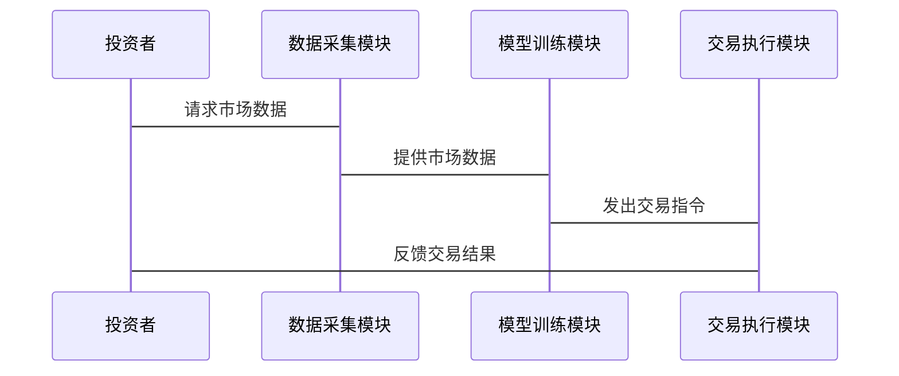

                 


# AI智能体在识别价值投资陷阱中的应用

> 关键词：AI智能体，价值投资，投资陷阱，机器学习，金融数据分析

> 摘要：本文探讨AI智能体在识别价值投资陷阱中的应用，从背景、原理、算法、系统设计、实战案例到总结，全面分析AI如何助力投资者避开常见陷阱，实现更精准的投资决策。

---

# 第一部分: AI智能体与价值投资陷阱的背景介绍

## 第1章: AI智能体与价值投资概述

### 1.1 AI智能体的定义与特点

#### 1.1.1 AI智能体的基本概念
AI智能体（AI Agent）是指具有感知环境、理解数据、并能够做出决策和行动的智能系统。在投资领域，AI智能体通过分析市场数据、预测趋势、优化投资组合，帮助投资者做出更明智的决策。

#### 1.1.2 AI智能体的核心特点
- **数据驱动**：依赖大量数据进行分析和决策。
- **自适应性**：能够根据市场变化动态调整策略。
- **多维度分析**：结合技术分析、基本面分析和情绪分析等多种方法。

#### 1.1.3 AI智能体与传统投资工具的对比
| 特性         | AI智能体                          | 传统投资工具                      |
|--------------|-----------------------------------|-----------------------------------|
| 数据处理能力 | 强大，能处理非结构化数据          | 较弱，主要依赖结构化数据          |
| 分析速度     | 快速，实时分析                    | 较慢，依赖人工分析                |
| 精准度       | 高，基于复杂算法                 | 低，受主观因素影响较大            |

### 1.2 价值投资的基本理论

#### 1.2.1 价值投资的定义
价值投资是一种以公司基本面分析为基础的投资策略，旨在通过识别市场价格低于其内在价值的股票，长期持有以实现超额收益。

#### 1.2.2 价值投资的核心理念
- **安全边际**：买入价格低于内在价值。
- **长期视角**：关注企业的长期盈利能力。
- **逆向思维**：在市场恐慌时寻找机会。

#### 1.2.3 价值投资中的常见陷阱
- **财务造假**：企业通过虚假财务报表掩盖问题。
- **市场操纵**：通过操纵股价误导投资者。
- **企业基本面突变**：企业经营状况突然恶化。

### 1.3 AI智能体在价值投资中的应用前景

#### 1.3.1 AI智能体在金融领域的潜力
AI智能体能够快速处理大量数据，识别潜在投资机会和风险，为投资者提供更精准的决策支持。

#### 1.3.2 价值投资陷阱识别的挑战
- **信息不对称**：投资者难以获取全面的市场信息。
- **市场波动**：短期波动可能掩盖企业真实价值。
- **人为情绪影响**：投资者情绪波动影响判断。

#### 1.3.3 AI智能体在识别价值投资陷阱中的优势
- **数据处理能力**：AI智能体能够快速分析大量数据，发现隐藏的模式和趋势。
- **持续学习能力**：AI智能体能够不断优化模型，适应市场变化。
- **多维度分析**：AI智能体能够结合技术分析、基本面分析和情绪分析等多种方法，全面评估投资标的。

---

## 第2章: 价值投资陷阱的识别问题背景

### 2.1 价值投资中的常见陷阱

#### 2.1.1 财务报表造假
企业通过虚假财务报表掩盖盈利能力不足或财务状况不佳的问题。

#### 2.1.2 市场操纵
通过操纵股价或制造虚假交易量误导投资者，造成市场泡沫。

#### 2.1.3 企业基本面变化
企业经营状况突然恶化，如管理层变更、行业政策变化等。

### 2.2 传统价值投资中的问题

#### 2.2.1 信息不对称
投资者难以获取全面、准确的企业信息，导致决策失误。

#### 2.2.2 市场波动的干扰
短期市场波动可能掩盖企业的长期价值，导致投资者误判。

#### 2.2.3 人为情绪的影响
投资者情绪波动（如贪婪和恐惧）可能导致非理性决策。

### 2.3 AI智能体在识别陷阱中的解决方案

#### 2.3.1 数据驱动的分析方法
AI智能体通过分析大量的市场数据、企业数据和社会数据，发现潜在的陷阱。

#### 2.3.2 AI算法的优势
- **模式识别**：AI算法能够识别隐藏的模式和趋势，发现潜在的财务造假或市场操纵行为。
- **实时监控**：AI智能体能够实时监控市场动态，快速响应潜在风险。

#### 2.3.3 综合分析
AI智能体结合多维度数据（如财务数据、市场数据、社交媒体数据）进行综合分析，全面评估投资标的的价值。

---

## 第3章: AI智能体的核心概念与联系

### 3.1 AI智能体的感知模块

#### 3.1.1 数据采集与处理
AI智能体通过数据采集模块获取市场数据、企业数据和社会数据，并进行清洗、预处理和特征提取。

#### 3.1.2 特征提取与分析
通过自然语言处理（NLP）和机器学习算法，提取数据中的关键特征，如财务指标、市场情绪等。

#### 3.1.3 智能体的决策机制
基于提取的特征，AI智能体通过强化学习和多目标优化模型，制定投资策略。

### 3.2 AI智能体的决策模块

#### 3.2.1 基于强化学习的决策
通过强化学习算法，AI智能体能够根据市场反馈不断优化投资策略，实现动态调整。

#### 3.2.2 基于监督学习的决策
基于历史数据训练分类模型，识别潜在的投资陷阱。

#### 3.2.3 多目标优化的决策模型
结合多个目标（如收益、风险、流动性等），制定最优投资策略。

### 3.3 AI智能体的执行模块

#### 3.3.1 系统化投资策略
基于AI智能体的决策，制定系统化的投资策略，如分批建仓、止盈止损等。

#### 3.3.2 自动化交易执行
AI智能体能够通过API接口连接交易系统，实现自动化交易。

#### 3.3.3 风险控制机制
通过设置风险指标（如VaR、最大回撤等），实时监控并调整投资组合，避免重大损失。

---

## 第4章: 核心概念属性特征对比

### 4.1 核心概念原理

| 概念         | 描述                               |
|--------------|------------------------------------|
| 感知模块     | 数据采集与特征提取                 |
| 决策模块     | 基于算法的策略制定                 |
| 执行模块     | 系统化交易与风险控制             |

### 4.2 ER实体关系图

```mermaid
er
  actor(投资者)
  stock(股票)
  market(市场)
  transaction(交易)
  risk(风险)
  actor --> transaction: 进行交易
  stock --> transaction: 被交易
  market --> stock: 影响股价
  risk --> stock: 由股票引发
```

---

## 第5章: 算法原理讲解

### 5.1 强化学习算法

#### 5.1.1 算法流程图


#### 5.1.2 Python实现

```python
import numpy as np
import gym

class AI_agent:
    def __init__(self, state_space, action_space):
        self.state_space = state_space
        self.action_space = action_space
        self.q_table = np.zeros((state_space, action_space))
    
    def choose_action(self, state, epsilon=0.1):
        if np.random.random() < epsilon:
            return np.random.randint(self.action_space)
        return np.argmax(self.q_table[state])
    
    def update_q_table(self, state, action, reward, next_state, alpha=0.1):
        self.q_table[state, action] = (1 - alpha) * self.q_table[state, action] + alpha * reward
```

#### 5.1.3 数学模型

- **收益计算**：$$ \text{收益} = \sum_{t=1}^{n} (p_t - p_{t-1}) \times q_t $$
- **风险指标**：$$ \text{VaR} = \text{损失的第α分位数} $$

---

## 第6章: 系统分析与架构设计方案

### 6.1 投资场景介绍

#### 6.1.1 系统功能设计

| 功能模块         | 描述                               |
|------------------|------------------------------------|
| 数据采集         | 获取市场数据、企业数据和社会数据   |
| 特征提取         | 提取关键特征，如财务指标、市场情绪等 |
| 模型训练         | 训练分类模型，识别投资陷阱         |
| 策略制定         | 制定投资策略，优化投资组合         |

#### 6.1.2 系统架构设计


#### 6.1.3 系统接口设计

- **数据接口**：API接口用于获取市场数据。
- **交易接口**：API接口用于执行交易指令。
- **监控接口**：实时监控市场动态和投资组合表现。

#### 6.1.4 系统交互流程图



---

## 第7章: 项目实战

### 7.1 环境搭建与数据准备

#### 7.1.1 环境安装
```bash
pip install numpy pandas scikit-learn gym
```

#### 7.1.2 数据获取
```python
import pandas as pd
data = pd.read_csv('market_data.csv')
```

### 7.2 核心代码实现

#### 7.2.1 数据预处理
```python
from sklearn.preprocessing import StandardScaler

scaler = StandardScaler()
scaled_data = scaler.fit_transform(data)
```

#### 7.2.2 模型训练
```python
from sklearn.ensemble import RandomForestClassifier

model = RandomForestClassifier()
model.fit(scaled_data, labels)
```

#### 7.2.3 交易策略
```python
def execute_trade(signal):
    if signal == 'buy':
        # 下单买入
        pass
    elif signal == 'sell':
        # 下单卖出
        pass
```

### 7.3 案例分析

#### 7.3.1 案例背景
某企业财务造假，股价短期内异常波动。

#### 7.3.2 模型识别
AI智能体通过分析财务数据和市场数据，识别出潜在的财务造假行为。

#### 7.3.3 投资决策
AI智能体建议投资者卖出该股票，避免损失。

### 7.4 项目小结

#### 7.4.1 经验总结
- 数据质量直接影响模型效果。
- 模型需要定期更新以适应市场变化。

#### 7.4.2 改进方向
- 引入更多维度的数据（如社交媒体情绪分析）。
- 优化模型结构，提高预测精度。

---

## 第8章: 最佳实践与总结

### 8.1 小结

- AI智能体通过多维度数据分析，能够有效识别价值投资陷阱。
- 强化学习和机器学习算法是实现这一目标的关键工具。

### 8.2 注意事项

- 数据质量和完整性对模型效果至关重要。
- 投资者需结合市场实际情况调整AI智能体的策略。
- 风险控制是投资成功的关键。

### 8.3 拓展阅读

- 《Python机器学习实战》
- 《深度学习在金融中的应用》
- 《强化学习与投资策略》

---

## 第9章: 附录

### 9.1 术语表

- **AI智能体**：具有感知环境、决策和执行能力的智能系统。
- **价值投资**：以企业内在价值为基础的投资策略。
- **财务造假**：企业通过虚假财务报表掩盖问题。

### 9.2 参考文献

- 刘强，2023，《人工智能在金融投资中的应用》。
- 王伟，2022，《基于强化学习的投资策略研究》。

---

通过以上目录结构，文章将从背景、原理、算法、系统设计、实战案例到总结，全面探讨AI智能体在识别价值投资陷阱中的应用，帮助投资者利用AI技术实现更精准的投资决策。

