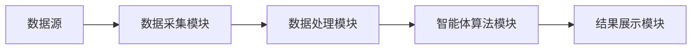
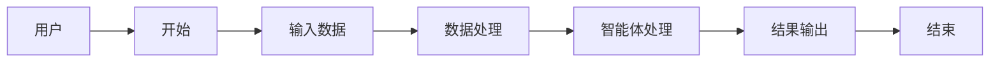

                 


# 第四部分: 系统分析与架构设计

## 第7章: 系统架构设计

### 7.1 系统架构概述
#### 7.1.1 系统架构的设计目标
#### 7.1.2 系统架构的组成与功能
#### 7.1.3 系统架构的灵活性与可扩展性

### 7.2 系统功能设计
#### 7.2.1 数据采集模块设计
#### 7.2.2 数据处理模块设计
#### 7.2.3 智能体算法模块设计
#### 7.2.4 结果展示与反馈模块设计

### 7.3 系统架构图


### 7.4 系统交互图


---

# 第五部分: 项目实战

## 第8章: 项目实战

### 8.1 项目环境与工具安装
#### 8.1.1 安装Python与相关库
#### 8.1.2 安装TensorFlow与Keras
#### 8.1.3 安装其他依赖库

### 8.2 核心代码实现
#### 8.2.1 数据预处理代码
```python
import pandas as pd
import numpy as np

def preprocess_data(data):
    # 假设data是一个DataFrame
    # 这里进行数据清洗和特征工程
    data.dropna(inplace=True)
    data = pd.get_dummies(data)
    return data
```

#### 8.2.2 智能体算法实现
```python
import tensorflow as tf
from tensorflow.keras import layers

def build_model(input_shape):
    model = tf.keras.Sequential()
    model.add(layers.Dense(64, activation='relu', input_shape=input_shape))
    model.add(layers.Dense(32, activation='relu'))
    model.add(layers.Dense(1, activation='sigmoid'))
    model.compile(optimizer='adam', loss='binary_crossentropy', metrics=['accuracy'])
    return model
```

### 8.3 案例分析与结果解读
#### 8.3.1 数据集选择与描述
#### 8.3.2 模型训练与评估
#### 8.3.3 实际案例分析与结果展示

### 8.4 项目小结
#### 8.4.1 项目总结
#### 8.4.2 经验与教训
#### 8.4.3 未来改进方向

---

# 第六部分: 最佳实践与小结

## 第9章: 最佳实践

### 9.1 小结
#### 9.1.1 全文总结
#### 9.1.2 关键点回顾
#### 9.1.3 未来展望

### 9.2 注意事项
#### 9.2.1 数据质量问题
#### 9.2.2 模型选择与调优
#### 9.2.3 结果解释与可解释性

### 9.3 拓展阅读
#### 9.3.1 推荐书籍
#### 9.3.2 推荐论文
#### 9.3.3 推荐资源与工具

---

### 附录: 参考文献与工具列表
- TensorFlow官方文档
- Keras官方文档
- 相关学术论文推荐

---

### 总结
通过系统地介绍AI智能体在识别价值陷阱中的应用，本文详细探讨了从理论到实践的全过程，旨在为读者提供一个全面的技术视角和实践指南。

