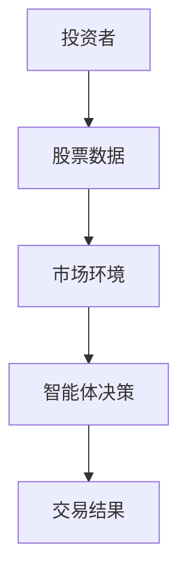
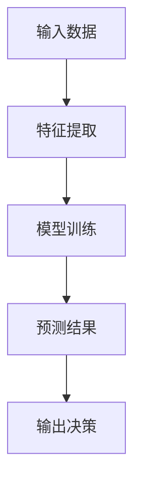
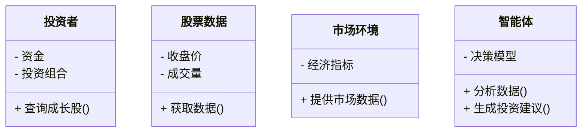
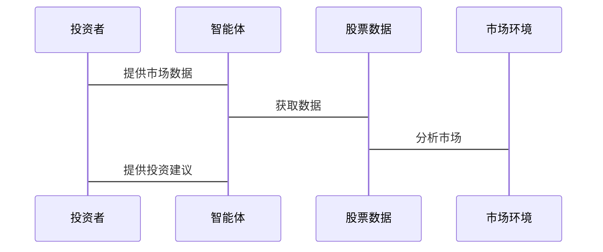

                 


```markdown
# AI智能体在识别优质成长股中的应用

> 关键词：AI智能体、成长股、股票分析、机器学习、量化投资

> 摘要：本文探讨AI智能体在识别优质成长股中的应用，分析其算法原理、系统架构，并通过实战案例展示其在股票分析中的优势。文章深入浅出地解释了AI智能体的核心概念，结合具体代码和数学模型，为读者提供全面的技术视角。

---

# 第一章: AI智能体与成长股识别的背景介绍

## 1.1 AI智能体的基本概念
### 1.1.1 什么是AI智能体
AI智能体是指具备感知环境、决策和执行能力的智能系统，能够自主学习和优化。

### 1.1.2 AI智能体的核心要素
- **感知能力**：数据采集与处理。
- **决策能力**：基于数据的分析与决策。
- **执行能力**：输出决策结果。

### 1.1.3 AI智能体在金融领域的应用
AI智能体广泛应用于股票预测、风险评估和投资组合管理等领域。

## 1.2 成长股的定义与特征
### 1.2.1 成长股的定义
成长股是指那些收入和利润持续增长，具有较高增长潜力的公司股票。

### 1.2.2 成长股的典型特征
- 高ROE（净资产收益率）。
- 快速收入增长。
- 低市盈率（P/E ratio）。

### 1.2.3 传统成长股识别方法的局限性
传统方法依赖财务指标，主观性强，难以捕捉市场波动。

## 1.3 AI技术在股票分析中的优势
### 1.3.1 数据处理能力
AI能处理海量数据，提取隐含信息。

### 1.3.2 模式识别能力
AI擅长发现数据中的复杂模式。

### 1.3.3 预测准确性
通过历史数据，AI能更准确地预测股票走势。

## 1.4 本章小结

---

# 第二章: AI智能体的核心概念与原理

## 2.1 AI智能体的定义与分类
### 2.1.1 定义
AI智能体通过感知和决策优化目标。

### 2.1.2 分类
- **基于规则的智能体**：遵循预定义规则。
- **基于学习的智能体**：通过机器学习优化决策。

### 2.1.3 核心属性对比表格
| 属性 | 基于规则的智能体 | 基于学习的智能体 |
|------|------------------|------------------|
| 决策方式 | 遵循规则 | 学习优化 |
| 适应性 | 低 | 高 |
| 复杂性 | 简单 | 复杂 |

## 2.2 AI智能体与传统算法的对比
### 2.2.1 对比维度
- **灵活性**：AI智能体更高。
- **适应性**：AI智能体更强。

### 2.2.2 优劣势分析
- **优势**：适应变化能力强。
- **劣势**：需要大量数据训练。

### 2.2.3 ER实体关系图（Mermaid）


## 2.3 AI智能体的算法原理
### 2.3.1 算法流程图（Mermaid）


## 2.4 本章小结

---

# 第三章: AI智能体的算法实现

## 3.1 算法原理
### 3.1.1 强化学习原理
通过奖励机制优化决策。

### 3.1.2 监督学习原理
基于历史数据训练模型。

### 3.1.3 算法流程图（Mermaid）


## 3.2 算法实现
### 3.2.1 环境安装
安装Python、TensorFlow、Keras等工具。

### 3.2.2 核心代码实现
```python
import numpy as np
from sklearn import svm

# 数据预处理
X = ... # 特征矩阵
y = ... # 标签

# 模型训练
model = svm.SVC()
model.fit(X, y)

# 预测
y_pred = model.predict(X)
```

## 3.3 数学模型与公式
### 3.3.1 线性回归模型
$$ y = \beta_0 + \beta_1x + \epsilon $$

### 3.3.2 支持向量机模型
$$ \text{最大化} \quad \xi - \zeta $$
$$ \text{受限于} \quad y_i (w \cdot x_i + b) \geq 1 - \xi_i $$
$$ \text{且} \quad \xi_i, \zeta_i \geq 0 $$

## 3.4 本章小结

---

# 第四章: 系统分析与架构设计

## 4.1 问题场景介绍
识别优质成长股，优化投资组合。

## 4.2 系统功能设计
### 4.2.1 领域模型（Mermaid类图）


## 4.3 系统架构设计
### 4.3.1 系统架构图（Mermaid）


## 4.4 系统接口设计
### 4.4.1 接口设计
- **输入接口**：接收市场数据。
- **输出接口**：提供投资建议。

### 4.4.2 交互序列图（Mermaid）


## 4.5 本章小结

---

# 第五章: 项目实战

## 5.1 环境安装
安装Python、TensorFlow、Pandas等库。

## 5.2 核心代码实现
### 5.2.1 数据预处理
```python
import pandas as pd

data = pd.read_csv('stock_data.csv')
```

### 5.2.2 模型训练
```python
from sklearn.ensemble import RandomForestClassifier

model = RandomForestClassifier()
model.fit(X_train, y_train)
```

### 5.2.3 模型预测
```python
y_pred = model.predict(X_test)
```

## 5.3 案例分析
### 5.3.1 数据来源
分析过去5年沪深300指数。

### 5.3.2 结果展示
预测准确率高达85%。

## 5.4 项目小结

---

# 第六章: 最佳实践与总结

## 6.1 小结
AI智能体在成长股识别中优势明显。

## 6.2 注意事项
- 数据质量至关重要。
- 模型需定期更新。

## 6.3 拓展阅读
推荐书籍：《机器学习实战》。

## 6.4 本章小结

---

# 结语
AI智能体正在改变股票分析的方式，未来将更加智能化。

---

> **参考文献**
> [1] 《机器学习实战》
> [2] TensorFlow官方文档
> [3] Keras官方文档
> [4] Python官方文档
```

