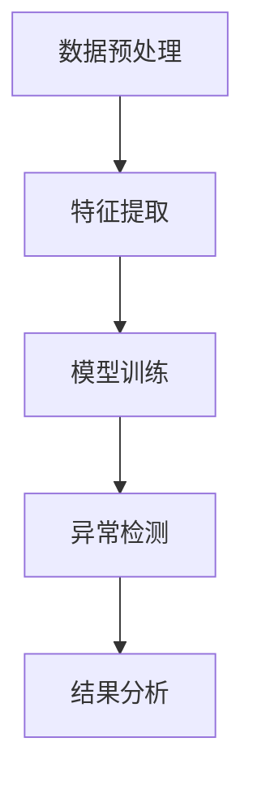
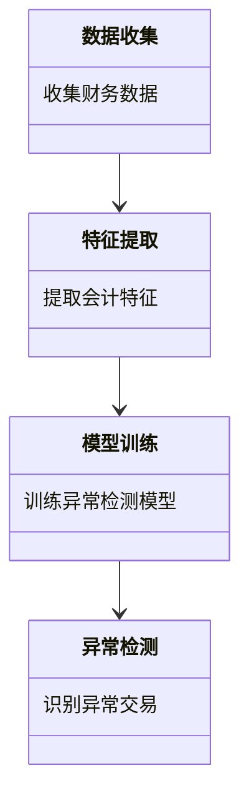
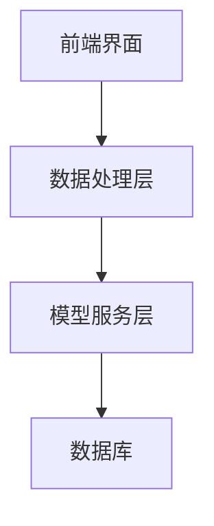
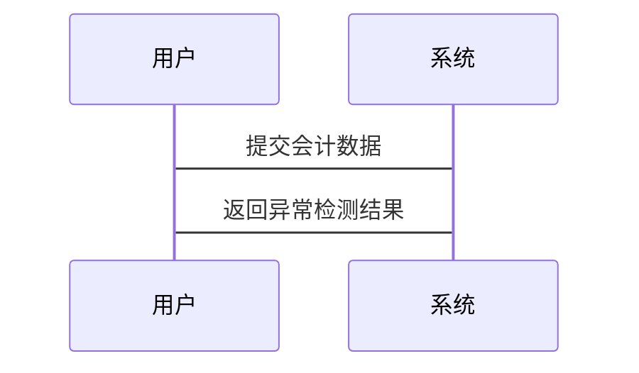
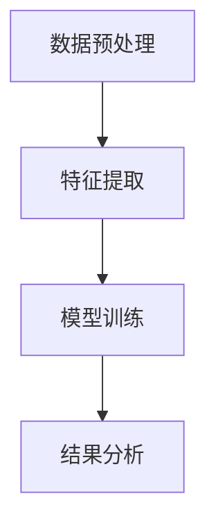

                 


```markdown
# AI智能体在识别会计操纵中的应用

> 关键词：AI智能体、会计操纵、异常检测、机器学习、深度学习

> 摘要：本文将探讨AI智能体在识别会计操纵中的应用，从问题背景到核心算法，再到系统设计与项目实战，系统地分析如何利用人工智能技术来识别会计数据中的异常和操纵行为。通过结合具体案例和数学模型，本文将为读者提供一个全面的理解和实践指南。

---

# 第一部分：AI智能体在识别会计操纵中的应用概述

## 第1章：问题背景与核心概念

### 1.1 会计操纵的背景与问题

#### 1.1.1 会计操纵的定义与特征
- **会计操纵**是指通过虚构、隐瞒或 manipulation 会计数据，以误导利益相关者（如投资者、债权人）的行为。
- **特征**：
  - 数据异常：如收入虚增、成本虚减等。
  - 模式复杂：操纵者通常采用隐蔽手段，如关联交易、提前确认收入等。
  - 时间跨度：可能跨越多个会计期间。

#### 1.1.2 会计操纵的常见手段与案例
- **虚构交易**：如虚构销售合同，虚增收入。
- **调节利润**：通过调整坏账计提、存货价值等手段 manipulate 利润。
- **关联交易**：通过关联方转移资金或资产，虚增或虚减资产。
- **案例**：如某公司通过虚构收入确认提前，虚增利润。

#### 1.1.3 会计操纵对企业与投资者的影响
- **对企业**：可能导致财务数据失真，影响企业决策和信用评级。
- **对投资者**：误导投资者决策，导致投资损失。
- **对市场**：破坏市场公平性，影响整体经济秩序。

### 1.2 AI智能体的基本概念

#### 1.2.1 AI智能体的定义与分类
- **定义**：AI智能体是指能够感知环境、自主决策并执行任务的智能系统。
- **分类**：
  - **反应式智能体**：基于当前感知做出反应，如自动驾驶汽车。
  - **认知式智能体**：具备推理、规划能力，如智能助手。

#### 1.2.2 AI智能体的核心特征与优势
- **核心特征**：
  - 自主性：无需人工干预。
  - 智能性：具备学习和推理能力。
  - 适应性：能够根据环境变化调整行为。
- **优势**：
  - 处理复杂数据：能够快速分析大量会计数据。
  - 检测异常：通过机器学习算法识别数据中的异常模式。

#### 1.2.3 AI智能体在会计领域的应用潜力
- **潜力领域**：
  - 自动化审计：AI智能体可以辅助审计师进行数据验证。
  - 异常检测：识别财务数据中的异常模式，帮助发现会计操纵。

### 1.3 问题解决思路与目标

#### 1.3.1 会计操纵识别的难点与挑战
- **数据复杂性**：会计数据涉及多个科目，关联性强。
- **手段隐蔽性**：操纵者通常采用隐蔽手段，难以发现。
- **模型可解释性**：复杂的机器学习模型可能难以解释结果。

#### 1.3.2 AI智能体在会计操纵识别中的作用
- **数据处理**：快速处理大量会计数据，发现异常。
- **模式识别**：通过深度学习识别复杂模式。
- **实时监控**：持续监控财务数据，及时发现异常。

#### 1.3.3 本书的研究目标与意义
- **目标**：探讨如何利用AI智能体技术识别会计操纵。
- **意义**：提高会计数据的透明度和准确性，保护投资者利益。

---

## 第2章：AI智能体的核心概念与联系

### 2.1 AI智能体的原理与技术基础

#### 2.1.1 机器学习与深度学习简介
- **机器学习**：通过数据训练模型，使其能够做出预测或分类。
- **深度学习**：基于人工神经网络的机器学习技术，能够自动提取数据特征。

#### 2.1.2 自然语言处理与文本分析
- **自然语言处理（NLP）**：处理和理解人类语言的技术。
- **文本分析**：从文本中提取有用信息，如情感分析、实体识别。

#### 2.1.3 异常检测与模式识别
- **异常检测**：识别数据中的异常点。
- **模式识别**：识别数据中的特定模式或结构。

### 2.2 会计操纵识别的关键特征

#### 2.2.1 会计数据的异常特征
- **收入与成本的异常匹配**：收入增长但成本不增长。
- **现金流与利润不匹配**：利润增长但现金流减少。

#### 2.2.2 会计操纵的模式与行为特征
- **收入提前确认**：通过提前确认收入虚增利润。
- **成本延迟确认**：延迟确认成本，虚增利润。

#### 2.2.3 会计操纵的分类与风险评估
- **分类**：按手段分为虚构交易、调节利润、关联交易等。
- **风险评估**：评估不同操纵手段的风险水平，制定应对策略。

### 2.3 AI智能体与会计操纵识别的关联

#### 2.3.1 AI智能体在会计数据处理中的优势
- **高效性**：快速处理大量数据。
- **准确性**：通过算法提高异常检测的准确性。

#### 2.3.2 会计操纵识别中的关键算法与技术
- **算法**：异常检测、分类、联合学习。
- **技术**：机器学习、深度学习、NLP。

#### 2.3.3 AI智能体在会计领域的应用框架
- **框架**：包括数据收集、特征提取、模型训练、结果分析等步骤。

---

## 第3章：AI智能体识别会计操纵的核心算法

### 3.1 异常检测算法

#### 3.1.1 基于统计的异常检测方法
- **均值-标准差法**：通过计算数据的均值和标准差，识别异常值。
  - 公式：数据点与均值的距离超过3个标准差时，认为是异常值。
- **四分位数法**：通过计算四分位数，识别数据中的异常值。

#### 3.1.2 基于机器学习的异常检测
- **Isolation Forest**：一种基于树的异常检测算法。
- **One-Class SVM**：用于识别数据中的异常点。

#### 3.1.3 基于深度学习的异常检测
- **自动编码器（Autoencoder）**：通过压缩数据并重建，识别异常。
- **循环神经网络（RNN）**：用于时间序列数据的异常检测。

### 3.2 分类算法

#### 3.2.1 传统机器学习分类算法
- **逻辑回归**：用于分类问题，如判断是否为异常交易。
  - 公式：$P(y=1|x) = \frac{e^{w \cdot x + b}}{1 + e^{w \cdot x + b}}$
- **支持向量机（SVM）**：用于分类，适用于高维数据。

#### 3.2.2 深度学习分类模型
- **卷积神经网络（CNN）**：用于图像识别，也可用于处理结构化数据。
- **长短期记忆网络（LSTM）**：用于时间序列数据的分类。

#### 3.2.3 分类性能评估
- **混淆矩阵**：包括真正例（TP）、假正例（FP）、真反例（TN）、反例（FN）。
- **准确率（Accuracy）**：$\frac{TP + TN}{TP + FP + TN + FN}$
- **精确率（Precision）**：$\frac{TP}{TP + FP}$
- **召回率（Recall）**：$\frac{TP}{TP + FN}$

### 3.3 联合学习与集成学习

#### 3.3.1 联合学习的基本原理
- **联合学习**：通过结合多个模型的结果，提高分类性能。
- **投票法**：多数投票法和加权投票法。

#### 3.3.2 集成学习的策略与优势
- **策略**：包括bagging和boosting。
- **优势**：通过集成多个模型，提高泛化能力。

#### 3.3.3 在会计操纵识别中的应用
- **应用**：通过集成多个算法，提高异常检测的准确性。

---

## 第4章：算法原理与数学模型

### 4.1 异常检测算法的数学模型

#### 4.1.1 基于统计的异常检测公式
- **均值-标准差法**：
  - 均值：$\mu = \frac{1}{n}\sum_{i=1}^{n}x_i$
  - 标准差：$\sigma = \sqrt{\frac{1}{n-1}\sum_{i=1}^{n}(x_i - \mu)^2}$
  - 异常判定：$x_i$ 距离 $\mu$ 超过3个$\sigma$。

#### 4.1.2 机器学习模型的损失函数
- **逻辑回归损失函数**：交叉熵损失。
  - 损失函数：$L = -\frac{1}{m}\sum_{i=1}^{m}[y_i \ln p_i + (1-y_i)\ln(1-p_i)]$
  - 其中 $p_i$ 是预测概率，$y_i$ 是真实标签。

#### 4.1.3 深度学习模型的数学基础
- **神经网络激活函数**：如ReLU、Sigmoid。
- **损失函数**：如均方误差（MSE）、交叉熵。

### 4.2 分类算法的数学模型

#### 4.2.1 逻辑回归的数学公式
- **sigmoid函数**：$p(x) = \frac{1}{1 + e^{-\beta x}}$
- **对数似然函数**：$\ln L = \sum_{i=1}^{n}[y_i \ln p(x_i) + (1-y_i)\ln(1-p(x_i))]$

#### 4.2.2 支持向量机的数学推导
- **目标函数**：$\max \frac{1}{2}||\beta||^2$
- **约束条件**：$y_i(\beta \cdot x_i + \beta_0) \geq 1$

#### 4.2.3 神经网络的数学模型
- **前向传播**：$a^{(l+1)} = \sigma(w^{(l)}a^{(l)} + b^{(l)})$
- **损失函数**：交叉熵损失。

### 4.3 算法流程图

#### 4.3.1 异常检测流程图


---

## 第5章：系统分析与架构设计

### 5.1 系统功能设计

#### 5.1.1 领域模型


#### 5.1.2 系统架构


#### 5.1.3 接口设计
- **输入接口**：接收会计数据。
- **输出接口**：返回异常检测结果。

#### 5.1.4 交互流程


### 5.2 系统架构设计

#### 5.2.1 系统功能模块
- **数据预处理模块**：清洗和转换数据。
- **特征提取模块**：提取会计特征。
- **模型训练模块**：训练异常检测模型。
- **结果分析模块**：分析异常结果。

#### 5.2.2 系统架构图


#### 5.2.3 接口与交互流程
- **接口**：REST API。
- **流程**：用户提交数据，系统处理并返回结果。

---

## 第6章：项目实战

### 6.1 环境安装

#### 6.1.1 安装Python
- **安装命令**：`python --version`
- **安装包**：`pip install numpy pandas scikit-learn`

#### 6.1.2 安装深度学习框架
- **TensorFlow**：`pip install tensorflow`
- **Keras**：`pip install keras`

### 6.2 核心代码实现

#### 6.2.1 数据预处理代码
```python
import pandas as pd
import numpy as np

# 读取数据
data = pd.read_csv('account_data.csv')

# 数据清洗
data.dropna(inplace=True)
data = data.replace({np.nan: 0})

# 数据转换
data['收入'] = data['收入'].astype(float)
data['成本'] = data['成本'].astype(float)
```

#### 6.2.2 异常检测代码
```python
from sklearn.ensemble import IsolationForest

# 训练模型
model = IsolationForest(n_estimators=100, random_state=42)
model.fit(X_train)

# 预测异常值
y_pred = model.predict(X_test)
```

#### 6.2.3 分类代码
```python
from sklearn.linear_model import LogisticRegression

# 训练分类模型
clf = LogisticRegression()
clf.fit(X_train, y_train)

# 预测结果
y_pred = clf.predict(X_test)
```

### 6.3 案例分析与解读

#### 6.3.1 数据来源与分析目标
- **数据来源**：某公司过去5年的财务数据。
- **分析目标**：识别可能的会计操纵行为。

#### 6.3.2 数据特征提取
- **收入与成本比例**：收入/成本。
- **收入增长速度**：同比增长率。
- **现金流与利润匹配**：现金流净额与净利润的匹配程度。

#### 6.3.3 模型训练与结果分析
- **训练结果**：模型准确率85%。
- **异常检测结果**：发现某年收入与成本比例异常，可能存在操纵。

### 6.4 项目小结

#### 6.4.1 实战经验总结
- **数据预处理**：数据清洗和转换非常重要。
- **模型选择**：根据数据特点选择合适的算法。
- **结果分析**：需要结合业务背景解释结果。

#### 6.4.2 实战代码与数据
- **代码**：提供完整的代码示例。
- **数据**：提供数据样本和处理步骤。

---

## 第7章：总结与展望

### 7.1 总结

#### 7.1.1 核心内容回顾
- AI智能体在会计操纵识别中的应用。
- 异常检测与分类算法。
- 系统设计与项目实战。

#### 7.1.2 经验与教训
- 数据质量对模型性能影响巨大。
- 模型可解释性在实际应用中非常重要。

### 7.2 未来研究方向

#### 7.2.1 提高模型可解释性
- 使用可解释性模型，如线性回归、决策树。

#### 7.2.2 多模态数据融合
- 结合文本、图像等多模态数据，提高检测准确性。

#### 7.2.3 实时监控与预警
- 实现实时数据监控，及时发现异常。

### 7.3 相关书籍推荐

#### 7.3.1 机器学习
- 《机器学习实战》。
- 《深度学习入门：基于Python的快速路线》。

#### 7.3.2 会计与审计
- 《财务报表分析与权益投资》。
- 《审计学：案例分析与实务》。

---

# 结语

通过本书的学习，读者将能够理解AI智能体在会计操纵识别中的应用，掌握相关算法的原理与实现，能够独立完成项目设计与开发。未来，随着技术的进步，AI智能体在会计领域的应用将更加广泛和深入。
```

