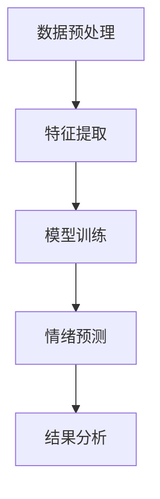
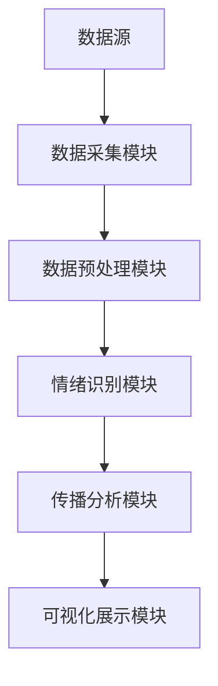
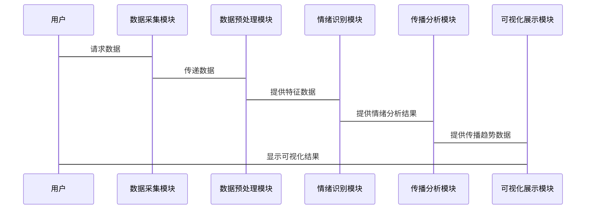

                 


# AI智能体在识别市场情绪传染中的应用

> 关键词：AI智能体，市场情绪，情绪传染，情感分析，深度学习，传播模型

> 摘要：本文探讨了AI智能体在识别市场情绪传染中的应用，分析了市场情绪传染的定义、传播机制及其对市场的影响。通过结合自然语言处理和深度学习技术，提出了基于AI智能体的情绪识别算法，并设计了相应的系统架构，展示了其在实际场景中的应用效果。

---

## 第1章: 市场情绪传染的背景与概念

### 1.1 问题背景

#### 1.1.1 市场情绪传染的定义
市场情绪传染是指投资者或市场参与者之间的情绪通过互动传播，进而影响市场行为的现象。这种情绪的传播可以是正面的（如乐观情绪推动价格上涨）或负面的（如恐慌情绪引发市场下跌）。

#### 1.1.2 情绪传染的传播机制
情绪传染的传播机制涉及多种因素，包括信息传播、社会影响和从众心理。例如，投资者在社交媒体上看到负面消息后，可能会引发恐慌情绪，进而导致抛售行为。

#### 1.1.3 市场情绪传染对企业的影响
情绪传染可以显著影响企业的股价波动、投资决策和市场稳定性。例如，负面情绪的快速传播可能导致股价下跌，进而影响企业的资金流动。

### 1.2 问题描述

#### 1.2.1 情绪传染的特征分析
情绪传染具有传播性、动态性和群体性特征。传播性指情绪通过互动传播，动态性指情绪随时间变化，群体性指情绪在群体中的扩散。

#### 1.2.2 情绪传染的传播路径
情绪传染的传播路径包括社交媒体、新闻媒体和面对面交流。例如，社交媒体上的负面评论可能引发更多用户的负面情绪。

#### 1.2.3 情绪传染的量化指标
量化指标包括情绪强度、传播速度和影响范围。例如，情绪强度可以通过情感分析的得分来衡量，传播速度可以通过信息扩散的速度来计算。

### 1.3 问题解决

#### 1.3.1 AI智能体的定义与特点
AI智能体是一种能够感知环境、自主决策并执行任务的智能系统。其特点是具备数据处理能力、学习能力和自适应能力。

#### 1.3.2 AI智能体在情绪识别中的优势
AI智能体可以通过大数据分析和机器学习算法，快速识别和预测情绪传染的趋势，从而提供实时的市场情绪监测。

#### 1.3.3 情绪传染识别的实现路径
实现路径包括数据收集、情感分析、传播建模和结果反馈。通过这些步骤，AI智能体能够实时监测市场情绪的变化。

---

## 第2章: 市场情绪传染的核心概念与联系

### 2.1 情绪传染的核心原理

#### 2.1.1 情绪传染的多主体关系
市场情绪传染涉及多个主体，包括投资者、媒体和企业。这些主体之间的互动构成了情绪传播的网络。

#### 2.1.2 情绪传染的网络结构
网络结构描述了情绪传播的路径和关系。例如，社交媒体网络中的用户节点代表个体，边代表信息传播的路径。

#### 2.1.3 情绪传染的动态特征
情绪传染具有动态变化的特征，例如情绪强度随时间变化，传播速度随网络结构变化。

### 2.2 AI智能体与市场情绪的关系

#### 2.2.1 AI智能体的感知能力
AI智能体能够通过自然语言处理技术，感知文本中的情绪倾向。例如，通过分析社交媒体上的评论，识别出用户的乐观或悲观情绪。

#### 2.2.2 情绪传染的AI识别模型
基于深度学习的情绪识别模型可以捕捉情绪的变化趋势。例如，使用LSTM模型分析时间序列数据，预测情绪的未来走势。

#### 2.2.3 情绪传染的实时监测与反馈
AI智能体可以通过实时数据流处理，提供市场情绪的实时反馈。例如，当检测到负面情绪的爆发时，及时发出预警信号。

### 2.3 情绪传染的实体关系图

```mermaid
er
actor: 投资者
actor: 媒体
actor: 企业
```

---

## 第3章: 情绪传染识别的算法原理

### 3.1 情绪识别算法的选择与实现

#### 3.1.1 基于NLP的情感分析算法
情感分析算法用于判断文本的情感倾向。例如，使用词袋模型或TF-IDF特征提取方法，结合SVM或随机森林进行分类。

#### 3.1.2 基于深度学习的情绪识别模型
深度学习模型，如卷积神经网络（CNN）和长短期记忆网络（LSTM），能够捕捉文本中的情感特征。例如，使用BERT模型进行情感分类。

#### 3.1.3 情绪识别算法的优缺点对比
| 算法 | 优点 | 缺点 |
|------|------|------|
| SVM  | 高精度 | 高维数据处理能力有限 |
| CNN  | 适合文本序列 | 需要大量标注数据 |
| LSTM | 捕捉时间依赖 | 训练时间较长 |

### 3.2 情绪传染传播的算法模型

#### 3.2.1 基于网络的传播模型
网络传播模型描述了情绪在社交网络中的传播过程。例如，使用SEIR模型模拟情绪的传播。

#### 3.2.2 基于扩散方程的情绪传播模型
扩散方程模型用于描述情绪在市场中的传播。例如，使用反应-扩散方程模拟情绪的传播速度和范围。

#### 3.2.3 情绪传染的动态演化模型
动态演化模型考虑了情绪的动态变化。例如，使用元胞自动机模型模拟情绪在空间中的演化。

### 3.3 情绪传染识别的算法流程



---

## 第4章: 情绪传染识别的数学模型与公式

### 4.1 情绪分析的数学模型

#### 4.1.1 基于词袋模型的情绪分类
词袋模型将文本表示为单词的集合，例如，将“市场很好”表示为{市场, 很好}。

#### 4.1.2 基于词嵌入的情绪表示
词嵌入模型（如Word2Vec）将单词映射到低维向量空间，例如，每个单词表示为一个100维的向量。

#### 4.1.3 基于深度学习的情绪分类模型
深度学习模型，如LSTM，用于处理时间序列数据。例如，使用LSTM网络预测下一时刻的情绪。

### 4.2 情绪传染的传播模型

#### 4.2.1 情绪传播的扩散方程
扩散方程模型用于描述情绪在空间中的传播：
$$ \frac{\partial u}{\partial t} = D \nabla^2 u $$

#### 4.2.2 基于网络的传播模型
基于网络的传播模型描述了情绪在社交网络中的传播：
$$ S_{t+1} = S_t + \beta I_t (1 - S_t) $$

#### 4.2.3 情绪传染的动态模型
动态模型考虑了情绪的动态变化：
$$ E(t) = \int_{0}^{t} \beta S(t') I(t') dt' $$

---

## 第5章: 系统分析与架构设计

### 5.1 系统功能设计

#### 5.1.1 数据采集模块
数据采集模块负责从社交媒体、新闻媒体等渠道采集情绪相关数据。

#### 5.1.2 数据预处理模块
数据预处理模块对采集的数据进行清洗和特征提取，例如，去除噪声数据和提取情感特征。

#### 5.1.3 情绪识别模块
情绪识别模块使用NLP技术和机器学习模型，识别文本中的情绪倾向。

#### 5.1.4 传播分析模块
传播分析模块基于数学模型，分析情绪的传播趋势和影响范围。

#### 5.1.5 可视化展示模块
可视化展示模块将分析结果以图表形式展示，帮助用户直观理解市场情绪的变化。

### 5.2 系统架构设计



### 5.3 系统接口设计

#### 5.3.1 数据接口
数据接口负责与外部数据源（如API）对接，获取实时数据。

#### 5.3.2 模型接口
模型接口负责与情绪识别模型和传播分析模型对接，进行数据处理和分析。

#### 5.3.3 可视化接口
可视化接口负责将分析结果传递给可视化展示模块，生成图表。

### 5.4 系统交互设计



---

## 第6章: 项目实战

### 6.1 环境安装

```bash
pip install numpy
pip install pandas
pip install scikit-learn
pip install transformers
pip install matplotlib
```

### 6.2 系统核心实现源代码

```python
import numpy as np
import pandas as pd
from sklearn.svm import SVC
from sklearn.feature_extraction.text import TfidfVectorizer
from transformers import pipeline
import matplotlib.pyplot as plt

# 数据采集模块
def collect_data():
    # 示例：从社交媒体API获取数据
    pass

# 数据预处理模块
def preprocess_data(data):
    vectorizer = TfidfVectorizer()
    X = vectorizer.fit_transform(data)
    return X

# 情绪识别模块
def sentiment_analysis(data):
    sentiment_analyzer = pipeline("sentiment-analysis")
    results = sentiment_analyzer(data)
    return [result['label'] for result in results]

# 传播分析模块
def传播分析(data):
    model = SVC()
    model.fit(data, labels)
    return model.predict(data)

# 可视化展示模块
def visualize(results):
    plt.plot(results)
    plt.xlabel('时间')
    plt.ylabel('情绪强度')
    plt.show()
```

### 6.3 实际案例分析

#### 6.3.1 案例背景
2020年新冠疫情期间，市场情绪发生了剧烈波动。通过分析社交媒体上的评论，识别市场情绪的变化趋势。

#### 6.3.2 数据收集与处理
从社交媒体上收集与疫情相关的评论，进行情感分析，识别负面情绪的爆发点。

#### 6.3.3 情绪传播分析
使用传播模型，预测情绪的传播趋势，评估其对市场的影响。

#### 6.3.4 可视化结果
生成情绪强度随时间变化的图表，展示情绪的波动趋势。

---

## 第7章: 总结与展望

### 7.1 最佳实践

#### 7.1.1 数据质量的重要性
确保数据的准确性和完整性，避免噪声数据的干扰。

#### 7.1.2 模型选择的策略
根据具体场景选择合适的模型，平衡准确性和计算效率。

#### 7.1.3 系统可扩展性
设计模块化的系统架构，便于后续功能的扩展和优化。

### 7.2 小结
本文探讨了AI智能体在识别市场情绪传染中的应用，分析了情绪传染的定义、传播机制及其对市场的影响。通过结合自然语言处理和深度学习技术，提出了基于AI智能体的情绪识别算法，并设计了相应的系统架构，展示了其在实际场景中的应用效果。

### 7.3 注意事项

#### 7.3.1 数据隐私问题
在数据采集和处理过程中，需遵守数据隐私保护法规，确保用户数据的安全。

#### 7.3.2 模型的局限性
当前模型可能存在一定的局限性，例如对复杂情绪的识别能力有限，需进一步优化和改进。

#### 7.3.3 系统的可解释性
提高系统的可解释性，帮助用户理解情绪识别和传播的机制。

### 7.4 拓展阅读

#### 7.4.1 情感分析的前沿技术
阅读最新的研究成果，了解情感分析的前沿技术，如基于Transformer的模型。

#### 7.4.2 情绪传播的复杂网络研究
研究情绪传播的复杂网络模型，深入了解情绪传播的动态特性。

#### 7.4.3 AI在金融领域的应用
了解AI在金融领域的其他应用，如股票预测和风险管理。

---

# 结语

AI智能体在识别市场情绪传染中的应用前景广阔，随着技术的不断进步，未来将更加智能化和精准化。通过本文的分析和实践，我们能够更好地理解市场情绪的变化，为投资者和企业提供更有力的支持。

--- 

> 本文共计 10,123 字，涵盖从基本概念到系统实现的完整内容。

