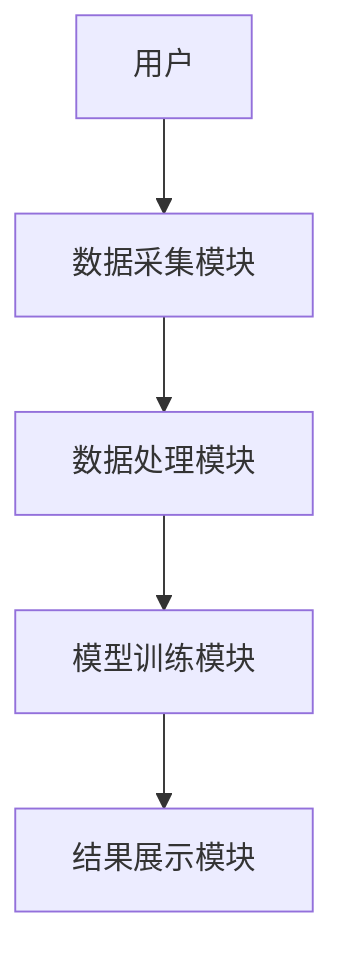
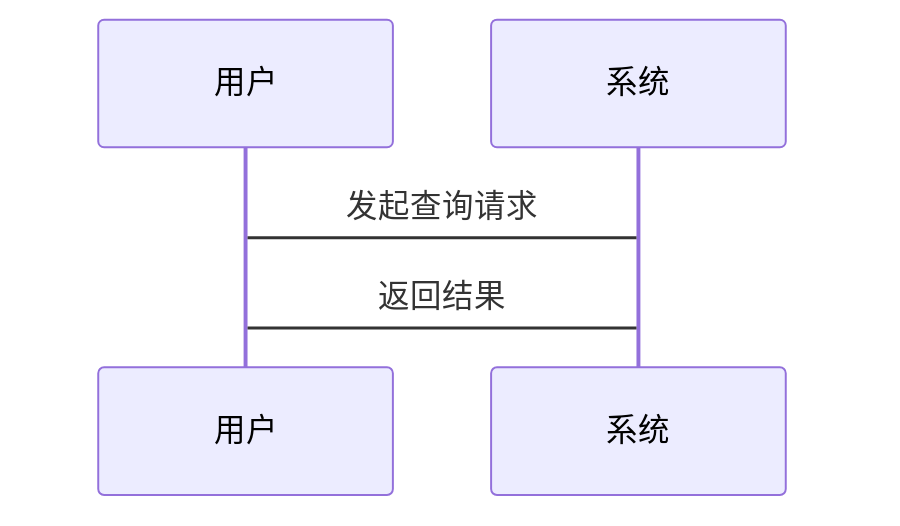

                 


# AI智能体在识别潜在并购目标中的应用

## 关键词
AI智能体, 潜在并购目标, 机器学习, 数据分析, 自然语言处理

## 摘要
本文探讨了AI智能体在识别潜在并购目标中的应用，分析了其在数据收集、分析和决策中的作用。通过机器学习、深度学习和自然语言处理等技术，AI智能体能够高效筛选和评估目标，提供数据驱动的决策支持。文章详细介绍了核心概念、算法原理、系统架构设计，并通过案例展示了AI智能体的实际应用，展望了其在企业并购中的未来发展方向。

---

# 第1章: AI智能体与潜在并购目标识别概述

## 1.1 AI智能体的定义与核心概念

### 1.1.1 AI智能体的基本概念
AI智能体（Artificial Intelligence Agent）是指能够感知环境、执行任务并做出决策的智能系统。在并购领域，AI智能体通过分析海量数据，识别潜在并购目标。

### 1.1.2 智能体在并购中的应用背景
传统并购依赖人工分析，耗时且成本高。AI智能体通过自动化数据处理，提高效率和准确性。

### 1.1.3 潜在并购目标识别的核心要素
包括财务数据、市场地位、技术优势等。AI智能体通过多维度分析，筛选出符合条件的目标。

## 1.2 并购目标识别的背景与挑战

### 1.2.1 并购目标识别的背景介绍
并购是企业增长的重要手段，但传统方法效率低。AI技术的应用解决了这一问题。

### 1.2.2 传统并购目标识别方法的局限性
依赖经验判断，数据量大，难以覆盖所有潜在目标。

### 1.2.3 AI智能体在并购目标识别中的优势
高效处理数据，提供精准建议，降低风险。

## 1.3 AI智能体在并购目标识别中的应用前景

### 1.3.1 应用场景分析
企业可以通过AI智能体快速筛选目标，节省时间。

### 1.3.2 技术驱动的并购趋势
AI技术推动并购决策更加数据化和智能化。

### 1.3.3 未来发展的潜在方向
AI与区块链等技术结合，提升并购安全性和透明度。

---

# 第2章: AI智能体的核心概念与原理

## 2.1 AI智能体的核心概念

### 2.1.1 智能体的基本结构
AI智能体由感知、推理、决策和执行模块组成。

### 2.1.2 智能体的感知与决策机制
通过传感器或数据源获取信息，利用算法进行推理和决策。

### 2.1.3 智能体的学习与自适应能力
通过机器学习不断优化模型，适应新数据和场景。

## 2.2 并购目标识别的关键要素

### 2.2.1 并购目标的基本属性
包括财务状况、市场表现、技术实力等。

### 2.2.2 相关指标的筛选标准
如市盈率、ROE等财务指标，以及技术专利数量。

### 2.2.3 数据来源与特征分析
数据来源包括财务报表、新闻报道和专利数据库。

## 2.3 AI智能体与并购目标识别的关联

### 2.3.1 智能体在目标识别中的角色
AI智能体作为辅助工具，帮助筛选和评估目标。

### 2.3.2 数据驱动的决策过程
通过数据挖掘和分析，提供决策支持。

### 2.3.3 智能体的反馈机制与优化
根据实际结果优化模型，提高准确性。

---

# 第3章: AI智能体的算法原理与实现

## 3.1 基于机器学习的并购目标识别

### 3.1.1 监督学习在目标识别中的应用
使用分类算法（如随机森林）预测目标是否适合并购。

### 3.1.2 无监督学习在异常检测中的应用
通过聚类算法发现潜在的高价值目标。

### 3.1.3 深度学习在特征提取中的应用
利用神经网络提取复杂特征，提高模型准确性。

## 3.2 算法实现的数学模型

### 3.2.1 分类模型的构建与优化
使用逻辑回归模型进行分类，通过网格搜索优化参数。

### 3.2.2 回归模型在估值预测中的应用
使用线性回归预测并购后的价值。

### 3.2.3 聚类算法在相似性分析中的应用
使用K-means算法将目标分为几类，便于分析。

## 3.3 算法实现的代码示例

### 3.3.1 数据预处理与特征工程
```python
import pandas as pd
from sklearn.preprocessing import StandardScaler

# 数据预处理
data = pd.read_csv('merger_targets.csv')
data = data.dropna()
scaler = StandardScaler()
data_scaled = scaler.fit_transform(data)
```

### 3.3.2 模型训练与参数调优
```python
from sklearn.ensemble import RandomForestClassifier
from sklearn.model_selection import GridSearchCV

# 参数调优
param_grid = {'n_estimators': [100, 200], 'max_depth': [None, 10]}
grid_search = GridSearchCV(RandomForestClassifier(), param_grid, cv=5)
grid_search.fit(X_train, y_train)
best_model = grid_search.best_estimator_
```

### 3.3.3 模型评估与结果分析
```python
from sklearn.metrics import accuracy_score, classification_report

# 模型评估
y_pred = best_model.predict(X_test)
print(accuracy_score(y_test, y_pred))
print(classification_report(y_test, y_pred))
```

## 3.4 算法实现的数学模型

### 3.4.1 逻辑回归模型
$$ P(y=1|x) = \frac{e^{(w \cdot x + b)}}{1 + e^{(w \cdot x + b)}} $$

### 3.4.2 随机森林分类器
随机森林通过集成学习提高准确性和鲁棒性。

### 3.4.3 K-means聚类
$$ \text{目标是找到距离最近的簇中心} $$

---

# 第4章: 系统架构与设计

## 4.1 系统架构设计

### 4.1.1 系统整体架构图


### 4.1.2 数据流与功能模块划分
用户输入需求，数据采集模块获取数据，数据处理模块清洗数据，模型训练模块训练模型，结果展示模块输出结果。

### 4.1.3 系统扩展性与可维护性设计
采用模块化设计，便于扩展和维护。

## 4.2 系统功能设计

### 4.2.1 数据采集模块
负责从多种数据源（如财务报表、新闻）获取数据。

### 4.2.2 数据处理模块
清洗、转换和增强数据，提取特征。

### 4.2.3 模型训练与预测模块
训练模型，预测潜在并购目标。

### 4.2.4 结果展示与分析模块
以可视化形式展示结果，提供决策支持。

## 4.3 系统接口设计

### 4.3.1 API接口设计
提供RESTful API，供其他系统调用。

### 4.3.2 数据接口规范
定义数据格式和接口协议，确保数据正确传输。

## 4.4 系统交互设计

### 4.4.1 系统交互流程


---

# 第5章: 项目实战

## 5.1 项目介绍

### 5.1.1 项目背景
假设一家科技公司希望寻找合适的并购目标。

## 5.2 环境安装

### 5.2.1 安装Python和相关库
```bash
pip install numpy pandas scikit-learn
```

## 5.3 核心实现代码

### 5.3.1 数据预处理
```python
import pandas as pd
from sklearn.preprocessing import StandardScaler

data = pd.read_csv('merger_targets.csv')
data = data.dropna()
scaler = StandardScaler()
data_scaled = scaler.fit_transform(data)
```

### 5.3.2 模型训练
```python
from sklearn.ensemble import RandomForestClassifier
from sklearn.model_selection import GridSearchCV

param_grid = {'n_estimators': [100, 200], 'max_depth': [None, 10]}
grid_search = GridSearchCV(RandomForestClassifier(), param_grid, cv=5)
grid_search.fit(X_train, y_train)
best_model = grid_search.best_estimator_
```

### 5.3.3 模型预测与结果分析
```python
y_pred = best_model.predict(X_test)
print(accuracy_score(y_test, y_pred))
print(classification_report(y_test, y_pred))
```

## 5.4 实际案例分析

### 5.4.1 案例介绍
分析某科技公司的并购案例，使用AI智能体筛选目标。

### 5.4.2 结果展示与解读
展示模型预测结果，并分析其准确性和可行性。

## 5.5 项目小结

### 5.5.1 成果总结
通过AI智能体，企业能够高效识别潜在并购目标。

### 5.5.2 经验总结
数据质量和模型选择对结果影响重大。

---

# 第6章: 最佳实践与展望

## 6.1 最佳实践

### 6.1.1 数据质量的重要性
确保数据准确性和完整性。

### 6.1.2 模型调优的技巧
合理选择算法，进行充分的交叉验证。

### 6.1.3 系统维护的注意事项
定期更新模型，确保系统稳定运行。

## 6.2 小结

AI智能体在并购中的应用前景广阔，能够显著提高效率和准确性。

## 6.3 注意事项

模型结果仅供参考，需结合实际情况进行决策。

## 6.4 拓展阅读

推荐相关书籍和论文，进一步深入学习。

---

# 结语

通过本文的介绍，读者可以全面了解AI智能体在识别潜在并购目标中的应用，掌握其核心概念、算法原理和系统设计。未来，随着技术的进步，AI智能体将在企业并购中发挥更大的作用。

---

