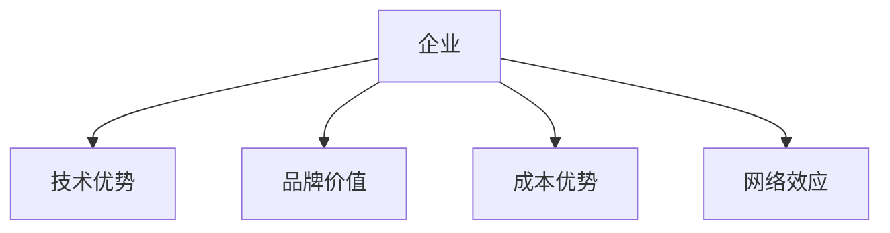
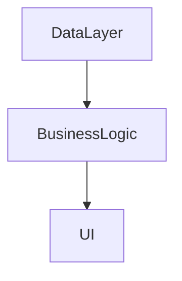

                 


# AI智能体在识别经济护城河中的作用

## 关键词：AI智能体、经济护城河、强化学习、博弈论、系统架构

## 摘要：  
本文探讨了AI智能体在识别经济护城河中的作用，从概念、算法、系统架构到实际案例，全面分析了AI技术在经济领域的应用。通过强化学习和博弈论等方法，AI智能体能够高效识别企业竞争优势，为企业战略决策提供支持。

---

# 第1章: 经济护城河与AI智能体概述

## 1.1 经济护城河的定义与特征

### 1.1.1 经济护城河的核心概念  
经济护城河是指企业在市场中建立的竞争优势，使其能够在竞争中长期保持领先地位。这种优势可能来源于技术、品牌、成本、网络效应等多个方面。

**领域模型图：**



### 1.1.2 经济护城河的分类与特征

| 分类 | 特征 | 示例 |
|------|------|------|
| 技术型 | 基于技术创新 | 苹果的iOS系统 |
| 品牌型 | 强大的品牌影响力 | 可口可乐 |
| 成本型 | 成本领先策略 | 沃尔玛 |
| 网络型 | 网络效应驱动 | 微信的社交网络 |

### 1.1.3 经济护城河的构建与维护

构建经济护城河需要企业持续创新和优化，同时应对市场变化。维护护城河则需要企业定期评估和调整策略。

---

## 1.2 AI智能体的基本概念

### 1.2.1 AI智能体的定义与分类

AI智能体（Artificial Intelligence Agent）是指具备感知环境、做出决策并执行动作的智能系统。分类如下：

| 类型 | 描述 | 示例 |
|------|------|------|
| 反应式 | 基于当前感知做出反应 | 自动化交易系统 |
| 递归式 | 具备推理和规划能力 | 象棋AI |

### 1.2.2 AI智能体的核心能力

AI智能体具备以下核心能力：

1. **感知能力**：通过传感器或数据输入感知环境。
2. **决策能力**：基于感知信息做出决策。
3. **学习能力**：通过机器学习不断优化性能。

### 1.2.3 AI智能体的应用场景

AI智能体广泛应用于金融、医疗、交通等领域。在经济护城河识别中，AI智能体主要用于数据分析和决策支持。

---

## 1.3 AI智能体与经济护城河的结合

### 1.3.1 AI智能体在经济分析中的作用

AI智能体能够处理大量数据，识别潜在的经济模式，帮助发现企业的竞争优势。

### 1.3.2 AI智能体如何识别经济护城河

AI智能体通过分析市场数据、竞争对手行为，识别企业的护城河类型。

### 1.3.3 AI智能体与经济护城河的关系

AI智能体作为工具，帮助企业在复杂市场中识别和维护经济护城河。

---

# 第2章: 经济护城河的识别与分析

## 2.1 经济护城河的识别方法

### 2.1.1 传统经济护城河识别方法

传统方法包括SWOT分析、波特五力模型等，但效率较低。

### 2.1.2 基于AI的经济护城河识别方法

基于AI的方法利用大数据和机器学习，提高了识别的准确性和效率。

### 2.1.3 综合识别方法的优缺点对比

| 方法 | 优点 | 缺点 |
|------|------|------|
| 传统 | 易操作 | 低效 |
| AI   | 高效 | 技术复杂 |

---

## 2.2 AI智能体在经济护城河识别中的优势

### 2.2.1 数据处理能力

AI智能体能够处理海量数据，提取有价值的信息。

### 2.2.2 模型分析能力

通过机器学习模型，AI智能体能够预测市场趋势，识别潜在护城河。

### 2.2.3 实时监控能力

AI智能体能够实时监控市场动态，及时发现竞争变化。

---

## 2.3 经济护城河识别的挑战与解决方案

### 2.3.1 数据质量与完整性问题

数据质量问题可能导致识别结果不准确。

### 2.3.2 模型泛化能力不足

模型可能无法适应不同行业和市场环境。

### 2.3.3 解决方案与优化策略

通过数据清洗、模型优化和领域知识结合，可以提高识别准确性。

---

# 第3章: AI智能体的算法原理与实现

## 3.1 强化学习算法原理

### 3.1.1 强化学习的基本概念

强化学习是一种通过试错学习的方法，AI智能体通过与环境交互获得奖励或惩罚。

### 3.1.2 状态、动作与奖励的定义

| 组件 | 描述 |
|------|------|
| 状态 | 当前环境的描述 |
| 动作 | AI智能体的决策 |
| 奖励 | 行为的结果反馈 |

### 3.1.3 策略与价值函数的实现

策略函数决定AI智能体的动作选择，价值函数评估当前状态的价值。

---

## 3.2 基于博弈论的经济护城河分析

### 3.2.1 博弈论的基本原理

博弈论研究策略互动，帮助理解市场竞争行为。

### 3.2.2 经济护城河的博弈模型

通过博弈模型分析企业之间的竞争关系。

### 3.2.3 AI智能体在博弈模型中的应用

AI智能体可以模拟竞争者行为，预测市场趋势。

---

## 3.3 经济护城河识别的数学模型

### 3.3.1 经济护城河的量化指标

指标包括市场占有率、利润率等。

### 3.3.2 经济护城河识别的数学公式

$$ 护城河强度 = \sum_{i=1}^{n} (w_i \cdot f_i) $$

其中，$w_i$ 是指标权重，$f_i$ 是指标值。

### 3.3.3 模型的验证与优化

通过数据验证和参数调优，提高模型准确性。

---

# 第4章: 系统架构与设计

## 4.1 系统功能设计

### 4.1.1 数据采集模块

负责收集市场数据，包括竞争对手信息。

### 4.1.2 数据分析模块

利用机器学习模型进行数据分析和护城河识别。

### 4.1.3 智能决策模块

基于分析结果，提供决策支持。

---

## 4.2 系统架构设计

### 4.2.1 分层架构设计

| 层 | 描述 |
|----|------|
| 数据层 | 数据存储和管理 |
| 业务逻辑层 | 数据处理和分析 |
| 表示层 | 用户界面 |

### 4.2.2 模块之间的交互关系



### 4.2.3 系统的可扩展性设计

通过模块化设计，系统具备良好的扩展性。

---

## 4.3 接口与交互设计

### 4.3.1 数据接口设计

定义数据接口，确保数据流畅传输。

### 4.3.2 用户交互界面

设计直观的用户界面，方便用户操作。

### 4.3.3 系统日志与监控

记录系统运行日志，便于维护和优化。

---

# 第5章: 项目实战与案例分析

## 5.1 项目环境与工具安装

### 5.1.1 Python环境的搭建

安装Python和相关库，如TensorFlow、Pandas。

### 5.1.2 必需库的安装与配置

安装必要的机器学习库和数据处理库。

### 5.1.3 开发工具的使用

使用Jupyter Notebook进行开发和调试。

---

## 5.2 核心算法实现

### 5.2.1 数据预处理代码

```python
import pandas as pd

# 加载数据
data = pd.read_csv('market_data.csv')

# 数据清洗
data.dropna(inplace=True)
```

### 5.2.2 AI智能体模型的训练

```python
import tensorflow as tf

# 定义模型
model = tf.keras.Sequential([
    tf.keras.layers.Dense(64, activation='relu'),
    tf.keras.layers.Dense(1, activation='sigmoid')
])

# 编译模型
model.compile(optimizer='adam', loss='binary_crossentropy')
```

### 5.2.3 经济护城河识别的实现

```python
# 使用训练好的模型进行预测
predictions = model.predict(data)
```

---

## 5.3 案例分析与总结

### 5.3.1 案例分析

以某互联网企业为例，分析其经济护城河，并展示AI智能体识别结果。

### 5.3.2 总结与优化

总结识别结果，提出优化建议，如加强技术研发。

---

# 第6章: 总结与展望

## 6.1 最佳实践 tips

- 数据质量是关键，需确保数据的准确性和完整性。
- 结合领域知识，优化模型性能。

## 6.2 小结

AI智能体在经济护城河识别中具有重要作用，能够帮助企业发现和维护竞争优势。

## 6.3 注意事项

- 数据隐私和安全问题需重视。
- 模型需定期更新，适应市场变化。

## 6.4 拓展阅读

建议阅读《经济学原理》和《机器学习实战》深入理解相关知识。

---

通过以上步骤，我们完成了从理论到实践的全面分析，展示了AI智能体在识别经济护城河中的巨大潜力和应用价值。未来，随着技术的进步，AI智能体将为企业战略决策提供更强大的支持。

