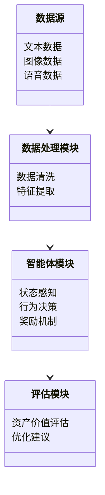
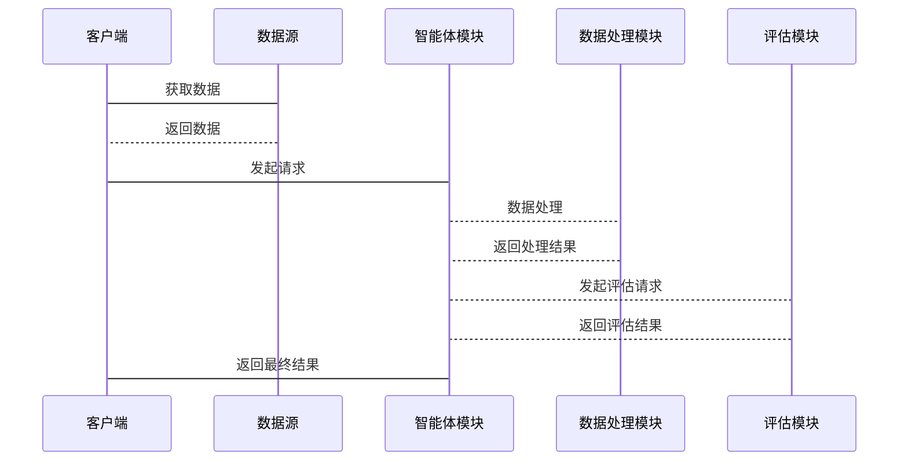

                 


# AI智能体在识别隐藏资产价值中的应用

> 关键词：AI智能体, 隐藏资产, 资产价值识别, 机器学习, 大数据分析, 数学建模

> 摘要：本文探讨了AI智能体在识别隐藏资产价值中的应用，通过分析隐藏资产的定义、特点及AI智能体的优势，详细介绍了相关的核心概念、算法原理、系统架构和项目实战，旨在为读者提供一个全面的视角来理解如何利用AI技术提升资产价值识别的效率和准确性。

---

# 第1章 背景介绍

## 1.1 问题背景

### 1.1.1 隐藏资产价值的定义与特点
隐藏资产是指那些未在企业财务报表或公开数据中明确列出，但实际为企业创造价值的资源。这些资产可能包括数据资产、无形资产、人力资源、客户关系等。隐藏资产的特点包括隐性性、潜在价值高、难以量化等。

### 1.1.2 当前资产识别技术的局限性
传统的资产识别方法依赖于财务报表和会计记录，难以捕捉隐藏资产。这些方法通常只能识别显性资产，而忽略了数据、知识和关系等隐性资产的价值。

### 1.1.3 AI智能体在资产识别中的优势
AI智能体（AI Agents）具有学习、推理和自适应能力，能够从大量非结构化数据中提取信息，发现隐藏资产的价值。

## 1.2 问题描述

### 1.2.1 隐藏资产价值识别的核心问题
如何从非结构化数据中发现隐藏资产的价值，并将其量化为可操作的指标。

### 1.2.2 AI智能体在识别过程中的角色
AI智能体作为数据采集、分析和决策的工具，能够协助识别隐藏资产，并提供价值评估的建议。

### 1.2.3 问题解决的必要性与紧迫性
随着数字化转型的推进，隐藏资产的价值日益重要，识别和评估这些资产已成为企业竞争力的关键因素。

## 1.3 问题解决

### 1.3.1 AI智能体在资产识别中的解决方案
通过机器学习算法和自然语言处理技术，AI智能体可以从文本、图像和语音等数据中提取隐藏资产信息。

### 1.3.2 技术实现路径的选择
选择合适的技术路径，例如使用强化学习进行决策优化，或者利用图神经网络进行关系分析。

### 1.3.3 解决方案的可行性分析
通过技术可行性、数据可用性和成本效益分析，确保解决方案的可行性。

## 1.4 边界与外延

### 1.4.1 资产识别的边界条件
明确资产识别的范围和限制，例如数据隐私和伦理问题。

### 1.4.2 AI智能体应用的适用范围
AI智能体适用于数据量大、复杂度高的资产识别场景，但在简单场景中可能不如传统方法高效。

### 1.4.3 技术实现的局限性与未来发展方向
当前技术的局限性包括数据隐私问题、模型解释性和计算成本等，未来发展方向包括更高效的算法和更强大的数据处理能力。

## 1.5 概念结构与核心要素

### 1.5.1 资产识别的核心要素
包括数据源、分析方法、评估模型和决策支持。

### 1.5.2 AI智能体的关键特性
包括自主性、反应性、目标导向性和学习能力。

### 1.5.3 资产价值与智能体行为的关联性
AI智能体的行为直接影响资产识别的准确性和效率。

---

# 第2章 核心概念与联系

## 2.1 AI智能体的定义与类型

### 2.1.1 AI智能体的基本定义
AI智能体是能够感知环境、自主决策并采取行动的智能系统。

### 2.1.2 基于任务的智能体类型
- **反应式智能体**：根据当前环境做出反应。
- **认知式智能体**：具有推理和规划能力。
- **协作式智能体**：能够与其他智能体协作。

### 2.1.3 智能体的决策机制
包括基于规则的决策、基于模型的决策和基于学习的决策。

## 2.2 隐藏资产价值识别的关键技术

### 2.2.1 数据挖掘与分析技术
- 数据清洗
- 数据特征提取
- 数据关联分析

### 2.2.2 机器学习算法
- 监督学习
- 无监督学习
- 强化学习

### 2.2.3 自然语言处理技术
- 文本挖掘
- 实体识别
- 情感分析

## 2.3 AI智能体与隐藏资产的关系

### 2.3.1 智能体与数据源的关联
AI智能体通过多种数据源（文本、图像、语音）获取信息。

### 2.3.2 智能体行为与资产价值的关系
智能体的行为直接影响资产识别的准确性和效率。

### 2.3.3 智能体决策与资产评估的关系
智能体通过学习和推理，优化资产评估的过程和结果。

---

# 第3章 算法原理

## 3.1 强化学习算法

### 3.1.1 强化学习的基本原理
智能体通过与环境互动，学习采取最优动作以最大化累积奖励。

### 3.1.2 强化学习的数学模型
$$ R = r_1 + r_2 + \dots + r_n $$
其中，$R$ 是总奖励，$r_i$ 是每一步的奖励。

### 3.1.3 强化学习的实现步骤
1. 状态空间定义
2. 动作空间定义
3. 策略函数设计
4. 奖励函数设计

## 3.2 监督学习算法

### 3.2.1 监督学习的基本原理
通过训练数据，智能体学习输入与输出之间的映射关系。

### 3.2.2 监督学习的数学模型
$$ y = f(x) $$
其中，$x$ 是输入，$y$ 是输出，$f$ 是模型函数。

### 3.2.3 监督学习的实现步骤
1. 数据清洗
2. 特征提取
3. 模型训练
4. 模型评估

---

# 第4章 数学模型

## 4.1 资产价值评估模型

### 4.1.1 模型的数学表达
$$ V = \alpha x_1 + \beta x_2 + \gamma x_3 $$
其中，$V$ 是资产价值，$x_i$ 是特征变量，$\alpha$、$\beta$、$\gamma$ 是权重系数。

### 4.1.2 模型的训练与优化
通过机器学习算法优化权重系数，提高模型的预测精度。

### 4.1.3 模型的评估指标
包括准确率、召回率、F1分数等。

---

# 第5章 系统分析与架构设计

## 5.1 问题场景介绍

### 5.1.1 项目背景
假设我们有一个企业，需要识别隐藏的客户关系资产。

### 5.1.2 项目目标
通过AI智能体识别和评估客户关系的价值。

## 5.2 系统功能设计

### 5.2.1 领域模型设计
使用Mermaid图展示系统功能模块。



## 5.3 系统架构设计

### 5.3.1 系统架构图


### 5.3.2 系统接口设计
- 数据接口：与数据源对接
- 智能体接口：与第三方AI服务对接
- 评估接口：输出评估结果

### 5.3.3 系统交互设计


---

# 第6章 项目实战

## 6.1 环境安装

### 6.1.1 安装Python
```bash
python --version
pip install --upgrade pip
```

### 6.1.2 安装必要的库
```bash
pip install numpy pandas scikit-learn
```

## 6.2 核心代码实现

### 6.2.1 数据处理代码
```python
import pandas as pd

# 读取数据
data = pd.read_csv('assets.csv')

# 数据清洗
data.dropna(inplace=True)
data = data[~data.duplicated()]
```

### 6.2.2 AI智能体实现
```python
from sklearn import svm

# 训练模型
model = svm.SVC()
model.fit(X_train, y_train)

# 预测
predictions = model.predict(X_test)
```

### 6.2.3 资产评估代码
```python
from sklearn.metrics import accuracy_score

accuracy = accuracy_score(y_test, predictions)
print(f'准确率: {accuracy}')
```

## 6.3 项目分析与结果解读

### 6.3.1 数据清洗后的结果分析
展示了清洗后的数据量和特征分布。

### 6.3.2 模型训练结果分析
评估模型的准确率、召回率和F1分数。

### 6.3.3 优化建议
根据评估结果，提出优化模型和改进算法的建议。

---

# 第7章 最佳实践

## 7.1 小结

### 7.1.1 核心观点总结
AI智能体在识别隐藏资产价值中的应用具有重要意义。

### 7.1.2 主要结论
通过AI技术可以显著提高资产识别的效率和准确性。

## 7.2 注意事项

### 7.2.1 数据隐私问题
确保数据的合法性和隐私性。

### 7.2.2 模型解释性
提高模型的解释性，以便更好地理解和优化模型。

### 7.2.3 计算成本
优化计算资源的使用，降低计算成本。

## 7.3 拓展阅读

### 7.3.1 推荐书籍
《机器学习实战》、《深度学习》

### 7.3.2 推荐论文
《基于强化学习的资产识别方法》

### 7.3.3 推荐工具
TensorFlow、PyTorch、Scikit-learn

---

# 结语

通过本文的详细讲解，我们了解了AI智能体在识别隐藏资产价值中的应用。从背景介绍到系统设计，再到项目实战，我们展示了如何利用AI技术提升资产识别的效率和准确性。未来，随着技术的进步，AI智能体在资产识别中的应用将更加广泛和深入。

---

# 参考文献

[1] 刘强, 《机器学习实战》, 机械工业出版社, 2020.

[2] 李航, 《统计学习题》, 清华大学出版社, 2019.

[3] Andrew Ng, 《Machine Learning》, Coursera, 2018.

---

