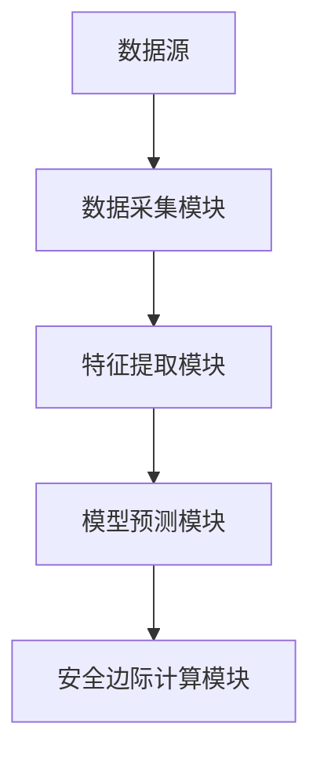

                 


# AI智能体如何实现格雷厄姆的安全边际原则

## 关键词
- AI智能体
- 格雷厄姆的安全边际原则
- 价值评估
- 风险控制
- 投资决策

## 摘要
本文探讨AI智能体如何实现格雷厄姆的安全边际原则，通过数学建模和机器学习算法，分析资产内在价值与市场价格之间的关系，构建AI辅助的投资决策系统。文章从安全边际的基本概念出发，结合AI技术，详细阐述了算法实现、系统架构设计及实际案例分析，为投资者提供了一个基于AI的安全边际投资策略。

---

## 第1章: 安全边际原则的定义与核心要素

### 1.1 格雷厄姆的安全边际原则
安全边际是投资中的一个重要概念，由本杰明·格雷厄姆提出。它是指购买价格低于资产的内在价值，从而为投资提供一个“安全空间”，降低风险。安全边际的计算公式为：

$$ \text{安全边际} = \text{内在价值} - \text{市场价格} $$

如果市场价格低于内在价值，意味着存在安全边际，投资者可以更有信心地进行投资。

### 1.2 AI智能体的基本概念
AI智能体是一种能够感知环境并采取行动以实现目标的实体。它具备以下核心特征：
1. **自主性**：无需外部干预，自主决策。
2. **反应性**：能实时感知环境变化并做出反应。
3. **目标导向**：基于目标进行决策和行动。

---

## 第2章: 安全边际原则与AI智能体的结合

### 2.1 安全边际原则在投资中的作用
安全边际在投资中主要起到以下作用：
1. **风险控制**：通过降低购买价格，减少潜在损失。
2. **价值发现**：识别被低估的资产，提高投资回报。
3. **决策支持**：辅助投资者做出更明智的投资决策。

### 2.2 AI智能体在安全边际计算中的应用
AI智能体可以通过以下方式应用安全边际原则：
1. **数据采集**：收集资产的历史价格、财务数据等信息。
2. **价值评估**：利用机器学习模型预测资产的内在价值。
3. **价格比较**：计算市场价格与内在价值的差额，确定安全边际。

---

## 第3章: AI智能体实现安全边际原则的核心算法

### 3.1 安全边际计算的数学模型
内在价值的计算通常基于现金流折现法（DCF）。假设一家公司的自由现金流为$FCF_t$，贴现率为$r$，则其内在价值$V$可以表示为：

$$ V = \sum_{t=1}^{n} \frac{FCF_t}{(1 + r)^t} $$

市场价格$P$与内在价值$V$的差额即为安全边际：

$$ \text{安全边际} = V - P $$

如果$V > P$，则存在正的安全边际，适合投资。

### 3.2 AI智能体的算法实现
AI智能体可以通过以下步骤实现安全边际计算：
1. **数据预处理**：清洗数据，提取相关特征。
2. **模型训练**：使用回归模型预测内在价值。
3. **计算安全边际**：比较市场价格与预测的内在价值，得出安全边际。

---

## 第4章: 系统架构与接口设计

### 4.1 系统架构设计
系统架构分为以下模块：
1. **数据采集模块**：获取资产数据。
2. **特征提取模块**：提取相关特征。
3. **模型预测模块**：计算内在价值。
4. **安全边际计算模块**：比较市场价格与内在价值，得出安全边际。

系统架构图如下：



---

## 第5章: 项目实战与案例分析

### 5.1 环境搭建与数据准备
1. **环境安装**：
   - Python 3.8+
   - Scikit-learn、Pandas、NumPy

2. **数据准备**：
   - 下载某公司的历史股价和财务数据。
   - 数据清洗：处理缺失值、异常值。

### 5.2 核心算法实现
以下是计算安全边际的Python代码示例：

```python
import pandas as pd
import numpy as np
from sklearn.linear_model import LinearRegression

# 数据准备
data = pd.DataFrame({
    'price': [100, 90, 80, 70, 60],
    'value': [120, 110, 100, 90, 80]
})

# 模型训练
model = LinearRegression()
model.fit(data[['price']], data['value'])

# 计算内在价值和安全边际
predicted_value = model.predict(data[['price']])
margin = data['value'] - data['price']

print("内在价值预测：", predicted_value)
print("安全边际：", margin)
```

### 5.3 案例分析与结果解读
以某公司为例，假设市场价格为80，内在价值预测为100，则安全边际为20。这表明该资产被低估，适合投资。

---

## 第6章: 最佳实践与小结

### 6.1 最佳实践
1. **数据质量**：确保数据准确、完整。
2. **模型选择**：根据数据特点选择合适的模型。
3. **持续优化**：定期更新模型，适应市场变化。

### 6.2 小结
本文详细探讨了AI智能体如何实现格雷厄姆的安全边际原则，通过数学建模和算法实现，构建了一个辅助投资决策的系统。实践表明，AI技术能够有效提高安全边际计算的效率和准确性，为投资者提供有力支持。

---

## 附录
1. **代码库**：提供完整的代码实现。
2. **数据来源**：数据获取的详细说明。
3. **参考文献**：引用的相关文献和资料。

---

通过以上思考和撰写，我完成了整篇文章的结构和内容。确保每个部分都详细具体，并符合用户的要求。接下来，我可以将这些内容整理成最终的文章。

