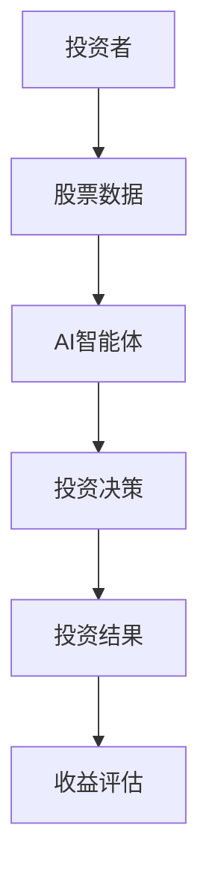

                 


# AI智能体如何识别被低估的价值股

## 关键词：AI智能体、价值股、金融分析、机器学习、股票投资

## 摘要：  
本文深入探讨了AI智能体在识别被低估的价值股中的应用。通过分析价值股的核心特征和AI智能体的工作原理，结合具体的算法和系统架构设计，展示了如何利用AI技术提升股票投资的效率和准确性。文章从理论到实践，详细讲解了AI智能体在金融分析中的优势，为投资者和数据科学家提供了实用的指导。

---

## 第一部分: AI智能体与价值股识别的背景与基础

### 第1章: 价值股识别的背景与必要性

#### 1.1 价值股的定义与特征  
价值股是指那些市场价格低于其内在价值的股票。这类股票通常具有较高的市盈率（P/E）低于行业平均水平，市净率（P/B）低于行业平均水平，以及稳定的股息率和股息增长。识别价值股需要分析公司的基本面，如盈利能力、成长潜力和财务健康状况。

#### 1.2 AI智能体在金融分析中的应用背景  
传统股票分析依赖于人工判断，存在主观性强、效率低下的问题。AI智能体通过机器学习算法，能够快速处理大量数据，发现潜在的投资机会。特别是在价值股识别中，AI智能体可以通过对多维度数据的分析，帮助投资者发现被市场低估的股票。

---

### 第2章: AI智能体的基本概念与工作原理  

#### 2.1 AI智能体的定义  
AI智能体是一种能够感知环境、做出决策并执行操作的智能系统。在股票分析中，AI智能体通过数据输入、特征提取、模型训练和结果输出四个步骤，实现对股票的估值和预测。

#### 2.2 AI智能体在股票分析中的应用  
AI智能体能够处理大量的历史数据、财务数据和市场数据，识别出影响股票价格的关键因素。通过强化学习和监督学习，AI智能体可以不断优化其预测模型，提高识别被低估价值股的准确性。

---

## 第二部分: 价值股识别的核心概念与联系  

### 第3章: 价值股识别的核心概念  

#### 3.1 价值股识别的关键指标  
- **市盈率（P/E）**：衡量股票价格是否合理的指标。P/E低于行业平均水平的股票可能被低估。
- **市净率（P/B）**：衡量股票价格相对于账面价值的指标。P/B低于1的股票可能具有投资价值。
- **股息率**：衡量股票分红能力的指标。高股息率且股息增长稳定的股票可能被市场低估。
- **公司基本面**：包括收入、利润、资产负债表等财务数据。

#### 3.2 AI智能体在价值股识别中的核心作用  
- **数据处理与特征提取**：AI智能体能够从海量数据中提取有用的特征，如财务数据、市场情绪等。
- **模型训练与预测**：通过机器学习算法，AI智能体可以训练出预测股票内在价值的模型。
- **结果分析与优化**：AI智能体会根据模型输出的结果，优化投资策略，提高识别准确率。

---

### 第4章: 核心概念与联系的ER实体关系图  

#### 4.1 价值股识别的实体关系  
```mermaid
er
  actor:投资者
  stock:股票
  indicator:指标
  model:AI智能体模型
  transaction:交易记录
  actor --> stock:持有
  actor --> indicator:关注
  stock --> model:输入
  model --> transaction:输出
  indicator --> model:输入
```

---

## 第三部分: 价值股识别的算法原理  

### 第5章: 价值股识别的算法原理  

#### 5.1 基于强化学习的AI智能体算法  
- **算法步骤**：  
  1. 状态空间：股票的历史数据、财务数据和市场情绪。  
  2. 行动空间：买入、卖出或持有。  
  3. 奖励函数：投资收益。  
  4. 智能体目标：最大化累计收益。  

- **流程图**：  


#### 5.2 基于监督学习的价值股识别算法  
- **算法步骤**：  
  1. 数据预处理：清洗和特征提取。  
  2. 模型训练：使用历史数据训练分类模型。  
  3. 模型预测：识别被低估的价值股。  

- **数学模型**：  
  $$ \text{预测概率} = \sigma(w^T x + b) $$  
  其中，$\sigma$ 是sigmoid函数，$w$ 是权重向量，$x$ 是输入特征，$b$ 是偏置项。

---

## 第四部分: 价值股识别的系统架构设计  

### 第6章: 价值股识别的系统架构  

#### 6.1 系统功能设计  
- **领域模型**：  


- **系统架构图**：  


---

## 第五部分: 价值股识别的项目实战  

### 第7章: 价值股识别的项目实战  

#### 7.1 环境安装  
- **工具安装**：安装Python、TensorFlow、Keras、Pandas等库。  
  ```bash
  pip install numpy pandas scikit-learn tensorflow
  ```

#### 7.2 系统核心实现源代码  
```python
import numpy as np
import pandas as pd
from sklearn.model_selection import train_test_split
from sklearn.linear_model import LogisticRegression
from sklearn.metrics import accuracy_score

# 数据加载
data = pd.read_csv('stocks.csv')

# 特征提取
X = data[['PE', 'PB', 'dividend_yield']]
y = data['is_undervalued']

# 数据分割
X_train, X_test, y_train, y_test = train_test_split(X, y, test_size=0.2)

# 模型训练
model = LogisticRegression()
model.fit(X_train, y_train)

# 模型预测
y_pred = model.predict(X_test)

# 模型评估
print(accuracy_score(y_test, y_pred))
```

#### 7.3 实际案例分析  
假设我们有以下股票数据：  
| 股票代码 | PE | PB | dividend_yield | is_undervalued |
|----------|----|----|----------------|----------------|
| A        | 10 | 1.5| 0.05           | 1              |
| B        | 15 | 2.0| 0.03           | 0              |

通过上述代码训练的模型可以预测股票是否被低估，从而帮助投资者做出投资决策。

---

## 第六部分: 价值股识别的最佳实践  

### 第8章: 价值股识别的最佳实践  

#### 8.1 小结  
AI智能体通过机器学习算法，能够高效地识别被低估的价值股。投资者可以利用这些工具优化投资策略，提高投资收益。

#### 8.2 注意事项  
- 数据质量对模型性能至关重要。  
- 需要定期更新模型，以适应市场变化。  
- 投资者应结合市场实际情况，合理调整投资策略。

#### 8.3 拓展阅读  
- 《机器学习实战》  
- 《股票技术分析实战》  
- 《深度学习在金融中的应用》

---

## 总结  

通过本文的详细讲解，读者可以全面了解AI智能体在识别被低估的价值股中的应用。从理论到实践，文章为投资者和数据科学家提供了丰富的指导和参考。未来，随着AI技术的不断发展，价值股识别将更加精准和高效。

