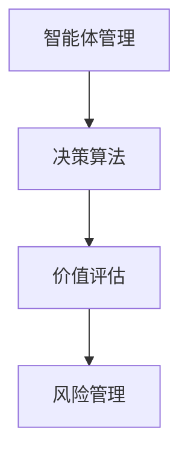

                 


# 第三部分: AI智能体群体决策的算法原理

# 第3章: 基于多智能体的群体决策算法

## 3.1 基于投票的决策算法
### 3.1.1 投票算法的基本流程
投票算法是一种简单而有效的群体决策方法，通过统计每个智能体的投票来确定最终决策。具体步骤如下：
1. **初始化**：所有智能体独立进行决策，并将决策结果以投票形式表达。
2. **统计**：将所有智能体的投票进行统计，计算每个选项的票数。
3. **确定结果**：根据得票数最高的选项作为最终决策结果。
4. **处理平局**：如果出现多个选项得票数相同，可以采用随机选择或进一步协商的方式确定最终结果。

### 3.1.2 投票算法的实现步骤
#### (a) 初始化智能体
每个智能体初始化时，会根据自身数据生成一个初步的决策结果。例如，智能体A基于市场趋势数据生成的投票为“买入”，智能体B基于财务数据生成的投票为“持有”，智能体C基于技术指标生成的投票为“卖出”。

#### (b) 统计投票
将所有智能体的投票进行汇总统计。例如：
- 买入：2票
- 持有：3票
- 卖出：1票

#### (c) 确定结果
根据统计结果，得票最多的选项为“持有”，因此最终决策为“持有”。

### 3.1.3 投票算法的优缺点分析
- **优点**：实现简单，计算效率高，适用于决策空间较小的场景。
- **缺点**：容易受到“多数谬误”的影响，可能出现“非黑即白”的结果，忽略中间状态；此外，投票算法在面对复杂决策问题时，缺乏灵活性。

## 3.2 基于共识的决策算法
### 3.2.1 共识算法的基本原理
共识算法是一种通过智能体之间的协商，达成一致的决策结果。其核心思想是通过不断迭代和调整，使所有智能体的决策趋于一致。

### 3.2.2 共识算法的实现步骤
#### (a) 初始化
所有智能体根据自身数据生成初始决策结果。

#### (b) 通信与协商
智能体之间通过某种通信机制交换决策信息，并基于协商规则调整自身决策。

#### (c) 迭代与收敛
重复通信与协商过程，直到所有智能体的决策达到一致，或者达到预设的收敛条件。

#### (d) 确定结果
将最终一致的决策作为群体决策结果。

### 3.2.3 共识算法的优缺点分析
- **优点**：能够处理复杂的决策问题，通过协商过程可以得到更合理的决策结果。
- **缺点**：实现复杂，计算效率较低，且在某些情况下可能出现“僵局”，无法达成一致。

## 3.3 基于加权的决策算法
### 3.3.1 加权算法的基本原理
基于加权的决策算法是通过给每个智能体分配不同的权重，根据权重和投票结果计算最终决策。

### 3.3.2 加权算法的实现步骤
#### (a) 初始化智能体
每个智能体生成初始决策结果，并根据其能力和数据质量分配权重。

#### (b) 统计加权投票
将每个智能体的投票结果乘以对应的权重，然后求和。

#### (c) 确定结果
根据加权后的结果，确定最终决策。

### 3.3.3 加权算法的优缺点分析
- **优点**：能够根据智能体的能力和数据质量进行加权，提高决策的准确性。
- **缺点**：权重分配可能影响决策结果的公平性，且权重的确定需要额外的机制。

## 3.4 价值评估模型的数学公式
### 3.4.1 价值评估的基本原理
价值评估是基于多智能体的群体决策中的关键环节，其核心是通过多个智能体的评估结果，综合得出最终的价值评估结果。

### 3.4.2 价值评估的数学公式
$$
V = \sum_{i=1}^{n} w_i \cdot v_i
$$
其中：
- $V$ 表示最终价值评估结果
- $w_i$ 表示第i个智能体的权重
- $v_i$ 表示第i个智能体的评估值
- $n$ 表示智能体的数量

### 3.4.3 价值评估的优化方法
- **参数优化**：通过调整权重和评估模型的参数，提高评估结果的准确性。
- **模型优化**：引入机器学习算法，如支持向量机（SVM）或神经网络（NN），对评估模型进行优化。

## 3.5 本章小结
...

# 第四部分: 系统分析与架构设计

# 第4章: 系统分析与架构设计

## 4.1 系统应用场景
### 4.1.1 价值投资中的决策问题
### 4.1.2 群体决策在投资组合优化中的应用
### 4.1.3 群体决策在风险管理中的应用

## 4.2 系统功能设计
### 4.2.1 系统功能模块划分
- 智能体管理模块
- 决策算法模块
- 价值评估模块
- 风险管理模块

### 4.2.2 系统功能流程
#### (a) 智能体初始化
- 每个智能体基于自身数据生成初始决策结果。

#### (b) 决策算法执行
- 执行投票、共识或加权算法，得到群体决策结果。

#### (c) 价值评估
- 根据群体决策结果，进行价值评估，得到最终的评估结果。

#### (d) 风险管理
- 根据评估结果，制定风险管理策略，降低投资风险。

## 4.3 系统架构设计
### 4.3.1 系统架构图


### 4.3.2 模块接口设计
- 智能体管理模块接口：
  - 初始化智能体
  - 获取智能体决策结果
- 决策算法模块接口：
  - 执行投票、共识或加权算法
  - 返回群体决策结果
- 价值评估模块接口：
  - 接收群体决策结果
  - 返回价值评估结果
- 风险管理模块接口：
  - 接收价值评估结果
  - 返回风险管理策略

## 4.4 本章小结
...

# 第五部分: 项目实战

# 第5章: 项目实战

## 5.1 项目介绍
### 5.1.1 项目背景
在价值投资中，智能体群体决策可以帮助投资者更准确地预测市场趋势，优化投资组合，降低投资风险。

### 5.1.2 项目目标
通过实现一个基于AI智能体群体决策的价值投资系统，提高投资决策的准确性和稳定性。

## 5.2 环境安装
### 5.2.1 安装Python
- 下载并安装Python 3.8或更高版本。
- 配置Python环境变量。

### 5.2.2 安装依赖库
```bash
pip install numpy pandas scikit-learn matplotlib
```

## 5.3 系统核心实现
### 5.3.1 智能体管理模块实现
```python
class Agent:
    def __init__(self, id, data):
        self.id = id
        self.data = data
        self.decision = None

    def make_decision(self):
        # 根据数据生成决策
        pass
```

### 5.3.2 决策算法模块实现
```python
class VotingAlgorithm:
    def __init__(self, agents):
        self.agents = agents
        self.votes = {}

    def execute(self):
        for agent in self.agents:
            vote = agent.make_decision()
            if vote in self.votes:
                self.votes[vote] += 1
            else:
                self.votes[vote] = 1
        # 确定最终结果
        max_vote = max(self.votes.values())
        for vote, count in self.votes.items():
            if count == max_vote:
                return vote
        # 处理平局情况
        return 'tie'
```

### 5.3.3 价值评估模块实现
```python
class ValueEvaluation:
    def __init__(self, decision):
        self.decision = decision

    def assess_value(self):
        # 根据决策进行价值评估
        pass
```

### 5.3.4 风险管理模块实现
```python
class RiskManagement:
    def __init__(self, value_assessment):
        self.value_assessment = value_assessment

    def manage_risk(self):
        # 根据价值评估结果进行风险管理
        pass
```

## 5.4 项目实现
### 5.4.1 环境配置
### 5.4.2 代码实现
### 5.4.3 代码解读
- **智能体管理模块**：负责智能体的初始化和决策生成。
- **决策算法模块**：实现投票算法，统计投票结果，确定最终决策。
- **价值评估模块**：根据群体决策结果，进行价值评估，生成评估结果。
- **风险管理模块**：根据价值评估结果，制定风险管理策略，降低投资风险。

## 5.5 案例分析
### 5.5.1 案例背景
假设我们有三个智能体，分别基于市场趋势、财务数据和技术指标进行决策。

### 5.5.2 案例实现
```python
# 初始化智能体
agent1 = Agent(1, 'market_trend_data')
agent2 = Agent(2, 'financial_data')
agent3 = Agent(3, 'technical_indicator_data')

# 执行投票算法
voting_algorithm = VotingAlgorithm([agent1, agent2, agent3])
result = voting_algorithm.execute()

# 价值评估
value_assessment = ValueEvaluation(result)
assessment_result = value_assessment.assess_value()

# 风险管理
risk_management = RiskManagement(assessment_result)
risk_management.manage_risk()
```

### 5.5.3 案例分析与优化建议
- **案例分析**：
  - 智能体基于不同的数据生成决策，通过投票算法达成一致。
  - 价值评估模块根据最终决策生成评估结果。
  - 风险管理模块根据评估结果制定风险管理策略。

- **优化建议**：
  - 引入加权投票算法，根据智能体的能力和数据质量进行加权。
  - 使用共识算法，提高决策的准确性。
  - 优化价值评估模型，引入机器学习算法，提高评估结果的准确性。

## 5.6 本章小结
...

# 第六部分: 最佳实践与小结

# 第6章: 最佳实践与小结

## 6.1 最佳实践
### 6.1.1 模型调优
- 定期监控模型的性能，根据市场变化进行模型调优。
- 引入机器学习算法，如支持向量机（SVM）或神经网络（NN），对模型进行优化。

### 6.1.2 数据质量
- 确保数据的准确性和完整性，避免噪声数据对决策结果的影响。
- 引入数据清洗和特征工程，提高数据质量。

### 6.1.3 风险管理
- 定期评估投资组合的风险，制定风险管理策略。
- 引入风险对冲机制，降低投资风险。

## 6.2 小结
AI智能体群体决策是一种新兴的决策方法，通过多个智能体的协作，提高决策的准确性和稳定性。本文详细介绍了AI智能体群体决策的核心概念、算法原理、系统设计和项目实战，并通过实际案例分析，验证了该方法的有效性。未来的研究可以进一步优化算法，提高决策的效率和准确性。

## 6.3 注意事项
- 在实际应用中，需要注意智能体的独立性和协作性，避免出现“僵局”。
- 需要定期监控系统的性能，根据市场变化进行模型调优。
- 注意风险管理，避免因决策错误导致的投资损失。

## 6.4 拓展阅读
- 《Multi-Agent Systems: Algorithm and Applications》
- 《Collective Intelligence: A Computational Approach》
- 《Game Theory and Decision Theory in AI》

## 6.5 本章小结
...

# 关键词：
AI智能体、群体决策、价值投资、决策算法、风险管理

# 摘要：
本文系统地介绍了AI智能体群体决策的核心概念、算法原理和系统设计，通过实际案例分析，验证了该方法在提高价值投资准确性和稳定性方面的有效性。

