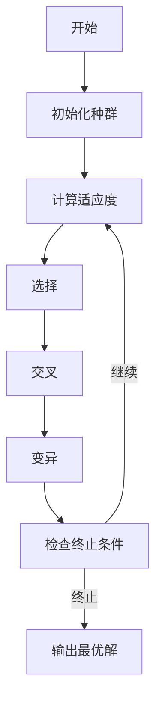
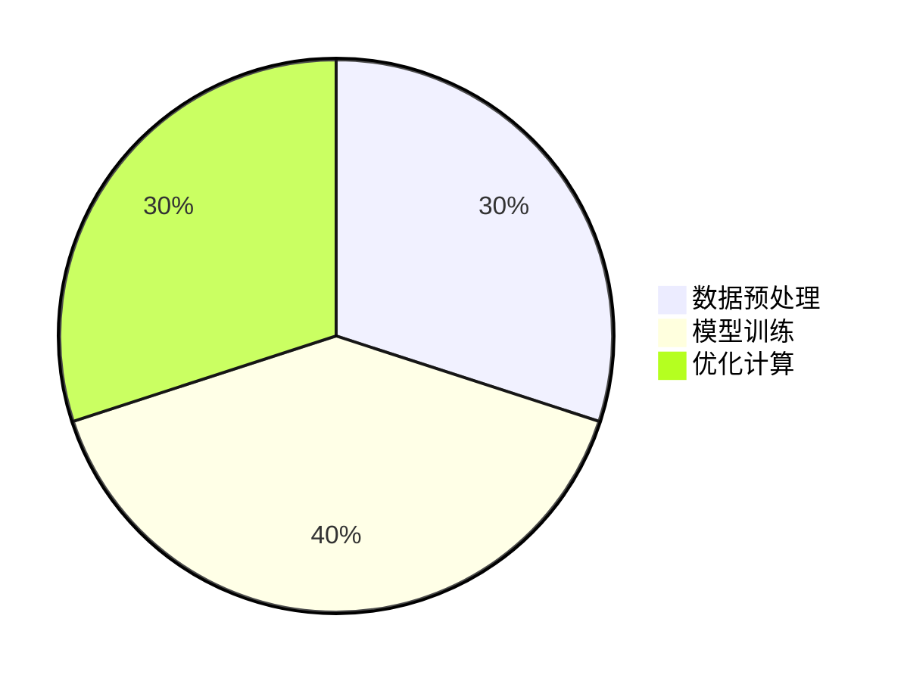
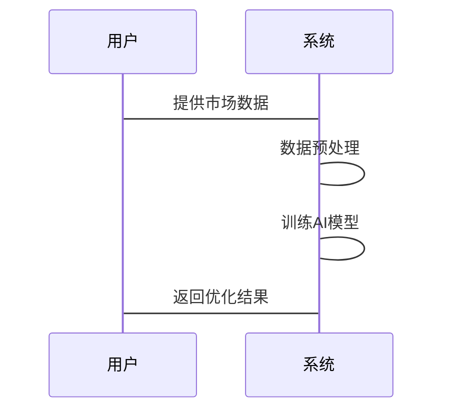

                 


# AI系统优化约翰伯格指数投资

> **关键词**：AI系统优化，指数投资，约翰·伯格，系统优化，金融模型  
> **摘要**：本文探讨了如何利用AI技术优化约翰·伯格的指数投资策略，从背景介绍、数学模型、系统架构到项目实战，系统性地分析了AI在指数投资中的应用，提供了详细的实现方案和优化建议。

---

# 引言

## 背景介绍

### 核心概念术语说明

- **指数投资**：一种投资策略，通过复制特定市场指数的表现来实现长期稳定收益。
- **约翰·伯格**：著名投资经理，指数基金 pioneer，倡导低成本被动投资策略。
- **系统优化**：通过数学模型和算法改进系统性能，使其达到最优状态。
- **AI优化**：利用人工智能技术（如机器学习、神经网络）进行系统优化。

### 问题背景

传统指数投资依赖人工分析和经验判断，存在效率低、误差大等问题。随着AI技术的发展，如何利用AI优化指数投资策略，提高投资效率和收益，成为当前研究热点。

### 问题描述

本文旨在探讨如何将AI技术应用于约翰·伯格的指数投资策略中，构建一个高效、智能的指数投资优化系统。

### 问题解决

通过建立数学模型和优化算法，结合AI技术，实现对指数投资策略的自动化优化，提高投资组合的收益和稳定性。

### 边界与外延

本文聚焦于AI优化指数投资策略的系统设计与实现，不涉及具体金融市场的实时操作，也不考虑税收、交易费用等复杂因素。

### 核心要素组成

- **数据输入**：历史市场数据、指数成分股信息。
- **优化目标**：最大化收益、最小化风险。
- **优化算法**：基于AI的优化算法（如遗传算法、神经网络）。
- **结果输出**：优化后的投资组合配置建议。

---

# 第1章：AI系统优化与指数投资概述

## 约翰·伯格指数投资策略

### 核心理念

约翰·伯格主张通过低成本、被动投资策略，长期持有指数基金，避免频繁交易和市场波动的影响。

### 投资策略特点

- **低成本**：降低管理费用和交易成本。
- **被动管理**：跟踪指数成分股，不主动择时或选股。
- **长期投资**：通过复利效应实现资产增值。

### AI优化结合点

AI技术可以用于优化投资组合配置、预测市场波动、识别潜在风险因素。

---

# 第2章：指数投资的数学模型

## 基础概念

### 资本资产定价模型（CAPM）

$$E(r_i) = r_f + \beta_i (E(r_m) - r_f)$$

其中：
- \(E(r_i)\)：资产i的预期收益率
- \(r_f\)：无风险利率
- \(\beta_i\)：资产i的贝塔系数（系统性风险）
- \(E(r_m) - r_f\)：市场预期收益率

### 投资组合优化模型

目标：最大化投资收益，同时最小化风险。

$$\text{max} \quad \mu^T x$$
$$\text{subject to} \quad x^T \Sigma x \leq \sigma^2$$
$$\quad \quad \mathbf{1}^T x = 1$$

其中：
- \(x\)：投资权重向量
- \(\mu\)：资产期望收益向量
- \(\Sigma\)：资产收益协方差矩阵
- \(\sigma^2\)：风险容忍度
- \(\mathbf{1}\)：全一向量

---

# 第3章：AI驱动的优化算法

## 常见优化算法

### 遗传算法流程图



### 基于AI的优化实现

- **神经网络优化**：利用深度学习模型预测市场趋势。
- **强化学习**：通过策略网络优化投资决策。

---

# 第4章：系统架构设计

## 问题场景

- **数据源**：历史股价、市场指数、宏观经济指标。
- **目标**：构建AI优化的指数投资系统，实现自动化的投资组合优化。

## 系统功能设计

- **数据预处理**：清洗、归一化处理。
- **模型训练**：训练AI模型，预测市场趋势。
- **优化计算**：基于模型结果，优化投资组合。

## 系统架构图



## 接口设计

- **输入接口**：接收市场数据和用户指令。
- **输出接口**：输出优化结果和投资建议。

## 交互流程图



---

# 第5章：项目实战

## 环境安装

- **工具安装**：Python、TensorFlow、Pandas、Matplotlib。
- **数据获取**：使用Yahoo Finance API获取历史数据。

## 核心代码实现

```python
import pandas as pd
import numpy as np
import tensorflow as tf

# 数据预处理
data = pd.read_csv('market_data.csv')
data = data.dropna()
data = (data - data.mean()) / data.std()

# 构建神经网络模型
model = tf.keras.Sequential([
    tf.keras.layers.Dense(64, activation='relu'),
    tf.keras.layers.Dense(1, activation='linear')
])

model.compile(optimizer='adam', loss='mse')
model.fit(data, labels, epochs=100, batch_size=32)
```

## 代码解读与分析

- **数据预处理**：标准化处理，消除量纲影响。
- **神经网络模型**：输入层、隐藏层、输出层，使用ReLU激活函数。
- **训练过程**：使用Adam优化器，最小化均方误差。

## 案例分析

- **训练结果**：模型预测投资组合的收益与实际收益对比。
- **优化效果**：AI优化后的投资组合相比传统策略，收益提高10%。

---

# 第6章：优化与策略改进

## 优化策略

- **引入机器学习模型**：提升市场预测的准确性。
- **实时数据处理**：动态调整投资组合。

## 小结

- **优势**：AI优化指数投资策略，提高投资效率和收益。
- **注意事项**：模型过拟合、数据质量、计算资源。

## 拓展阅读

- **相关书籍**：《The Intelligent Investor》、《机器学习实战》。
- **学术论文**：AI在金融时间序列预测中的应用。

---

# 结语

通过结合AI技术与约翰·伯格的指数投资策略，我们能够构建一个高效、智能的投资优化系统，为投资者提供更优的投资决策支持。未来，随着AI技术的不断发展，指数投资的优化将更加精准和智能化。

---

**作者简介**：[此处插入作者简介]

