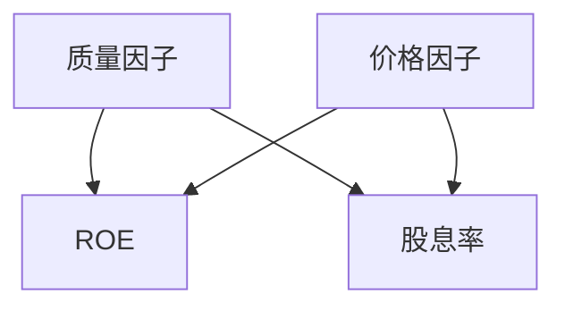
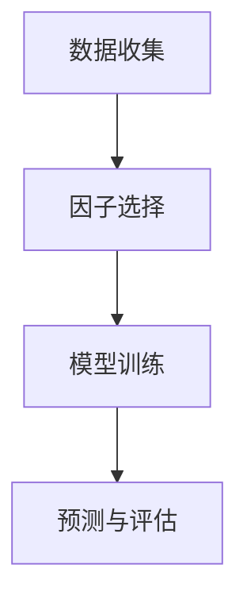

                 


# AI系统如何平衡质量与价格在价值投资中的作用

> 关键词：价值投资，人工智能，股价预测，质量因子，价格因子，投资组合优化

> 摘要：本文探讨了AI技术在价值投资中的应用，分析了如何通过AI系统平衡质量和价格这两个核心要素，优化投资决策，提升投资效率和准确性。文章从背景介绍、核心概念、算法原理、系统架构到项目实战，全面解析了AI在价值投资中的作用与实现。

---

## 第一部分：背景介绍

### 第1章：价值投资的基本概念与AI的应用

#### 1.1 价值投资的核心理念
- **定义与特点**：价值投资是一种以低于内在价值的价格买入优质股票的投资策略，注重基本面分析。
- **核心要素**：市盈率（P/E）、市净率（P/B）、股息率、ROE（净资产收益率）等。
- **常见策略**：寻找被市场低估的股票，长期持有，等待价值回归。

#### 1.2 AI技术在金融领域的应用现状
- **AI在金融中的应用领域**：股票预测、风险评估、投资组合优化等。
- **AI在股票预测中的优势**：数据处理能力强、模式识别精准、计算速度快。
- **AI在投资决策中的优缺点**：
  - 优点：提高预测准确性，降低人为情绪干扰。
  - 缺点：模型过拟合、市场黑天鹅事件难以预测。

#### 1.3 价值投资与AI技术的结合
- **必要性**：AI技术可以辅助投资者快速筛选优质标的，量化分析基本面数据，提供决策支持。
- **AI如何优化价值投资**：通过大数据分析，发现潜在的价值低估股票，优化投资组合，降低风险。

---

## 第二部分：核心概念与联系

### 第2章：质量和价格的定义与关系

#### 2.1 质量因子的定义与特征
- **质量因子**：反映公司质量的指标，如ROE、股息率、资产负债率等。
- **质量因子的重要性**：高ROE意味着公司盈利能力强，高股息率意味着分红能力强。
- **质量因子的对比表**：
  | 质量因子 | 定义 | 示例公司 |
  |----------|------|----------|
  | ROE      | 净资产收益率 | 苹果、微软 |
  | 股息率   | 每股股息与股价的比率 | 高股息股票如红利股 |

#### 2.2 价格因子的定义与特征
- **价格因子**：反映股票价格的指标，如市盈率（P/E）、市净率（P/B）。
- **价格因子的重要性**：低市盈率或市净率意味着股票可能被低估。
- **价格因子的对比表**：
  | 价格因子 | 定义 | 示例公司 |
  |----------|------|----------|
  | P/E      | 市盈率 | 高价值股票如茅台 |
  | P/B      | 市净率 | 高价值股票如银行股 |

#### 2.3 质量与价格的关系
- **质量与价格的动态平衡**：高质量股票可能因市场波动导致价格下跌，提供买入机会。
- **质量因子与价格因子的联系**：通过分析质量因子，预测价格因子的变化趋势。

---

### 第2章：质量与价格的实体关系图



---

## 第三部分：算法原理

### 第3章：多因子模型在价值投资中的应用

#### 3.1 多因子模型的定义与特点
- **多因子模型**：通过多个因子（如质量因子和价格因子）进行综合评估，预测股票价格走势。
- **多因子模型的优势**：考虑多个维度，提高预测准确性。

#### 3.2 多因子模型的数学公式
$$
F = \alpha + \beta_1 F_1 + \beta_2 F_2 + \ldots + \beta_n F_n + \epsilon
$$
- **解释**：F为预测因子，F1、F2等为各个因子，β为因子的权重，ε为误差项。

#### 3.3 多因子模型的实现步骤
1. **数据收集**：收集股票的历史数据，包括价格、市盈率、ROE等。
2. **因子选择**：筛选出具有显著影响的因子。
3. **模型训练**：使用回归分析确定各因子的权重。
4. **预测与评估**：基于模型预测股票价格，评估模型的准确性。

---

### 第3章：算法流程图



---

## 第四部分：系统分析与架构设计

### 第4章：系统架构设计

#### 4.1 系统功能需求
- **需求分析**：支持多因子模型训练、股票预测、投资组合优化。
- **功能模块**：
  1. 数据采集模块：收集股票数据。
  2. 数据处理模块：清洗和预处理数据。
  3. 模型训练模块：训练多因子模型。
  4. 预测模块：输出股票预测结果。

#### 4.2 系统架构设计


---

## 第五部分：项目实战

### 第5章：价值投资AI系统的实现

#### 5.1 环境配置
- **Python版本**：3.8+
- **依赖库安装**：pandas、numpy、scikit-learn、matplotlib

#### 5.2 核心代码实现
```python
import pandas as pd
import numpy as np
from sklearn.linear_model import LinearRegression

# 数据预处理
data = pd.read_csv('stock_data.csv')
data = data.dropna()

# 选择因子
features = ['ROE', 'P/E', 'P/B']
target = 'Price'

# 训练模型
model = LinearRegression()
model.fit(data[features], data[target])

# 预测与评估
predictions = model.predict(data[features])
print('预测结果:', predictions)
print('R²值:', model.score(data[features], data[target]))
```

#### 5.3 项目总结
- **项目成果**：成功构建了一个基于多因子模型的股票预测系统。
- **经验总结**：模型的准确性和数据质量密切相关，需要不断优化模型参数。

---

## 第六部分：最佳实践

### 第6章：价值投资与AI结合的实践经验

#### 6.1 小结
- AI技术为价值投资提供了强大的工具，能够帮助投资者更精准地识别优质股票，优化投资组合。

#### 6.2 注意事项
- 数据质量至关重要，需确保数据来源可靠。
- 模型需要定期更新，避免过拟合。

#### 6.3 拓展阅读
- 推荐阅读《投资学基础》、《机器学习实战》等书籍。

---

通过以上步骤，AI系统能够有效平衡质量与价格在价值投资中的作用，为投资者提供更科学的决策支持。

