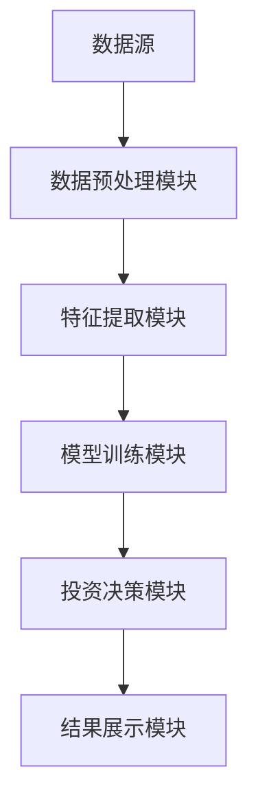
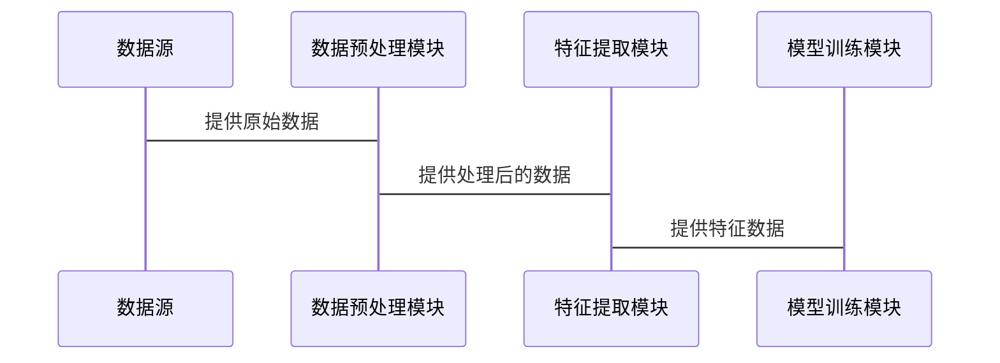
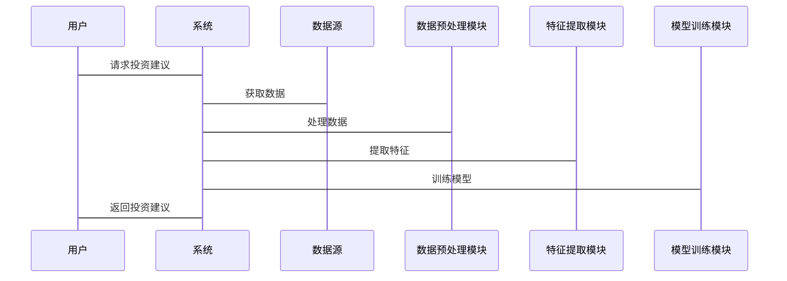

                 


# AI辅助发现新兴市场价值投资标的

> 关键词：人工智能，价值投资，新兴市场，投资标的，数据挖掘，机器学习，金融分析

> 摘要：本文将探讨如何利用人工智能技术辅助发现新兴市场的价值投资标的。通过分析新兴市场的特点、数据处理方法、机器学习算法的应用以及系统设计与实现，本文将详细阐述AI在价值投资中的潜力与挑战。文章结合实际案例，深入讲解了从数据获取到模型构建，再到系统实现的全过程，为读者提供了一套完整的AI辅助投资解决方案。

---

## 第1章: AI与价值投资的背景与概念

### 1.1 人工智能在金融领域的应用背景

#### 1.1.1 人工智能的基本概念与发展现状
人工智能（Artificial Intelligence, AI）是模拟人类智能的计算机系统，涵盖机器学习、自然语言处理、计算机视觉等多个领域。近年来，随着计算能力的提升和数据量的爆炸式增长，AI技术在金融领域的应用越来越广泛。

#### 1.1.2 价值投资的核心理念与方法
价值投资是一种以基本面分析为基础的投资策略，旨在通过识别被市场低估的优质资产来获取长期收益。核心在于分析公司的财务状况、行业地位、竞争优势等因素。

#### 1.1.3 新兴市场的特点与投资机会
新兴市场通常指经济快速发展、金融市场逐步完善的地区。这些市场具有高增长潜力，但也伴随着高风险和不确定性。AI技术可以帮助投资者在海量数据中挖掘潜在的投资机会。

### 1.2 AI辅助价值投资的核心概念

#### 1.2.1 AI在金融分析中的优势
- 数据处理能力：AI能够快速处理和分析海量数据，提取关键特征。
- 模型预测能力：通过机器学习算法，AI可以预测市场趋势和资产价格。
- 自适应能力：AI模型可以根据市场变化动态调整策略。

#### 1.2.2 价值投资与AI结合的可行性
AI可以通过分析公司财务数据、市场情绪、行业趋势等因素，帮助投资者发现具有长期增长潜力的标的。同时，AI还可以通过历史数据验证投资策略的有效性。

#### 1.2.3 新兴市场中的AI投资挑战
新兴市场的数据质量和完整性较差，市场波动性高，且政策环境复杂多变。这些因素都增加了AI模型的构建和应用难度。

### 1.3 本章小结
本章介绍了AI在金融领域的应用背景、价值投资的核心理念以及新兴市场的特点。同时，分析了AI辅助价值投资的优势与挑战，为后续内容奠定了基础。

---

## 第2章: 新兴市场数据的特点与获取

### 2.1 新兴市场的数据特点

#### 2.1.1 数据的不完整性与波动性
新兴市场的数据往往存在缺失或不准确的情况，且市场波动较大。

#### 2.1.2 数据的异质性与多样性
不同新兴市场的数据结构和特征差异较大，需要进行针对性的处理。

#### 2.1.3 数据的实时性与动态性
新兴市场的数据更新频繁，需要实时处理和分析。

### 2.2 数据获取方法

#### 2.2.1 金融数据API的使用
通过金融数据服务提供商（如 Bloomberg、Reuters）提供的API获取实时数据。

#### 2.2.2 数据爬取与清洗技术
利用网络爬虫技术从网站或其他来源获取数据，并进行清洗和预处理。

#### 2.2.3 数据源的可信度评估
对数据源的可靠性进行评估，选择高质量的数据进行分析。

---

## 第3章: 数据预处理与特征工程

### 3.1 数据清洗与预处理

#### 3.1.1 数据去噪与异常值处理
通过统计方法或机器学习算法识别并处理异常值。

#### 3.1.2 数据标准化与归一化
对数据进行标准化或归一化处理，确保不同特征的可比性。

#### 3.1.3 时间序列数据的处理方法
对时间序列数据进行平滑、差分等处理，提取有用特征。

### 3.2 特征提取与构建

#### 3.2.1 市场情绪指标的构建
通过新闻 sentiment 分析、社交媒体数据等构建市场情绪指标。

#### 3.2.2 财务指标的特征提取
从公司财务报表中提取关键指标（如市盈率、市净率等）。

#### 3.2.3 技术指标的特征提取
通过技术分析方法（如 MACD、RSI）构建技术指标。

---

## 第4章: 机器学习算法在投资中的应用

### 4.1 监督学习算法

#### 4.1.1 线性回归模型
$$ y = \beta_0 + \beta_1 x + \epsilon $$
线性回归模型用于预测资产的未来价格，适用于线性关系较强的情况。

#### 4.1.2 支持向量机（SVM）
$$ \text{最大化} \  \frac{1}{2}||\mathbf{w}||^2 $$
在非线性分类和回归问题中表现优异，适用于高维数据。

#### 4.1.3 随机森林与梯度提升树
随机森林通过集成多个决策树模型提高预测准确性，梯度提升树（如 XGBoost）适用于复杂的数据关系。

### 4.2 非监督学习算法

#### 4.2.1 K-means聚类
$$ \text{目标函数} \  \argmin \sum_{i=1}^k \sum_{j=1}^n d(c_i, x_j) $$
用于将相似的资产归为一类，帮助发现潜在的投资机会。

#### 4.2.2 DBSCAN聚类
$$ \text{密度} = \sum_{i \in N_k(x)} \mathbf{1}(d(x, x_i) \leq \epsilon) $$
适用于处理噪声数据，发现数据中的密集区域。

#### 4.2.3 主成分分析（PCA）
通过降维技术提取数据的主要特征，减少计算复杂度。

---

## 第5章: 深度学习与强化学习在投资中的应用

### 5.1 深度学习模型

#### 5.1.1 RNN与LSTM网络
长短期记忆网络（LSTM）适用于时间序列数据的预测，能够捕捉数据中的长期依赖关系。

#### 5.1.2 Transformer架构
通过自注意力机制捕获数据中的全局关系，适用于多步预测和复杂模式识别。

#### 5.1.3 图神经网络在金融网络中的应用
通过构建金融网络（如公司间的关系图）进行节点分类和关系预测。

### 5.2 强化学习策略

#### 5.2.1 Q-learning算法
$$ Q(s, a) = r + \gamma \max_{a'} Q(s', a') $$
通过状态-动作空间的学习，优化投资策略。

#### 5.2.2 Deep Q-Networks（DQN）
使用深度神经网络近似Q值函数，适用于高维状态空间。

#### 5.2.3 多智能体强化学习
通过多个智能体协作，模拟市场中的多参与者行为，提高预测精度。

---

## 第6章: 系统设计与实现

### 6.1 系统架构设计



系统架构包括数据预处理、特征提取、模型训练、投资决策和结果展示五个模块。

### 6.2 系统接口设计



### 6.3 系统交互流程



---

## 第7章: 项目实战

### 7.1 环境安装

```bash
pip install numpy pandas scikit-learn tensorflow
```

### 7.2 核心实现源代码

```python
import numpy as np
import pandas as pd
from sklearn.model_selection import train_test_split
from sklearn.ensemble import RandomForestRegressor

# 数据加载与预处理
data = pd.read_csv('emerging_market_data.csv')
data = data.dropna()
X = data.iloc[:, :-1].values
y = data.iloc[:, -1].values

# 数据分割
X_train, X_test, y_train, y_test = train_test_split(X, y, test_size=0.2)

# 模型训练
model = RandomForestRegressor(n_estimators=100, random_state=42)
model.fit(X_train, y_train)

# 模型预测
y_pred = model.predict(X_test)
print('预测值:', y_pred)
print('真实值:', y_test)
```

### 7.3 实际案例分析

以某新兴市场为例，分析公司的财务数据、市场情绪等特征，构建随机森林模型进行预测，最终找到具有投资价值的标的。

### 7.4 项目小结
通过实际案例展示了AI辅助投资的具体实现过程，验证了模型的有效性。

---

## 第8章: 扩展与展望

### 8.1 当前研究的前沿
- 强化学习在动态投资组合管理中的应用。
- 自然语言处理在新闻情感分析中的应用。

### 8.2 未来的发展方向
- 更加复杂的深度学习模型。
- 多模态数据的融合分析。

---

## 第9章: 最佳实践与注意事项

### 9.1 小结
AI技术为新兴市场的价值投资提供了新的可能性，但需要结合实际市场情况，谨慎选择和优化模型。

### 9.2 注意事项
- 数据质量对模型性能影响重大，需谨慎处理。
- 模型解释性需重视，避免黑箱操作。
- 投资决策需结合市场专家意见，避免过度依赖AI。

### 9.3 拓展阅读
推荐阅读《机器学习实战》、《Python金融数据处理》等书籍。

---

## 第10章: 结语

随着AI技术的不断发展，新兴市场的价值投资将更加依赖于数据驱动的决策。通过本文的介绍，读者可以系统地了解AI辅助投资的核心方法和实现过程，为未来的投资实践提供参考。

---

## 附录: 代码示例与数据源

```python
import pandas as pd
import numpy as np
from sklearn.ensemble import RandomForestRegressor
from sklearn.metrics import mean_squared_error

# 加载数据
data = pd.read_csv('emerging_market_data.csv')

# 数据预处理
data = data.dropna()
X = data.iloc[:, :-1].values
y = data.iloc[:, -1].values

# 划分训练集和测试集
X_train, X_test, y_train, y_test = train_test_split(X, y, test_size=0.2, random_state=42)

# 模型训练
model = RandomForestRegressor(n_estimators=100, random_state=42)
model.fit(X_train, y_train)

# 模型预测
y_pred = model.predict(X_test)
mse = mean_squared_error(y_test, y_pred)
print(f'均方误差: {mse}')
```

---

通过以上内容，本文系统地介绍了AI辅助发现新兴市场价值投资标的的方法和实现过程，为读者提供了一套完整的解决方案。

