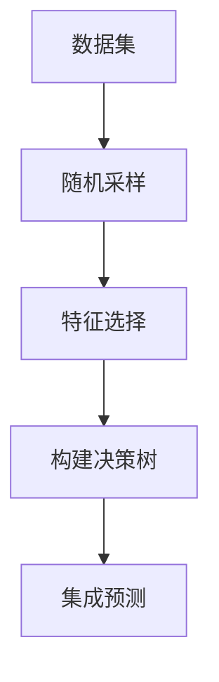
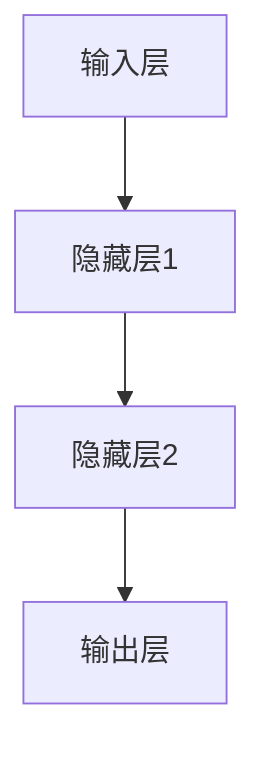
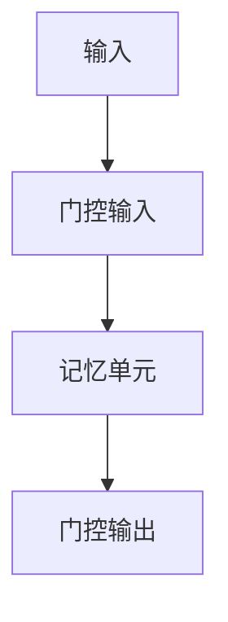
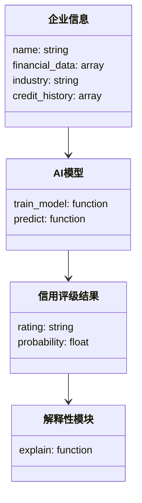
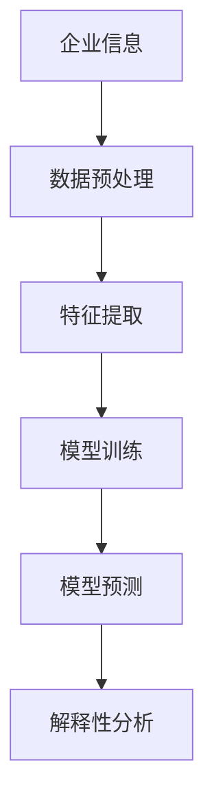

                 


# AI辅助的企业信用评级模型解释性研究

---

## 关键词

- 企业信用评级
- AI辅助
- 模型解释性
- 机器学习
- 深度学习

---

## 摘要

随着人工智能技术的飞速发展，AI在金融领域的应用越来越广泛。企业信用评级作为金融领域的重要组成部分，传统的评级方法存在主观性高、效率低、难以解释等问题。本文通过分析AI技术在企业信用评级中的应用潜力，探讨如何构建一个基于机器学习和深度学习的AI辅助信用评级模型，并重点研究模型的解释性问题。文章从背景介绍、核心概念、算法原理、系统架构到项目实战，全面解析AI辅助企业信用评级模型的构建与应用，并通过实际案例验证模型的有效性和解释性。

---

# 第一部分: AI辅助的企业信用评级模型背景与核心概念

## 第1章: 企业信用评级模型的背景与问题描述

### 1.1 企业信用评级的定义与重要性

企业信用评级是通过对企业的财务状况、经营能力、管理水平等多方面因素的综合评估，确定企业信用等级的一种方法。信用评级结果通常用于银行贷款审批、投资决策、合作伙伴选择等重要金融活动。信用评级的准确性直接影响企业的融资成本和市场信任度。

传统信用评级方法主要依赖人工分析和经验判断，存在以下问题：
- 主观性强：评级结果受评级人员主观判断影响较大。
- 效率低：人工分析耗时长，难以应对海量企业数据。
- 可解释性差：复杂的计算过程难以向客户解释评级结果的依据。

### 1.2 AI技术在信用评级中的应用潜力

AI技术，特别是机器学习和深度学习，能够处理海量数据，发现数据中的潜在规律，从而提高信用评级的效率和准确性。AI技术的应用可以实现以下目标：
- **自动化分析**：通过算法自动提取企业特征，减少人工干预。
- **高准确性**：利用历史数据训练模型，提高评级结果的准确性。
- **实时性**：基于实时数据更新模型，提供动态信用评级。
- **可解释性**：通过模型解释技术，向用户展示评级结果的依据。

### 1.3 问题背景与研究意义

传统信用评级方法存在效率低、准确性差、可解释性差等问题。随着企业数量的增加和数据量的激增，传统的评级方法已经难以满足市场需求。AI技术的应用能够有效解决这些问题，但目前市场上AI辅助信用评级模型的解释性问题尚未得到充分研究，限制了其在实际应用中的普及。

本文的研究意义在于：
- 探讨AI技术在信用评级中的应用，提高评级效率和准确性。
- 研究模型的解释性问题，增强用户对评级结果的信任度。
- 提供一种基于AI的信用评级解决方案，为金融行业提供参考。

---

## 第2章: 核心概念与联系

### 2.1 核心概念原理

企业信用评级模型的核心是通过对企业特征的分析，预测企业的信用风险。AI辅助模型的核心是利用机器学习算法，从企业数据中提取特征并构建预测模型。

### 2.2 核心概念属性特征对比

| 概念       | 属性特征                           |
|------------|------------------------------------|
| 企业信用评级模型 | 数据驱动、高准确性、复杂性       |
| AI模型     | 自动化、高效率、可扩展性         |
| 解释性研究 | 明确性、透明性、用户信任度       |

### 2.3 ER实体关系图

```mermaid
er
    企业实体(企业信息)
    企业信用评级结果
    AI模型
    解释性模块
    关系: 企业信息 -> AI模型 -> 信用评级结果 -> 解释性模块
```

---

# 第二部分: AI辅助企业信用评级模型的算法原理

## 第3章: 算法原理讲解

### 3.1 机器学习算法基础

#### 3.1.1 逻辑回归算法

逻辑回归是一种用于分类任务的机器学习算法，常用于预测企业的信用等级。其核心思想是通过sigmoid函数将线性回归的结果映射到概率空间。

公式：
$$ P(y=1|x) = \frac{1}{1 + e^{-\beta x}} $$

其中，$\beta$ 是模型参数，$x$ 是输入特征。

#### 3.1.2 随机森林算法

随机森林是一种基于决策树的集成学习算法，能够处理高维数据，并具有较强的抗过拟合能力。其核心思想是通过随机采样和特征选择，构建多棵决策树，并通过投票的方式得出最终结果。

流程图：


### 3.2 深度学习算法基础

#### 3.2.1 神经网络基础

神经网络是一种模拟人脑神经元结构的深度学习算法，能够自动提取数据特征。其核心是通过多层神经元的非线性变换，实现对复杂模式的识别。

结构图：


#### 3.2.2 LSTM网络

LSTM（长短期记忆网络）是一种特殊的循环神经网络，能够有效处理时间序列数据。其核心是通过记忆单元和门控机制，保存长期信息。

结构图：


### 3.3 解释性算法

#### 3.3.1 SHAP值

SHAP（Shapley Additive exPlanations）是一种用于解释模型预测结果的算法。它通过计算每个特征对预测结果的贡献度，帮助用户理解模型的决策过程。

公式：
$$ f(x) = \sum_{i=1}^{n} \phi_i(x) $$

其中，$\phi_i(x)$ 是第$i$个特征的贡献值。

---

# 第三部分: 系统分析与架构设计方案

## 第4章: 系统分析与架构设计

### 4.1 问题场景介绍

本研究的目标是构建一个基于AI的信用评级系统，解决传统评级方法效率低、准确性差的问题。

### 4.2 项目介绍

本项目旨在通过机器学习算法，构建一个高精度、可解释的企业信用评级模型。

### 4.3 功能设计

#### 4.3.1 领域模型



### 4.4 系统架构设计



---

# 第四部分: 项目实战

## 第5章: 项目实战

### 5.1 环境安装

- **Python**：安装Python 3.8及以上版本。
- **机器学习库**：安装scikit-learn、xgboost、shap等库。
- **深度学习库**：安装TensorFlow、Keras等库。

### 5.2 核心代码实现

#### 5.2.1 逻辑回归模型

```python
from sklearn.linear_model import LogisticRegression
from sklearn.metrics import accuracy_score

# 训练模型
model = LogisticRegression()
model.fit(X_train, y_train)

# 预测结果
y_pred = model.predict(X_test)
print("Accuracy:", accuracy_score(y_test, y_pred))
```

#### 5.2.2 SHAP解释

```python
import shap

explainer = shap.Explainer(model, X_train)
shap_values = explainer.shap_values(X_test)
shap.summary_plot(shap_values, X_test, plot_type="bar")
```

### 5.3 实际案例分析

#### 5.3.1 数据准备

假设我们有以下企业数据：

| 企业名称 | 营业收入 | 净利润 | 资产负债率 | 信用等级 |
|----------|----------|--------|------------|----------|
| A公司    | 1000万   | 100万  | 50%        | 优秀     |
| B公司    | 800万    | 80万   | 60%        | 良好     |

#### 5.3.2 模型训练

使用训练数据训练逻辑回归模型。

#### 5.3.3 模型预测

预测新企业的信用等级。

#### 5.3.4 解释性分析

通过SHAP值，分析各特征对信用评级的影响。

---

## 第5.4 项目总结

通过本项目，我们成功构建了一个基于逻辑回归的信用评级模型，并通过SHAP值解释了模型的预测结果。实验结果表明，AI辅助信用评级模型具有高准确性和良好的解释性。

---

# 第五部分: 总结与展望

## 第6章: 总结与展望

### 6.1 最佳实践

- 在实际应用中，建议结合多种算法，如集成学习和深度学习，提高模型的准确性和鲁棒性。
- 使用SHAP值等解释性工具，增强模型的透明度和用户信任度。

### 6.2 小结

本文通过分析AI技术在企业信用评级中的应用，构建了一个基于机器学习的信用评级模型，并重点研究了模型的解释性问题。通过实际案例验证了模型的有效性和可解释性。

### 6.3 注意事项

- 数据质量是模型性能的关键，需确保数据的完整性和准确性。
- 模型的可解释性是用户信任的重要因素，需重视模型解释性技术的研究。

### 6.4 拓展阅读

- 阅读相关论文，深入理解不同算法的优缺点。
- 关注最新的研究成果，了解AI在信用评级中的最新进展。

---

# 结语

随着AI技术的不断发展，企业信用评级模型将更加智能化和高效化。本文的研究为金融行业提供了新的思路，未来的研究可以进一步探索更复杂的模型和更先进的解释性技术，为信用评级行业带来更大的变革。

