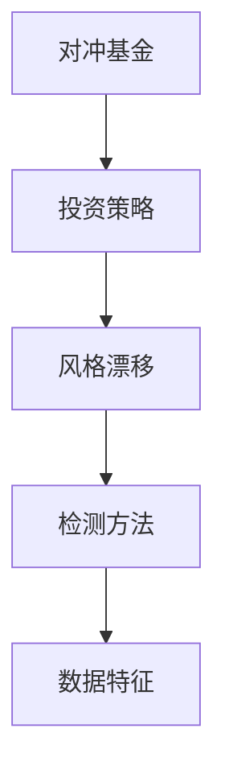
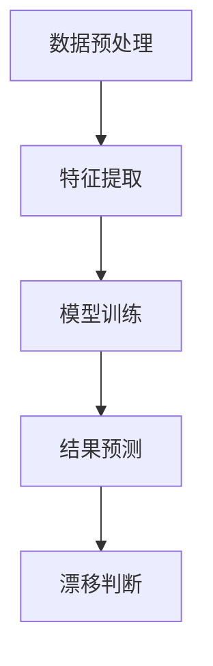

                 


# AI辅助的对冲基金风格漂移检测

> 关键词：对冲基金，风格漂移，AI，机器学习，金融数据分析，投资策略

> 摘要：本文详细探讨了利用人工智能技术辅助对冲基金风格漂移检测的方法与实现。通过对冲基金风格漂移的定义、检测方法、算法原理、系统架构设计以及实际案例分析，展示了如何利用AI技术有效识别和管理对冲基金的投资风格偏离问题。本文结合理论与实践，为金融从业者和AI技术爱好者提供了从概念理解到实际应用的完整指南。

---

# 第1章: 对冲基金风格漂移检测概述

## 1.1 问题背景与定义

### 1.1.1 对冲基金的基本概念

对冲基金是一种通过多种策略对冲市场风险的投资基金，其核心目标是实现绝对收益。对冲基金的投资策略多样，包括股票多空策略、套利策略、量化策略等。由于对冲基金的复杂性，其投资风格和风险敞口可能会随市场环境和管理人决策发生变化。

### 1.1.2 风格漂移的定义与问题描述

风格漂移是指对冲基金的实际投资行为与其初始投资策略或风险敞口发生偏离的现象。这种偏离可能源于市场变化、管理人调整或投资策略的自然演化。风格漂移可能导致基金的实际风险与预期不符，进而影响投资者的收益和信任。因此，及时发现和管理风格漂移是金融风险管理的重要环节。

### 1.1.3 风格漂移检测的必要性

- **风险管理**：风格漂移可能导致基金承担超出预期的风险。
- **投资透明度**：通过检测风格漂移，可以提高对冲基金的透明度，增强投资者信任。
- **合规性要求**：部分金融监管机构要求对冲基金严格遵守其投资策略，风格漂移可能引发合规问题。

## 1.2 AI技术在金融领域的应用现状

### 1.2.1 AI在金融数据分析中的应用

人工智能技术在金融领域的应用日益广泛，包括股票预测、风险评估、投资组合优化等领域。AI技术能够处理海量数据，发现传统方法难以捕捉的模式和趋势。

### 1.2.2 对冲基金领域中的AI技术

对冲基金领域是AI技术的重要应用场景。通过机器学习模型，可以分析基金的投资行为，识别投资风格的变化，优化投资策略。

### 1.2.3 风格漂移检测的AI技术发展

随着深度学习和自然语言处理技术的进步，AI在风格漂移检测中的应用逐渐成熟。通过分析文本数据、市场数据和基金行为数据，AI技术能够更准确地识别风格漂移。

## 1.3 对冲基金风格漂移检测的核心要素

### 1.3.1 投资策略与风格的定义

对冲基金的投资策略决定了其风格。例如，股票多空策略注重市场趋势，而套利策略则依赖于市场套利机会。明确的投资策略是风格漂移检测的基础。

### 1.3.2 风格漂移的度量方法

风格漂移可以通过多种方法进行度量，包括统计方法、机器学习方法和自然语言处理方法。每种方法都有其优缺点，需要根据具体场景选择合适的方案。

### 1.3.3 数据来源与特征提取

数据来源包括市场数据、基金持仓数据、交易数据和文本数据等。特征提取是将这些数据转化为可用于检测风格漂移的特征向量的关键步骤。

---

# 第2章: 对冲基金风格漂移检测的核心概念与联系

## 2.1 风格漂移检测的原理与方法

### 2.1.1 基于统计的方法

统计方法通过分析基金的收益和风险特征，识别其与预期策略的偏离。例如，通过均值-方差分析，可以判断基金的投资风格是否发生变化。

### 2.1.2 基于机器学习的方法

机器学习方法通过训练模型，识别基金投资行为的变化。常用的算法包括聚类分析、支持向量机和随机森林等。

### 2.1.3 基于自然语言处理的方法

自然语言处理方法通过分析基金的报告、新闻和社交媒体数据，识别其投资风格的变化。例如，通过情感分析可以判断市场情绪对基金风格的影响。

## 2.2 核心概念对比分析

### 2.2.1 风格漂移与投资策略漂移的对比

风格漂移是指基金的实际投资行为与其初始策略的偏离，而投资策略漂移则指策略本身的变化。两者密切相关，但侧重点不同。

### 2.2.2 不同检测方法的优缺点分析

| 方法类型       | 优点                           | 缺点                           |
|----------------|--------------------------------|--------------------------------|
| 统计方法       | 实现简单，易于解释             | 适用于简单场景，难以捕捉复杂模式 |
| 机器学习方法   | 能够捕捉复杂模式               | 实现复杂，需要大量数据           |
| 自然语言处理   | 可以分析非结构化数据           | 计算资源消耗大，准确性依赖数据质量 |

## 2.3 实体关系图与概念架构



---

# 第3章: 基于机器学习的风格漂移检测算法

## 3.1 算法原理概述

### 3.1.1 聚类分析原理

聚类分析是一种无监督学习方法，通过将数据分成簇，识别数据的自然分组。在风格漂移检测中，可以将基金分成不同的风格类别。

### 3.1.2 时间序列分析原理

时间序列分析用于分析基金风格随时间的变化。通过ARIMA等模型，可以预测基金的未来风格变化。

### 3.1.3 分类算法原理

分类算法通过训练模型，将基金分类为风格漂移或非漂移。常用的分类算法包括支持向量机和随机森林。

## 3.2 算法实现流程



## 3.3 数学模型与公式

### 3.3.1 聚类分析的数学模型

$$距离度量：d(x,y) = \sqrt{\sum_{i=1}^n (x_i - y_i)^2}$$

### 3.3.2 时间序列分析的公式

$$ARIMA模型：y_t = \phi y_{t-1} + \theta \epsilon_{t-1} + \epsilon_t$$

---

# 第4章: 对冲基金风格漂移检测的系统架构设计

## 4.1 系统功能设计

### 4.1.1 数据采集模块

负责采集市场数据、基金持仓数据和文本数据。

### 4.1.2 特征提取模块

将数据转化为可用于检测风格漂移的特征向量。

### 4.1.3 模型训练模块

训练机器学习模型，识别风格漂移。

### 4.1.4 结果输出模块

输出风格漂移检测结果，供投资者和管理者参考。

## 4.2 系统架构设计


---

# 第5章: 对冲基金风格漂移检测的项目实战

## 5.1 环境安装与配置

### 5.1.1 安装Python环境

使用Anaconda安装Python 3.8及以上版本。

### 5.1.2 安装必要的库

安装numpy、pandas、scikit-learn和自然语言处理库（如spaCy）。

## 5.2 核心代码实现

### 5.2.1 数据预处理代码

```python
import pandas as pd
import numpy as np

# 读取数据
data = pd.read_csv('fund_data.csv')

# 数据清洗
data.dropna(inplace=True)
```

### 5.2.2 模型训练代码

```python
from sklearn.cluster import KMeans

# 特征提取
X = data[['return', 'volatility', 'beta']]

# 聚类分析
model = KMeans(n_clusters=3, random_state=42)
model.fit(X)
```

## 5.3 案例分析与解读

### 5.3.1 案例数据来源

使用某对冲基金的 monthly returns 和 risk metrics 数据进行分析。

### 5.3.2 检测结果解读

通过聚类分析，发现某基金的投资风格发生显著变化，表明存在风格漂移。

## 5.4 项目总结

通过实际案例分析，验证了基于机器学习的风格漂移检测方法的有效性。

---

# 第6章: 对冲基金风格漂移检测的最佳实践与注意事项

## 6.1 最佳实践

### 6.1.1 数据质量的重要性

确保数据的完整性和准确性是风格漂移检测的基础。

### 6.1.2 模型选择与调优

根据具体场景选择合适的算法，并进行模型调优以提高检测准确性。

### 6.1.3 结果解释与反馈

检测结果需要结合具体业务场景进行解释，并及时反馈给相关方。

## 6.2 小结

通过对冲基金风格漂移检测的实践，可以有效管理投资风险，提高投资透明度。

---

# 第7章: 未来研究方向与拓展阅读

## 7.1 未来研究方向

### 7.1.1 更先进的AI算法研究

探索深度学习和强化学习在风格漂移检测中的应用。

### 7.1.2 多模态数据融合

结合结构化数据和非结构化数据，提高检测的准确性。

### 7.1.3 实时检测系统开发

开发实时风格漂移检测系统，实现对冲基金投资行为的实时监控。

## 7.2 拓展阅读

推荐阅读相关领域的经典文献和最新研究成果，以深入了解对冲基金风格漂移检测的技术细节和应用实践。

---

# 附录: 参考文献与工具资源

## 附录A: 参考文献

1. 《机器学习实战》
2. 《Python机器学习》
3. 《金融数据分析与建模》

## 附录B: 工具资源

1. Python编程语言
2. Scikit-learn机器学习库
3. Pandas数据分析库

---

通过本文的详细讲解，读者可以系统地了解AI辅助的对冲基金风格漂移检测的理论与实践，掌握从数据处理到算法实现的全过程，并能够将其应用于实际的金融风险管理中。

