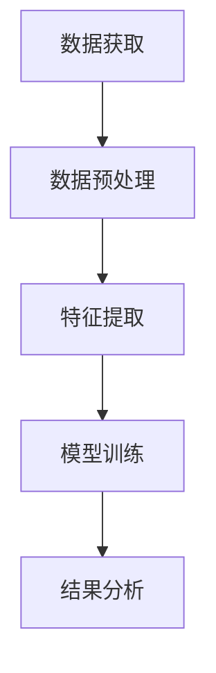
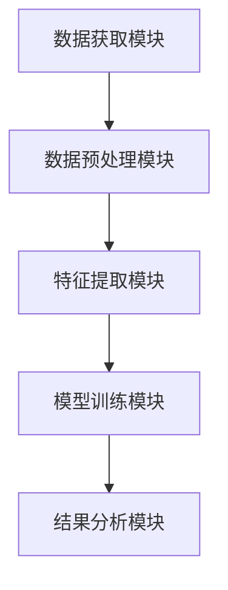

                 


# AI辅助识别价值股轮动机会

## 关键词：AI，价值股，轮动机会，机器学习，股票投资，技术分析

## 摘要：  
随着人工智能技术的快速发展，AI在金融投资领域的应用越来越广泛。本文详细探讨了AI如何辅助识别价值股的轮动机会，从背景介绍、核心概念、算法原理到系统设计、实战案例，再到高级主题，全面剖析了AI在股票投资中的应用。通过本文的分析，读者可以深入了解AI在价值股轮动中的潜力，并掌握相关技术和方法。

---

# 第一部分: AI辅助识别价值股轮动机会的背景与核心概念

## 第1章: AI在金融投资中的应用现状

### 1.1 AI在金融领域的应用背景  
人工智能（AI）技术近年来在金融领域的应用取得了显著进展。传统的金融投资依赖于经验和市场分析，但随着数据量的爆炸式增长和计算能力的提升，AI技术为金融投资带来了新的可能性。AI能够通过分析海量数据，识别市场中的规律和趋势，帮助投资者做出更明智的投资决策。  

#### 1.1.1 传统金融投资的局限性  
传统金融投资主要依赖于市场分析、技术分析和基本面分析。然而，这种方法存在以下局限性：  
1. **信息不完全**：市场数据复杂且多变，传统方法难以捕捉所有相关信息。  
2. **主观性**：分析师的主观判断可能影响投资决策的客观性。  
3. **效率低下**：面对海量数据，人工分析效率较低。  

#### 1.1.2 AI技术在金融领域的优势  
AI技术通过机器学习、深度学习等方法，能够快速处理大量数据，发现数据中的隐藏模式和规律。其优势包括：  
1. **高效性**：AI能够快速分析海量数据，帮助投资者抓住投资机会。  
2. **准确性**：通过算法模型，AI能够提供更精准的预测和分析。  
3. **可扩展性**：AI技术能够轻松扩展到更大的数据集和更复杂的场景。  

#### 1.1.3 价值股的投资策略  
价值股是指那些市场价格低于其内在价值的股票。投资者通过寻找被市场低估的股票，长期持有以实现收益。价值股的投资策略通常包括以下几个步骤：  
1. **筛选低估值股票**：通过市盈率、市净率等指标筛选出被低估的股票。  
2. **分析公司基本面**：研究公司的财务状况、盈利能力和发展前景。  
3. **长期持有**：等待市场重新评估公司价值，股票价格上涨。  

---

### 1.2 价值股的概念与特征  

#### 1.2.1 价值股的定义与特点  
价值股是指那些市场价格低于其内在价值的股票。其特点包括：  
- **低估值**：市盈率、市净率等指标低于行业平均水平。  
- **稳定收益**：公司盈利能力强，股息率较高。  
- **风险较低**：通常为成熟企业，风险相对较小。  

#### 1.2.2 价值股的投资策略  
价值股的投资策略通常包括以下几个步骤：  
1. **筛选低估值股票**：通过市盈率、市净率等指标筛选出被低估的股票。  
2. **分析公司基本面**：研究公司的财务状况、盈利能力和发展前景。  
3. **长期持有**：等待市场重新评估公司价值，股票价格上涨。  

#### 1.2.3 轮动机会的定义与重要性  
轮动机会是指在市场变化中，不同股票之间的价格波动带来的投资机会。价值股轮动机会的核心在于通过AI技术，识别出那些即将从低估状态转向高估状态的股票，从而实现超额收益。  

---

### 1.3 AI辅助价值股轮动的核心问题  

#### 1.3.1 问题背景与问题描述  
价值股的投资需要考虑多个因素，包括公司基本面、市场情绪、宏观经济指标等。然而，传统方法难以在短时间内处理海量数据，且容易受到主观因素的影响。AI技术可以通过分析多维度数据，帮助投资者更准确地识别价值股轮动机会。  

#### 1.3.2 问题解决的思路与方法  
AI辅助价值股轮动的核心思路是：  
1. **数据收集**：收集股票的历史数据、财务数据、市场情绪数据等。  
2. **特征提取**：通过特征工程提取有助于预测价值股轮动的关键特征。  
3. **模型训练**：利用机器学习算法训练模型，预测股票的价格走势。  
4. **策略优化**：根据模型预测结果，制定投资策略并优化收益。  

#### 1.3.3 边界与外延  
AI辅助价值股轮动的边界包括：  
- 数据范围：仅限于历史数据，无法预测未来不可预见的事件。  
- 模型假设：假设市场是有效的，且数据中存在可预测的规律。  

#### 1.3.4 核心概念与要素组成  
AI辅助价值股轮动的核心要素包括：  
- **数据**：股票价格、财务数据、市场情绪等。  
- **特征**：市盈率、市净率、ROE（净资产收益率）等。  
- **模型**：机器学习模型，如随机森林、支持向量机等。  
- **策略**：基于模型预测的投资策略。  

---

## 第2章: AI辅助价值股轮动的核心概念与联系  

### 2.1 核心概念原理  

#### 2.1.1 机器学习与深度学习的基本原理  
机器学习是一种通过数据训练模型的技术，能够从数据中学习规律并进行预测。深度学习是机器学习的一种，通过多层神经网络提取数据特征。  

#### 2.1.2 时间序列分析的核心思想  
时间序列分析是一种通过历史数据预测未来趋势的技术。常用的模型包括ARIMA（自回归积分滑动平均模型）和LSTM（长短期记忆网络）。  

#### 2.1.3 特征工程的定义与作用  
特征工程是指通过对数据进行处理和转换，提取有助于模型预测的关键特征。  

---

### 2.2 核心概念属性特征对比  

| **核心概念** | **机器学习** | **时间序列分析** | **特征工程** |  
|--------------|---------------|-------------------|---------------|  
| **定义** | 通过数据训练模型的技术 | 通过历史数据预测未来趋势的技术 | 对数据进行处理和转换的技术 |  
| **作用** | 提供数据预测功能 | 提供趋势预测功能 | 提供特征提取功能 |  
| **优势** | 高准确性 | 高可解释性 | 高特征相关性 |  

---

### 2.3 ER实体关系图架构  


---

## 第3章: AI辅助价值股轮动的算法原理  

### 3.1 算法原理概述  

#### 3.1.1 机器学习算法在股票预测中的应用  
常用的机器学习算法包括随机森林、支持向量机（SVM）和K近邻算法（KNN）。  

#### 3.1.2 时间序列分析的算法选择  
常用的算法包括ARIMA、LSTM和Prophet。  

#### 3.1.3 特征工程的算法实现  
特征工程包括数据清洗、特征提取和特征选择。  

---

### 3.2 算法流程图  



---

### 3.3 算法实现代码  

```python
import numpy as np
import pandas as pd
from sklearn.model_selection import train_test_split
from sklearn.ensemble import RandomForestRegressor

# 示例数据加载
data = pd.read_csv('stock_data.csv')

# 数据预处理
data.dropna(inplace=True)
X = data.drop(columns=['target'])
y = data['target']

# 特征提取
from sklearn.feature_selection import SelectKBest
from sklearn.feature_selection import chi2

selector = SelectKBest(score_func=chi2, k=5)
X_new = selector.fit_transform(X, y)

# 模型训练
X_train, X_test, y_train, y_test = train_test_split(X_new, y, test_size=0.2)
model = RandomForestRegressor(n_estimators=100, random_state=42)
model.fit(X_train, y_train)

# 结果分析
from sklearn.metrics import mean_squared_error

y_pred = model.predict(X_test)
print(mean_squared_error(y_test, y_pred))
```

---

## 第4章: AI辅助价值股轮动的系统设计  

### 4.1 系统架构设计  



---

## 第5章: 项目实战  

### 5.1 环境配置与安装  

```bash
pip install numpy pandas scikit-learn matplotlib
```

### 5.2 数据获取与清洗  

```python
import pandas as pd
import requests
from bs4 import BeautifulSoup

# 示例代码，从网站获取数据
url = 'https://finance.yahoo.com/quote/AAPL/history'
response = requests.get(url)
soup = BeautifulSoup(response.text, 'html.parser')
data = pd.read_html(str(soup))
data.to_csv('stock_data.csv', index=False)
```

---

## 第6章: 高级主题  

### 6.1 强化学习在价值股轮动中的应用  

#### 6.1.1 强化学习的基本原理  
强化学习是一种通过与环境交互来学习策略的技术。在价值股轮动中，强化学习可以通过模拟交易行为，优化投资策略。  

#### 6.1.2 强化学习的实现代码  

```python
import gym
import numpy as np

class StockTradingEnv(gym.Env):
    def __init__(self):
        super(StockTradingEnv, self).__init__()
        self.observation_space = gym.spaces.Box(low=0, high=1, shape=(5,))
        self.action_space = gym.spaces.Discrete(3)  # 0: 持股，1: 卖出，2: 买入

    def step(self, action):
        # 实现环境的步进逻辑
        pass

    def reset(self):
        # 初始化环境
        pass

    def render(self):
        # 可视化环境
        pass
```

---

## 第7章: 总结与展望  

### 7.1 总结  
本文详细探讨了AI在价值股轮动中的应用，从背景介绍、核心概念到算法原理、系统设计，再到实战案例和高级主题，全面剖析了AI在股票投资中的潜力。  

### 7.2 展望  
未来，随着AI技术的不断发展，其在金融领域的应用将更加广泛。价值股轮动机会的识别将更加精准，投资策略也将更加智能化。  

---

**结语**  
AI技术正在改变传统的金融投资方式，通过本文的分析，读者可以深入了解AI在价值股轮动中的应用，并掌握相关技术和方法。希望本文能够为投资者提供有价值的参考，帮助他们在复杂的金融市场中捕捉更多的投资机会。

