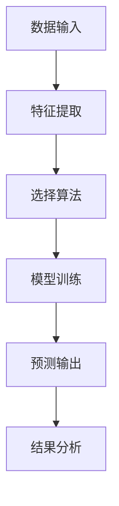
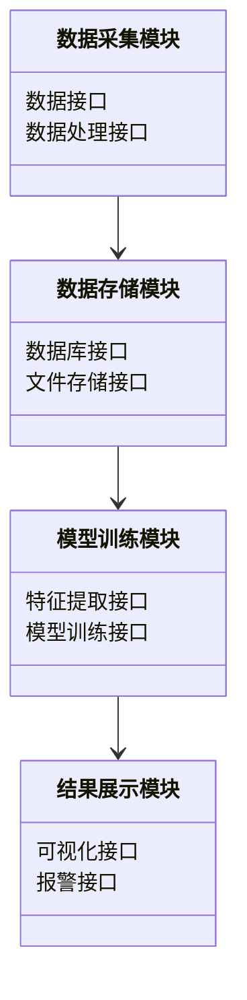

                 


# AI辅助识别市场异常与套利机会

> 关键词：AI、金融市场、异常检测、套利机会、监督学习、无监督学习、强化学习

> 摘要：本文将探讨如何利用人工智能技术辅助识别金融市场中的异常现象和套利机会。通过分析AI在金融领域的应用背景、核心算法、系统架构设计以及实际案例，本文旨在为读者提供一套完整的解决方案，帮助他们在复杂的金融市场中捕捉到潜在的套利机会。

---

## 第1章: AI辅助识别市场异常与套利机会的背景与概述

### 1.1 问题背景与问题描述

金融市场是一个复杂且高度动态的环境，价格波动、交易行为以及市场参与者的决策都在不断影响市场的走向。然而，市场中的异常现象（如闪崩、操纵）和套利机会（如价差套利、统计套利）往往难以被传统方法及时发现。传统的金融分析方法依赖于经验和统计分析，存在效率低、覆盖面窄、响应速度慢等问题。随着人工智能（AI）技术的快速发展，利用AI辅助识别市场异常和套利机会成为可能。

#### 1.1.1 金融市场中的异常与套利现象

- **市场异常**：指市场中出现的非正常价格波动，可能是由于市场操纵、突发事件或技术故障引起的。识别这些异常现象可以帮助投资者避免重大损失。
- **套利机会**：指利用市场价差或时间差进行无风险或低风险的盈利行为。套利机会往往短暂，需要快速识别和捕捉。

#### 1.1.2 传统识别方法的局限性

- **数据处理能力有限**：传统方法依赖人工分析，难以处理海量数据。
- **响应速度慢**：传统方法难以实时捕捉市场变化。
- **规则复杂**：套利机会的识别需要复杂的市场分析和规则制定。

#### 1.1.3 AI技术在金融领域的优势

- **高效性**：AI可以快速处理海量数据，实时捕捉市场变化。
- **准确性**：通过机器学习算法，AI可以识别复杂的市场模式和异常现象。
- **可扩展性**：AI技术可以应用于多种金融市场和产品。

### 1.2 AI辅助识别的核心概念

#### 1.2.1 市场异常的定义与分类

- **市场异常**：指市场中出现的非正常价格波动。
- **分类**：可以分为短期异常（如闪崩）和长期异常（如市场操纵）。

#### 1.2.2 套利机会的定义与特征

- **套利机会**：利用市场价差或时间差进行无风险或低风险的盈利行为。
- **特征**：短暂性、低风险性、可复制性。

#### 1.2.3 AI在识别过程中的作用机制

- **数据驱动**：AI通过分析历史数据和实时数据，识别市场模式和异常现象。
- **模型驱动**：通过构建机器学习模型，AI能够预测市场走势并识别套利机会。

### 1.3 本章小结

本章介绍了AI在识别市场异常和套利机会中的重要作用，并从传统方法的局限性和AI技术的优势两个方面进行了对比分析。接下来，我们将深入探讨数据采集与预处理的关键步骤。

---

## 第2章: 金融市场数据的采集与预处理

### 2.1 数据来源与类型

#### 2.1.1 常见金融数据类型

- **K线数据**：包括开盘价、收盘价、最高价、最低价等。
- **tick数据**：实时交易数据，记录每一笔交易的时间、价格和成交量。

#### 2.1.2 数据采集的挑战与解决方案

- **挑战**：数据量大、数据格式多样、数据清洗复杂。
- **解决方案**：使用数据采集工具（如Yahoo Finance API）和数据清洗工具（如Pandas）。

### 2.2 数据清洗与特征提取

#### 2.2.1 数据清洗方法

- **处理缺失值**：使用均值、中位数或插值法填充缺失值。
- **处理异常值**：使用Z-score或IQR方法识别并处理异常值。

#### 2.2.2 特征提取技术

- **技术指标**：如MACD、RSI、移动平均线等。
- **统计特征**：如均值、方差、最大值、最小值等。

### 2.3 数据预处理的注意事项

#### 2.3.1 数据标准化与归一化

- **标准化**：将数据按比例缩放到均值为0、方差为1。
- **归一化**：将数据缩放到0-1范围。

#### 2.3.2 时间序列数据的特殊处理

- **滑动窗口法**：提取过去n个时间点的特征。
- **差分法**：将时间序列数据转换为平稳序列。

### 2.4 本章小结

本章详细介绍了金融市场数据的采集与预处理方法，包括数据来源、数据清洗、特征提取以及数据标准化等关键步骤。接下来，我们将探讨AI辅助识别的核心算法。

---

## 第3章: AI辅助识别的核心算法

### 3.1 监督学习算法

#### 3.1.1 分类算法

- **随机森林**：一种基于决策树的集成学习算法，适用于分类和回归任务。
- **支持向量机（SVM）**：适用于小样本数据的分类任务。

#### 3.1.2 回归算法

- **线性回归**：用于预测连续型变量（如股票价格）。
- **Lasso回归**：用于特征选择和降维。

### 3.2 无监督学习算法

#### 3.2.1 聚类算法

- **K-means**：适用于将数据分为K个簇的聚类任务。
- **DBSCAN**：基于密度的聚类算法，适用于处理噪声数据。

#### 3.2.2 异常检测算法

- **Isolation Forest**：基于树结构的异常检测算法。
- **One-Class SVM**：适用于无监督异常检测任务。

### 3.3 强化学习算法

#### 3.3.1 Q-Learning算法

- **Q-Learning**：一种基于值函数的强化学习算法，适用于离线学习任务。

#### 3.3.2 Deep Q-Network算法

- **Deep Q-Network**：一种结合深度学习和强化学习的算法，适用于复杂的非线性环境。

### 3.4 算法流程图



### 3.5 本章小结

本章介绍了几种常用的AI算法，包括监督学习、无监督学习和强化学习算法，并通过流程图展示了算法的整体流程。接下来，我们将探讨系统架构设计。

---

## 第4章: 系统架构设计

### 4.1 项目需求分析

#### 4.1.1 功能需求

- **数据采集**：实时采集金融市场数据。
- **模型训练**：训练异常检测和套利机会识别模型。
- **结果展示**：可视化展示识别结果。

#### 4.1.2 性能需求

- **实时性**：要求系统能够实时处理数据。
- **准确性**：要求识别结果具有较高的准确率。

### 4.2 系统功能设计

#### 4.2.1 领域模型（Mermaid类图）



### 4.3 系统架构设计

#### 4.3.1 系统架构（Mermaid架构图）


### 4.4 本章小结

本章通过领域模型和系统架构图展示了系统的整体设计，从数据采集到结果展示，每个模块的功能和交互关系都清晰明了。接下来，我们将通过实际案例展示如何将这些技术应用于实战。

---

## 第5章: 实战分析

### 5.1 环境搭建

#### 5.1.1 安装Python环境

```bash
# 安装Python
# 安装必要的库
pip install numpy pandas scikit-learn matplotlib
```

### 5.2 系统核心实现源代码

#### 5.2.1 数据采集与预处理代码

```python
import pandas as pd
import numpy as np

# 数据采集
df = pd.read_csv('data.csv')

# 数据清洗
df.dropna(inplace=True)

# 特征提取
df['moving_avg'] = df['收盘价'].rolling(window=5).mean()
```

#### 5.2.2 模型训练代码

```python
from sklearn.ensemble import RandomForestClassifier
from sklearn.metrics import accuracy_score

# 数据分割
X = df.drop('标签', axis=1)
y = df['标签']

# 训练模型
model = RandomForestClassifier()
model.fit(X, y)

# 模型评估
y_pred = model.predict(X)
print(accuracy_score(y, y_pred))
```

### 5.3 代码应用解读与分析

- **数据采集**：使用Pandas库读取CSV格式的金融数据。
- **数据清洗**：处理缺失值和异常值。
- **特征提取**：计算移动平均线等技术指标。
- **模型训练**：使用随机森林算法进行分类任务。

### 5.4 实际案例分析

#### 5.4.1 案例背景

- **市场环境**：假设当前市场出现异常波动。
- **数据来源**：某股票的历史价格数据。

#### 5.4.2 模型实现

```python
# 示例代码：异常检测
from sklearn.ensemble import IsolationForest

model = IsolationForest(contamination=0.05)
model.fit(X)
y_pred = model.predict(X)
```

#### 5.4.3 结果分析

- **异常检测结果**：标记出异常交易行为。
- **套利机会识别**：通过模型预测识别潜在的套利机会。

### 5.5 本章小结

本章通过实际案例展示了如何利用AI技术识别市场异常和套利机会，从环境搭建到代码实现，再到结果分析，为读者提供了一套完整的解决方案。

---

## 第6章: 总结与展望

### 6.1 总结

本文详细探讨了AI在识别市场异常和套利机会中的应用，从数据采集到系统架构设计，再到实际案例分析，为读者提供了一套完整的解决方案。

### 6.2 展望

随着AI技术的不断发展，未来在金融领域的应用将更加广泛。未来的研究方向包括：

- **更复杂的模型**：如深度学习和强化学习。
- **实时性优化**：提高系统的响应速度。
- **多市场应用**：将AI技术应用于更多金融市场。

---

## 附录

### 附录A: 常用Python库

- **Pandas**：数据处理。
- **Scikit-learn**：机器学习算法。
- **Matplotlib**：数据可视化。

### 附录B: 参考文献

- [1] 书籍或论文参考文献。

---

通过本文的系统介绍，读者可以全面了解AI在识别市场异常和套利机会中的应用，并能够将其应用于实际投资和交易中。

