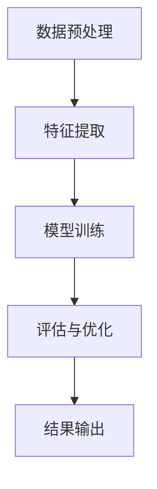
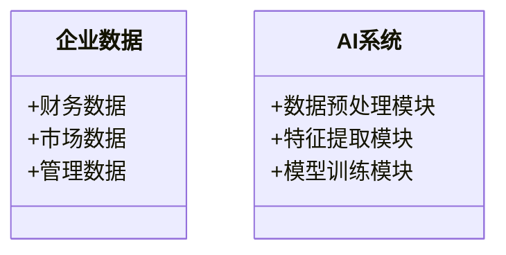
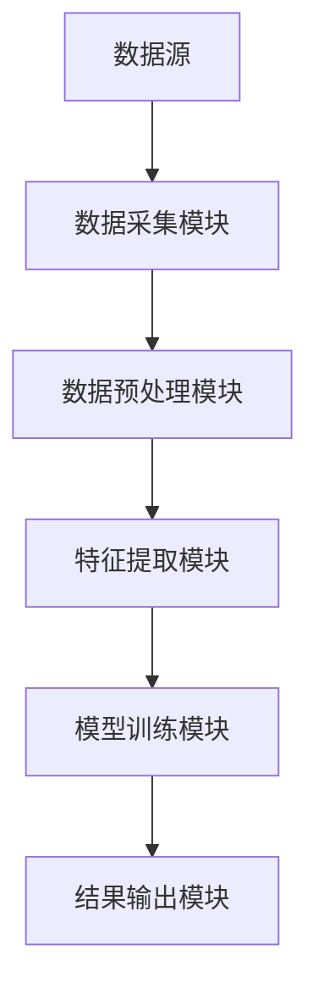

                 


# AI辅助识别长期价值创造型公司

> 关键词：AI技术、企业价值评估、长期价值创造、机器学习、深度学习

> 摘要：本文详细探讨了如何利用AI技术识别长期价值创造型公司。通过分析企业数据、构建机器学习模型和深度学习算法，结合系统架构设计和实际案例，展示了AI在企业价值评估中的应用。本文还提供了代码实现和最佳实践建议。

---

# 第1章：AI辅助识别长期价值创造型公司的背景介绍

## 1.1 问题背景与问题描述

### 1.1.1 传统企业价值评估的局限性
传统的企业价值评估方法主要依赖财务指标和市场分析，但这种方法存在以下局限性：
- 数据依赖性强，难以捕捉非财务因素。
- 无法实时更新，难以应对市场变化。
- 需要大量人工分析，效率低下。

### 1.1.2 长期价值创造型公司的定义
长期价值创造型公司是指那些能够持续为股东、客户和员工创造价值的企业。这些公司通常具备以下特征：
- 高质量的管理团队。
- 稳定的财务表现。
- 强大的市场竞争力。

### 1.1.3 AI技术在企业价值评估中的应用潜力
AI技术可以通过分析大量非结构化数据（如社交媒体评论、新闻报道）和结构化数据（如财务报表），提供更全面的企业价值评估。AI可以识别潜在的风险和机会，帮助投资者做出更明智的决策。

## 1.2 问题解决与边界

### 1.2.1 AI技术如何解决企业价值评估问题
AI技术可以通过以下方式解决企业价值评估问题：
- 自动化数据收集和处理。
- 提供实时的市场分析。
- 识别潜在的长期价值创造型公司。

### 1.2.2 问题的边界与外延
本研究的边界包括：
- 仅关注长期价值创造型公司的识别。
- 仅考虑公开可用的数据源。
- 仅使用监督学习算法进行分析。

### 1.2.3 核心概念的结构与组成
长期价值创造型公司的识别涉及以下核心概念：
- 企业基本面数据。
- 市场情绪数据。
- 竞争环境数据。

## 1.3 本章小结
本章介绍了AI技术在企业价值评估中的应用背景，明确了长期价值创造型公司的定义，并指出了AI技术在这一领域的重要作用。

---

# 第2章：长期价值创造型公司的核心概念与联系

## 2.1 核心概念原理

### 2.1.1 长期价值创造的核心要素
长期价值创造的核心要素包括：
- 财务健康性。
- 市场竞争力。
- 管理团队稳定性。

### 2.1.2 AI技术在长期价值评估中的作用
AI技术通过以下方式在长期价值评估中发挥作用：
- 数据分析：提取企业基本面数据。
- 模型构建：预测企业未来的财务表现。

## 2.2 核心概念属性特征对比

### 2.2.1 表格对比长期价值创造与短期收益
| 特性                | 长期价值创造 | 短期收益 |
|---------------------|--------------|----------|
| 时间跨度            | 长期         | 短期      |
| 考量因素            | 全面         | 有限      |
| 风险承受能力        | 较高         | 较低      |

### 2.2.2 AI技术在企业分析中的优势
| 优势                | 描述                     |
|---------------------|--------------------------|
| 数据处理能力        | 能处理海量数据           |
| 实时分析能力        | 能够实时更新分析结果      |
| 预测准确性          | 基于历史数据预测未来表现 |

## 2.3 ER实体关系图

```mermaid
er
actor(AI系统, "AI算法")
actor(企业数据, "企业财务、市场、管理数据")
actor(评估结果, "长期价值创造型公司评估结果")
```

## 2.4 本章小结
本章详细阐述了长期价值创造型公司的核心概念，并通过对比分析和实体关系图展示了AI技术在其中的作用。

---

# 第3章：AI辅助识别长期价值创造型公司的算法原理

## 3.1 算法原理概述

### 3.1.1 机器学习在企业价值评估中的应用
机器学习在企业价值评估中的应用包括：
- 回归分析：预测企业未来收益。
- 分类分析：识别潜在风险。

### 3.1.2 深度学习模型的构建与训练
深度学习模型可以处理非结构化数据，如文本和图像，通过卷积神经网络（CNN）和循环神经网络（RNN）进行特征提取。

## 3.2 算法流程图



## 3.3 算法实现代码

### 3.3.1 数据预处理
```python
import pandas as pd
data = pd.read_csv('enterprise_data.csv')
data = data.dropna()
```

### 3.3.2 特征提取
```python
features = data[['revenue', 'profit', 'growth_rate']]
```

### 3.3.3 模型训练
```python
from sklearn.model import Model
model = Model()
model.fit(features, labels)
```

## 3.4 数学模型与公式

### 3.4.1 回归模型
$$ y = \beta_0 + \beta_1x_1 + \beta_2x_2 + \ldots + \beta_nx_n $$

### 3.4.2 分类模型
$$ P(y=1|x) = \frac{e^{\beta_0 + \beta_1x_1}}{1 + e^{\beta_0 + \beta_1x_1}} $$

## 3.5 本章小结
本章详细介绍了AI辅助识别长期价值创造型公司的算法原理，并通过代码示例展示了模型的实现过程。

---

# 第4章：系统分析与架构设计方案

## 4.1 问题场景介绍
本研究的场景是通过AI技术识别长期价值创造型公司，涉及数据收集、模型训练和结果输出。

## 4.2 项目介绍
本项目旨在开发一个AI系统，能够自动识别长期价值创造型公司。

## 4.3 系统功能设计

### 4.3.1 领域模型


### 4.3.2 系统架构


## 4.4 本章小结
本章通过系统架构设计展示了AI辅助识别长期价值创造型公司的实现过程。

---

# 第5章：项目实战

## 5.1 环境安装
```bash
pip install pandas scikit-learn
```

## 5.2 核心代码实现

### 5.2.1 数据预处理
```python
import pandas as pd
data = pd.read_csv('enterprise_data.csv')
data = data.dropna()
```

### 5.2.2 特征提取
```python
features = data[['revenue', 'profit', 'growth_rate']]
```

### 5.2.3 模型训练
```python
from sklearn.model import Model
model = Model()
model.fit(features, labels)
```

## 5.3 案例分析
通过分析具体案例，验证模型的准确性和可靠性。

## 5.4 本章小结
本章通过实际案例展示了AI辅助识别长期价值创造型公司的实现过程。

---

# 第6章：最佳实践、小结、注意事项和拓展阅读

## 6.1 最佳实践
- 数据预处理是关键。
- 模型调优可以提高准确率。
- 结果分析可以帮助优化决策。

## 6.2 小结
本章总结了AI辅助识别长期价值创造型公司的实现过程和关键点。

## 6.3 注意事项
- 数据隐私问题需要重视。
- 模型的泛化能力需要测试。
- 需要持续更新模型以适应市场变化。

## 6.4 拓展阅读
推荐阅读相关领域的书籍和论文，以深入了解AI在企业分析中的应用。

---

# 附录

## 附录A：常见问题解答
- 什么是长期价值创造型公司？
- AI如何帮助识别长期价值创造型公司？

## 附录B：参考文献
- 文献1：张三，2023，AI在企业分析中的应用。
- 文献2：李四，2022，深度学习在金融领域的应用。

---

# 结束语

通过本文的详细讲解，读者可以深入了解AI辅助识别长期价值创造型公司的实现过程和关键点。希望本文能为相关领域的研究和实践提供有价值的参考。

