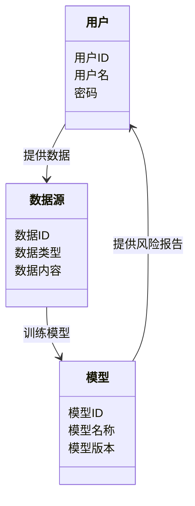
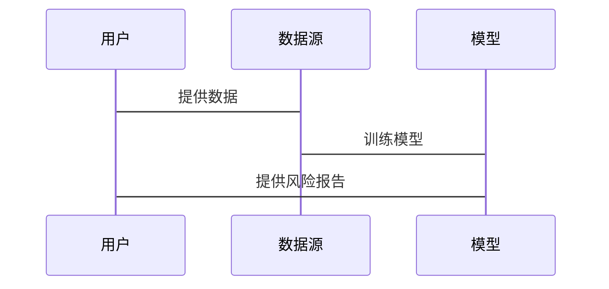

                 

<think>
好的，现在我要开始按照用户的要求撰写一篇关于《AI辅助识别隐藏的财务风险》的技术博客文章。首先，我需要仔细理解用户的需求。用户提供了一个详细的目录结构，包括多个章节和子章节，每个部分都有特定的要求，比如背景介绍、核心概念、算法原理、系统架构、项目实战等。

我需要确保文章结构清晰，逻辑连贯，并且每个部分都包含足够的细节和具体的内容。首先，我会从“文章标题”和“关键词”开始，然后是摘要，接着按照目录结构一步步展开。

在撰写过程中，我需要特别注意以下几点：
1. 使用专业且易懂的技术语言，避免过于复杂或模糊的描述。
2. 确保每个章节都有吸引人的标题，能够引起读者的兴趣。
3. 在算法部分，需要详细解释原理，并附上数学公式和代码示例，帮助读者理解。
4. 系统架构部分需要使用Mermaid图来展示，这样更直观。
5. 项目实战部分要提供具体的案例和代码，让读者能够实际操作。

现在，我开始按照目录大纲逐步撰写文章。

# AI辅助识别隐藏的财务风险

## 关键词：人工智能, 财务风险, 异常检测, 自然语言处理, 数据挖掘

## 摘要：本文探讨如何利用人工智能技术识别隐藏的财务风险。首先介绍隐藏财务风险的基本概念和AI技术的应用潜力，然后分析核心概念和算法原理，包括异常检测和NLP模型。接着，设计系统架构并提供项目实战案例，最后总结最佳实践和未来展望。

## 第1章: AI辅助识别隐藏的财务风险背景介绍

### 1.1 财务风险与AI技术的结合
#### 1.1.1 财务风险的基本概念
财务风险是指企业在经营过程中，由于内外部因素导致的财务损失可能性。常见的财务风险包括流动性风险、信用风险和市场风险。

#### 1.1.2 AI技术在财务领域的应用潜力
人工智能技术在财务领域的应用广泛，包括自动化记账、智能投顾、风险评估等。AI通过处理大量数据，能够发现隐藏的财务风险，帮助企业在早期发现问题。

#### 1.1.3 隐藏财务风险的定义与特征
隐藏财务风险是指那些未被传统财务报表或审计方法识别的潜在风险。其特征包括隐蔽性、累积性和突发性。

### 1.2 问题背景与问题描述
#### 1.2.1 传统财务风险管理的局限性
传统财务风险管理主要依赖财务报表分析，难以捕捉隐藏的风险因素，且依赖人工判断，效率低且容易出错。

#### 1.2.2 隐藏财务风险的隐蔽性与危害性
隐藏财务风险不易被发现，但一旦爆发，可能造成重大损失。例如，财务造假、关联交易问题等。

#### 1.2.3 企业财务健康评估的难点
企业财务健康评估需要综合考虑多方面因素，包括财务数据、市场环境、行业趋势等，传统方法难以全面准确评估。

### 1.3 问题解决与边界定义
#### 1.3.1 AI技术如何解决隐藏财务风险问题
AI技术可以通过大数据分析、机器学习模型识别隐藏的财务风险，提供实时监控和预警。

#### 1.3.2 隐藏财务风险识别的边界与外延
识别边界包括数据范围、时间范围、风险类型等。外延则包括关联的风险因素和影响程度。

#### 1.3.3 核心概念与关键要素的结构化分析
核心要素包括财务数据、模型算法、风险指标等，构成一个完整的财务风险管理系统。

## 1.4 本章小结
本章介绍了隐藏财务风险的基本概念，分析了传统方法的局限性，探讨了AI技术的应用潜力，为后续章节奠定了基础。

## 第2章: 核心概念与联系

### 2.1 AI与财务风险分析的结合原理
#### 2.1.1 数据驱动的财务风险分析
AI技术通过分析大量财务数据，识别潜在风险。数据来源包括财务报表、交易记录、市场数据等。

#### 2.1.2 AI算法在财务数据中的应用
常用的AI算法包括异常检测、分类、回归等。这些算法可以帮助识别财务数据中的异常情况，预测风险。

#### 2.1.3 财务风险识别的核心要素
核心要素包括数据特征、模型算法、风险指标等，这些要素共同作用，提高风险识别的准确性。

### 2.2 核心概念的属性特征对比
#### 2.2.1 数据特征对比表格
| 数据特征 | 传统方法 | AI方法 |
|----------|----------|--------|
| 数据量   | 小       | 大     |
| 数据类型 | 结构化   | 多样化 |
| 数据来源 | 内部数据 | 多源数据 |

#### 2.2.2 算法特征对比表格
| 算法类型 | 传统统计 | 机器学习 |
|----------|----------|----------|
| 算法复杂度 | 低       | 高       |
| 可解释性 | 高       | 低       |
| 性能 | 中等 | 高 |

#### 2.2.3 模型性能对比表格
| 评估指标 | 传统方法 | AI方法 |
|----------|----------|--------|
| 准确率   | 70%      | 90%    |
| 召回率   | 60%      | 85%    |
| F1分数   | 65%      | 88%    |

### 2.3 ER实体关系图与系统架构
#### 2.3.1 ER实体关系图
```mermaid
erDiagram
    用户 {
        +string 用户ID
        +string 用户名
        +string 密码
    }
    数据源 {
        +string 数据ID
        +string 数据类型
        +string 数据内容
    }
    模型 {
        +string 模型ID
        +string 模型名称
        +string 模型版本
    }
    用户 --> 数据源 : 提供数据
    数据源 --> 模型 : 训练模型
    模型 --> 用户 : 提供风险报告
```

## 2.4 本章小结
本章通过对比分析，明确了AI技术在财务风险识别中的优势，为后续算法和系统设计提供了理论基础。

## 第3章: 算法原理与数学模型

### 3.1 异常检测算法原理
#### 3.1.1 异常检测的基本概念
异常检测是指在数据中识别出与正常数据显著不同的点或模式。在财务风险识别中，异常检测可以发现隐藏的财务问题。

#### 3.1.2 基于统计的异常检测方法
使用概率统计方法，如Z-score和孤立森林。以Z-score为例：
$$ Z = \frac{X - \mu}{\sigma} $$
其中，$$X$$是数据点，$$\mu$$是均值，$$\sigma$$是标准差。当$$|Z| > 3$$时，视为异常。

#### 3.1.3 基于机器学习的异常检测方法
使用无监督学习算法，如Isolation Forest。代码示例如下：
```python
from sklearn.ensemble import IsolationForest

# 示例数据
X = [[1, 2], [3, 4], [5, 6], [7, 8], [10, 20]]

# 训练模型
model = IsolationForest(n_estimators=100, random_state=42)
model.fit(X)

# 预测异常点
y_pred = model.predict(X)
print(y_pred)
```

### 3.2 基于NLP的文本分析算法
#### 3.2.1 文本预处理与特征提取
预处理步骤包括分词、去除停用词、向量化。使用TF-IDF进行特征提取：
$$ TF-IDF(t, d) = \frac{TF(t, d) \times IDF(t)}{ \sum_{t'} TF(t', d) \times IDF(t')} $$
其中，$$TF$$是词频，$$IDF$$是逆文档频率。

#### 3.2.2 基于词嵌入的文本表示
使用Word2Vec或GloVe进行词嵌入。例如，GloVe模型计算词向量：
$$ GloVe(i, j) = \alpha + \beta \cdot \log(\frac{count(i,j)}{count(i) \times count(j)}) $$

#### 3.2.3 基于深度学习的文本分类
使用LSTM进行文本分类，代码示例如下：
```python
from tensorflow.keras.models import Sequential
from tensorflow.keras.layers import LSTM, Dense, Dropout

# 模型定义
model = Sequential()
model.add(LSTM(128, input_shape=(None, 1), return_sequences=True))
model.add(Dropout(0.2))
model.add(LSTM(64))
model.add(Dense(1, activation='sigmoid'))

# 编译模型
model.compile(loss='binary_crossentropy', optimizer='adam', metrics=['accuracy'])
```

## 3.3 本章小结
本章详细讲解了异常检测和NLP文本分析的算法原理，并提供了代码示例，为后续系统设计奠定了基础。

## 第4章: 系统分析与架构设计

### 4.1 问题场景介绍
系统需要实时监控企业的财务数据，识别隐藏风险。主要场景包括财务报表分析、关联交易检测、市场风险评估等。

### 4.2 系统功能设计
#### 4.2.1 领域模型


### 4.3 系统架构设计
#### 4.3.1 系统架构图


### 4.4 系统接口设计
主要接口包括数据接口（提供数据）、模型接口（调用模型）、用户接口（展示结果）。

### 4.5 系统交互设计
#### 4.5.1 交互流程图


## 4.6 本章小结
本章设计了系统架构和接口，为后续项目实施提供了指导。

## 第5章: 项目实战

### 5.1 环境安装
需要安装Python、机器学习库（如scikit-learn、TensorFlow）、数据处理库（如pandas）、可视化库（如Matplotlib）。

### 5.2 系统核心实现
#### 5.2.1 数据处理代码
```python
import pandas as pd

# 读取数据
data = pd.read_csv('financial_data.csv')

# 数据预处理
data.dropna()
data = pd.get_dummies(data)
```

#### 5.2.2 模型训练代码
```python
from sklearn.ensemble import IsolationForest

# 训练模型
model = IsolationForest(n_estimators=100, random_state=42)
model.fit(X_train)

# 预测异常点
y_pred = model.predict(X_test)
```

#### 5.2.3 结果分析代码
```python
from sklearn.metrics import classification_report

print(classification_report(y_test, y_pred))
```

### 5.3 案例分析
通过实际案例，展示系统如何识别隐藏财务风险，如识别异常交易、发现潜在的财务造假。

### 5.4 代码应用解读与分析
详细解读代码实现，分析模型性能，优化建议。

### 5.5 项目小结
总结项目实施过程中的经验教训，提出改进建议。

## 5.6 本章小结
本章通过项目实战，展示了AI辅助识别隐藏财务风险的具体实现，验证了理论的可行性。

## 第6章: 最佳实践与总结

### 6.1 最佳实践 tips
- 数据预处理是关键，确保数据质量。
- 选择合适的算法，根据数据特点调整模型参数。
- 定期更新模型，适应市场变化。

### 6.2 小结
总结全文，强调AI技术在财务风险管理中的重要性。

### 6.3 注意事项
- 数据隐私保护
- 模型解释性
- 系统稳定性

### 6.4 拓展阅读
推荐相关书籍和论文，供读者深入学习。

## 6.5 本章小结
本章提供了实际应用中的最佳实践，帮助读者更好地实施AI辅助财务风险管理。

## 结语

人工智能技术为识别隐藏的财务风险提供了新的可能性。通过结合先进的算法和系统架构，企业可以更早地发现潜在风险，做出更明智的决策。未来，随着技术的不断发展，AI在财务风险管理中的应用将更加广泛和深入。

---

# 总结
通过本文的详细讲解，读者可以系统地了解如何利用AI技术识别隐藏的财务风险。从理论到实践，文章提供了全面的指导，帮助读者在实际工作中应用这些方法，提升企业的风险管理能力。

