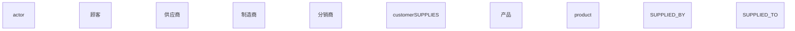
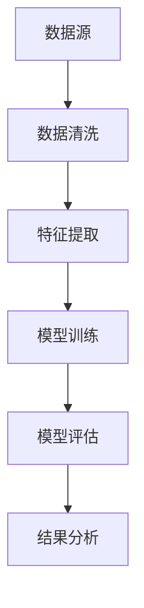
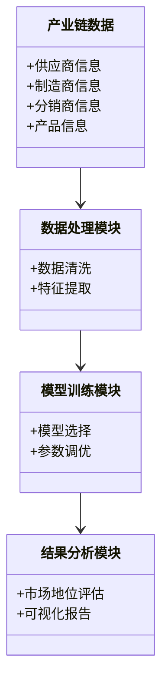
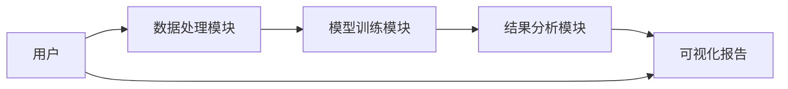
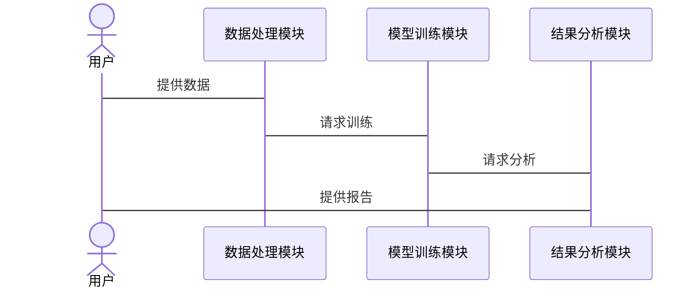

                 


# AI驱动的产业链分析：全面把握公司的市场地位

> 关键词：产业链分析，人工智能，市场地位，机器学习，系统架构

> 摘要：本文将深入探讨如何利用人工智能技术分析产业链，帮助企业确定其市场地位。通过详细讲解背景、核心概念、算法原理、系统架构以及项目实战，本文旨在为企业提供一套基于AI的产业链分析方法论，帮助其在复杂市场环境中做出明智决策。

---

## 第一章：背景与概述

### 1.1 产业链分析的基本概念

#### 1.1.1 产业链的定义与结构
- 产业链的定义：从原材料到最终产品的生产与流通过程中，各参与方形成的价值链网络。
- 产业链的结构：包括上游供应商、中游制造商、下游分销商和终端用户。
- 产业链的复杂性：涉及多个行业和环节，数据来源广泛且复杂。

#### 1.1.2 产业链分析的重要性
- 识别关键节点：发现产业链中的核心企业和关键环节。
- 优化资源配置：通过分析瓶颈环节，提升整体效率。
- 支持企业决策：为企业的战略制定和市场定位提供数据支持。

#### 1.1.3 AI驱动的产业链分析的兴起
- 数据爆炸时代：AI技术的崛起为复杂数据处理提供了新的可能性。
- 传统分析的局限性：人工分析耗时且容易出错，难以应对海量数据。
- 技术进步的推动：机器学习和自然语言处理的进步使得AI能够处理结构化和非结构化数据。

### 1.2 AI在产业链分析中的作用

#### 1.2.1 数据驱动的决策优势
- 数据的实时性：AI能够处理实时数据，提供动态分析。
- 数据的全面性：AI可以整合来自多个来源的海量数据，提供全局视角。
- 数据的准确性：通过算法优化，提高分析结果的准确性。

#### 1.2.2 AI技术在产业链优化中的应用
- 供应链优化：通过预测需求和优化库存，降低运营成本。
- 市场预测：利用历史数据和趋势分析，预测市场走向。
- 竞争对手分析：识别竞争对手的动向，制定应对策略。

#### 1.2.3 企业市场地位分析的AI方法
- 市场份额分析：通过数据分析确定企业的市场份额。
- 竞争力评估：识别企业的优势和劣势，制定改进策略。
- 市场趋势预测：预测未来市场变化，提前调整战略。

---

## 第二章：核心概念与原理

### 2.1 产业链分析的关键要素

#### 2.1.1 产业链的上下游关系
- 上游：供应商提供原材料和零部件。
- 中游：制造商进行加工和组装。
- 下游：分销商和零售商将产品交付给终端用户。

#### 2.1.2 企业的市场定位与竞争力
- 市场定位：企业在市场中的位置和竞争优势。
- 竞争力分析：通过数据分析确定企业的优劣势。
- 协同效应：产业链各环节之间的协作对整体效率的影响。

#### 2.1.3 产业链的协同效应
- 协同效应的重要性：协同效应能够显著提升整体效率。
- 协同效应的实现：通过优化信息流和物流实现协同。
- 协同效应的测量：通过数据分析评估协同效应的大小。

### 2.2 AI驱动的产业链分析原理

#### 2.2.1 数据采集与处理
- 数据源：包括企业内部数据、行业报告、新闻媒体等。
- 数据清洗：去除噪声数据，确保数据质量。
- 数据整合：将结构化和非结构化数据整合到统一平台。

#### 2.2.2 产业链网络构建与分析
- 网络构建：将产业链中的企业、供应商、客户等关系构建为网络结构。
- 网络分析：利用图论方法分析网络的结构特征，如节点度数、中心性等。
- 关键节点识别：识别网络中的关键节点，如核心企业和瓶颈环节。

#### 2.2.3 市场地位评估模型
- 市场地位评估：通过综合分析企业的市场份额、品牌影响力和竞争力，评估其市场地位。
- 评估模型：使用机器学习模型对市场地位进行量化评估。
- 模型优化：通过不断训练和优化模型，提高评估的准确性。

### 2.3 核心概念对比与ER图

#### 2.3.1 产业链分析与传统方法的对比
- 传统方法：基于经验和市场调研，耗时且不够精准。
- AI驱动的方法：基于大数据和机器学习，快速且准确。

#### 2.3.2 ER实体关系图展示



---

## 第三章：算法与模型

### 3.1 产业链网络分析模型

#### 3.1.1 数据预处理与特征提取
- 数据清洗：去除重复和错误数据。
- 特征提取：从原始数据中提取有意义的特征，如销售额、市场份额等。

#### 3.1.2 模型训练与优化
- 模型选择：选择适合的机器学习模型，如随机森林、支持向量机等。
- 模型训练：利用训练数据训练模型，调整参数以优化性能。
- 模型验证：通过交叉验证评估模型的准确性和稳定性。

#### 3.1.3 模型评估与验证
- 性能评估：使用准确率、召回率、F1分数等指标评估模型性能。
- 模型验证：通过测试数据验证模型的泛化能力。
- 模型优化：根据评估结果进一步优化模型，提高预测准确性。

### 3.2 产业链分析的机器学习流程

#### 3.2.1 数据流处理



#### 3.2.2 机器学习算法实现

```python
# 数据预处理
import pandas as pd
from sklearn.model_selection import train_test_split
from sklearn.ensemble import RandomForestClassifier
from sklearn.metrics import accuracy_score

# 加载数据
data = pd.read_csv('产业链数据.csv')

# 分割数据
X = data.drop('市场地位', axis=1)
y = data['市场地位']
X_train, X_test, y_train, y_test = train_test_split(X, y, test_size=0.2, random_state=42)

# 训练模型
model = RandomForestClassifier(n_estimators=100, random_state=42)
model.fit(X_train, y_train)

# 模型预测
y_pred = model.predict(X_test)

# 模型评估
print("准确率:", accuracy_score(y_test, y_pred))
```

#### 3.2.3 数学模型与公式

- 熵权法计算权重：
  $$ w_i = \frac{a_i}{\sum_{j=1}^{n} a_j} $$
  其中，\( a_i \) 是第i个特征的重要性得分，\( n \) 是特征总数。

- 机器学习模型的损失函数：
  $$ L = -\frac{1}{n}\sum_{i=1}^{n} [y_i \ln p_i + (1 - y_i) \ln (1 - p_i)] $$
  其中，\( y_i \) 是真实标签，\( p_i \) 是模型预测概率。

---

## 第四章：系统分析与架构设计

### 4.1 问题场景介绍

#### 4.1.1 系统目标
- 收集和处理产业链相关数据。
- 构建AI模型，分析市场地位。
- 提供可视化报告和决策支持。

#### 4.1.2 项目介绍
- 项目名称：AI驱动的产业链分析系统。
- 项目目标：帮助企业全面了解市场地位，优化运营策略。

### 4.2 系统功能设计

#### 4.2.1 领域模型设计



### 4.3 系统架构设计

#### 4.3.1 系统架构图



#### 4.3.2 接口设计

- 数据接口：用于数据导入和导出。
- 模型接口：用于模型的训练和预测。
- 报告接口：用于生成和展示分析报告。

#### 4.3.3 交互流程



---

## 第五章：项目实战

### 5.1 环境安装

```bash
pip install pandas scikit-learn mermaid4jupyter jupyterlab
```

### 5.2 核心代码实现

#### 5.2.1 数据预处理

```python
import pandas as pd

# 加载数据
data = pd.read_csv('产业链数据.csv')

# 数据清洗
data.dropna(inplace=True)
data = data[~data.duplicated()]

# 特征提取
features = data.drop('市场地位', axis=1)
target = data['市场地位']
```

#### 5.2.2 模型训练

```python
from sklearn.ensemble import RandomForestClassifier

# 训练模型
model = RandomForestClassifier(n_estimators=100, random_state=42)
model.fit(features, target)
```

#### 5.2.3 模型预测与评估

```python
from sklearn.metrics import classification_report

# 预测
y_pred = model.predict(features)

# 评估
print(classification_report(target, y_pred))
```

### 5.3 案例分析

#### 5.3.1 行业分析
- 某行业数据分析：通过AI模型识别出关键供应商和制造商，优化供应链管理。
- 竞争对手分析：发现竞争对手的市场动向，制定应对策略。

#### 5.3.2 企业市场地位提升
- 通过分析，确定企业的市场份额和竞争力，制定针对性的战略。
- 优化市场推广策略，提高品牌影响力。

### 5.4 项目小结

- 项目成果：成功构建了AI驱动的产业链分析系统，帮助企业全面了解市场地位。
- 经验总结：数据质量是关键，模型选择和优化也非常重要。
- 改进建议：进一步完善数据采集模块，增加实时数据处理功能。

---

## 第六章：最佳实践与总结

### 6.1 最佳实践

#### 6.1.1 数据质量管理
- 数据清洗：确保数据的准确性和完整性。
- 数据标注：对数据进行合理的标注，提高模型训练效果。

#### 6.1.2 模型优化策略
- 参数调优：通过网格搜索等方法找到最佳参数组合。
- 模型集成：使用集成学习方法提高模型的准确性和稳定性。

#### 6.1.3 系统维护与更新
- 数据更新：定期更新数据，保持模型的实时性。
- 模型更新：根据市场变化，及时更新模型，确保分析结果的准确性。

### 6.2 小结

- AI驱动的产业链分析为企业提供了全新的视角和方法，能够帮助企业更精准地把握市场地位。
- 通过构建高效的分析系统，企业可以快速响应市场变化，提升竞争力。

### 6.3 注意事项

- 数据隐私：在处理数据时，必须遵守相关法律法规，保护数据隐私。
- 模型解释性：选择具有较高解释性的模型，便于企业理解和应用。
- 系统稳定性：确保系统的稳定性和安全性，避免数据泄露和系统崩溃。

### 6.4 拓展阅读

- 《机器学习实战》：深入学习机器学习算法和实践。
- 《企业架构实战》：了解企业架构设计的理论和方法。
- 《产业链分析》：进一步了解产业链分析的理论和应用。

---

## 结语

AI驱动的产业链分析正在成为企业竞争的关键武器。通过本文的详细讲解，企业可以掌握一套基于AI的产业链分析方法论，帮助其在复杂市场环境中做出明智决策。未来，随着技术的不断发展，AI在产业链分析中的应用将更加广泛和深入，为企业创造更大的价值。

--- 

# 结束语

感谢您的阅读！希望本文能为您提供有价值的见解和实践指导，帮助您在AI驱动的产业链分析领域取得更大的成功！

