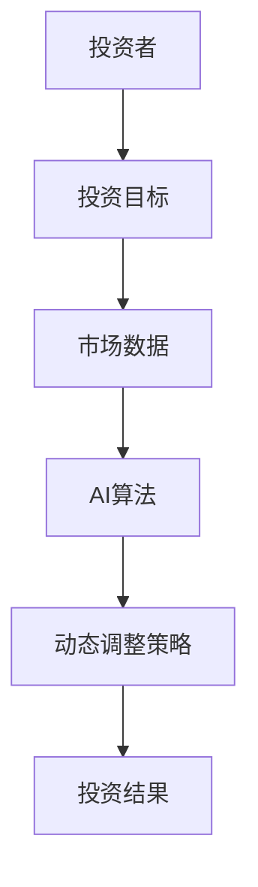
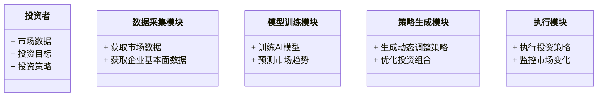
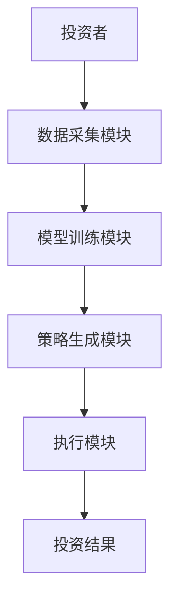
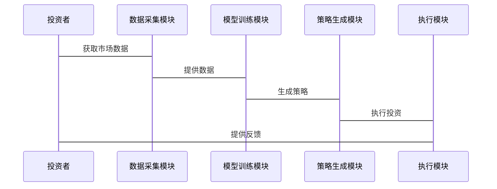

                 


# AI驱动的价值投资策略动态调整

> 关键词：AI驱动，价值投资，动态调整，投资策略，动态优化

> 摘要：本文探讨了AI在价值投资中的应用，特别是如何利用动态调整策略优化投资组合。通过分析AI算法、系统架构和实际案例，揭示了AI驱动的价值投资策略动态调整的核心原理和实现方法。

---

## 第1章: 背景介绍

### 1.1 价值投资与动态调整的背景

#### 1.1.1 价值投资的核心概念
价值投资是一种以基本面分析为基础的投资策略，强调以低于内在价值的价格买入优质资产。其核心在于识别市场中的估值偏差，长期持有优质企业，等待价值回归。

#### 1.1.2 动态调整的必要性
传统价值投资策略静态，忽视市场变化和企业基本面的动态变化。动态调整强调根据市场环境和企业变化，实时优化投资组合，提高收益和风险管理能力。

#### 1.1.3 AI技术在投资领域的应用前景
AI技术在金融领域的应用日益广泛，从数据处理、预测分析到投资决策，AI能够处理海量数据，发现复杂模式，提供实时反馈，为投资策略优化提供强大支持。

### 1.2 问题背景与目标

#### 1.2.1 传统投资策略的局限性
传统策略依赖经验判断，存在主观性强、反应滞后、难以应对复杂市场环境等问题，难以在快速变化的市场中保持优势。

#### 1.2.2 动态调整的必要性
动态调整能够根据市场变化和企业基本面变化，实时优化投资组合，提高收益，降低风险。

#### 1.2.3 AI驱动的价值投资目标
利用AI技术实时分析市场数据和企业基本面，动态优化投资策略，实现长期稳定收益。

### 1.3 核心概念与问题描述

#### 1.3.1 价值投资的定义与特征
- 定义：基于对企业内在价值的评估，以低于价值的价格买入并长期持有的投资策略。
- 特征：注重长期价值，强调安全边际，逆周期投资。

#### 1.3.2 动态调整的定义与特征
- 定义：根据市场环境和企业基本面变化，实时优化投资组合的过程。
- 特征：实时性、适应性、灵活性。

#### 1.3.3 AI在投资策略中的作用
- 数据处理与分析：AI能够快速处理海量数据，提取有价值的信息。
- 预测与决策：利用机器学习算法预测市场趋势，优化投资组合。
- 实时反馈：AI系统能够实时监控市场变化，提供及时反馈。

### 1.4 问题解决与边界

#### 1.4.1 AI驱动价值投资的核心问题
如何利用AI技术实时分析市场数据和企业基本面，动态优化投资策略。

#### 1.4.2 问题的边界与外延
- 数据范围：市场数据、企业财务数据、行业数据。
- 时间范围：实时或定期调整。
- 风险控制：在动态调整中，如何平衡收益与风险。

#### 1.4.3 核心概念的结构与组成
- 输入：市场数据、企业基本面数据。
- 输出：动态调整后的投资组合。
- 核心算法：机器学习、强化学习、时间序列分析。

### 1.5 本章小结
本章介绍了AI驱动的价值投资策略动态调整的背景，分析了传统策略的局限性，明确了动态调整的必要性，并阐述了AI在其中的作用。

---

## 第2章: AI驱动的价值投资策略动态调整的核心概念

### 2.1 核心概念原理

#### 2.1.1 价值投资与AI的结合
AI技术能够增强价值投资的科学性和精确性，通过大数据分析发现潜在的投资机会，优化投资组合。

#### 2.1.2 动态调整的实现机制
动态调整基于AI算法对市场和企业基本面的实时分析，生成动态的投资策略。

#### 2.1.3 AI算法在投资策略中的应用
- 数据挖掘：发现市场中的规律和趋势。
- 预测分析：预测市场走势和企业业绩。
- 优化决策：动态调整投资组合。

### 2.2 核心概念属性特征对比

| 特性          | 传统价值投资          | AI驱动的价值投资          |
|---------------|-----------------------|---------------------------|
| 数据处理能力  | 依赖人工分析          | 利用AI处理海量数据        |
| 调整频率      | 低频，定期调整        | 高频，实时调整            |
| 风险控制      | 事后调整             | 实时监控，预防风险        |

### 2.3 ER实体关系图架构



---

## 第3章: 算法原理与实现

### 3.1 算法原理

#### 3.1.1 时间序列分析
时间序列分析用于预测市场走势，帮助投资者做出动态调整决策。

#### 3.1.2 强化学习在动态调整中的应用
强化学习通过不断试错，优化投资策略，适应市场变化。

#### 3.1.3 聚类算法在投资组合优化中的应用
聚类算法用于将相似资产分组，优化投资组合的风险和收益。

### 3.2 算法实现

#### 3.2.1 时间序列分析的实现

```python
import pandas as pd
import numpy as np
from sklearn.metrics import mean_squared_error
from statsmodels.tsa.arima_model import ARIMA

# 数据准备
data = pd.read_csv('market_data.csv')
data = data['price'].values

# 拆分训练集和测试集
train_size = int(len(data) * 0.8)
train, test = data[:train_size], data[train_size:]

# ARIMA模型训练
model = ARIMA(train, order=(5, 1, 0))
model_fit = model.fit(disp=0)

# 预测
 forecast = model_fit.forecast(steps=len(test))[0]
```

#### 3.2.2 强化学习算法实现

```python
import gym
import numpy as np

class InvestmentEnv(gym.Env):
    def __init__(self):
        super().__init__()
        self.observation_space = ...  # 定义观察空间
        self.action_space = ...        # 定义动作空间

    def step(self, action):
        # 执行动作，返回新的状态、奖励、终止标志
        pass

    def reset(self):
        # 初始化环境
        pass
```

#### 3.2.3 聚类算法实现

```python
from sklearn.cluster import KMeans

# 数据预处理
X = ...  # 特征矩阵

# K-means聚类
kmeans = KMeans(n_clusters=3, random_state=0)
kmeans.fit(X)
clusters = kmeans.predict(X)
```

### 3.3 算法的数学模型

#### 3.3.1 ARIMA模型
ARIMA模型用于时间序列预测，其数学表达式为：

$$
ARIMA(p, d, q) = y_t = \phi_1 y_{t-1} + \dots + \phi_p y_{t-p} + \theta_1 \epsilon_{t-1} + \dots + \theta_q \epsilon_{t-q} + \epsilon_t
$$

#### 3.3.2 Q-learning算法
Q-learning是一种强化学习算法，其更新规则为：

$$
Q(s, a) = Q(s, a) + \alpha [r + \gamma \max Q(s', a') - Q(s, a)]
$$

其中：
- $Q(s, a)$：状态s下动作a的Q值。
- $\alpha$：学习率。
- $\gamma$：折扣因子。
- $r$：奖励。
- $s'$：新状态。
- $a'$：新动作。

---

## 第4章: 系统分析与架构设计

### 4.1 系统应用场景

#### 4.1.1 数据采集
- 从金融市场获取实时数据，包括股票价格、成交量、财务指标等。

#### 4.1.2 模型训练
- 利用历史数据训练AI模型，生成预测模型。

#### 4.1.3 策略生成
- 根据模型预测结果，生成动态调整的投资策略。

#### 4.1.4 策略执行
- 执行投资策略，实时监控市场变化，动态调整投资组合。

### 4.2 系统功能设计



### 4.3 系统架构设计



### 4.4 接口设计与交互流程



---

## 第5章: 项目实战

### 5.1 环境安装

#### 5.1.1 安装Python环境
```bash
python --version
pip install numpy pandas scikit-learn gym
```

#### 5.1.2 安装其他依赖
```bash
pip install statsmodels gym[强化学习]
```

### 5.2 核心实现

#### 5.2.1 时间序列分析实现

```python
import pandas as pd
import numpy as np
from statsmodels.tsa.arima_model import ARIMA
import matplotlib.pyplot as plt

# 数据准备
data = pd.read_csv('market_data.csv')
data = data['price'].values

# 拆分训练集和测试集
train_size = int(len(data) * 0.8)
train, test = data[:train_size], data[train_size:]

# ARIMA模型训练
model = ARIMA(train, order=(5, 1, 0))
model_fit = model.fit(disp=0)

# 预测
 forecast = model_fit.forecast(steps=len(test))[0]

# 可视化
plt.figure(figsize=(12, 6))
plt.plot(test, label='实际值')
plt.plot(forecast, label='预测值')
plt.legend()
plt.show()
```

#### 5.2.2 强化学习实现

```python
import gym
import numpy as np

class InvestmentEnv(gym.Env):
    def __init__(self):
        super().__init__()
        self.observation_space = gym.spaces.Box(low=-np.inf, high=np.inf, shape=(4,))
        self.action_space = gym.spaces.Discrete(3)  # 0: 持有，1: 买入，2: 卖出

    def step(self, action):
        # 获取当前状态
        obs = self._get_obs()
        # 执行动作
        reward = self._calculate_reward(action)
        done = self._check_done()
        next_obs = self._next_obs()
        return next_obs, reward, done, {}

    def reset(self):
        # 初始化环境
        self.current_step = 0
        return self._get_obs()

    def _get_obs(self):
        # 返回当前状态
        return self.data[self.current_step]

    def _calculate_reward(self, action):
        # 计算奖励
        return 0.1 * (next_price - current_price)

    def _check_done(self):
        # 检查是否结束
        return False

# 初始化环境
env = InvestmentEnv()
state = env.reset()

# 训练过程
for _ in range(1000):
    action = env.action_space.sample()
    next_state, reward, done, _ = env.step(action)
    if done:
        break
```

### 5.3 案例分析

#### 5.3.1 数据分析与特征工程
从市场数据中提取有用的特征，如股价、成交量、市盈率等，使用特征工程提升模型性能。

#### 5.3.2 模型训练与评估
训练AI模型，评估模型的准确性和稳定性，调整模型参数以优化性能。

#### 5.3.3 动态调整与投资组合优化
根据模型预测结果，动态调整投资组合，优化收益与风险。

### 5.4 项目总结
本项目展示了如何利用AI技术优化价值投资策略，通过动态调整投资组合，实现长期稳定的收益。

---

## 第6章: 最佳实践

### 6.1 小结
AI驱动的价值投资策略动态调整是一种创新的投资方式，利用AI技术提升投资决策的科学性和精确性。

### 6.2 注意事项
- 数据质量：确保数据准确、完整。
- 模型选择：选择合适的AI算法，避免过拟合。
- 风险管理：制定有效的风险管理策略。

### 6.3 拓展阅读
- 《机器学习在金融中的应用》
- 《强化学习与投资组合优化》
- 《时间序列分析与市场预测》

---

## 附录: 参考文献

- 李笑来：《投资中最简单的事》
- 张宏伟：《价值投资实战策略》
- 哮菘：《时间序列分析与应用》

---

以上为《AI驱动的价值投资策略动态调整》的技术博客文章的完整大纲和内容。

