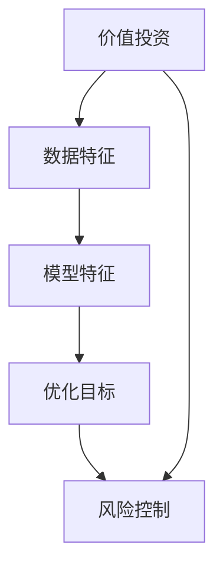
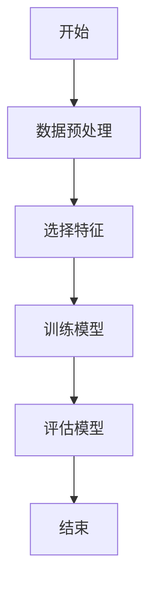

                 


# AI驱动的价值投资策略回测与优化

> 关键词：AI驱动、价值投资、策略回测、优化方法、投资策略

> 摘要：本文详细探讨了如何利用人工智能技术优化价值投资策略，并通过回测验证其有效性。文章从背景介绍、核心概念、算法原理、数学模型、系统架构到项目实战，全面解析了AI在投资策略中的应用，最后总结了最佳实践和未来展望。

## 第一部分：背景介绍

### 第1章：AI在金融投资中的应用

#### 1.1 价值投资的基本概念

- **1.1.1 价值投资的定义与核心理念**
  价值投资是一种长期投资策略，强调购买低于其内在价值的股票，等待其价值回归。其核心理念是寻找市场低估的公司，长期持有以实现超额收益。

- **1.1.2 价值投资与AI技术的结合**
  AI技术的应用使得价值投资策略的分析更加高效和精准。通过机器学习模型，投资者可以快速分析大量数据，发现潜在的投资机会，优化投资组合。

#### 1.2 AI在金融领域的应用现状

- **1.2.1 AI在金融数据分析中的应用**
  AI技术广泛应用于金融数据的分析与处理，包括市场趋势预测、风险评估、舆情分析等。通过自然语言处理（NLP）和深度学习技术，AI能够从非结构化数据中提取有价值的信息。

- **1.2.2 AI在投资策略优化中的作用**
  AI通过历史数据分析，帮助投资者识别有效的投资策略，并进行动态调整以应对市场变化。机器学习模型可以预测市场波动，优化资产配置，降低投资风险。

#### 1.3 价值投资策略的AI驱动优化

- **1.3.1 AI如何提升投资策略的准确性**
  AI通过分析大量历史数据和市场信息，识别出影响股票价格的关键因素，构建预测模型，提高投资决策的准确性。

- **1.3.2 回测与优化在投资策略中的重要性**
  回测是指通过历史数据验证投资策略的有效性，优化则是根据回测结果调整策略参数，以提高策略的收益和稳定性。AI技术的应用使得回测和优化过程更加自动化和高效。

## 第二部分：核心概念与联系

### 第2章：AI驱动价值投资的核心概念

#### 2.1 数据特征与模型特征

- **2.1.1 数据特征的提取与分析**
  数据特征是模型输入的关键，包括财务指标（如市盈率、市净率）、市场情绪指标、宏观经济指标等。特征选择直接影响模型的预测能力。

- **2.1.2 模型特征的选择与优化**
  模型特征选择是优化模型性能的重要步骤。通过特征重要性分析，剔除冗余特征，提高模型的泛化能力。

#### 2.2 优化目标与约束条件

- **2.2.1 投资回报率最大化**
  投资策略的核心目标是在风险可控的前提下，实现投资回报的最大化。

- **2.2.2 风险控制与资产配置**
  风险控制是投资策略的重要组成部分，通过合理的资产配置和风险对冲，降低投资组合的波动性。

#### 2.3 概念关系图



## 第三部分：算法原理讲解

### 第3章：常用算法与流程图

#### 3.1 线性回归

- **3.1.1 算法流程图**



- **3.1.2 Python代码实现**

```python
import numpy as np
from sklearn.linear_model import LinearRegression

# 示例数据
X = np.array([[1], [2], [3], [4], [5]])
y = np.array([2, 4, 5, 4, 6])

# 创建线性回归模型
model = LinearRegression()

# 训练模型
model.fit(X, y)

# 预测
print(model.predict(X))
```

## 第四部分：数学模型和公式

### 第4章：数学模型与公式推导

#### 4.1 CAPM模型

- **4.1.1 CAPM模型公式**

$$R_i = R_f + \beta_i (R_m - R_f)$$

其中，\( R_i \) 是资产的预期收益，\( R_f \) 是无风险利率，\( \beta_i \) 是资产的系统性风险系数，\( R_m \) 是市场预期收益。

#### 4.2 回归模型

- **4.2.1 线性回归模型**

$$y = \beta_0 + \beta_1 x + \epsilon$$

其中，\( \epsilon \) 是误差项。

## 第五部分：系统分析与架构设计

### 第5章：系统分析与架构设计方案

#### 5.1 系统功能设计

- **5.1.1 领域模型**


## 第六部分：项目实战

### 第6章：项目实战

#### 6.1 环境配置与代码实现

- **6.1.1 环境配置**

```bash
pip install numpy pandas scikit-learn matplotlib
```

- **6.1.2 核心代码实现**

```python
import pandas as pd
from sklearn.model_selection import train_test_split
from sklearn.linear_model import LinearRegression
from sklearn.metrics import mean_squared_error

# 加载数据
data = pd.read_csv('stock_data.csv')

# 数据预处理
X = data[['市盈率', '市净率']]
y = data['收益']

# 分割数据
X_train, X_test, y_train, y_test = train_test_split(X, y, test_size=0.2, random_state=42)

# 创建模型
model = LinearRegression()

# 训练模型
model.fit(X_train, y_train)

# 预测
y_pred = model.predict(X_test)

# 评估
 mse = mean_squared_error(y_test, y_pred)
 print(f'MSE: {mse}')
```

## 第七部分：最佳实践与总结

### 第7章：最佳实践与总结

#### 7.1 经验与技巧

- **数据质量的重要性**
  高质量的数据是模型准确性的基石，确保数据的完整性和准确性至关重要。

- **模型选择与优化**
  根据数据特性和业务需求选择合适的模型，并通过交叉验证和调参优化模型性能。

- **风险控制与资产配置**
  合理的资产配置和风险对冲策略能够有效降低投资组合的波动性，提高整体收益。

#### 7.2 小结

本文详细探讨了AI在价值投资策略优化中的应用，从背景介绍到项目实战，全面解析了AI技术在投资策略中的重要性与实际应用。通过合理的算法选择和系统设计，投资者可以显著提升投资决策的效率和准确性。

#### 7.3 注意事项

- **数据隐私与合规性**
  在处理金融数据时，必须遵守相关法律法规，确保数据的隐私和合规性。

- **模型的可解释性**
  高复杂度的模型可能难以解释，投资者需要关注模型的可解释性，以便更好地理解和调整策略。

- **持续监控与优化**
  市场环境不断变化，投资策略需要持续监控和优化，以适应新的市场条件。

#### 7.4 拓展阅读

- 《机器学习实战》
- 《Python机器学习》
- 《算法导论》

通过本文的分析与实践，读者可以深入了解AI在价值投资中的应用，并将其应用于实际投资策略中，以实现更高效和精准的投资决策。

