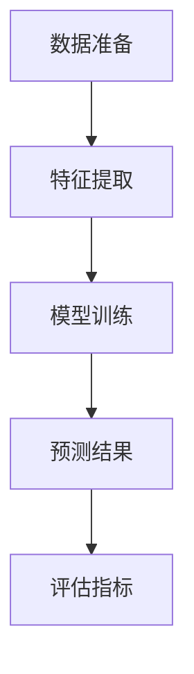
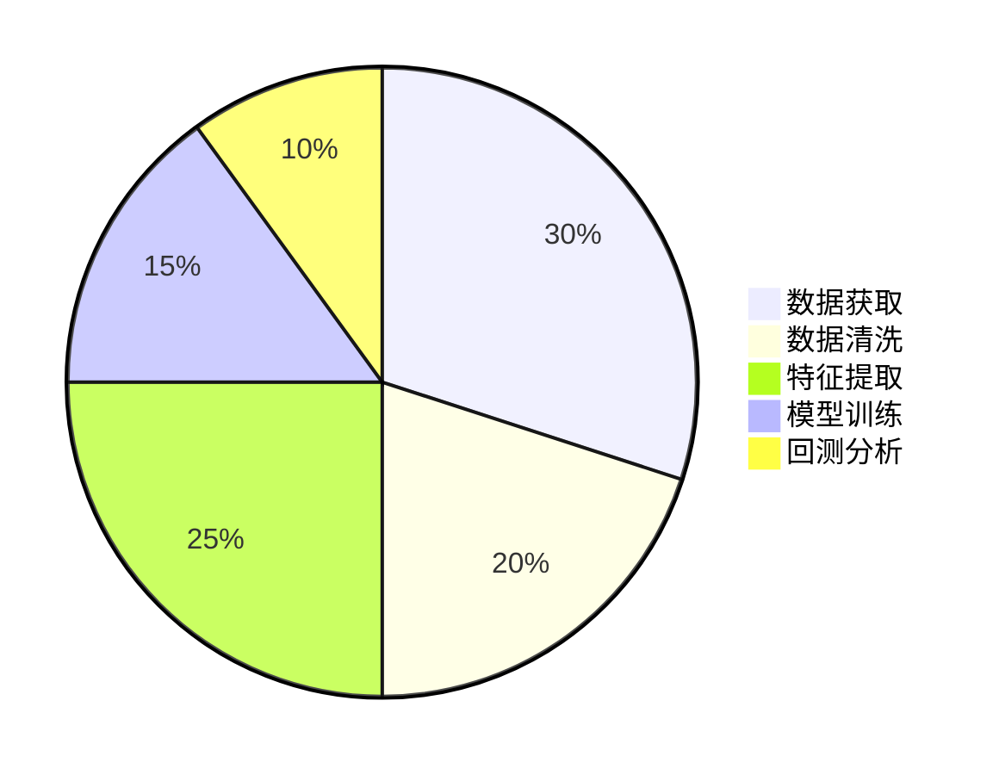

                 


# AI驱动的价值投资策略回测偏差校正

## 关键词：人工智能、价值投资、回测偏差、算法、金融数据分析、系统架构

## 摘要

本文探讨了如何利用人工智能技术优化价值投资策略的回测过程，重点解决回测偏差问题。文章从背景介绍、核心概念、算法原理、系统架构、项目实战和总结等方面展开，详细阐述了AI在回测偏差校正中的应用，包括回归分析、时间序列分析、机器学习模型等算法，以及系统设计和实际案例分析。通过本文，读者将深入了解如何利用AI技术提升投资策略的准确性。

---

## 第一部分：背景与概述

### 第1章：价值投资与回测偏差概述

#### 1.1 价值投资的基本概念

价值投资是一种以低于公平市场价值的价格购买优质股票的投资策略，核心在于寻找市场低估的公司。其成功依赖于对市场趋势和公司基本面的准确判断，而回测是验证策略有效性的关键步骤。

#### 1.2 回测偏差的定义与影响

回测偏差是指在策略回测中，由于数据选择偏差、过拟合或假设不准确导致的结果与实际市场表现不符。常见偏差包括数据泄漏、样本选择偏差和过拟合。这些偏差会影响策略的有效性和可靠性。

#### 1.3 AI在回测偏差校正中的作用

AI技术通过自动化分析和建模，帮助识别和校正回测偏差。机器学习模型能够捕捉复杂市场模式，提高回测结果的准确性，从而优化投资决策。

---

## 第二部分：核心概念与联系

### 第2章：AI在金融中的应用

#### 2.1 金融数据分析的核心挑战

金融数据复杂多样，数据清洗和特征提取是关键步骤。AI技术帮助处理噪声数据，提取有效特征，为模型提供可靠输入。

#### 2.2 机器学习在金融预测中的应用

机器学习模型如随机森林和神经网络用于股票价格预测，通过特征工程和模型调优，提升预测准确性。

#### 2.3 AI驱动的回测偏差校正

利用回归分析和时间序列分析，AI技术识别偏差来源，调整模型参数，校正回测结果。

---

## 第三部分：算法原理

### 第3章：回归分析与时间序列分析

#### 3.1 线性回归分析

回归分析用于建立变量间关系模型，帮助识别影响股票价格的关键因素。

公式：$$ y = \beta_0 + \beta_1x_1 + \beta_2x_2 + ... + \beta_nx_n + \epsilon $$

#### 3.2 时间序列分析

时间序列分析捕捉数据趋势和周期性，适用于股票价格预测。

公式：$$ ARIMA(p, d, q) $$

#### 3.3 机器学习模型

随机森林和XGBoost模型用于分类和回归任务，提升预测准确性。

---

## 第四部分：系统分析与架构设计

### 第4章：系统架构设计

#### 4.1 系统功能设计

系统包括数据获取、清洗、特征提取、模型训练和回测模块。

#### 4.2 系统架构图

系统架构采用微服务设计，各模块独立运行，便于维护和扩展。

#### 4.3 接口设计

RESTful API用于模块间通信，确保数据流高效处理。

---

## 第五部分：项目实战

### 第5章：项目实战

#### 5.1 环境安装

安装Python、机器学习库和数据处理工具，配置开发环境。

#### 5.2 核心代码实现

编写数据清洗、特征提取、模型训练和回测代码，实现偏差校正。

#### 5.3 案例分析

通过具体案例分析，验证模型的有效性和准确性，调整参数优化结果。

---

## 第六部分：总结与展望

### 第6章：总结与展望

#### 6.1 小结

总结AI在回测偏差校正中的应用，强调其重要性和优势。

#### 6.2 注意事项

提醒读者注意数据质量和模型泛化能力，避免过拟合和数据泄漏。

#### 6.3 拓展阅读

建议进一步研究强化学习和自适应模型，提升投资策略的动态调整能力。

---

## 附录：代码示例

```python
import pandas as pd
from sklearn.ensemble import RandomForestRegressor
from sklearn.model_selection import train_test_split
from sklearn.metrics import mean_squared_error

# 数据加载
data = pd.read_csv('stock_data.csv')

# 特征工程
features = data[['feature1', 'feature2', 'feature3']]
target = data['target']

# 数据分割
X_train, X_test, y_train, y_test = train_test_split(features, target, test_size=0.2)

# 模型训练
model = RandomForestRegressor()
model.fit(X_train, y_train)

# 模型预测
y_pred = model.predict(X_test)

# 评估指标
mse = mean_squared_error(y_test, y_pred)
print(f"均方误差: {mse}")
```

---

## 图表展示

### 回归分析流程图



### 系统架构图



---

通过以上结构，本文系统地介绍了AI在价值投资策略回测偏差校正中的应用，从理论到实践，为读者提供了全面的指导和参考。

