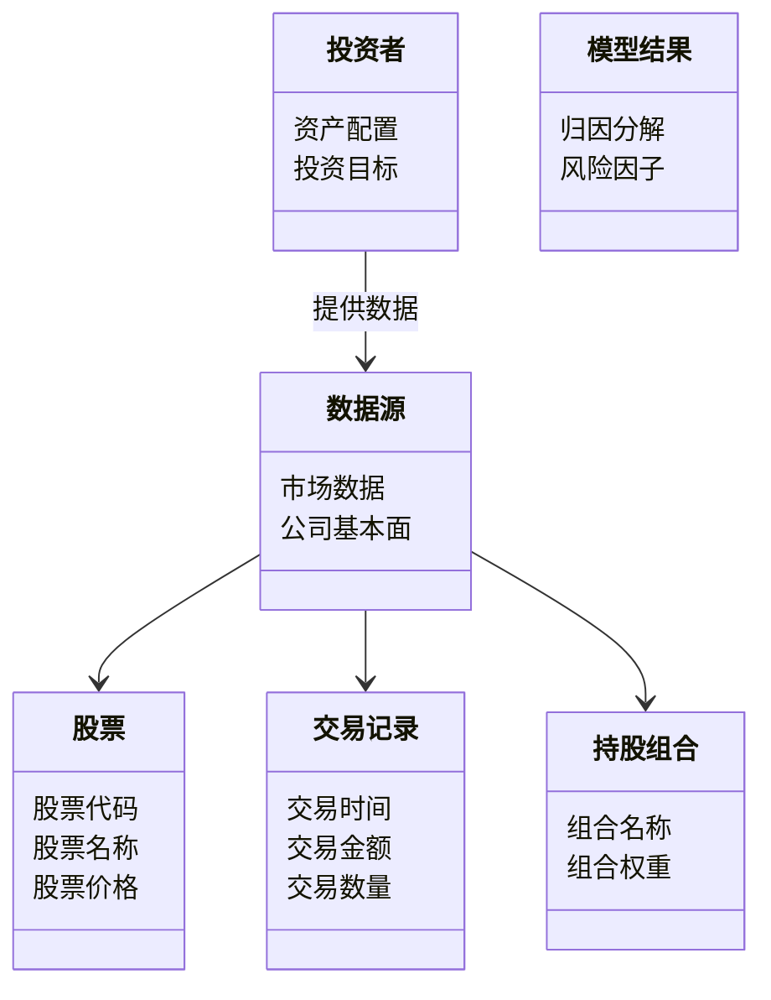

                 


# AI驱动的价值投资策略归因分析

## 关键词：
AI驱动、价值投资、策略归因分析、机器学习、金融数据分析

## 摘要：
本文探讨了如何利用人工智能技术进行价值投资策略的归因分析。通过分析投资策略的表现，利用AI技术分解策略收益来源，识别关键驱动因素，优化投资组合。文章详细讲解了AI在归因分析中的应用，包括算法原理、系统架构设计、项目实战等内容，为金融从业者和数据科学家提供实用的指导和见解。

---

# 第一部分: AI驱动的价值投资策略归因分析基础

## 第1章: 价值投资策略归因分析概述

### 1.1 问题背景与定义

#### 1.1.1 价值投资的定义与核心要素
价值投资是一种以基本面分析为基础的投资策略，旨在通过分析公司的财务状况、行业地位、竞争优势等因素，寻找被市场低估的投资标的。其核心要素包括：
- **内在价值**：公司未来现金流的现值。
- **安全边际**：投资价格低于内在价值的部分。
- **长期视角**：关注企业的长期盈利能力。

#### 1.1.2 策略归因分析的定义
策略归因分析是指将投资组合的收益分解为不同因子或策略的贡献，以识别驱动收益的关键因素。传统归因分析通常基于线性模型，而AI驱动的归因分析则利用机器学习技术，从非线性关系中提取更复杂的因子组合。

#### 1.1.3 AI驱动的归因分析的优势
AI技术能够处理海量数据，发现传统方法难以捕捉的非线性关系和复杂模式，从而提供更精准的归因分析结果。此外，AI还可以实时更新模型，适应市场变化。

### 1.2 问题描述与解决路径

#### 1.2.1 传统归因分析的局限性
传统归因分析通常依赖于固定的因子模型，难以应对市场的动态变化，且难以处理高维数据。

#### 1.2.2 AI驱动归因分析的必要性
随着市场的复杂化，传统方法的局限性日益明显，AI驱动的归因分析能够提供更灵活和精确的解决方案。

#### 1.2.3 解决方案的总体框架
AI驱动归因分析的整体框架包括数据采集、特征工程、模型训练、结果解读等步骤，利用机器学习模型分解投资收益，识别关键驱动因素。

### 1.3 核心概念与边界

#### 1.3.1 价值投资的核心要素
- 公司基本面分析：收入、利润、负债等财务指标。
- 市场情绪分析：投资者情绪对股价的影响。
- 行业趋势：行业内的竞争格局和发展趋势。

#### 1.3.2 归因分析的边界与外延
归因分析的边界包括投资组合的时间范围、资产类别等，外延则涉及风险因子、市场波动等外部因素。

#### 1.3.3 AI驱动的实现边界
AI驱动归因分析的边界包括数据质量、模型复杂度和计算资源等。

---

## 第2章: 核心概念与联系

### 2.1 归因分析与AI的结合原理

#### 2.1.1 归因分析的核心原理
归因分析的核心是将投资收益分解为各因子的贡献，通常使用线性回归等方法。

#### 2.1.2 AI在归因分析中的应用原理
AI通过机器学习模型，从高维数据中提取非线性关系，分解收益来源。

#### 2.1.3 两者的联系与区别
AI驱动的归因分析能够处理传统方法难以处理的复杂情况，但需要更多的数据和计算资源。

### 2.2 核心概念属性对比表

| 对比维度 | 传统归因分析 | AI驱动归因分析 |
|----------|---------------|----------------|
| 数据需求 | 低维数据       | 高维数据       |
| 方法 | 线性回归       | 机器学习模型    |
| 精度 | 较低           | 更高           |
| 复杂度 | 较低           | 较高           |

### 2.3 数据模型ER图

```mermaid
erDiagram
    investor {
        <属性> 投资目标
        <属性> 资产配置
    }
    dataSource {
        <属性> 市场数据
        <属性> 公司基本面
    }
    stock {
        <属性> 股票代码
        <属性> 股票名称
        <属性> 股票价格
    }
    transactionRecord {
        <属性> 交易时间
        <属性> 交易金额
        <属性> 交易数量
    }
    holdingPortfolio {
        <属性> 组合名称
        <属性> 组合权重
    }
    modelResult {
        <属性> 归因分解
        <属性> 风险因子
    }
    investor --> stock:
    dataSource --> stock:
    dataSource --> transactionRecord:
    dataSource --> holdingPortfolio:
```

---

## 第3章: 算法原理与实现

### 3.1 算法选择与原理

#### 3.1.1 算法选择
选择因子分解机（Factorization Machine）作为归因分析的模型，因为它能够处理高维稀疏数据，适合处理金融数据。

#### 3.1.2 算法原理
因子分解机通过分解特征之间的交互作用，捕捉数据中的非线性关系。其数学模型如下：

$$ f(x) = w_0 + \sum_{i=1}^k w_i x_i + \sum_{i=1}^k \sum_{j=i+1}^k u_i u_j x_i x_j $$

其中，\( w_0 \) 是偏置项，\( w_i \) 是线性系数，\( u_i \) 是非线性因子的权重。

### 3.2 算法实现

#### 3.2.1 代码实现
以下是因子分解机的Python实现示例：

```python
import numpy as np

class FactorizationMachine:
    def __init__(self, n_factors=5):
        self.n_factors = n_factors
        self.w0 = 0.0
        self.ws = np.zeros(n_factors)
        self.ufs = np.zeros(n_factors)
        self.vfs = np.zeros(n_factors)

    def fit(self, X, y, iterations=100, learning_rate=0.01):
        for _ in range(iterations):
            for i in range(X.shape[0]):
                x = X[i]
                prediction = self.w0 + np.dot(self.ws, x) + np.sum(
                    [self.ufs[k] * self.vfs[k] * x[k] for k in range(len(x))]
                )
                loss = 0.5 * (y[i] - prediction) ** 2
                # 更新权重
                self.w0 += learning_rate * (y[i] - prediction)
                self.ws += learning_rate * (y[i] - prediction) * x
                for k in range(len(x)):
                    self.ufs[k] += learning_rate * (y[i] - prediction) * self.vfs[k] * x[k]
                    self.vfs[k] += learning_rate * (y[i] - prediction) * self.ufs[k] * x[k]

    def predict(self, X):
        y_pred = []
        for x in X:
            prediction = self.w0 + np.dot(self.ws, x) + np.sum(
                [self.ufs[k] * self.vfs[k] * x[k] for k in range(len(x))]
            )
            y_pred.append(prediction)
        return y_pred
```

#### 3.2.2 数学模型与公式
因子分解机的损失函数如下：

$$ L = \frac{1}{2} \sum_{i=1}^n (y_i - f(x_i))^2 $$

优化目标是最小化损失函数，使用梯度下降法更新权重。

---

## 第4章: 系统架构设计

### 4.1 系统功能设计

#### 4.1.1 领域模型
以下是系统的领域模型：



#### 4.1.2 系统架构设计
以下是系统的架构设计：

```mermaid
containerDiagram
    container 数据采集模块 {
        数据源
        数据预处理
    }
    container 特征工程模块 {
        特征选择
        数据标准化
    }
    container 模型训练模块 {
        训练数据
        测试数据
        模型评估
    }
    container 结果展示模块 {
        可视化结果
        结果解读
    }
    数据采集模块 --> 特征工程模块
    特征工程模块 --> 模型训练模块
    模型训练模块 --> 结果展示模块
```

---

## 第5章: 项目实战

### 5.1 环境安装与数据准备

#### 5.1.1 环境安装
安装必要的Python库，如numpy、pandas、scikit-learn等。

#### 5.1.2 数据准备
从公开数据源获取股票数据，包括收盘价、成交量、财务指标等。

### 5.2 系统核心实现

#### 5.2.1 数据预处理
对数据进行清洗、缺失值处理和标准化。

#### 5.2.2 特征选择
选择对公司价值影响较大的特征，如市盈率、市净率、ROE等。

#### 5.2.3 模型训练
使用因子分解机模型对数据进行训练，得到各因子的权重。

### 5.3 实际案例分析

#### 5.3.1 案例介绍
分析某投资组合的收益来源，分解其归因。

#### 5.3.2 模型结果解读
解释各因子对收益的贡献，识别关键驱动因素。

---

## 第6章: 最佳实践与总结

### 6.1 总结
AI驱动的价值投资策略归因分析能够提高投资决策的精度，帮助投资者更好地理解收益来源。

### 6.2 小结
本文详细讲解了AI在归因分析中的应用，从算法原理到系统架构设计，再到项目实战，为读者提供了全面的指导。

### 6.3 注意事项
在实际应用中，需注意数据质量、模型选择和计算资源的合理配置。

### 6.4 拓展阅读
建议读者进一步研究强化学习在投资中的应用，以及时间序列分析方法。

---

通过以上内容，本文为读者提供了AI驱动的价值投资策略归因分析的全面指导，帮助读者在金融领域更好地应用人工智能技术。

