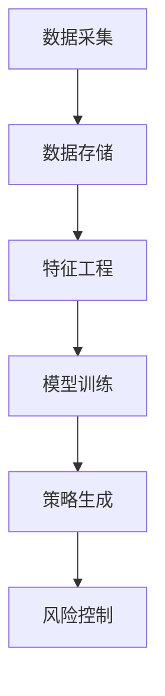

                 


# AI驱动的价值投资策略情景分析

## 关键词：AI，价值投资，情景分析，机器学习，风险管理

## 摘要：本文探讨AI技术在价值投资中的应用，分析如何通过AI进行情景模拟和策略优化，结合数学模型和系统架构，提出一种高效的投资策略，并提供实战案例和未来展望。

---

## 第一章: AI在金融投资中的应用

### 1.1 价值投资的基本概念

#### 1.1.1 价值投资的定义与核心理念

价值投资是一种投资策略，强调通过分析企业的基本面，如财务状况、行业地位和管理团队，来判断其内在价值。投资者购买价格低于内在价值的股票，长期持有，等待市场重新评估其价值。其核心理念是寻找市场低估的优质企业，而非关注短期价格波动。

#### 1.1.2 价值投资的策略分类

- **防御性投资**：注重低风险、高分红的股票，适合风险厌恶型投资者。
- **成长型投资**：投资于高成长潜力的公司，注重未来收益。
- **价值型投资**：寻找市场价格低于内在价值的股票，强调安全边际。

#### 1.1.3 价值投资与传统投资的区别

- **传统投资**：依赖市场趋势和情绪，注重短期收益。
- **价值投资**：注重长期基本面，寻找被低估的机会。

### 1.2 AI技术在金融领域的应用现状

#### 1.2.1 AI在金融分析中的应用

AI技术广泛应用于市场数据处理、风险评估、投资组合优化等领域。机器学习算法能够分析大量非结构化数据，如新闻、社交媒体，提取情绪指标，辅助投资决策。

#### 1.2.2 AI在投资决策中的作用

AI通过大数据分析和复杂模型，帮助投资者识别潜在机会和风险，优化投资组合，提高收益。

#### 1.2.3 AI在风险管理中的应用

AI能够实时监控市场动态，预测市场波动，帮助投资者制定风险控制策略。

### 1.3 AI驱动的价值投资的背景与意义

#### 1.3.1 传统价值投资的局限性

传统价值投资依赖人工分析，耗时且受主观因素影响，难以处理海量数据。

#### 1.3.2 AI技术如何提升价值投资的效率

AI能够快速处理大量数据，发现潜在投资机会，优化投资组合。

#### 1.3.3 AI驱动价值投资的未来发展趋势

AI技术将与价值投资进一步融合，推动投资决策的智能化和自动化。

---

## 第二章: 价值投资策略的情景分析

### 2.1 情景分析的基本概念

#### 2.1.1 情景分析的定义

情景分析是评估不同市场条件下投资组合表现的方法，通过模拟极端情况，帮助投资者制定应对策略。

#### 2.1.2 情景分析的分类

- **历史情景分析**：基于过去市场数据进行模拟。
- **假设情景分析**：基于假设条件进行模拟。
- **压力测试情景分析**：评估投资组合在极端市场条件下的表现。

#### 2.1.3 情景分析在投资中的作用

帮助投资者评估不同市场条件下的投资策略效果，优化投资组合，降低风险。

### 2.2 AI驱动的情景分析方法

#### 2.2.1 数据驱动的情景分析

利用大数据和AI算法，分析市场趋势和潜在风险，生成多种情景。

#### 2.2.2 模型驱动的情景分析

构建数学模型，模拟不同市场条件下的投资组合表现。

#### 2.2.3 组合优化与情景模拟

通过AI优化投资组合，在不同情景下最大化收益或最小化损失。

### 2.3 情景分析在价值投资中的应用

#### 2.3.1 不同市场环境下的投资策略

AI帮助投资者根据市场情况调整投资策略，如在牛市中增加成长股，熊市中增加防御性股票。

#### 2.3.2 情景分析对投资组合的影响

通过情景分析，投资者可以优化投资组合，平衡风险和收益。

#### 2.3.3 情景分析在风险管理中的应用

AI驱动的情景分析帮助投资者识别潜在风险，制定应对策略。

---

## 第三章: AI驱动的价值投资策略模型

### 3.1 价值投资策略的核心要素

#### 3.1.1 财务指标分析

分析企业的收入、利润、资产负债等财务指标，评估其财务健康状况。

#### 3.1.2 市场情绪分析

通过新闻、社交媒体等数据，分析市场情绪，辅助投资决策。

#### 3.1.3 行业趋势分析

分析行业发展趋势，判断企业的成长潜力。

### 3.2 AI算法在策略模型中的应用

#### 3.2.1 机器学习算法在价值投资中的应用

- **监督学习**：用于分类和回归问题，如预测股票价格。
- **无监督学习**：用于聚类分析，发现市场趋势。
- **深度学习**：用于复杂模式识别，如图像识别。

#### 3.2.2 自然语言处理在市场情绪分析中的应用

NLP技术分析新闻和社交媒体，提取情绪指标，辅助投资决策。

#### 3.2.3 时间序列分析在趋势预测中的应用

利用ARIMA、LSTM等模型预测股票价格和市场趋势。

### 3.3 算法原理与数学模型

#### 3.3.1 线性回归模型在价值评估中的应用

线性回归模型用于预测股票价格，形式如下：

$$ y = \beta_0 + \beta_1x + \epsilon $$

其中，$y$是目标变量，$x$是自变量，$\epsilon$是误差项。

#### 3.3.2 支持向量机在分类问题中的应用

SVM用于分类问题，通过构建超平面将数据分为不同类别。

#### 3.3.3 随机森林在特征选择中的应用

随机森林用于特征选择，通过分析特征的重要性，识别关键因素。

---

## 第四章: 系统架构与实现方案

### 4.1 系统架构设计

#### 4.1.1 数据采集模块

- **数据来源**：股票数据、财务报表、新闻、社交媒体。
- **数据格式**：结构化和非结构化数据。

#### 4.1.2 特征工程模块

- **特征提取**：从财务数据中提取关键指标。
- **特征处理**：处理缺失值、归一化等。

#### 4.1.3 模型训练模块

- **算法选择**：根据任务选择合适的算法。
- **模型训练**：使用训练数据训练模型。

#### 4.1.4 策略生成模块

- **策略优化**：根据模型结果生成投资策略。
- **情景模拟**：模拟不同市场条件下的策略效果。

#### 4.1.5 风险控制模块

- **风险评估**：评估投资组合的风险。
- **风险控制**：设定止损、止盈等机制。

### 4.2 系统功能设计

#### 4.2.1 数据处理功能

- 数据清洗、转换、存储。

#### 4.2.2 模型训练功能

- 训练机器学习模型，评估模型性能。

#### 4.2.3 策略生成功能

- 根据模型结果生成投资策略。

#### 4.2.4 情景模拟功能

- 模拟不同市场条件下的策略表现。

#### 4.2.5 风险控制功能

- 监控投资组合风险，调整策略。

### 4.3 系统架构图



---

## 第五章: 项目实战与案例分析

### 5.1 环境安装

- **Python**：安装Anaconda或Miniconda。
- **机器学习库**：安装scikit-learn、TensorFlow、Keras。
- **自然语言处理库**：安装NLTK、spaCy。
- **数据处理库**：安装Pandas、NumPy。

### 5.2 核心实现源代码

#### 5.2.1 数据处理代码

```python
import pandas as pd
import numpy as np

# 加载数据
data = pd.read_csv('stock_data.csv')

# 数据清洗
data = data.dropna()
data = data.drop_duplicates()
```

#### 5.2.2 模型训练代码

```python
from sklearn.ensemble import RandomForestClassifier
from sklearn.metrics import accuracy_score

# 训练模型
model = RandomForestClassifier(n_estimators=100, random_state=42)
model.fit(X_train, y_train)

# 评估模型
y_pred = model.predict(X_test)
print("Accuracy:", accuracy_score(y_test, y_pred))
```

#### 5.2.3 情景模拟代码

```python
import numpy as np

# 模拟市场情景
def simulate_scenario(prices, returns, scenarios):
    results = []
    for scenario in scenarios:
        # 计算投资组合收益
        portfolio_return = np.mean(returns[scenario])
        results.append(portfolio_return)
    return results

# 应用情景模拟
scenarios = ['bull', 'bear', 'normal']
simulated_returns = simulate_scenario(prices, returns, scenarios)
```

### 5.3 实际案例分析

通过具体股票数据，展示如何利用AI进行价值投资策略分析，包括数据处理、模型训练和策略生成的全过程。

### 5.4 项目小结

总结项目实现的关键步骤和成果，强调AI在价值投资中的优势。

---

## 第六章: 总结与展望

### 6.1 总结

AI技术显著提升了价值投资的效率和准确性，通过情景分析和策略优化，帮助投资者制定更科学的投资决策。

### 6.2 未来展望

随着AI技术的发展，价值投资将更加智能化和自动化，投资者将能够实时调整策略，应对复杂市场环境。

### 6.3 注意事项与建议

- **数据质量**：确保数据的准确性和完整性。
- **模型选择**：根据具体任务选择合适的算法。
- **风险管理**：制定有效的风险控制策略。

### 6.4 拓展阅读

推荐相关书籍和论文，供读者深入学习AI在金融领域的应用。

---

## 结语

AI驱动的价值投资策略情景分析不仅提升了投资效率，还为投资者提供了更科学的决策支持。未来，随着技术的不断进步，AI将在金融领域发挥更大的作用。

