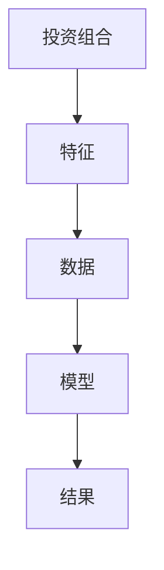
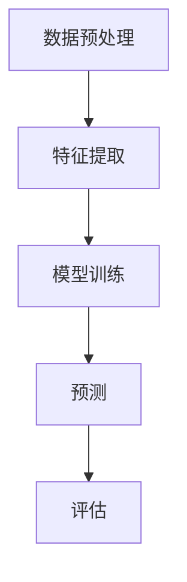
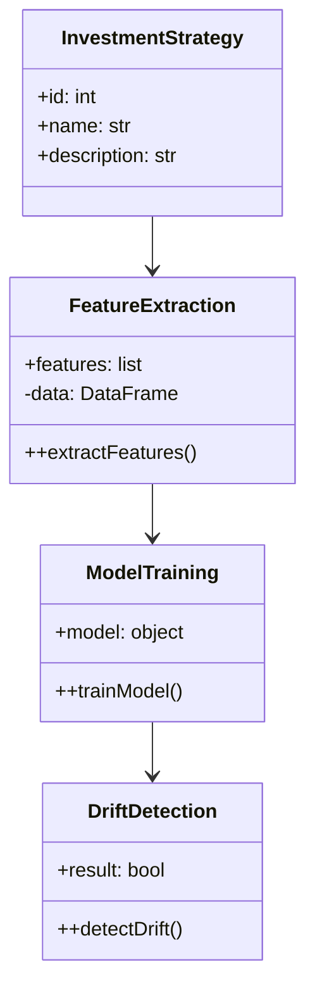
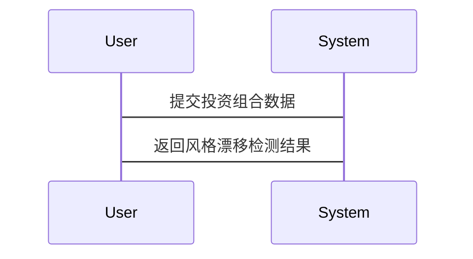

                 


# AI驱动的价值投资策略风格漂移检测

## 关键词：AI技术，风格漂移检测，投资组合管理，机器学习算法，风险管理

## 摘要

随着金融市场的日益复杂化，传统的投资策略分析方法逐渐显现出其局限性。价值投资策略的风格漂移问题尤为突出，它不仅影响投资回报，还可能导致投资风险的增加。本文探讨如何利用人工智能技术，特别是机器学习算法，来检测和预测投资策略中的风格漂移现象。通过详细分析风格漂移的核心概念、AI技术的应用、算法原理、系统架构设计以及实际案例，本文为投资者和金融技术开发者提供了一个全面的技术框架，以实现对投资策略风格漂移的智能化检测与管理。

---

## 第一部分：背景介绍

### 第1章：价值投资策略与风格漂移概述

#### 1.1 价值投资策略的基本概念

价值投资是一种长期投资策略，其核心在于寻找那些市场价格低于其内在价值的股票。该策略强调对公司的基本面分析，寻找被市场低估的投资标的。价值投资策略的成功依赖于对市场周期的准确判断以及对公司内在价值的深入分析。

#### 1.2 风格漂移的定义与影响

风格漂移指的是投资组合的实际表现与其初始的投资策略或风格发生偏离的现象。这种偏离可能源于市场环境的变化、管理人的策略调整或外部因素的干扰。风格漂移会导致投资组合的风险特征发生变化，偏离预期的投资目标，从而影响投资回报。

风格漂移的影响包括：
- **风险增加**：偏离预期的投资风格可能导致投资组合面临意想不到的市场风险。
- **收益不稳定**：风格漂移可能使得投资组合无法充分利用市场机会，从而影响收益。
- **合规性问题**：在某些情况下，风格漂移可能违反投资产品的合同约定或监管规定。

#### 1.3 AI驱动风格漂移检测的必要性

传统的风格漂移检测方法通常依赖于人工分析和统计模型，存在效率低、覆盖面窄等问题。随着AI技术的发展，利用机器学习算法进行风格漂移检测成为可能。AI技术能够处理海量数据，发现传统方法难以察觉的模式和趋势，从而提高检测的准确性和效率。

---

## 第二部分：核心概念与联系

### 第2章：AI驱动风格漂移检测的核心概念

#### 2.1 风格漂移检测的关键要素

在价值投资策略中，风格漂移的检测需要关注以下几个关键要素：
1. **投资组合特征**：包括资产配置、行业分布、市场资本化规模等因素。
2. **市场环境变化**：如宏观经济指标、市场波动率、行业趋势等。
3. **投资策略的动态调整**：包括投资目标的变化、管理人的投资决策等。

#### 2.2 AI技术在风格漂移检测中的应用

AI技术，特别是机器学习算法，在风格漂移检测中的应用主要体现在以下几个方面：
1. **数据处理**：AI能够高效处理大量非结构化数据，提取有用的投资特征。
2. **模式识别**：通过深度学习模型识别潜在的风格漂移模式。
3. **实时监控**：利用流数据处理技术实现对风格漂移的实时检测。

#### 2.3 核心概念的ER实体关系图

以下是核心概念的实体关系图：



---

## 第三部分：算法原理讲解

### 第3章：基于机器学习的风格漂移检测算法

#### 3.1 算法流程

以下是基于机器学习的风格漂移检测算法的流程图：



#### 3.2 算法实现

以下是算法实现的核心代码：

```python
import numpy as np
import pandas as pd
from sklearn.ensemble import RandomForestClassifier
from sklearn.metrics import accuracy_score

# 数据预处理
data = pd.read_csv('investment_data.csv')
data = data.dropna()

# 特征提取
features = ['return', 'volatility', 'market_cap']
target = 'drift'

X = data[features].values
y = data[target].values

# 模型训练
model = RandomForestClassifier()
model.fit(X, y)

# 预测与评估
predicted = model.predict(X)
print("准确率:", accuracy_score(y, predicted))
```

#### 3.3 算法原理

算法的核心在于使用随机森林模型进行分类。随机森林是一种基于决策树的集成学习算法，具有较强的特征选择能力和抗过拟合能力。通过训练模型，我们可以识别出投资组合的风格漂移特征。

---

## 第四部分：系统架构设计

### 第4章：系统架构与功能设计

#### 4.1 系统架构设计

以下是系统架构设计的类图：



#### 4.2 系统接口设计

以下是系统接口设计的序列图：



---

## 第五部分：项目实战

### 第5章：项目实战与实现

#### 5.1 项目环境安装

```bash
pip install numpy pandas scikit-learn
```

#### 5.2 核心代码实现

以下是核心代码实现：

```python
import numpy as np
import pandas as pd
from sklearn.ensemble import RandomForestClassifier

# 数据准备
data = pd.DataFrame({
    'return': np.random.randn(100),
    'volatility': np.random.randn(100),
    'market_cap': np.random.randint(1, 100, 100),
    'drift': np.random.randint(0, 2, 100)
})

# 特征与目标分离
X = data[['return', 'volatility', 'market_cap']]
y = data['drift']

# 模型训练
model = RandomForestClassifier()
model.fit(X, y)

# 预测
predicted = model.predict(X)
print("预测结果:", predicted)
```

#### 5.3 案例分析

通过上述代码，我们可以实现对投资组合风格漂移的实时检测。模型能够识别出投资组合的特征变化，并及时发出风格漂移的预警信号。

---

## 第六部分：总结与展望

### 第6章：总结与展望

#### 6.1 总结

本文详细探讨了AI驱动的价值投资策略风格漂移检测的方法，从背景介绍、核心概念、算法原理、系统设计到项目实战，为读者提供了全面的技术框架。通过机器学习算法，我们可以实现对风格漂移的高效检测，从而提高投资决策的科学性和准确性。

#### 6.2 未来展望

未来，随着AI技术的不断发展，风格漂移检测将更加智能化和精准化。我们可以探索更多的算法，如深度学习和强化学习，以提升检测的效率和准确性。同时，结合实时数据分析技术，实现对风格漂移的实时监控，为投资者提供更加及时和有效的决策支持。

---

通过本文的分析，我们相信AI技术将在金融领域的应用中发挥越来越重要的作用，为投资者和金融从业者提供更加高效和智能的工具，帮助他们在复杂多变的市场环境中做出明智的投资决策。

