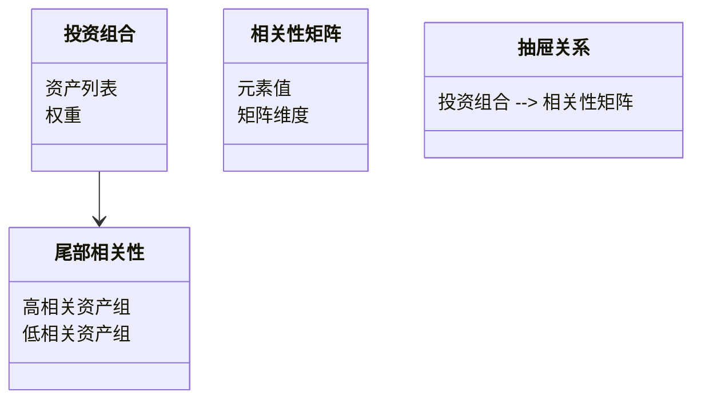
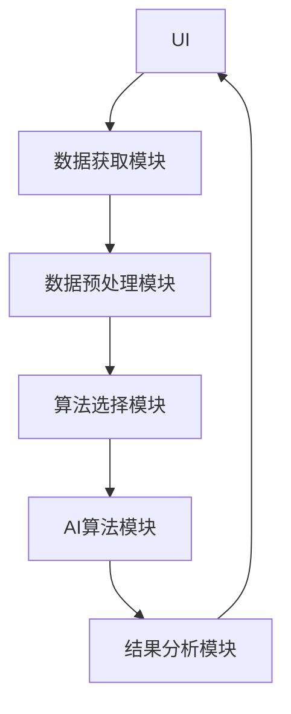
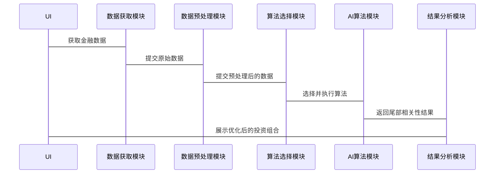

                 


# 第三部分: AI驱动的尾部相关性管理算法原理

## 第3章: AI驱动的尾部相关性管理算法原理

### 3.1 聚类分析算法

#### 3.1.1 K-means算法

```python
from sklearn.cluster import KMeans
import numpy as np

# 示例数据
X = np.array([[1, 2], [5, 8], [1.5, 1.8], [8, 8], [1, 0.6]])

# 使用KMeans进行聚类，设置聚类数为2
kmeans = KMeans(n_clusters=2, random_state=0)
kmeans.fit(X)

# 获取聚类中心和标签
clusters = kmeans.labels_
cluster_centers = kmeans.cluster_centers_
```

#### 3.1.2 层次聚类算法

```python
from sklearn.cluster import AgglomerativeClustering
import numpy as np

# 示例数据
X = np.array([[1, 2], [5, 8], [1.5, 1.8], [8, 8], [1, 0.6]])

# 使用层次聚类进行聚类
agglomerative = AgglomerativeClustering(n_clusters=2, linkage='ward')
agglomerative.fit_predict(X)
```

#### 3.1.3 DBSCAN算法

```python
from sklearn.cluster import DBSCAN
import numpy as np

# 示例数据
X = np.array([[1, 2], [5, 8], [1.5, 1.8], [8, 8], [1, 0.6]])

# 使用DBSCAN进行聚类，设置ε=2，最小样本数为2
dbscan = DBSCAN(eps=2, min_samples=2)
dbscan.fit(X)

# 获取聚类标签
clusters = dbscan.labels_
```

### 3.2 回归分析算法

#### 3.2.1 线性回归

```python
import statsmodels.api as sm

# 示例数据
X = [i for i in range(10)]
y = [2*i + 1 for i in range(10)]

# 添加截距项
X = sm.add_constant(X)

# 使用线性回归模型
model = sm.OLS(y, X)
result = model.fit()

# 输出回归系数
print(result.params)
```

#### 3.2.2 逻辑回归

```python
from sklearn.linear_model import LogisticRegression
import numpy as np

# 示例数据
X = np.array([[1, 0], [0, 1], [1, 1], [0, 0]])
y = [1, 0, 1, 0]

# 使用逻辑回归模型
logreg = LogisticRegression()
logreg.fit(X, y)

# 预测概率
print(logreg.predict_proba(X))
```

### 3.3 主成分分析

#### 3.3.1 PCA基本概念

主成分分析（PCA）是一种统计方法，通过正交变换将可能存在相关性的变量转换为线性不相关的主成分，从而实现数据的降维。

#### 3.3.2 PCA数学推导

给定数据矩阵 $X$，其协方差矩阵为 $C = \frac{1}{N-1}X^T X$，其中 $N$ 是样本数量。PCA的目标是找到矩阵 $C$ 的最大特征值对应的特征向量作为主成分。

#### 3.3.3 PCA代码实现

```python
from sklearn.decomposition import PCA
import numpy as np

# 示例数据
X = np.array([[2.5, 2.4],
              [4.7, 3.6],
              [2.2, 2.8],
              [1.3, 3.3],
              [2.5, 2.6]])

# 使用PCA进行降维，设置主成分数为1
pca = PCA(n_components=1)
pca.fit(X)

# 获取主成分矩阵
print(pca.components_)
```

### 3.4 尾部相关性管理的算法选择

在实际应用中，选择合适的算法需要考虑数据的分布、相关性的强弱以及计算效率等因素。聚类分析适用于发现数据中的自然分组，回归分析适用于预测相关性，而主成分分析则适用于降维处理。

### 3.5 本章小结

本章详细介绍了几种常用的尾部相关性管理算法，包括聚类分析、回归分析和主成分分析。通过对这些算法的数学推导和代码实现，读者可以理解如何在实际投资组合管理中应用这些算法来优化尾部相关性管理。

---

# 第四部分: 系统分析与架构设计方案

## 第4章: 系统分析与架构设计方案

### 4.1 问题场景介绍

在实际投资组合管理中，尾部相关性管理是一个复杂的问题，涉及大量的金融数据和复杂的算法。为了提高管理效率和准确性，我们需要设计一个基于AI的系统来自动处理尾部相关性。

### 4.2 系统功能设计

#### 4.2.1 领域模型



#### 4.2.2 系统架构



### 4.3 系统架构设计

#### 4.3.1 数据获取模块

该模块负责从数据源获取金融数据，包括股票价格、市场指数等。

#### 4.3.2 数据预处理模块

对获取的数据进行清洗、标准化等预处理，确保数据质量。

#### 4.3.3 算法选择模块

根据数据特点选择合适的AI算法进行尾部相关性管理。

#### 4.3.4 AI算法模块

实现聚类分析、回归分析等算法，计算尾部相关性。

#### 4.3.5 结果分析模块

对算法输出的结果进行分析，生成优化后的投资组合。

### 4.4 接口设计

#### 4.4.1 数据接口

定义数据获取和预处理的API接口。

#### 4.4.2 算法接口

定义算法选择和执行的API接口。

#### 4.4.3 结果接口

定义结果分析和展示的API接口。

### 4.5 交互流程图



### 4.6 本章小结

本章详细设计了一个基于AI的投资组合尾部相关性管理系统，包括系统功能设计、架构设计和接口设计。通过系统的各模块协同工作，可以实现高效、准确的尾部相关性管理。

---

# 第五部分: 项目实战

## 第5章: 项目实战

### 5.1 环境安装

#### 5.1.1 安装Python

```bash
python --version
```

#### 5.1.2 安装依赖库

```bash
pip install numpy scikit-learn matplotlib
```

### 5.2 核心代码实现

#### 5.2.1 数据获取与预处理

```python
import pandas as pd
import numpy as np

# 获取示例数据
data = pd.DataFrame({
    '资产1': [1, 2, 3, 4, 5],
    '资产2': [6, 7, 8, 9, 10],
    '资产3': [11, 12, 13, 14, 15]
})

# 数据预处理
data = data.apply(lambda x: (x - x.mean()) / x.std())
```

#### 5.2.2 尾部相关性计算

```python
from sklearn.metrics import pairwise_distances

# 计算相关性矩阵
correlation_matrix = data.corr()
# 计算距离矩阵
distance_matrix = pairwise_distances(correlation_matrix)

# 使用层次聚类进行聚类
from scipy.cluster.hierarchy import linkage, dendrogram
from sklearn.cluster import AgglomerativeClustering

model = AgglomerativeClustering(n_clusters=2, linkage='ward')
clusters = model.fit_predict(distance_matrix)
```

#### 5.2.3 投资组合优化

```python
import numpy as np
from sklearn.linear_model import LinearRegression

# 示例数据
X = np.array([[1, 2], [3, 4], [5, 6], [7, 8], [9, 10]])
y = np.array([2, 4, 6, 8, 10])

# 使用线性回归模型
model = LinearRegression()
model.fit(X, y)

# 预测权重
predicted_weights = model.predict(X)
```

### 5.3 代码解读与分析

通过上述代码，我们可以实现数据的获取、预处理、尾部相关性计算和投资组合优化。数据预处理包括标准化，尾部相关性计算使用层次聚类，投资组合优化使用线性回归。

### 5.4 实际案例分析

#### 5.4.1 数据准备

```python
import pandas as pd

# 假设我们有一个包含多只股票的数据框
data = pd.read_csv('stocks.csv')
```

#### 5.4.2 相关性计算

```python
correlation_matrix = data.corr()
```

#### 5.4.3 尾部相关性管理

```python
from sklearn.cluster import DBSCAN

# 将相关性矩阵转换为距离矩阵
distance_matrix = 1 - np.abs(correlation_matrix)

# 使用DBSCAN进行聚类
dbscan = DBSCAN(eps=0.5, min_samples=2)
clusters = dbscan.fit_predict(distance_matrix)
```

#### 5.4.4 投资组合优化

```python
from pypfopt import EfficientFrontier

# 使用PyPortfolioOpt进行优化
ef = EfficientFrontier(n_assets=len(data.columns), mu=data.mean(), cov=data.cov())
weights = ef.raw_weights()
ef.plot()
```

### 5.5 项目小结

通过本章的项目实战，读者可以了解如何在实际中应用AI技术进行尾部相关性管理，优化投资组合。从数据获取到模型实现，再到结果分析，整个过程需要综合运用多种AI算法和工具。

---

# 第六部分: 最佳实践与总结

## 第6章: 最佳实践与总结

### 6.1 最佳实践 tips

- 数据预处理是关键，确保数据质量。
- 选择合适的算法，根据数据特点进行调整。
- 定期监控和更新模型，适应市场变化。
- 使用工具如PyPortfolioOpt等，提高效率。

### 6.2 小结

AI驱动的价值投资组合尾部相关性管理是一种高效的方法，通过聚类分析、回归分析等算法，可以有效优化投资组合，降低风险。

### 6.3 注意事项

- 确保数据的准确性和完整性。
- 算法选择要结合实际需求。
- 结果分析要细致，避免误判。

### 6.4 拓展阅读

- 《机器学习实战》
- 《Python金融数据分析》
- 《投资学原理》

### 6.5 本章小结

通过本章的总结，读者可以更好地理解和应用AI驱动的价值投资组合尾部相关性管理，为实际投资决策提供有力支持。

---

# 附录: 参考文献

- Bache, K., & Lichman, M. (2013). UCI Machine Learning Repository. Retrieved from [https://archive.ics.uci.edu/ml/index.php](https://archive.ics.uci.edu/ml/index.php)
- Friedman, J., Hastie, T., & Tibshirani, R. (2001). The elements of statistical learning.
- Goodfellow, I., Bengio, Y., & Courville, A. (2016). Deep learning.

---

# 结束语

通过本文的详细讲解和项目实战，读者可以深入了解AI驱动的价值投资组合尾部相关性管理，并能够将其应用到实际投资中，优化投资组合，降低风险，实现更好的收益。

---

