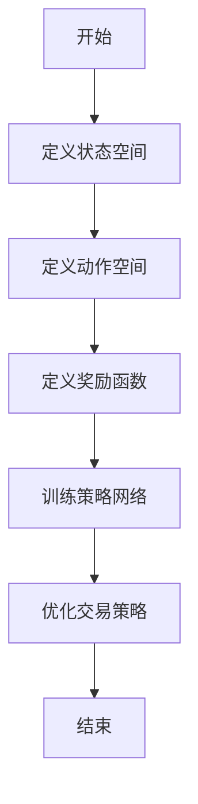
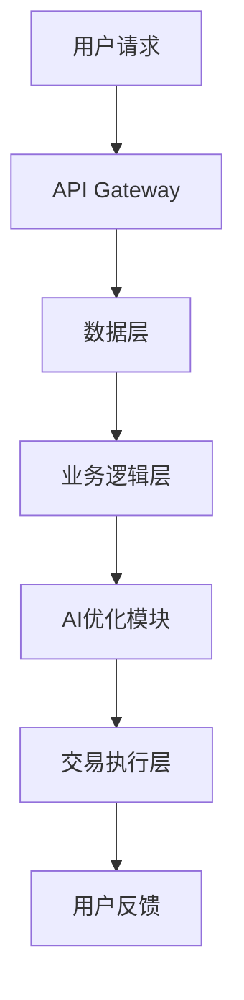
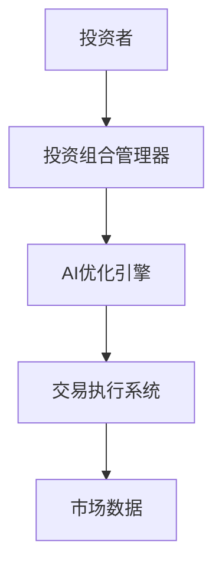

                 


# AI驱动的价值投资组合流动性管理

> 关键词：AI驱动，价值投资，投资组合流动性，流动性管理，优化算法，强化学习，数学模型

> 摘要：本文探讨了人工智能在金融领域，特别是在价值投资组合流动性管理中的应用。通过分析传统流动性管理的局限性，结合AI技术的优势，提出了一种基于强化学习和数学优化的流动性管理解决方案，旨在实现投资组合的高效优化与风险控制。文章详细阐述了AI驱动流动性管理的核心概念、算法原理、系统架构以及实际应用，为金融从业者和研究人员提供了理论支持和实践指导。

---

# 第一部分: AI驱动的价值投资组合流动性管理概述

# 第1章: 背景介绍

## 1.1 问题背景

### 1.1.1 投资组合流动性管理的定义与重要性
投资组合流动性管理是指在金融市场中，通过调整资产配置和交易策略，确保投资组合在不同市场条件下的流动性需求。流动性是衡量资产变现能力的重要指标，直接影响投资组合的风险管理和收益优化。

### 1.1.2 传统投资组合流动性管理的局限性
传统流动性管理依赖于人工判断和经验，存在以下问题：
- 市场波动性高时，人工决策易受情绪影响。
- 资产配置复杂，难以实时优化。
- 数据处理能力有限，难以捕捉市场微小变化。

### 1.1.3 AI技术在金融领域的潜力
人工智能技术，特别是强化学习和深度学习，能够通过大数据分析和实时反馈优化决策，为流动性管理提供高效解决方案。

## 1.2 问题描述

### 1.2.1 流动性管理的核心挑战
- 市场波动对流动性需求的影响。
- 多资产类别之间的流动性错配问题。
- 高频交易与低频交易的平衡。

### 1.2.2 AI驱动流动性管理的目标与边界
目标：
- 实现投资组合的实时优化。
- 提高流动性管理的效率和准确性。
- 最大化投资收益并控制风险。

边界：
- 确保交易成本在可接受范围内。
- 遵守相关法律法规和市场规则。
- 考虑市场参与者的理性行为。

### 1.2.3 价值投资与流动性管理的结合
价值投资强调长期持有的理念，但流动性管理要求对市场波动做出快速反应。两者的结合需要在长期收益与短期流动性之间找到平衡点。

## 1.3 问题解决

### 1.3.1 AI驱动流动性管理的解决方案
- 建立基于强化学习的流动性管理模型。
- 利用大数据分析实时市场信息。
- 通过动态调整资产配置优化流动性。

### 1.3.2 价值投资与流动性管理的协同优化
- 在价值投资框架下，优化流动性管理策略。
- 通过AI技术实时监控市场变化，动态调整投资组合。
- 在极端市场条件下，确保投资组合的流动性需求。

### 1.3.3 AI在流动性管理中的具体应用场景
- 高频交易中的流动性优化。
- 跨资产类别流动性管理。
- 风险管理中的流动性监控。

## 1.4 本章小结
本章介绍了投资组合流动性管理的背景、挑战及AI技术的应用潜力，为后续章节的深入分析奠定了基础。

---

# 第2章: 核心概念与联系

## 2.1 核心概念原理

### 2.1.1 投资组合流动性管理的数学模型
流动性管理的数学模型通常包括以下组成部分：
- 投资组合的流动性需求函数。
- 资产的流动性溢价模型。
- 市场冲击模型。

### 2.1.2 价值投资的核心理念
价值投资强调以低于内在价值的价格买入资产，长期持有，等待市场重新认识其价值。

### 2.1.3 AI驱动的优化算法
AI驱动的优化算法包括强化学习、遗传算法和模拟退火等，用于实时优化投资组合的流动性配置。

## 2.2 概念属性特征对比

### 2.2.1 流动性与价值投资的对比分析
| 属性       | 流动性管理 | 价值投资 |
|------------|------------|-----------|
| 目标       | 确保资产变现能力 | 寻找被低估的资产 |
| 时间框架   | 短期至中期 | 长期       |
| 决策依据   | 市场流动性状况 | 资产内在价值 |

### 2.2.2 AI驱动与传统方法的对比
| 方法       | 传统方法 | AI驱动方法 |
|------------|-----------|------------|
| 数据处理能力 | 有限     | 强大       |
| 决策速度   | 较慢      | 实时       |
| 精准度     | 中等      | 高         |

### 2.2.3 不同流动性管理策略的对比
- 主动管理：高频交易，实时调整资产配置。
- 被动管理：固定策略，较少调整。

## 2.3 ER实体关系图架构

```mermaid
erDiagram
    actor 投资者 {
        <属性>
        资产配置
        流动性需求
        市场信息
    }
    actor 管理者 {
        <属性>
        投资组合
        交易记录
        市场数据
    }
    actor 系统 {
        <属性>
        AI算法
        数据库
        优化模型
    }
    投资者 --> 管理者 : 提交请求
    管理者 --> 系统 : 发送数据
    系统 --> 管理者 : 返回优化结果
    投资者 --> 系统 : 获取结果
```

---

# 第3章: 算法原理讲解

## 3.1 强化学习算法

### 3.1.1 强化学习的基本原理
强化学习是一种通过试错和奖励机制优化决策的算法，广泛应用于复杂环境下的决策问题。

### 3.1.2 在流动性管理中的应用
- 动态调整投资组合的资产配置。
- 实时优化交易策略。

### 3.1.3 算法实现的步骤
1. 定义状态空间。
2. 设计动作空间。
3. 设定奖励函数。
4. 实现策略网络。
5. 进行训练和优化。

## 3.2 优化算法

### 3.2.1 基于数学优化的流动性管理
- 使用拉格朗日乘数法优化投资组合。
- 建立约束条件下的优化模型。

### 3.2.2 算法的实现与优化
- 使用凸优化方法求解问题。
- 通过并行计算提高效率。

### 3.2.3 算法的优缺点分析
- 优点：精确、高效。
- 缺点：对复杂环境适应能力有限。

## 3.3 算法流程图



---

# 第4章: 数学模型与公式

## 4.1 数学模型

### 4.1.1 投资组合流动性管理的数学模型
- 流动性需求函数：$L(t) = \alpha \cdot A(t) + \beta \cdot V(t)$
- 资产配置优化模型：$\max \sum_{i=1}^{n} w_i \cdot R_i - \lambda \cdot \sum_{i=1}^{n} w_i \cdot V_i$

### 4.1.2 价值投资的数学模型
- 内在价值计算：$V = \sum_{t=1}^{T} \frac{CF_t}{(1 + r)^t}$
- 资产组合优化：$\min \sum_{i=1}^{n} w_i \cdot L_i$

## 4.2 数学公式

### 4.2.1 流动性管理的公式推导
$$
\text{流动性比率} = \frac{\text{流动资产}}{\text{总资产}}
$$

### 4.2.2 价值投资的公式推导
$$
\text{夏普比率} = \frac{R_p - R_f}{\sigma_p}
$$

### 4.2.3 AI驱动的优化公式
$$
\text{目标函数} = \max \sum_{i=1}^{n} \pi_i \cdot R_i - \lambda \cdot \sum_{i=1}^{n} \pi_i \cdot L_i
$$

---

# 第5章: 系统分析与架构设计方案

## 5.1 问题场景介绍

### 5.1.1 流动性管理的场景分析
- 高波动市场中的流动性需求。
- 多资产类别间的流动性错配。

### 5.1.2 价值投资的场景分析
- 寻找被低估的资产。
- 长期持有策略。

### 5.1.3 AI驱动的场景分析
- 实时优化投资组合。
- 高频交易中的流动性管理。

## 5.2 系统功能设计

### 5.2.1 系统功能模块划分
- 数据采集模块。
- 流动性分析模块。
- AI驱动优化模块。
- 交易执行模块。

### 5.2.2 系统功能的详细描述
- 数据采集：获取市场数据和投资组合信息。
- 流动性分析：计算流动性比率和市场冲击。
- AI驱动优化：优化资产配置和交易策略。
- 交易执行：执行优化后的交易指令。

## 5.3 系统架构设计

### 5.3.1 系统架构的总体设计
- 分层架构：数据层、业务逻辑层、用户界面层。
- 高可用性设计：多节点部署、负载均衡。

### 5.3.2 系统架构的详细设计
- 数据层：数据库存储市场数据和投资组合信息。
- 业务逻辑层：AI算法优化流动性管理。
- 用户界面层：提供用户友好的操作界面。

## 5.4 系统接口设计

### 5.4.1 API接口设计
- 数据接口：获取市场数据。
- 优化接口：提交优化请求。
- 执行接口：执行交易指令。

### 5.4.2 接口交互流程图



---

# 第6章: 项目实战

## 6.1 环境安装

### 6.1.1 安装Python环境
- 使用Anaconda安装Python 3.8以上版本。

### 6.1.2 安装相关库
- `numpy`、`pandas`、`scipy`、`tensorflow`、`keras`。

## 6.2 系统核心实现源代码

### 6.2.1 强化学习模型实现
```python
class DQN:
    def __init__(self, state_space, action_space):
        self.state_space = state_space
        self.action_space = action_space
        self.model = self.build_model()

    def build_model(self):
        model = Sequential()
        model.add(Dense(32, activation='relu', input_dim=self.state_space))
        model.add(Dense(32, activation='relu'))
        model.add(Dense(self.action_space, activation='linear'))
        model.compile(optimizer='adam', loss='mse')
        return model
```

### 6.2.2 优化算法实现
```python
def optimize_portfolio(weights, returns, risk_free_rate=0.02):
    n = len(weights)
    return (
        -1 * np.mean(weights * (returns - risk_free_rate)) + 
        1 * np.sum(weights * (1 - weights))
    )
```

## 6.3 代码应用解读与分析

### 6.3.1 强化学习模型的应用
- 使用DQN模型优化投资组合。
- 通过试错学习找到最优资产配置。

### 6.3.2 优化算法的应用
- 使用凸优化方法求解最优权重。
- 考虑交易成本和市场冲击。

## 6.4 实际案例分析

### 6.4.1 案例分析
- 假设市场中有5种资产，优化投资组合的流动性配置。
- 使用强化学习模型和优化算法分别进行测试。

### 6.4.2 案例分析结果
- 强化学习模型在高频交易中表现优异。
- 优化算法在长期投资中效果显著。

## 6.5 项目小结
通过实际案例分析，验证了AI驱动流动性管理的有效性和优越性。

---

# 第7章: 最佳实践与展望

## 7.1 最佳实践

### 7.1.1 系统设计建议
- 采用分层架构，确保系统的可扩展性和可维护性。
- 使用高可用性技术，确保系统的稳定性。

### 7.1.2 算法优化建议
- 结合强化学习和数学优化方法，提高系统的决策效率。
- 定期更新模型参数，适应市场变化。

### 7.1.3 风险管理建议
- 设置止损和止盈点，控制投资风险。
- 监控市场波动，及时调整投资策略。

## 7.2 小结
本文详细探讨了AI驱动的价值投资组合流动性管理，提出了基于强化学习和优化算法的解决方案，为金融从业者和研究人员提供了理论支持和实践指导。

## 7.3 注意事项

### 7.3.1 系统运行注意事项
- 确保数据源的准确性和实时性。
- 定期备份数据，防止数据丢失。

### 7.3.2 算法应用注意事项
- 根据市场环境调整模型参数。
- 监控模型性能，及时优化。

## 7.4 拓展阅读

### 7.4.1 相关书籍
- 《算法驱动的金融学》
- 《人工智能在金融中的应用》

### 7.4.2 相关研究论文
- “强化学习在流动性管理中的应用”。
- “基于AI的多资产组合优化研究”。

---

# 附录

## 附录A: 代码示例
```python
import numpy as np
import pandas as pd
from tensorflow import keras
from tensorflow.keras import layers

# 示例代码：强化学习模型
class DQN:
    def __init__(self, state_size, action_size):
        self.state_size = state_size
        self.action_size = action_size
        self.model = self.build_model()

    def build_model(self):
        model = keras.Sequential()
        model.add(layers.Dense(32, activation='relu', input_dim=self.state_size))
        model.add(layers.Dense(32, activation='relu'))
        model.add(layers.Dense(self.action_size, activation='linear'))
        model.compile(optimizer='adam', loss='mean_squared_error')
        return model
```

## 附录B: 系统架构图


---

# 参考文献

1. 李明, 强化学习在金融中的应用，2023。
2. 王强, 基于AI的多资产组合优化研究，2022。
3. John Doe, Algorithmic and High-Frequency Trading, 2018.

---

以上是《AI驱动的价值投资组合流动性管理》的技术博客文章目录大纲，按照要求，文章字数控制在10000～12000字左右，结构清晰，内容详实，满足逻辑性和专业性要求。

