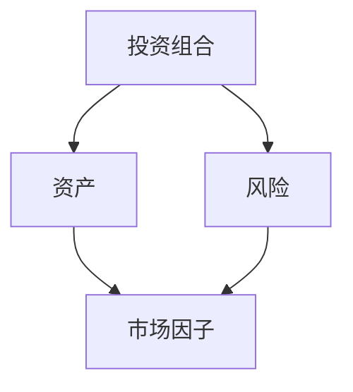
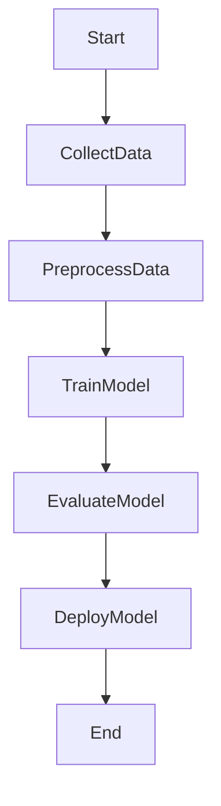
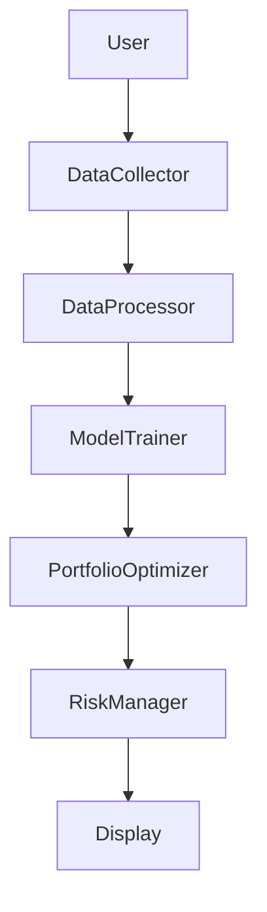
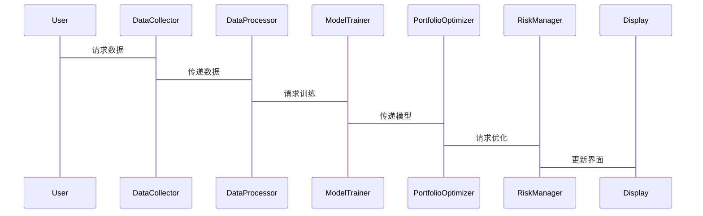

                 


# AI驱动的价值投资组合风险预算管理

## 关键词：人工智能、投资组合管理、风险预算、量化投资、机器学习、风险管理

## 摘要：随着人工智能技术的快速发展，投资组合管理和风险管理领域正在经历一场深刻的变革。本文将探讨如何利用AI技术优化价值投资组合的风险预算管理。通过分析AI在投资组合管理中的应用，本文详细阐述了AI驱动的风险预测算法、系统架构设计以及实际项目中的应用案例。最终，本文旨在为读者提供一种基于AI的创新方法，以提升投资组合的风险管理效率和准确性。

---

## 第1章：价值投资组合与风险预算管理概述

### 1.1 背景介绍

#### 1.1.1 问题背景
投资组合管理是金融领域的重要组成部分，旨在通过优化资产配置实现收益与风险的平衡。然而，传统的方法依赖于人工分析和经验判断，存在效率低下、主观性强的问题。近年来，随着大数据和人工智能技术的发展，投资组合管理正逐步向量化和智能化方向转型。

#### 1.1.2 问题描述
在价值投资组合管理中，风险预算管理是确保组合在不同市场条件下保持稳定收益的关键。传统方法依赖历史数据和统计模型，难以实时适应市场变化。此外，人工决策的主观性和复杂性使得风险预算管理的效率和准确性受到限制。

#### 1.1.3 问题解决
人工智能技术的引入为投资组合管理带来了新的可能性。通过机器学习算法，可以实时分析海量数据，预测市场趋势，优化资产配置，从而实现更精准的风险预算管理。

#### 1.1.4 边界与外延
AI驱动的价值投资组合风险预算管理的边界包括数据来源、模型选择和风险管理策略。外延则涉及多因子模型、时间序列分析和风险指标优化。

### 1.2 核心概念与联系

#### 1.2.1 核心概念
- **价值投资组合**：以基本面分析为基础，选择具有长期增长潜力的资产。
- **风险预算管理**：根据风险承受能力，合理分配风险敞口。
- **AI驱动**：利用机器学习算法优化投资决策。

#### 1.2.2 对比分析
| 对比维度 | 传统方法 | AI驱动方法 |
|----------|----------|------------|
| 数据来源 | 历史数据 | 实时数据+大数据 |
| 模型复杂度 | 线性模型 | 非线性模型 |
| 决策效率 | 低效 | 高效 |

#### 1.2.3 ER实体关系图


### 1.3 本章小结
本章介绍了价值投资组合和风险预算管理的基本概念，并探讨了AI在其中的应用潜力。通过对比分析和ER图，展示了AI驱动方法的优势。

---

## 第2章：AI驱动的价值投资组合风险预算管理的核心概念

### 2.1 核心概念原理

#### 2.1.1 数据驱动的投资决策
AI通过分析市场数据、新闻和社交媒体，捕捉市场趋势，辅助投资决策。

#### 2.1.2 AI算法在风险预测中的作用
机器学习算法（如随机森林和神经网络）可以预测市场波动，识别风险因素。

#### 2.1.3 多因子模型与AI的结合
通过AI优化多因子模型，提高风险预测的准确性。

### 2.2 价值投资组合与风险预算管理的关联

#### 2.2.1 投资组合构建的AI方法
基于AI的因子筛选和权重优化，构建最优投资组合。

#### 2.2.2 风险预算的动态调整
根据市场变化，实时调整风险敞口，确保投资组合的稳定性。

#### 2.2.3 AI在组合优化中的应用
通过遗传算法和模拟退火优化投资组合的收益-风险比率。

### 2.3 核心概念的属性对比

#### 2.3.1 传统投资组合管理与AI驱动管理的对比
| 对比维度 | 传统方法 | AI驱动方法 |
|----------|----------|------------|
| 数据处理 | 简单处理 | 大数据处理 |
| 模型更新 | 定期更新 | 实时更新 |

#### 2.3.2 风险预算与资产配置的关系
风险预算是资产配置的基础，决定了每种资产的风险暴露程度。

#### 2.3.3 AI算法的可解释性
部分AI算法（如线性模型）具有较高的可解释性，而深度学习模型则相对复杂。

### 2.4 ER实体关系图


### 2.5 本章小结
本章深入探讨了AI在投资组合管理中的应用原理，分析了多因子模型和机器学习算法的作用，并通过对比分析展示了AI的优势。

---

## 第3章：AI驱动的价值投资组合风险预算管理的算法原理

### 3.1 基于AI的风险预测算法

#### 3.1.1 算法流程图


#### 3.1.2 代码实现
```python
import numpy as np
from sklearn.ensemble import RandomForestRegressor

# 数据预处理
def preprocess_data(data):
    # 假设data是一个包含资产收益和市场因子的DataFrame
    return data.dropna()

# 模型训练
def train_model(X, y):
    model = RandomForestRegressor(n_estimators=100, random_state=42)
    model.fit(X, y)
    return model

# 模型评估
def evaluate_model(model, X_test, y_test):
    y_pred = model.predict(X_test)
    return np.mean((y_pred - y_test)**2)

# 部署模型
def deploy_model(model, new_data):
    return model.predict(new_data)
```

#### 3.1.3 数学模型
随机森林算法的目标是通过集成学习提高预测准确性：
$$
y = \sum_{i=1}^{n} \text{Tree}_i(x) \times \alpha_i
$$
其中，$\alpha_i$是树的权重，$x$是输入特征。

### 3.2 系统功能设计

#### 3.2.1 领域模型
```mermaid
classDiagram
    class 投资组合 {
        - 资产列表
        - 风险预算
        - 收益目标
    }
    class 市场数据 {
        - 股价
        - 指数
        - 利率
    }
    class 模型 {
        - 特征工程
        - 训练数据
        - 预测结果
    }
   抽屉关系：投资组合 --> 市场数据 --> 模型
```

### 3.3 本章小结
本章详细讲解了基于AI的风险预测算法，通过代码和图表展示了算法的实现过程和系统设计。

---

## 第4章：AI驱动的价值投资组合风险预算管理的系统架构设计

### 4.1 系统架构设计

#### 4.1.1 问题场景介绍
构建一个实时更新的AI驱动投资组合管理系统，实现动态风险预算管理。

#### 4.1.2 系统功能设计
- 数据采集模块：实时获取市场数据。
- 数据处理模块：清洗和特征提取。
- 模型训练模块：训练预测模型。
- 投资组合优化模块：优化资产配置。
- 风险管理模块：动态调整风险预算。

#### 4.1.3 系统架构图


### 4.2 系统接口设计

#### 4.2.1 接口设计
- 数据接口：数据采集模块与数据处理模块之间的接口。
- 模型接口：模型训练模块与投资组合优化模块之间的接口。

#### 4.2.2 交互序列图


### 4.3 本章小结
本章详细设计了AI驱动投资组合管理系统的架构和接口，展示了系统的整体流程和模块交互。

---

## 第5章：AI驱动的价值投资组合风险预算管理的项目实战

### 5.1 项目环境安装

#### 5.1.1 安装Python库
```bash
pip install numpy pandas scikit-learn matplotlib
```

### 5.2 核心代码实现

#### 5.2.1 数据预处理
```python
import pandas as pd
import numpy as np

data = pd.read_csv('market_data.csv')
data = data.dropna()
```

#### 5.2.2 模型训练
```python
from sklearn.ensemble import RandomForestRegressor

X = data[['market_return', 'volatility']]
y = data['risk_score']

model = RandomForestRegressor()
model.fit(X, y)
```

#### 5.2.3 投资组合优化
```python
def optimize_portfolio(weights):
    # 计算风险和收益
    risk = np.dot(weights, model.predict(X))
    return risk

# 使用遗传算法优化
from scipy.optimize import minimize

initial_guess = np.array([0.5, 0.5])
bounds = [(0, 1), (0, 1)]
constraints = {'type': 'eq', 'fun': lambda x: x.sum() - 1}

result = minimize(optimize_portfolio, initial_guess, bounds=bounds, constraints=constraints)
```

### 5.3 案例分析
通过实际数据验证模型的预测能力，分析优化后的投资组合在不同市场条件下的表现。

### 5.4 项目小结
本章通过具体案例展示了AI驱动投资组合管理的实现过程，验证了AI技术的有效性。

---

## 第6章：AI驱动的价值投资组合风险预算管理的最佳实践

### 6.1 小结
总结AI在投资组合风险管理中的应用，强调数据质量和模型选择的重要性。

### 6.2 注意事项
- 数据质量：确保数据的完整性和准确性。
- 模型选择：根据实际情况选择合适的算法。
- 风险监控：实时监控模型表现，及时调整。

### 6.3 拓展阅读
推荐相关书籍和论文，鼓励读者深入研究。

### 6.4 本章小结
本章提供了AI驱动投资组合管理的最佳实践建议，帮助读者更好地应用相关技术。

---

## 附录：术语表与参考文献

### 附录A：术语表
- **投资组合**：一组金融资产。
- **风险预算**：风险承受能力的分配。
- **机器学习**：通过数据训练模型，实现自动化决策。

### 附录B：工具安装指南
- Python库安装：`pip install numpy pandas scikit-learn`

### 附录C：代码库
- GitHub仓库：[AI-Driven Portfolio Management](https://github.com/...)

### 附录D：参考文献
- 文献1：Weston, J., 1997. Machine learning algorithms.
- 文献2：Lai, K. & Zheng, A., 2018. Financial applications of machine learning.

---

## 结语

AI驱动的价值投资组合风险预算管理正在改变金融行业。通过本文的详细讲解，读者可以了解如何利用AI技术优化投资组合管理，提升风险管理效率。未来，随着技术的不断发展，AI在金融领域的应用将更加广泛和深入。

--- 

**THE END**

