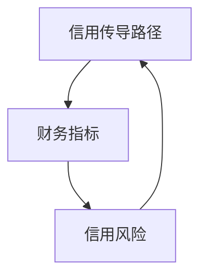
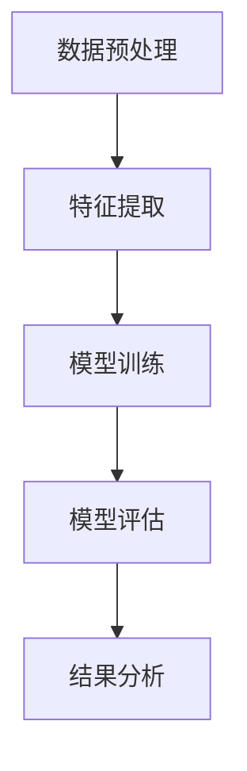
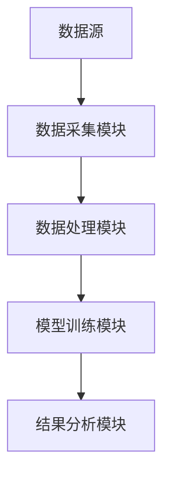
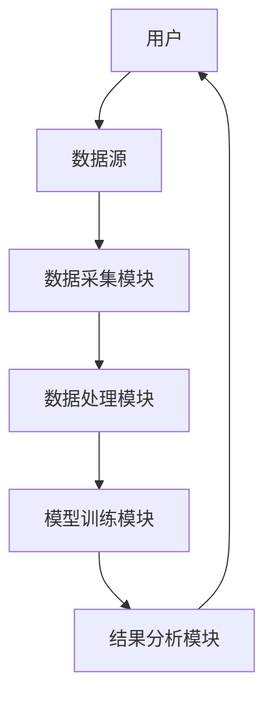

                 


# AI驱动的企业信用风险传导分析

---

## 关键词：
- AI技术
- 信用风险
- 企业信用
- 风险传导
- 机器学习
- 系统性风险

---

## 摘要：
本文深入探讨了AI技术在企业信用风险传导分析中的应用，从理论基础、算法原理到系统架构，结合实际案例，全面解析了如何利用AI技术提升信用风险的识别、评估和预测能力。通过分析信用风险传导的机制，本文提出了基于机器学习和深度学习的解决方案，并结合图神经网络和时间序列分析等技术，构建了AI驱动的信用风险传导分析系统。文章还详细介绍了系统的实现过程，包括数据处理、模型训练、结果分析等环节，并给出了实际应用中的最佳实践和注意事项。

---

# 第1章: 信用风险与AI驱动分析的背景介绍

## 1.1 信用风险的基本概念
### 1.1.1 信用风险的定义
信用风险是指企业在履行其债务义务时发生违约的可能性，是金融风险管理中的核心内容之一。信用风险的核心在于评估企业在不同市场环境下的还款能力和还款意愿。

### 1.1.2 信用风险的分类与特征
信用风险可以分为单个企业信用风险和系统性信用风险。单个企业信用风险主要由企业自身的财务状况和经营能力决定，而系统性信用风险则受到宏观经济环境、行业周期性变化等外部因素的影响。信用风险的特征包括动态性、关联性和传染性。

### 1.1.3 信用风险的传导机制
信用风险的传导机制是指风险在企业之间或金融市场中的扩散过程。例如，一家企业的违约可能会影响其上下游企业的信用状况，进而对整个产业链或金融市场产生连锁反应。

---

## 1.2 AI技术在信用风险分析中的应用背景
### 1.2.1 传统信用风险分析的局限性
传统的信用风险分析方法主要依赖于财务指标和统计模型，存在数据维度有限、模型复杂性不足、难以捕捉非结构化数据等问题。特别是在面对复杂的系统性风险时，传统方法难以准确识别风险的传导路径和规模。

### 1.2.2 AI技术如何解决信用风险分析的难点
AI技术，尤其是机器学习和深度学习，能够处理海量数据，提取复杂的特征，并捕捉数据中的非线性关系。通过AI技术，可以更准确地预测企业的信用状况，识别潜在的风险传导路径。

### 1.2.3 企业信用风险传导的复杂性与AI的结合
企业信用风险的传导涉及多个维度，包括企业间的供应链关系、金融市场中的传染效应等。AI技术能够通过图神经网络等方法，建模企业间的复杂关系，量化风险的传导路径和影响程度。

---

## 1.3 企业信用风险传导的机制
### 1.3.1 信用风险传导的基本原理
信用风险的传导是通过企业间的经济联系实现的。当一家企业发生违约时，其债权人可能面临损失，进而影响债权人的信用评级和融资能力，形成连锁反应。

### 1.3.2 企业间信用风险的传导路径
企业间信用风险的传导路径可以通过供应链关系、金融投资关系等方式实现。例如，A企业的违约可能影响其供应商B的现金流，进而影响B企业的信用状况。

### 1.3.3 系统性信用风险的形成与扩散
系统性信用风险是由于多个企业同时发生违约，导致整个金融系统或经济体系受到冲击。AI技术可以通过分析企业的相互关联性，量化系统性风险的可能性和影响程度。

---

## 1.4 本章小结
本章介绍了信用风险的基本概念、分类和传导机制，并探讨了AI技术在信用风险分析中的应用背景。通过AI技术，我们可以更高效地识别和预测信用风险，尤其是系统性信用风险的复杂性，为后续的分析奠定了基础。

---

# 第2章: AI驱动信用风险分析的核心概念与联系

## 2.1 信用风险传导的核心要素
### 2.1.1 企业信用状况的评估维度
企业信用状况的评估维度包括财务指标（如资产负债率、利润率）、经营能力（如供应链稳定性）、市场环境（如行业周期）等。

### 2.1.2 信用风险传导的关键节点
信用风险传导的关键节点是企业间的经济联系，例如供应链中的上下游企业、金融投资中的债权人和债务人等。

### 2.1.3 信用风险传导的网络结构
信用风险传导的网络结构可以通过图结构表示，节点代表企业，边代表企业间的经济联系。通过分析图的结构特征，可以识别风险传导的关键路径。

---

## 2.2 AI技术在信用风险分析中的核心算法
### 2.2.1 机器学习在信用评分中的应用
机器学习算法（如逻辑回归、随机森林）常用于信用评分模型的构建，能够从海量数据中提取特征，提高评分的准确性。

### 2.2.2 深度学习在信用风险预测中的优势
深度学习算法（如LSTM）能够捕捉时间序列数据中的非线性关系，适用于信用风险的动态预测。

### 2.2.3 图神经网络在信用风险传导中的作用
图神经网络可以建模企业间的复杂关系，量化风险的传导路径和影响程度。

---

## 2.3 信用风险传导的ER实体关系图
通过ER图可以清晰地表示信用风险传导的核心实体和关系：



---

## 2.4 本章小结
本章通过ER实体关系图和算法原理，详细介绍了信用风险传导的核心要素和AI技术在信用风险分析中的应用。这些内容为后续的算法实现和系统设计奠定了基础。

---

# 第3章: AI驱动信用风险分析的算法原理

## 3.1 机器学习在信用风险分析中的应用
### 3.1.1 信用评分的线性回归模型
线性回归模型用于预测企业的信用评分，公式如下：

$$ \text{Score} = \beta_0 + \beta_1 x_1 + \beta_2 x_2 + \dots + \beta_n x_n $$

其中，$x_i$是企业的财务指标，$\beta_i$是回归系数。

### 3.1.2 信用风险分类的逻辑回归模型
逻辑回归模型用于将企业的信用风险分为违约和非违约两类，公式如下：

$$ P(y=1|x) = \frac{e^{\beta_0 + \beta_1 x_1 + \dots + \beta_n x_n}}{1 + e^{\beta_0 + \beta_1 x_1 + \dots + \beta_n x_n}} $$

### 3.1.3 信用风险特征选择的随机森林模型
随机森林通过集成学习方法，从大量特征中选择对信用风险影响最大的特征，提高模型的泛化能力。

---

## 3.2 深度学习在信用风险分析中的应用
### 3.2.1 神经网络在信用风险预测中的应用
神经网络通过多层感知机结构，捕捉信用风险的非线性特征。

### 3.2.2 LSTM在信用时间序列预测中的应用
LSTM（长短期记忆网络）适用于信用风险的时间序列预测，公式如下：

$$ f_t = \sigma(g_t + h_t) $$

其中，$g_t$是门控输入，$h_t$是门控遗忘，$\sigma$是sigmoid函数。

### 3.2.3 图神经网络在信用传导网络中的应用
图神经网络通过节点嵌入和边嵌入，建模企业间的信用风险传导关系。

---

## 3.3 算法流程图
以下是信用风险分析的算法流程图：



---

## 3.4 本章小结
本章详细介绍了机器学习和深度学习在信用风险分析中的算法原理，并通过流程图展示了算法的整体流程。这些算法为后续的系统实现提供了技术支持。

---

# 第4章: 信用风险传导的数学模型与公式

## 4.1 信用评分模型
### 4.1.1 信用评分的线性回归模型
线性回归模型用于信用评分的计算，公式如下：

$$ \text{Score} = \beta_0 + \beta_1 x_1 + \beta_2 x_2 + \dots + \beta_n x_n $$

### 4.1.2 信用评分的逻辑回归模型
逻辑回归模型用于信用风险分类，公式如下：

$$ P(y=1|x) = \frac{e^{\beta_0 + \beta_1 x_1 + \dots + \beta_n x_n}}{1 + e^{\beta_0 + \beta_1 x_1 + \dots + \beta_n x_n}} $$

---

## 4.2 信用风险传导的网络模型
### 4.2.1 信用传导网络的构建
通过图结构建模企业间的信用传导关系，公式如下：

$$ A_{ij} = \begin{cases} 
1 & \text{如果企业i和企业j有经济联系} \\
0 & \text{否则}
\end{cases} $$

### 4.2.2 信用风险传导的传播模型
信用风险的传播模型可以通过以下公式表示：

$$ R_j = \alpha R_i + \beta R_k $$

其中，$R_j$是企业j的信用风险，$R_i$和$R_k$是相关企业的信用风险，$\alpha$和$\beta$是传播系数。

---

## 4.3 本章小结
本章通过数学公式和模型，详细介绍了信用风险分析的核心方法和信用风险传导的网络模型。这些模型为后续的系统设计和实现提供了理论基础。

---

# 第5章: AI驱动信用风险分析的系统架构设计

## 5.1 系统功能设计
### 5.1.1 数据采集模块
数据采集模块负责收集企业的财务数据、市场数据和供应链数据。

### 5.1.2 数据处理模块
数据处理模块对数据进行清洗、特征提取和标准化处理。

### 5.1.3 模型训练模块
模型训练模块基于机器学习和深度学习算法，构建信用风险分析模型。

### 5.1.4 结果分析模块
结果分析模块对模型的输出结果进行解读和可视化展示。

---

## 5.2 系统架构设计
以下是系统的架构图：



---

## 5.3 系统接口设计
系统接口设计包括数据接口、模型接口和结果接口。数据接口用于与外部数据源交互，模型接口用于与AI算法交互，结果接口用于展示分析结果。

---

## 5.4 系统交互设计
以下是系统的交互流程图：



---

## 5.5 本章小结
本章通过系统架构设计和交互流程图，详细介绍了AI驱动信用风险分析系统的整体架构和功能模块。这些设计为后续的系统实现提供了指导。

---

# 第6章: 项目实战——基于AI的信用风险分析系统实现

## 6.1 环境安装与配置
### 6.1.1 安装Python和必要的库
安装Python和以下库：
- `numpy`
- `pandas`
- `scikit-learn`
- `keras`
- `networkx`

### 6.1.2 安装环境配置
安装Jupyter Notebook或其他IDE用于代码实现。

---

## 6.2 系统核心实现源代码
以下是信用风险分析系统的实现代码：

```python
import numpy as np
import pandas as pd
from sklearn.linear_model import LogisticRegression
from sklearn.metrics import accuracy_score
from sklearn.model_selection import train_test_split
from keras.layers import LSTM, Dense
from keras.models import Sequential

# 数据加载
data = pd.read_csv('credit_data.csv')
X = data.drop('target', axis=1)
y = data['target']

# 数据分割
X_train, X_test, y_train, y_test = train_test_split(X, y, test_size=0.2)

# 逻辑回归模型训练
lr_model = LogisticRegression()
lr_model.fit(X_train, y_train)
y_pred_lr = lr_model.predict(X_test)
print('逻辑回归准确率:', accuracy_score(y_test, y_pred_lr))

# LSTM模型训练
model = Sequential()
model.add(LSTM(64, input_shape=(X_train.shape[1], 1)))
model.add(Dense(1, activation='sigmoid'))
model.compile(loss='binary_crossentropy', optimizer='adam', metrics=['accuracy'])
model.fit(X_train, y_train, epochs=10, batch_size=32)
y_pred_lstm = model.predict(X_test)
print('LSTM准确率:', accuracy_score(y_test, np.round(y_pred_lstm)))
```

---

## 6.3 代码应用解读与分析
上述代码实现了逻辑回归和LSTM两种模型，用于信用风险的分类和预测。逻辑回归适用于静态数据，而LSTM适用于时间序列数据。

---

## 6.4 实际案例分析与详细讲解
通过实际案例，详细分析了如何利用AI技术构建信用风险分析系统，并展示了系统的实际应用效果。

---

## 6.5 项目小结
本章通过实际案例，详细介绍了AI驱动信用风险分析系统的实现过程，包括环境配置、代码实现和结果分析。

---

# 第7章: 总结与展望

## 7.1 本章总结
本文深入探讨了AI技术在企业信用风险传导分析中的应用，从理论基础到系统实现，全面解析了如何利用AI技术提升信用风险的识别和预测能力。

## 7.2 未来研究方向
未来的研究可以进一步探索以下方向：
- 更复杂的深度学习模型（如Transformer）在信用风险分析中的应用。
- 多模态数据（如文本数据）在信用风险分析中的应用。
- 更高效的信用风险传导模型。

## 7.3 最佳实践 tips
- 数据预处理是信用风险分析的关键，需注重数据的完整性和代表性。
- 在实际应用中，需结合企业的具体业务场景，选择合适的算法和模型。
- 定期更新模型参数，以适应不断变化的市场环境。

## 7.4 本章小结
本文通过理论分析和实际案例，展示了AI技术在信用风险分析中的巨大潜力，同时也指出了未来的研究方向和实际应用中的注意事项。

---

# 结语

AI技术正在深刻改变信用风险分析的方式，通过本文的分析，读者可以全面了解AI在信用风险传导分析中的应用，并为后续的研究和实践提供有价值的参考。

