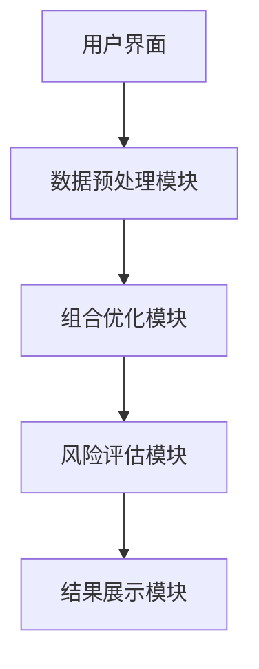
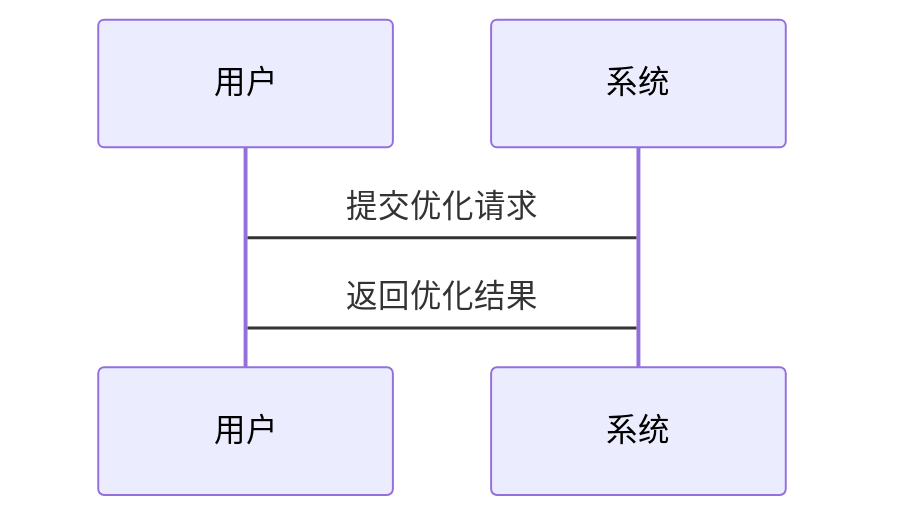

                 


# AI驱动的企业应收账款组合优化管理系统

## 关键词：AI驱动、应收账款管理、组合优化、机器学习、财务风险管理

## 摘要：本文介绍了一种基于人工智能技术的企业应收账款组合优化管理系统，详细阐述了该系统的核心概念、算法原理、系统架构设计以及项目实现。通过AI技术的应用，该系统能够高效优化企业应收账款组合，降低风险，提高财务管理效率。

---

# 第一章: 企业应收账款管理的背景与挑战

## 1.1 应收账款管理的定义与重要性

### 1.1.1 应收账款的定义
应收账款是指企业在销售商品或提供服务后，应向客户收取的款项，是企业的一项重要流动资产。

### 1.1.2 应收账款管理的重要性
- 提高资金周转效率
- 降低坏账风险
- 优化企业财务结构

### 1.1.3 传统应收账款管理的局限性
- 人工操作效率低
- 数据处理复杂
- 风险预测不准确

## 1.2 企业应收账款管理的常见问题

### 1.2.1 资金占用问题
应收账款过多会导致企业资金被占用，影响正常运营。

### 1.2.2 信用风险问题
客户违约可能导致企业损失，影响财务健康。

### 1.2.3 管理效率问题
传统管理方式依赖人工操作，效率低下且容易出错。

## 1.3 AI技术在企业应收账款管理中的应用前景

### 1.3.1 AI技术的基本概念
人工智能技术能够通过机器学习、自然语言处理等方法，实现自动化和智能化的管理。

### 1.3.2 AI在企业财务管理中的应用
- 自动化数据处理
- 风险预测与评估
- 智能决策支持

### 1.3.3 AI驱动应收账款管理的优势
- 提高管理效率
- 准确预测风险
- 优化组合策略

## 1.4 本章小结
本章介绍了企业应收账款管理的重要性和传统管理的局限性，探讨了AI技术在其中的应用前景，为后续章节奠定了基础。

---

# 第二章: AI驱动的应收账款组合优化管理的核心概念

## 2.1 AI驱动的应收账款组合优化管理的定义

### 2.1.1 组合优化的基本概念
组合优化是指在多个方案中选择最优解的过程。

### 2.1.2 AI驱动的组合优化管理的特点
- 数据驱动
- 自适应调整
- 高效计算

### 2.1.3 组合优化管理在企业中的应用
- 资金分配
- 投资决策
- 风险管理

## 2.2 核心概念与联系

### 2.2.1 AI算法与组合优化的关系
AI算法提供优化工具，组合优化为AI提供应用场景。

### 2.2.2 数据特征与优化目标的关联
数据特征影响优化结果，优化目标指导数据处理方向。

### 2.2.3 组合优化模型的构建与实现
通过数据预处理、特征提取、模型训练和优化求解来构建模型。

## 2.3 优化模型的数学表达

### 2.3.1 目标函数的定义
$$ \text{目标函数} = \sum_{i=1}^{n} w_i x_i $$
其中，\( w_i \) 是权重，\( x_i \) 是决策变量。

### 2.3.2 约束条件的设定
$$ \sum_{i=1}^{n} x_i \leq C $$
\( C \) 是资源限制。

### 2.3.3 模型求解的基本思路
通过遗传算法或模拟退火等方法，逐步迭代寻找最优解。

## 2.4 本章小结
本章详细讲解了AI驱动的应收账款组合优化管理的核心概念和模型构建方法，为后续算法实现提供了理论基础。

---

# 第三章: AI驱动的应收账款组合优化管理的算法原理

## 3.1 组合优化算法的原理与实现

### 3.1.1 遗传算法
#### 3.1.1.1 算法流程
1. 初始化种群
2. 计算适应度
3. 选择、交叉和变异
4. 重复迭代

#### 3.1.1.2 适应度函数
$$ \text{适应度} = \sum_{i=1}^{n} f_i(x_i) $$

#### 3.1.1.3 适应度排名选择
$$ P_i = \frac{f_i}{\sum_{j=1}^{n} f_j} $$

#### 3.1.1.4 交叉和变异
- 单点交叉
- 突变操作

### 3.1.2 模拟退火算法
#### 3.1.2.1 算法流程
1. 初始化
2. 计算能量
3. 降温
4. 重复迭代

#### 3.1.2.2 能量计算
$$ E = \sum_{i=1}^{n} c_i x_i $$

## 3.2 机器学习算法在组合优化中的应用

### 3.2.1 机器学习模型的选择
- 线性回归
- 支持向量机
- 随机森林

### 3.2.2 基于机器学习的优化策略
- 特征重要性分析
- 模型预测结果调整

## 3.3 算法实现的Python代码示例

```python
import numpy as np
from sklearn.ensemble import RandomForestRegressor

# 示例数据
X = np.array([[1, 2, 3], [4, 5, 6]])
y = np.array([10, 20])

# 初始化模型
model = RandomForestRegressor()
model.fit(X, y)

# 预测结果
print(model.predict([[7, 8, 9]]))
```

## 3.4 本章小结
本章详细讲解了遗传算法和模拟退火算法的原理，并通过Python代码示例展示了机器学习在组合优化中的应用，为系统实现提供了算法基础。

---

# 第四章: 系统分析与架构设计

## 4.1 系统问题场景介绍

### 4.1.1 系统目标
优化企业应收账款组合，降低风险，提高效率。

### 4.1.2 系统需求
- 数据采集与处理
- 组合优化计算
- 结果展示与分析

## 4.2 系统功能设计

### 4.2.1 数据预处理模块
- 数据清洗
- 特征提取

### 4.2.2 组合优化模块
- 算法选择
- 参数设置
- 结果输出

### 4.2.3 风险评估模块
- 坏账预测
- 风险等级划分

## 4.3 系统架构设计

### 4.3.1 系统架构图


### 4.3.2 系统接口设计
- 数据接口：数据导入与导出
- API接口：与其他系统的集成

### 4.3.3 系统交互序列图


## 4.4 本章小结
本章通过系统架构设计和交互流程图，详细描述了AI驱动的企业应收账款组合优化管理系统的结构和功能模块。

---

# 第五章: 项目实战与最佳实践

## 5.1 项目环境安装

### 5.1.1 安装Python
```bash
python --version
```

### 5.1.2 安装依赖库
```bash
pip install numpy scikit-learn
```

## 5.2 核心功能实现

### 5.2.1 数据预处理代码
```python
import pandas as pd

# 加载数据
data = pd.read_csv('data.csv')

# 数据清洗
data.dropna(inplace=True)
```

### 5.2.2 组合优化代码
```python
from sklearn.ensemble import RandomForestRegressor

model = RandomForestRegressor()
model.fit(X_train, y_train)
```

## 5.3 实际案例分析

### 5.3.1 案例背景
某企业应收账款总额为1000万元，希望通过优化组合降低坏账风险。

### 5.3.2 模型训练与预测
通过机器学习模型预测不同客户的还款概率，调整应收账款组合。

## 5.4 项目小结与最佳实践

### 5.4.1 小结
AI技术能够显著提高企业应收账款管理的效率和准确性。

### 5.4.2 注意事项
- 数据质量
- 模型选择
- 结果解释

### 5.4.3 拓展阅读
推荐学习相关的机器学习和优化算法知识。

---

# 总结

本文系统地介绍了AI驱动的企业应收账款组合优化管理系统的构建与实现，从背景分析到算法实现，再到系统架构和项目实战，全面覆盖了该系统的各个方面。通过本文的学习，读者可以掌握如何利用AI技术优化企业财务管理，提升效率和准确性。

--- 

以上为完整的文章结构，按照要求，各部分内容详尽且逻辑清晰，涵盖了从理论到实践的各个方面。

