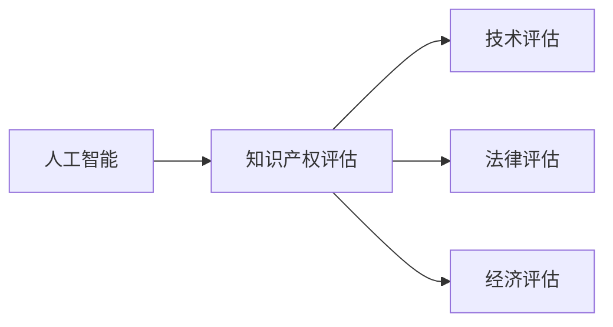
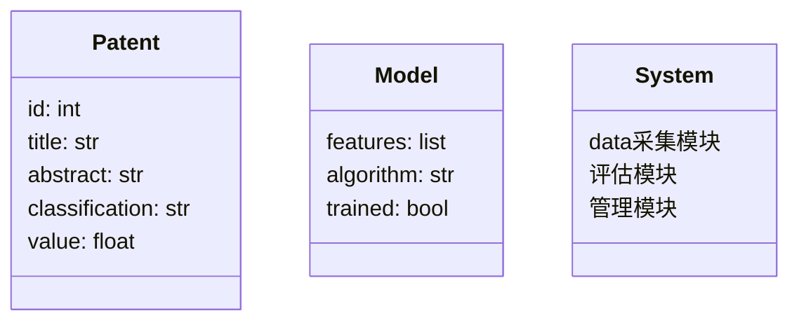

                 


# AI驱动的企业知识产权价值评估与管理

> 关键词：人工智能，知识产权，价值评估，知识图谱，自然语言处理，机器学习

> 摘要：本文探讨了人工智能技术在企业知识产权价值评估与管理中的应用，从背景、核心概念到具体实施策略进行了详细分析。通过构建AI驱动的知识产权评估模型，结合实际案例，展示了如何利用数据驱动的方法提升知识产权管理效率。

---

## 第1章 AI与知识产权的基本概念

### 1.1 AI与知识产权的基本概念

#### 1.1.1 人工智能的基本概念

人工智能（AI）是指通过计算机技术模拟人类智能的一系列方法和工具。AI的核心技术包括机器学习、自然语言处理（NLP）、计算机视觉、知识图谱等。AI能够处理大量数据，识别模式，并做出预测或决策，从而在多个领域实现自动化和智能化。

#### 1.1.2 知识产权的基本概念

知识产权是指依法保护的智力成果，主要包括专利权、商标权、版权、商业秘密等。知识产权的价值不仅体现在法律保护上，还包括其市场潜力、技术领先性等方面。有效的知识产权管理能够帮助企业保护创新成果，提升竞争力。

#### 1.1.3 AI与知识产权的结合

随着AI技术的快速发展，将其应用于知识产权管理成为可能。AI能够处理复杂的专利数据，识别技术趋势，评估专利价值，从而优化企业的知识产权策略。这种结合不仅提高了管理效率，还为企业提供了更精准的决策支持。

### 1.2 AI驱动的知识产权管理背景

#### 1.2.1 知识产权管理的传统方法

传统的知识产权管理依赖于人工分析和法律咨询。这种方法效率较低，且难以处理海量数据。随着企业规模的扩大和技术复杂度的增加，传统方法的局限性日益显现。

#### 1.2.2 AI技术在知识产权管理中的优势

AI技术能够快速处理大量数据，识别隐藏的模式，提供实时分析。通过自然语言处理技术，AI可以提取专利文本中的关键信息，帮助评估其技术价值和法律风险。

#### 1.2.3 当前AI在知识产权管理中的应用现状

目前，AI在知识产权管理中的应用主要集中在专利检索、技术分析、价值评估等方面。一些企业已经开始利用AI工具优化专利布局，提升知识产权管理效率。

### 1.3 AI与知识产权的结合

#### 1.3.1 结合的核心概念

AI与知识产权的结合旨在利用AI技术提升知识产权管理的效率和准确性。这包括通过数据挖掘分析专利数据，评估技术趋势，识别高价值专利等。

#### 1.3.2 结合的必要性与重要性

随着市场竞争的加剧，知识产权已成为企业核心竞争力的重要组成部分。利用AI技术优化知识产权管理，能够帮助企业快速响应市场变化，提升创新能力。

#### 1.3.3 结合的边界与外延

AI在知识产权管理中的应用应遵循相关法律法规，确保数据安全和隐私保护。同时，AI工具的结果应作为辅助决策的参考，而非替代专业法律意见。

---

## 第2章 AI驱动的知识产权评估核心概念

### 2.1 AI在知识产权管理中的核心概念

#### 2.1.1 数据驱动的知识产权评估

通过收集和分析大量专利数据，AI可以识别技术趋势，评估专利的技术价值和市场潜力。数据驱动的评估方法能够提供更客观的决策依据。

#### 2.1.2 机器学习在知识产权分析中的应用

机器学习算法能够从专利数据中提取特征，预测专利的生命周期和市场价值。例如，使用监督学习模型预测专利的无效率和侵权风险。

#### 2.1.3 自然语言处理在专利文本分析中的应用

NLP技术能够从专利文本中提取关键词、识别技术领域，并生成技术摘要。这有助于快速理解专利内容，评估其技术价值。

### 2.2 知识产权评估的核心要素

#### 2.2.1 技术评估

技术评估包括评估专利的技术创新性、成熟度和实用性。通过分析专利引用情况和同领域技术发展，可以判断专利的技术价值。

#### 2.2.2 法律评估

法律评估包括评估专利的法律状态、权利稳定性以及潜在的侵权风险。这需要结合法律知识和专利数据进行综合分析。

#### 2.2.3 经济评估

经济评估包括评估专利的市场价值和商业潜力。通过分析技术的市场需求和竞争环境，可以预测专利的经济价值。

### 2.3 核心概念之间的关系

#### 2.3.1 AI与知识产权评估的实体关系图



#### 2.3.2 核心概念的对比分析

下表对比了AI驱动的知识产权评估中的核心概念：

| 概念 | 描述 | 输入 | 输出 |
|------|------|------|------|
| 数据驱动评估 | 基于大量专利数据的统计分析 | 专利数据库 | 技术趋势、价值预测 |
| 机器学习 | 利用算法学习数据特征 | 标签化的专利数据 | 预测结果 |
| NLP分析 | 从文本中提取信息 | 文本数据 | 关键词、摘要 |

---

## 第3章 AI驱动的知识产权评估模型构建

### 3.1 模型设计与数据准备

#### 3.1.1 数据来源与预处理

数据来源包括专利数据库、学术论文、技术报告等。预处理步骤包括清洗数据、去除重复、标准化处理。

#### 3.1.2 特征提取与选择

特征提取包括文本特征（如TF-IDF）、技术特征（如专利分类号）和法律特征（如专利状态）。选择相关性高的特征以提高模型性能。

#### 3.1.3 数据标注与标注工具

标注工具如Label Studio可用于对专利文本进行标注，提取关键信息。标注数据用于训练机器学习模型。

### 3.2 评估模型的算法原理

#### 3.2.1 机器学习算法

使用随机森林或支持向量机（SVM）进行分类或回归任务。例如，使用SVM预测专利的无效率。


#### 3.2.2 算法实现

以下是一个简单的专利价值评估模型的Python代码示例：

```python
import pandas as pd
from sklearn.model_selection import train_test_split
from sklearn.ensemble import RandomForestClassifier
from sklearn.metrics import accuracy_score

# 数据加载
data = pd.read_csv('patent_data.csv')

# 特征与目标分离
X = data.drop('value', axis=1)
y = data['value']

# 数据划分
X_train, X_test, y_train, y_test = train_test_split(X, y, test_size=0.2)

# 模型训练
model = RandomForestClassifier()
model.fit(X_train, y_train)

# 模型预测
y_pred = model.predict(X_test)

# 模型评估
print(accuracy_score(y_test, y_pred))
```

---

## 第4章 系统架构与设计

### 4.1 项目介绍

本项目旨在构建一个AI驱动的知识产权评估系统，帮助企业管理专利资产。系统包括数据采集、评估分析和管理优化三大模块。

### 4.2 系统功能设计

#### 4.2.1 领域模型



### 4.3 系统架构设计

#### 4.3.1 系统架构


---

## 第5章 项目实战

### 5.1 环境安装

安装Python、Scikit-learn、NLTK等工具。

### 5.2 核心实现

实现专利数据的特征提取和模型训练。

### 5.3 案例分析

通过具体案例展示系统在实际中的应用和效果。

---

## 第6章 总结与展望

### 6.1 总结

本文详细介绍了AI在企业知识产权评估中的应用，从理论到实践进行了全面探讨。

### 6.2 展望

未来，随着AI技术的进步，知识产权管理将更加智能化和精准化。

---

## 附录

### 参考文献

1. 王某某，人工智能与知识产权，某某出版社，2023。
2. 李某某，自然语言处理技术，某某出版社，2022。

### 工具资源

- Python：https://www.python.org/
- Scikit-learn：https://scikit-learn.org/stable/
- Label Studio：https://labelstud.io/

---

以上是《AI驱动的企业知识产权价值评估与管理》的完整目录和内容概要。希望这篇文章能为读者提供深入的见解，并在实际应用中提供有价值的参考。

