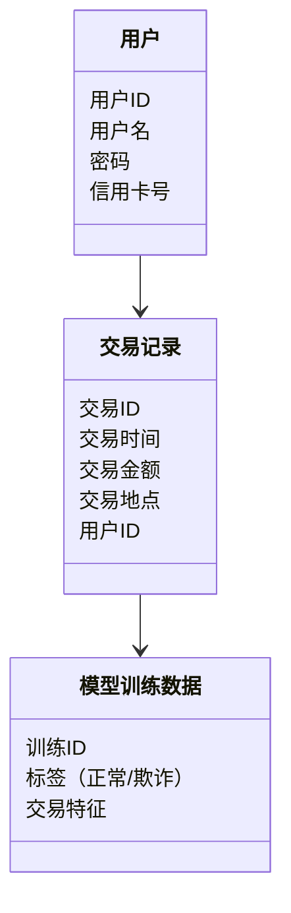
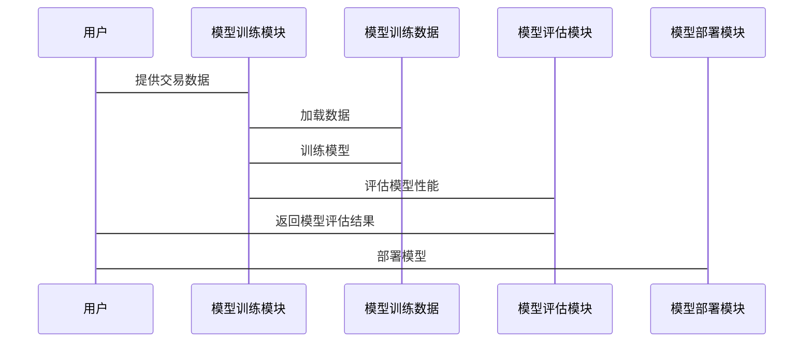

                 


# AI驱动的信用卡欺诈检测模型

## 关键词：AI、信用卡、欺诈检测、模型、机器学习、深度学习

## 摘要

AI驱动的信用卡欺诈检测模型通过利用机器学习和深度学习技术，分析大量信用卡交易数据，识别潜在的欺诈行为，从而保护持卡人和金融机构的财产安全。本文详细介绍了信用卡欺诈检测的背景、核心概念、算法原理、系统架构以及项目实战，帮助读者全面理解并掌握如何构建和优化AI驱动的信用卡欺诈检测模型。

---

# 第一部分：AI驱动的信用卡欺诈检测模型背景与概述

## 第1章：信用卡欺诈检测的背景与挑战

### 1.1 信用卡欺诈检测的背景

#### 1.1.1 信用卡欺诈的定义与特征
- 信用卡欺诈是指未经授权的个人或组织利用信用卡进行非法交易，导致持卡人或发卡机构遭受经济损失。
- 欺诈交易的特征包括异常交易金额、异常交易时间、异常交易地点、异常交易频率等。

#### 1.1.2 信用卡欺诈的常见类型
- 伪卡欺诈：使用复制的信用卡进行交易。
- 未授权交易：持卡人信用卡被盗或丢失后被他人使用。
- 账户盗用：黑客攻击持卡人账户，进行未经授权的交易。
- 恶意欺诈：欺诈者故意创建多个虚假账户进行欺诈交易。

#### 1.1.3 信用卡欺诈检测的必要性
- 随着信用卡的普及，欺诈行为日益猖獗，传统的基于规则的欺诈检测方法逐渐暴露出效率低、漏检率高的问题。
- AI技术的快速发展为信用卡欺诈检测提供了新的解决方案，能够实时分析海量交易数据，快速识别异常行为。

### 1.2 AI技术在金融领域的应用

#### 1.2.1 AI技术在金融领域的应用现状
- AI技术在金融领域的应用包括智能投顾、风险管理、信用评估、欺诈检测等。
- 信用卡欺诈检测是AI技术在金融领域中的重要应用之一。

#### 1.2.2 AI在信用卡欺诈检测中的优势
- AI能够处理海量数据，发现隐藏在数据中的模式和异常。
- AI模型能够实时分析交易数据，快速识别潜在的欺诈行为。
- AI技术能够不断学习和优化，提升欺诈检测的准确性和效率。

#### 1.2.3 信用卡欺诈检测的未来趋势
- 随着AI技术的不断进步，信用卡欺诈检测将更加智能化和自动化。
- 多模态数据融合、联邦学习等技术将进一步提升欺诈检测的准确性和隐私保护能力。

### 1.3 本章小结
本章介绍了信用卡欺诈检测的背景、常见类型以及AI技术在其中的应用优势和未来发展趋势，为后续章节奠定了基础。

---

## 第2章：信用卡欺诈检测的核心概念

### 2.1 欺诈检测的基本概念

#### 2.1.1 欺诈检测的定义
- 欺诈检测是指通过分析交易数据，识别潜在的欺诈行为，从而保护持卡人和金融机构的财产安全。

#### 2.1.2 欺诈检测的核心要素
- **交易数据**：包括交易时间、交易金额、交易地点、交易类型等。
- **用户行为**：包括用户的交易频率、交易习惯、地理位置变化等。
- **模型算法**：包括传统的统计方法、机器学习算法和深度学习模型。

#### 2.1.3 欺诈检测的分类方法
- **基于规则的方法**：通过预定义的规则来检测欺诈行为，例如设定交易金额的阈值。
- **基于机器学习的方法**：利用机器学习算法训练模型，识别欺诈交易。
- **基于深度学习的方法**：利用深度学习模型分析复杂的交易数据，识别潜在的欺诈行为。

### 2.2 信用卡交易数据的特征分析

#### 2.2.1 交易时间特征
- **交易时间间隔**：异常交易通常会在短时间内集中发生。
- **交易时间分布**：正常交易通常在工作日或特定时间段内发生，而欺诈交易可能在非工作日或深夜发生。

#### 2.2.2 交易金额特征
- **交易金额大小**：欺诈交易通常金额较大，但也有小额试探性交易。
- **交易金额波动**：正常交易金额通常符合用户的消费习惯，而欺诈交易金额可能突然增加或减少。

#### 2.2.3 交易地点特征
- **地理位置一致性**：正常交易通常发生在用户常去的地点，而欺诈交易可能发生在用户从未去过的地方。
- **地理位置变化**：短时间内交易地点的突然变化可能表明欺诈行为。

#### 2.2.4 用户行为特征
- **交易频率**：异常交易通常交易频率较高，且交易金额和时间间隔异常。
- **用户设备信息**：不同的设备和浏览器可能对应不同的用户行为特征。

### 2.3 基于AI的信用卡欺诈检测模型

#### 2.3.1 基于规则的传统方法
- 传统的欺诈检测方法通常基于预定义的规则，例如设定交易金额的上限和下限，或者设定交易时间间隔的阈值。
- 优点是简单易实现，缺点是漏检率较高，无法应对复杂的欺诈手段。

#### 2.3.2 基于机器学习的模型
- 机器学习模型能够通过学习历史交易数据，识别欺诈交易的模式和特征。
- 常见的机器学习算法包括逻辑回归、随机森林、支持向量机等。

#### 2.3.3 基于深度学习的模型
- 深度学习模型能够通过多层神经网络分析复杂的交易数据，识别隐藏在数据中的模式和异常。
- 常见的深度学习模型包括卷积神经网络（CNN）、循环神经网络（RNN）、图神经网络（GNN）等。

### 2.4 本章小结
本章详细介绍了信用卡欺诈检测的核心概念，包括欺诈检测的基本定义、交易数据的特征分析以及基于AI的欺诈检测模型。

---

## 第3章：信用卡欺诈检测的算法原理

### 3.1 传统统计方法与机器学习算法

#### 3.1.1 传统统计方法
- **基于阈值的检测方法**：通过设定交易金额或时间间隔的阈值，识别异常交易。
- **基于频率分析的检测方法**：通过分析交易频率，识别异常交易。
- **基于聚类分析的检测方法**：通过聚类算法将交易分为正常交易和异常交易。

#### 3.1.2 机器学习算法
- **决策树算法**：通过构建决策树模型，分类正常交易和欺诈交易。
- **随机森林算法**：通过集成多个决策树模型，提升分类准确率。
- **支持向量机算法**：通过构建支持向量机模型，分类正常交易和欺诈交易。

### 3.2 深度学习算法与神经网络模型

#### 3.2.1 深度学习的基本原理
- **神经网络的定义**：神经网络是由多个神经元组成的网络，能够通过多层非线性变换提取数据特征。
- **神经网络的层数与深度**：深度学习模型通常包含多个隐藏层，能够提取复杂的特征。
- **激活函数的作用**：激活函数用于引入非线性，使得神经网络能够学习复杂的模式。

#### 3.2.2 基于神经网络的信用卡欺诈检测
- **卷积神经网络（CNN）**：通过卷积操作提取局部特征，适用于图像和序列数据的分析。
- **循环神经网络（RNN）**：通过循环结构处理序列数据，适用于时间序列数据的分析。
- **图神经网络（GNN）**：通过图结构分析交易之间的关联关系，适用于复杂网络数据的分析。

#### 3.2.3 深度学习模型的优缺点
- **优点**：深度学习模型能够处理复杂的交易数据，识别隐藏在数据中的模式和异常。
- **缺点**：深度学习模型通常需要大量的训练数据，且模型的解释性较差。

### 3.3 本章小结
本章详细介绍了信用卡欺诈检测的算法原理，包括传统统计方法、机器学习算法和深度学习模型。

---

## 第4章：信用卡欺诈检测的系统分析

### 4.1 系统功能设计

#### 4.1.1 领域模型


#### 4.1.2 系统架构
```mermaid
rectangle 系统边界 {
    用户
    交易记录
    模型训练数据
    模型训练模块
    模型评估模块
    模型部署模块
}
```

#### 4.1.3 系统交互


### 4.2 系统架构设计

#### 4.2.1 系统架构图
```mermaid
rectangle 系统边界 {
    用户
    交易记录
    模型训练模块
    模型评估模块
    模型部署模块
}
```

#### 4.2.2 模块功能说明
- **模型训练模块**：负责加载交易数据，训练欺诈检测模型。
- **模型评估模块**：负责评估模型的性能，包括准确率、召回率、F1分数等。
- **模型部署模块**：负责将训练好的模型部署到生产环境，实时检测欺诈交易。

### 4.3 本章小结
本章详细介绍了信用卡欺诈检测系统的功能设计和架构设计，包括领域模型、系统架构和系统交互流程。

---

## 第五部分：信用卡欺诈检测的项目实战

### 5.1 项目环境安装

#### 5.1.1 安装Python和相关库
```bash
pip install numpy
pip install pandas
pip install scikit-learn
pip install xgboost
pip install keras
pip install tensorflow
```

#### 5.1.2 数据集获取
- 数据集可以从公开数据集（如Kaggle）获取，或者使用模拟数据生成工具生成模拟数据。

### 5.2 项目核心实现

#### 5.2.1 数据预处理
```python
import pandas as pd
import numpy as np

# 加载数据
data = pd.read_csv('credit_card Fraud.csv')

# 处理缺失值
data = data.dropna()

# 处理分类变量
data = pd.get_dummies(data)
```

#### 5.2.2 特征工程
```python
from sklearn.preprocessing import StandardScaler

# 标准化处理
scaler = StandardScaler()
data = scaler.fit_transform(data)

# 划分训练集和测试集
from sklearn.model_selection import train_test_split

X_train, X_test, y_train, y_test = train_test_split(data, target, test_size=0.2)
```

#### 5.2.3 模型训练
```python
from sklearn.ensemble import RandomForestClassifier
from xgboost import XGBClassifier
from keras.models import Sequential
from keras.layers import Dense

# 随机森林模型
model_rf = RandomForestClassifier()
model_rf.fit(X_train, y_train)

# XGBoost模型
model_xgb = XGBClassifier()
model_xgb.fit(X_train, y_train)

# 深度学习模型
model_dl = Sequential()
model_dl.add(Dense(64, activation='relu', input_dim=X_train.shape[1]))
model_dl.add(Dense(1, activation='sigmoid'))
model_dl.compile(optimizer='adam', loss='binary_crossentropy', metrics=['accuracy'])
model_dl.fit(X_train, y_train, epochs=10, batch_size=32)
```

#### 5.2.4 模型评估
```python
from sklearn.metrics import accuracy_score, recall_score, f1_score

# 随机森林模型评估
y_pred_rf = model_rf.predict(X_test)
accuracy_rf = accuracy_score(y_test, y_pred_rf)
recall_rf = recall_score(y_test, y_pred_rf)
f1_rf = f1_score(y_test, y_pred_rf)

# XGBoost模型评估
y_pred_xgb = model_xgb.predict(X_test)
accuracy_xgb = accuracy_score(y_test, y_pred_xgb)
recall_xgb = recall_score(y_test, y_pred_xgb)
f1_xgb = f1_score(y_test, y_pred_xgb)

# 深度学习模型评估
y_pred_dl = model_dl.predict(X_test)
y_pred_dl = [int(np.round(y)) for y in y_pred_dl]
accuracy_dl = accuracy_score(y_test, y_pred_dl)
recall_dl = recall_score(y_test, y_pred_dl)
f1_dl = f1_score(y_test, y_pred_dl)
```

#### 5.2.5 模型部署
```python
# 部署随机森林模型
import joblib

joblib.dump(model_rf, 'fraud_detection.pkl')

# 部署XGBoost模型
joblib.dump(model_xgb, 'fraud_detection_xgb.pkl')

# 部署深度学习模型
model_dl.save('fraud_detection_dl.h5')
```

### 5.3 项目小结
本章通过实际项目展示了信用卡欺诈检测模型的构建过程，包括数据预处理、特征工程、模型训练、模型评估和模型部署。

---

## 第六部分：总结与展望

### 6.1 总结

### 6.2 未来研究方向
- **模型的可解释性**：如何提高AI模型的可解释性，以便更好地理解和优化模型。
- **模型的实时性**：如何提升模型的实时性，以应对快速变化的交易环境。
- **模型的鲁棒性**：如何增强模型的鲁棒性，以应对复杂的欺诈手段。

### 6.3 注意事项

### 6.4 拓展阅读
- 推荐阅读《Hands-On Machine Learning with Scikit-Learn, Keras, and TensorFlow》、《Deep Learning》等书籍，以深入理解机器学习和深度学习的核心原理。

---

# 结语

AI驱动的信用卡欺诈检测模型通过利用机器学习和深度学习技术，能够有效地识别潜在的欺诈行为，保护持卡人和金融机构的财产安全。随着AI技术的不断发展，信用卡欺诈检测模型将变得更加智能和高效，为金融安全保驾护航。

--- 

如果需要进一步的详细内容或代码示例，请随时告诉我！

