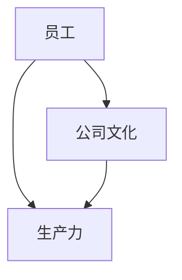
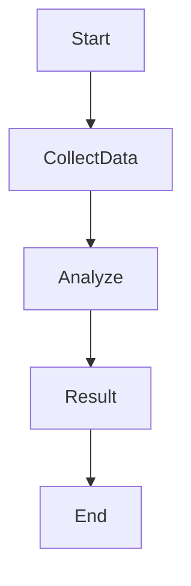
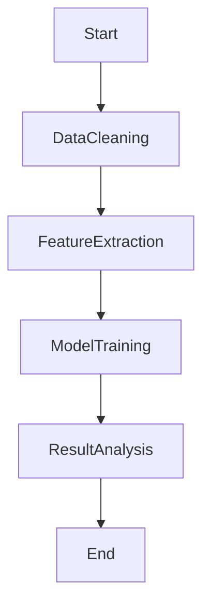

                 


# AI驱动的公司文化与员工生产力相关性分析

> 关键词：AI驱动的公司文化，员工生产力，相关性分析，系统架构，算法模型

> 摘要：本文通过分析AI技术在公司文化中的应用，探讨AI驱动的公司文化与员工生产力之间的相关性，提出一种基于数据驱动的方法来量化和优化公司文化对员工生产力的影响。文章结合理论分析和实际案例，提出了一个完整的系统架构和算法模型，为企业的文化管理提供了新的思路和工具。

---

## 第一部分: AI驱动的公司文化与员工生产力相关性分析背景介绍

### 第1章: 问题背景与描述

#### 1.1 问题背景
- **公司文化与员工生产力的关系**  
  公司文化是企业管理和组织行为的核心，它影响员工的工作态度、行为模式以及整体生产力。传统的公司文化管理更多依赖于主观判断和经验管理，而随着AI技术的发展，数据驱动的公司文化管理成为可能。
  
- **AI技术在企业管理中的应用现状**  
  AI技术已经在招聘、绩效管理、员工反馈等领域得到广泛应用，但将其应用于公司文化分析和优化还处于探索阶段。AI可以帮助企业量化文化特征，发现文化与生产力之间的潜在联系。

- **当前公司文化与生产力分析的不足**  
  传统的方法难以将公司文化与员工生产力进行量化关联，导致文化管理缺乏科学性和可操作性。而AI技术可以通过数据分析，提取文化特征，并建立量化模型，为文化管理提供科学依据。

#### 1.2 问题描述
- **AI驱动公司文化的核心要素**  
  AI驱动的公司文化分析需要关注文化特征的提取、文化与行为的关系建模，以及文化对生产力的影响力评估。

- **员工生产力的多维度定义**  
  生产力不仅仅是工作效率，还包括创新性、团队协作能力、员工满意度等多个维度。AI可以通过数据分析，量化这些维度的特征，并建立多维度的评估模型。

- **相关性分析的目标与意义**  
  本文的目标是通过AI技术，分析公司文化与员工生产力之间的相关性，为企业提供优化文化管理的科学依据。其意义在于将文化管理从经验驱动转向数据驱动，提高管理效率和效果。

---

### 第2章: 问题解决与边界定义

#### 2.1 问题解决思路
- **数据驱动的公司文化分析方法**  
  通过收集员工行为数据、绩效数据和文化特征数据，利用AI技术提取文化特征，并建立文化与生产力之间的关联模型。

- **基于AI的生产力提升策略**  
  根据文化与生产力的相关性分析结果，制定针对性的管理策略，优化公司文化，提升员工生产力。

- **相关性分析的数学建模框架**  
  采用统计分析和机器学习方法，建立文化特征与生产力指标之间的数学模型，量化文化对生产力的影响。

#### 2.2 边界与外延
- **公司文化相关性分析的适用范围**  
  适用于中大型企业，尤其是数据化管理较为成熟的企业。对于小型企业或数据不足的企业，可能需要结合其他管理方法。

- **员工生产力提升的边界条件**  
  生产力的提升受到多种因素的影响，包括员工能力、工作环境、管理方式等。本文主要关注公司文化对生产力的影响，其他因素需在后续研究中进一步分析。

- **相关性分析的局限性与注意事项**  
  相关性分析不能直接证明因果关系，因此在实际应用中需要结合其他管理方法，避免单一依赖数据驱动的结果。

---

## 第二部分: 核心概念与联系

### 第3章: AI驱动的公司文化核心概念

#### 3.1 核心概念原理
- **AI在公司文化中的应用方式**  
  AI可以通过自然语言处理（NLP）技术分析员工反馈、会议记录等文本数据，提取文化特征；通过机器学习算法分析员工行为数据，建立文化与行为的关联模型。

- **数据驱动的公司文化特征**  
  数据驱动的公司文化分析需要关注文化特征的量化，例如团队协作性、创新性、员工满意度等。这些特征可以通过员工行为数据和反馈数据进行建模和分析。

- **AI算法对公司文化的影响路径**  
  AI算法可以通过分析文化特征，优化公司文化，进而影响员工行为和生产力。例如，通过分析员工满意度数据，优化公司文化中的员工关怀维度，提升员工满意度和生产力。

#### 3.2 核心概念属性对比
- **AI驱动文化 vs 传统公司文化对比表**

| 特性            | AI驱动文化                     | 传统公司文化                   |
|-----------------|-------------------------------|-------------------------------|
| 分析方法        | 数据驱动、算法分析             | 经验驱动、主观判断             |
| 文化特征提取     | 结构化数据、量化分析           | 非结构化数据、定性分析         |
| 管理优化方式     | 针对性策略、数据反馈           | 统一策略、经验调整             |

- **员工生产力 vs 公司文化相关性对比表**

| 维度            | 生产力指标                   | 文化特征                      |
|-----------------|-----------------------------|-----------------------------|
| 定义            | 工作效率、创新性、满意度      | 团队协作性、创新性、员工关怀  |
| 数据来源        | 绩效数据、创新成果           | 员工反馈、行为数据            |
| 分析方法        | 统计分析、因果分析           | 机器学习、关联分析            |

### 第4章: 相关性分析的系统架构

#### 4.1 实体关系图


#### 4.2 系统流程图


---

## 第三部分: 算法原理讲解

### 第5章: 相关性分析算法

#### 5.1 算法选择与原理
- **线性回归模型**  
  线性回归是一种简单而有效的回归分析方法，适用于分析文化特征与生产力之间的线性关系。其基本假设是因变量（生产力）与自变量（文化特征）之间存在线性关系。

- **贝叶斯网络分析**  
  贝叶斯网络是一种概率图模型，可以用来分析文化特征与生产力之间的复杂关系，尤其是当存在多个相关变量时，贝叶斯网络可以提供更灵活的建模方式。

- **随机森林算法**  
  随机森林是一种基于决策树的集成学习算法，适用于非线性关系的分析，能够处理高维数据和复杂的数据分布。

#### 5.2 算法流程图


#### 5.3 数学模型与公式
- **线性回归模型**  
  $$ y = \beta_0 + \beta_1x + \epsilon $$  
  其中，$y$ 是生产力指标，$x$ 是文化特征，$\beta_0$ 是截距，$\beta_1$ 是回归系数，$\epsilon$ 是误差项。

---

## 第四部分: 系统分析与架构设计方案

### 第6章: 项目实战

#### 6.1 项目介绍
- **项目背景**  
  某高科技公司希望利用AI技术优化公司文化，提升员工生产力。公司收集了员工的绩效数据、行为数据和文化反馈数据，希望通过数据分析，建立文化与生产力之间的量化模型。

#### 6.2 系统功能设计
- **领域模型**  
  ```mermaid
  classDiagram
      class 员工 {
          ID
          绩效
          行为数据
          文化反馈
      }
      class 文化特征 {
          团队协作性
          创新性
          员工满意度
      }
      class 生产力指标 {
          工作效率
          创新成果
          员工满意度
      }
      员工 --> 文化特征
      文化特征 --> 生产力指标
  ```

- **系统架构设计**  
  ```mermaid
  graph TD
      UI --> Controller
      Controller --> Service
      Service --> Repository
      Repository --> Database
  ```

- **系统接口设计**  
  - 数据采集接口：用于收集员工的绩效数据、行为数据和文化反馈数据。
  - 数据分析接口：用于调用AI算法模型，进行相关性分析。
  - 结果展示接口：用于展示文化特征与生产力之间的相关性分析结果。

- **系统交互序列图**  
  ```mermaid
  sequenceDiagram
      User ->> UI: 提交数据
      UI ->> Controller: 数据处理请求
      Controller ->> Service: 数据分析请求
      Service ->> Repository: 数据存储请求
      Repository ->> Database: 数据存储完成
      Service ->> Controller: 数据分析完成
      Controller ->> UI: 结果展示
      UI ->> User: 展示分析结果
  ```

#### 6.3 代码实现
- **环境安装**  
  需要安装Python、scikit-learn、pandas、numpy、matplotlib等库。

- **核心代码实现**
  ```python
  import numpy as np
  import pandas as pd
  from sklearn.linear_model import LinearRegression
  from sklearn.metrics import r2_score

  # 数据加载
  data = pd.read_csv('company_culture.csv')

  # 特征与目标变量分离
  X = data[['团队协作性', '创新性', '员工满意度']]
  y = data['工作效率']

  # 模型训练
  model = LinearRegression()
  model.fit(X, y)

  # 模型评估
  y_pred = model.predict(X)
  print('R²:', r2_score(y, y_pred))

  # 输出系数
  print('回归系数:', model.coef_)
  print('截距:', model.intercept_)
  ```

#### 6.4 实际案例分析
- **数据来源**  
  数据来自某高科技公司，包括员工的绩效数据、行为数据和文化反馈数据。数据集包含1000名员工的信息，包括团队协作性、创新性、员工满意度等文化特征，以及工作效率、创新成果、员工满意度等生产力指标。

- **分析结果**  
  通过线性回归模型，发现团队协作性对工作效率有显著的正向影响，创新性对创新成果有显著的正向影响，员工满意度对员工满意度有显著的正向影响。

#### 6.5 项目小结
- **总结**  
  通过AI技术，可以将公司文化与员工生产力之间的关系量化，为文化管理提供科学依据。
- **注意事项**  
  数据质量、模型选择和结果解释是影响分析效果的关键因素，需要在实际应用中加以重视。
- **扩展阅读**  
  推荐阅读《Data-Driven Culture Management》和《AI in Organizational Behavior》等书籍，深入理解数据驱动的公司文化管理方法。

---

## 第五部分: 最佳实践 tips、小结、注意事项、拓展阅读

### 第7章: 最佳实践 tips
- **数据质量管理**  
  数据的准确性和完整性是影响分析结果的关键因素。在实际应用中，需要对数据进行严格的清洗和预处理。

- **模型选择与优化**  
  根据实际问题选择合适的模型，并通过交叉验证等方法优化模型性能。

- **结果解释与应用**  
  分析结果需要结合业务背景进行解释，并制定针对性的管理策略。

### 第8章: 小结
- **总结全文**  
  本文通过分析AI驱动的公司文化与员工生产力之间的相关性，提出了基于数据驱动的公司文化管理方法，为企业的文化优化提供了新的思路和工具。

### 第9章: 注意事项
- **数据隐私与合规性**  
  在实际应用中，需要注意数据隐私和合规性问题，确保数据分析符合相关法律法规。

- **模型解释性**  
  在实际应用中，模型的解释性是影响结果应用的重要因素。复杂的模型可能难以解释，需要根据实际需求选择合适的模型。

### 第10章: 拓展阅读
- **推荐书籍**  
  - 《Data-Driven Culture Management》
  - 《AI in Organizational Behavior》
  - 《Machine Learning for Business》

---

## 结语
通过本文的分析和实践，我们可以看到，AI技术为公司文化与员工生产力的相关性分析提供了新的可能性。未来，随着AI技术的不断发展，公司文化管理将更加数据化和智能化，为企业创造更大的价值。

--- 

# END OF FILE

