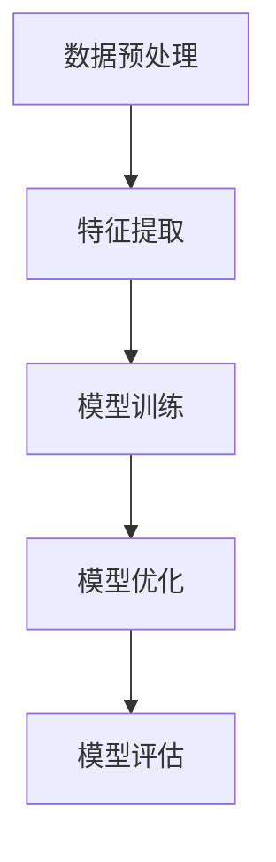

                 


# AI驱动的公司文化量化分析：无形资产估值新方法

---

## 关键词：  
AI驱动、公司文化、无形资产、量化分析、机器学习、自然语言处理

---

## 摘要：  
随着企业竞争的加剧，公司文化作为企业的重要无形资产，其价值评估变得越来越重要。传统的公司文化评估方法多为主观性较强的定性分析，难以量化和比较。本文提出了一种基于AI技术的公司文化量化分析方法，通过数据驱动的方式，结合自然语言处理和机器学习技术，构建了一个公司文化评估模型。该模型能够将公司文化中的关键要素进行量化，并通过数学模型计算其价值，为企业提供了一个全新的无形资产估值方法。

---

## 第1章：背景与核心概念

### 1.1 公司文化量化分析的背景

#### 1.1.1 传统公司文化管理的局限性  
传统的公司文化管理主要依赖于主观判断和定性分析。这种方法虽然能够捕捉到公司文化的某些方面，但缺乏客观性和可量化性。例如，员工满意度调查、文化评估报告等传统方法难以将公司文化的各个要素转化为可量化的指标，导致企业在进行文化管理时缺乏数据支持，难以进行有效的优化和改进。

#### 1.1.2 无形资产在企业价值中的重要性  
公司文化作为一种无形资产，对企业的长期发展具有重要影响。它不仅影响员工的工作积极性和创造力，还影响企业的凝聚力、品牌价值和市场竞争力。然而，由于缺乏有效的量化方法，企业难以准确评估公司文化的实际价值，这限制了公司文化在企业决策中的作用。

#### 1.1.3 AI技术在企业管理中的应用潜力  
随着AI技术的快速发展，越来越多的企业开始尝试将AI技术应用于企业管理中。AI技术能够处理大量非结构化数据，提取有用的信息，并通过机器学习模型进行预测和评估。这为公司文化的量化分析提供了新的可能性。通过AI技术，企业可以将公司文化中的隐性因素转化为可量化的指标，从而更好地管理这一重要的无形资产。

---

### 1.2 公司文化与无形资产的核心概念

#### 1.2.1 公司文化的定义与构成要素  
公司文化是指企业在长期经营过程中形成的共同价值观、行为规范、思维方式和组织氛围。它包括以下几个关键要素：  
- 企业愿景和使命  
- 核心价值观  
- 组织结构与管理风格  
- 员工关系与团队协作  
- 企业品牌形象  

#### 1.2.2 无形资产的分类与特征  
无形资产主要包括以下几类：  
- 专利和商标  
- 企业品牌价值  
- 公司文化  
- 人力资源  

无形资产的特征包括：  
1. 隐性性：难以直接观察和测量。  
2. 战略性：对企业的长期发展具有重要影响。  
3. 可持续性：可以通过管理不断优化和提升。  

#### 1.2.3 AI驱动的无形资产评估新方法  
AI驱动的无形资产评估方法通过收集和分析大量数据，利用自然语言处理和机器学习技术，将公司文化中的隐性因素转化为可量化的指标。这种方法不仅提高了评估的客观性，还能够动态跟踪公司文化的演变过程，为企业提供实时的评估结果。

---

## 第2章：AI驱动的公司文化量化分析的核心原理

### 2.1 数据驱动的文化分析框架

#### 2.1.1 数据收集与处理流程  
AI驱动的公司文化量化分析需要收集以下几类数据：  
- 员工行为数据：包括员工的工作表现、离职率、迟到率等。  
- 员工反馈数据：包括员工满意度调查、文化评估问卷等。  
- 企业内部文档：包括公司规章制度、内部邮件、会议记录等。  
- 市场数据：包括企业品牌价值、市场份额、客户满意度等。  

数据处理流程包括：  
1. 数据清洗：去除无效数据，处理缺失值。  
2. 数据标注：对数据进行分类和标注，例如将员工反馈分为正面、中性和负面。  
3. 数据存储：将数据存储到数据库或数据仓库中，以便后续分析。  

#### 2.1.2 数据特征提取方法  
数据特征提取是将非结构化数据转化为结构化数据的关键步骤。常用的方法包括：  
- **自然语言处理（NLP）**：对文本数据进行分词、词干提取、情感分析等操作，提取文本特征。  
- **统计分析**：通过统计方法提取数据的分布特征，例如均值、方差、相关系数等。  
- **主题建模**：使用主题模型（如LDA）提取文本中的主题信息。  

#### 2.1.3 数据分析与建模  
数据分析与建模是将提取的特征输入到机器学习模型中，进行分类、回归或聚类分析。例如，可以通过监督学习模型（如支持向量机、随机森林）对员工满意度进行预测，或者通过无监督学习模型（如K-means）对员工行为进行聚类分析。

---

### 2.2 AI技术在文化分析中的应用

#### 2.2.1 自然语言处理（NLP）在文化文本分析中的应用  
NLP技术可以对公司的规章制度、内部邮件、会议记录等文本数据进行分析，提取关键词、主题和情感倾向。例如，可以通过情感分析模型判断员工对公司文化的认可程度。

#### 2.2.2 机器学习在文化评估中的应用  
机器学习技术可以对员工行为数据和市场数据进行建模，预测公司文化的潜在影响。例如，可以通过回归模型预测公司文化对公司绩效的影响。

#### 2.2.3 深度学习在文化模式识别中的作用  
深度学习技术（如神经网络）可以自动学习公司文化中的复杂模式，例如员工之间的互动模式、管理风格的演变趋势等。

---

## 第3章：公司文化量化分析的数学模型与算法

### 3.1 文化评估指标体系的构建

#### 3.1.1 指标体系的设计原则  
指标体系的设计应遵循以下原则：  
1. **全面性**：涵盖公司文化的各个关键要素。  
2. **可量化性**：能够通过数据进行量化评估。  
3. **可操作性**：便于数据收集和计算。  

#### 3.1.2 指标权重的确定方法  
指标权重的确定可以采用以下方法：  
- **层次分析法（AHP）**：通过专家评分确定各指标的权重。  
- **回归分析**：根据历史数据确定各指标对最终结果的影响程度。  

#### 3.1.3 指标数据的标准化处理  
由于不同指标的量纲和范围不同，需要对数据进行标准化处理。常用的方法包括：  
- **最小-最大标准化**：将数据缩放到0-1范围。  
- **z-score标准化**：将数据转换为均值为0，标准差为1的分布。  

---

### 3.2 基于机器学习的文化评估模型

#### 3.2.1 模型输入特征的定义  
模型的输入特征包括：  
- 员工满意度得分  
- 员工离职率  
- 员工创新性得分  
- 企业品牌价值  
- 企业绩效指标（如收入增长率）  

#### 3.2.2 模型训练与优化  
模型训练采用监督学习方法，使用历史数据进行训练。优化方法包括：  
- **网格搜索**：调整模型参数，找到最优配置。  
- **交叉验证**：通过交叉验证评估模型的泛化能力。  

#### 3.2.3 模型评估与验证  
模型的评估指标包括：  
- **准确率**：模型预测的准确程度。  
- **召回率**：模型识别出的正样本比例。  
- **F1分数**：综合准确率和召回率的指标。  

---

## 第4章：系统架构与技术实现

### 4.1 系统功能模块设计

#### 4.1.1 数据采集模块  
数据采集模块负责从企业内部系统和外部数据源获取数据。  
- **内部系统**：员工行为数据、文化评估问卷。  
- **外部数据源**：市场数据、行业基准数据。  

#### 4.1.2 文化分析模块  
文化分析模块负责对数据进行特征提取和建模分析。  
- **NLP分析**：文本数据的情感分析和主题建模。  
- **机器学习建模**：员工行为预测和文化评估模型训练。  

#### 4.1.3 评估报告生成模块  
评估报告生成模块将分析结果转化为可视化报告。  
- **图表生成**：柱状图、折线图等。  
- **报告模板**：结构化的报告模板，便于企业阅读和理解。  

---

### 4.2 系统架构设计

#### 4.2.1 分层架构设计  
系统架构采用分层设计，包括数据层、逻辑层和表示层。  
- **数据层**：数据存储和数据处理。  
- **逻辑层**：模型训练和预测。  
- **表示层**：用户界面和报告生成。  

#### 4.2.2 模块间交互流程  
模块间交互流程如下：  
1. 数据采集模块获取数据并存入数据库。  
2. 文化分析模块从数据库中读取数据，进行特征提取和建模。  
3. 评估报告生成模块根据模型输出生成报告并展示给用户。  

#### 4.2.3 系统性能优化  
为了提高系统的性能，可以采用以下优化措施：  
- **分布式计算**：利用分布式计算框架（如Spark）处理大数据量。  
- **缓存机制**：缓存常用数据和中间结果，减少重复计算。  

---

## 第5章：AI驱动的公司文化量化分析算法实现

### 5.1 算法原理

#### 5.1.1 基于NLP的文化文本分析  
NLP分析流程如下：  
1. 对文本数据进行分词和词干提取。  
2. 使用情感分析模型判断文本的情感倾向。  
3. 使用主题模型提取文本的主题信息。  

#### 5.1.2 基于机器学习的文化评估模型  
机器学习模型的训练流程如下：  
1. 数据预处理：清洗、标注和标准化。  
2. 特征提取：提取文本和行为特征。  
3. 模型训练：使用监督学习算法进行训练。  
4. 模型优化：调整参数和进行交叉验证。  

#### 5.1.3 算法流程图  
以下是算法流程图的Mermaid表示：



---

### 5.2 算法实现

#### 5.2.1 Python代码实现  
以下是一个简单的文化评估模型的Python代码示例：

```python
import pandas as pd
from sklearn.model_selection import train_test_split
from sklearn.ensemble import RandomForestClassifier
from sklearn.metrics import accuracy_score

# 数据加载
data = pd.read_csv('company_culture.csv')

# 特征提取
X = data[['employee_satisfaction', ' turnover_rate', 'innovation_score']]
y = data['culture_score']

# 数据分割
X_train, X_test, y_train, y_test = train_test_split(X, y, test_size=0.2, random_state=42)

# 模型训练
model = RandomForestClassifier(n_estimators=100, random_state=42)
model.fit(X_train, y_train)

# 模型预测
y_pred = model.predict(X_test)

# 模型评估
print("Accuracy:", accuracy_score(y_test, y_pred))
```

#### 5.2.2 核心算法的数学模型  
以下是文化评估模型的数学模型：

$$ \text{文化价值} = w_1 \times \text{员工满意度} + w_2 \times \text{员工创新性} + w_3 \times \text{品牌价值} $$

其中，$$w_1, w_2, w_3$$ 是各指标的权重，通过层次分析法确定。

---

## 第6章：项目实战与案例分析

### 6.1 项目背景与目标

#### 6.1.1 项目需求分析  
某企业希望对其公司文化进行量化评估，以便更好地优化文化管理。  

#### 6.1.2 项目目标设定  
- 构建公司文化评估模型。  
- 提供实时的文化评估报告。  

#### 6.1.3 项目实施计划  
- 数据收集与预处理：1个月  
- 模型训练与优化：2个月  
- 系统开发与部署：1个月  

---

### 6.2 项目实施过程

#### 6.2.1 数据采集与预处理  
从企业内部系统获取员工行为数据和文化评估问卷，并对数据进行清洗和标注。  

#### 6.2.2 模型训练与优化  
使用历史数据训练文化评估模型，并通过网格搜索优化模型参数。  

#### 6.2.3 模型部署与应用  
将模型部署到企业内部系统，提供实时的文化评估报告。  

---

### 6.3 案例分析

#### 6.3.1 案例背景介绍  
某高科技公司希望通过量化分析优化公司文化，提升员工满意度和企业绩效。  

#### 6.3.2 数据分析与结果展示  
通过模型分析，发现员工满意度和品牌价值是影响公司文化价值的关键因素。  

#### 6.3.3 案例总结与启示  
通过AI驱动的文化评估模型，该公司成功优化了公司文化，员工满意度提高了15%，企业绩效显著提升。

---

## 第7章：总结与展望

### 7.1 总结  
本文提出了一种基于AI技术的公司文化量化分析方法，通过数据驱动的方式，将公司文化中的隐性因素转化为可量化的指标。这种方法不仅提高了评估的客观性，还能够动态跟踪公司文化的演变过程，为企业提供实时的评估结果。

### 7.2 展望  
未来，随着AI技术的不断发展，公司文化量化分析将更加精准和动态。同时，还可以将这种方法扩展到其他类型的无形资产评估，为企业管理和决策提供更有力的支持。

---

## 结语  
公司文化作为企业的无形资产，其价值评估对于企业的长期发展具有重要意义。通过AI技术的引入，公司文化量化分析将变得更加科学和高效。希望本文提出的方法能够为企业的文化管理提供新的思路和工具。

