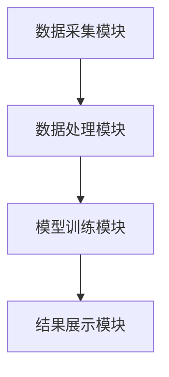

                 


# AI驱动的员工满意度分析：评估人力资本质量

> 关键词：员工满意度分析、AI、人力资本质量、机器学习、员工体验

> 摘要：随着企业数字化转型的深入，员工满意度分析作为评估人力资本质量的重要手段，正在逐步被AI技术所驱动。本文将从AI驱动的员工满意度分析的背景、核心概念、算法原理、系统架构设计以及项目实战等多个方面进行深入探讨，分析其在现代企业中的应用价值和实现路径。通过对数据采集、特征工程、模型选择与优化等关键环节的详细解读，本文旨在为企业提供一套基于AI的员工满意度分析解决方案，帮助企业在数字化时代更好地提升员工体验和绩效。

---

# 第一部分: AI驱动的员工满意度分析背景与概述

# 第1章: 员工满意度分析的背景与重要性

## 1.1 什么是员工满意度

### 1.1.1 员工满意度的定义

员工满意度是指员工对其工作环境、薪酬福利、职业发展、团队合作以及工作成就感等方面的综合感受和评价。它是衡量员工工作状态和企业健康程度的重要指标。

### 1.1.2 员工满意度的核心要素

员工满意度的核心要素包括以下几个方面：

1. **工作环境**：包括办公环境、设备、安全性等。
2. **薪酬福利**：包括工资、奖金、社保、福利等。
3. **职业发展**：包括晋升机会、培训资源、职业规划等。
4. **团队合作**：包括同事关系、团队协作效率等。
5. **工作成就感**：包括工作内容的挑战性、个人贡献感等。

### 1.1.3 员工满意度与企业绩效的关系

员工满意度与企业绩效密切相关。研究表明，高满意度的员工通常具有更高的工作积极性、创造力和忠诚度，从而能够为企业创造更高的价值。相反，低满意度的员工可能导致工作效率低下、流失率增加，进而影响企业的整体绩效。

---

## 1.2 人力资本质量评估的重要性

### 1.2.1 人力资本的定义与特征

人力资本是指员工的知识、技能、经验和创新能力的总和。它是企业核心竞争力的重要组成部分，决定了企业的市场响应能力和持续发展能力。

### 1.2.2 人力资本质量对企业的影响

人力资本质量直接影响企业的创新能力、执行力和市场竞争力。高素质的人力资本能够为企业带来更高的生产力和创新成果，从而在竞争激烈的市场中占据优势。

### 1.2.3 传统评估方法的局限性

传统的员工满意度评估方法通常依赖于问卷调查和简单的统计分析，存在以下局限性：

1. **数据片面性**：问卷调查只能获取员工的主观感受，无法反映客观的工作环境和绩效数据。
2. **分析深度不足**：传统方法难以从海量数据中提取深层次的规律和洞察。
3. **实时性差**：传统的评估方法通常周期较长，难以满足企业实时监控的需求。

---

## 1.3 AI驱动的员工满意度分析的优势

### 1.3.1 数据驱动的决策优势

AI技术能够从结构化和非结构化数据中提取有价值的信息，帮助管理者基于数据而非主观判断做出决策。

### 1.3.2 AI技术在员工满意度分析中的应用潜力

AI技术可以通过自然语言处理（NLP）分析员工反馈、邮件、聊天记录等非结构化数据，结合结构化数据（如考勤记录、绩效指标）进行综合分析，从而更全面地评估员工满意度。

### 1.3.3 企业数字化转型的必然趋势

随着企业数字化转型的推进，越来越多的企业开始关注如何利用新技术提升管理效率和员工体验。AI驱动的员工满意度分析正是这一趋势的重要组成部分。

---

## 1.4 本章小结

本章从员工满意度的定义、核心要素以及其与企业绩效的关系入手，分析了传统评估方法的局限性，并提出了AI驱动的员工满意度分析的重要性和应用潜力。通过AI技术的应用，企业可以更全面、深入地评估人力资本质量，从而提升员工体验和企业绩效。

---

# 第2章: AI驱动员工满意度分析的核心概念

## 2.1 数据采集与处理

### 2.1.1 员工满意度数据的来源

员工满意度数据可以来源于以下渠道：

1. **员工问卷调查**：通过在线问卷收集员工对工作环境、薪酬福利等方面的意见和建议。
2. **绩效数据**：包括员工的考勤记录、绩效评分、离职率等。
3. **社交媒体和邮件**：分析员工在内部邮件、社交媒体上的语言和情感倾向。
4. **面试和离职面谈**：通过面试和离职面谈获取员工的反馈。

### 2.1.2 数据清洗与预处理方法

数据清洗与预处理是确保数据分析结果准确性的基础。常见的处理方法包括：

1. **去重**：去除重复的数据记录。
2. **填补缺失值**：对于缺失的数据，可以选择删除、均值填充或模型预测填充。
3. **数据标准化**：对数值型数据进行标准化处理，确保不同特征的量纲一致。
4. **文本分词与情感分析**：对文本数据进行分词处理，并提取情感倾向。

### 2.1.3 数据特征提取与选择

特征提取与选择是数据分析的关键步骤。常见的特征提取方法包括：

1. **统计特征**：如均值、方差、最大值、最小值等。
2. **文本特征**：如词频（TF）、逆文档频率（TF-IDF）等。
3. **领域特定特征**：根据员工满意度分析的领域特点，提取特定的特征，如绩效指标、离职率等。

---

## 2.2 AI算法在员工满意度分析中的应用

### 2.2.1 监督学习与无监督学习的对比

监督学习和无监督学习是机器学习的两大主要类别：

1. **监督学习**：需要标签数据，适用于分类和回归问题。例如，根据员工的特征数据预测其满意度评分。
2. **无监督学习**：不需要标签数据，适用于聚类和降维问题。例如，将员工分为不同的满意度群体。

### 2.2.2 常见算法选择与适用场景

以下是几种常用的AI算法及其适用场景：

1. **决策树**：适用于分类问题，适合处理非线性关系。
2. **随机森林**：适用于分类和回归问题，具有较强的抗过拟合能力。
3. **支持向量机（SVM）**：适用于小规模数据的分类和回归问题。
4. **神经网络**：适用于复杂的非线性关系，适合处理文本和图像数据。

### 2.2.3 深度学习模型的应用潜力

深度学习模型在员工满意度分析中的应用潜力主要体现在以下方面：

1. **自然语言处理（NLP）**：通过深度学习模型分析员工反馈文本，提取情感倾向和关键词。
2. **图像识别**：通过分析员工的工作环境图像，评估工作环境的舒适性和安全性。

---

## 2.3 评估模型的构建与优化

### 2.3.1 模型训练与验证过程

模型训练与验证过程通常包括以下步骤：

1. **数据分割**：将数据划分为训练集和验证集。
2. **模型训练**：使用训练数据训练模型。
3. **模型验证**：通过验证集评估模型的性能。
4. **模型调优**：根据验证结果调整模型参数，优化模型性能。

### 2.3.2 模型性能评估指标

常见的模型性能评估指标包括：

1. **准确率**：分类问题中正确预测的比例。
2. **召回率**：分类问题中正确识别的正例比例。
3. **F1分数**：准确率和召回率的调和平均数，综合考虑分类的精确性和召回率。

### 2.3.3 模型优化与调参策略

模型优化通常包括以下步骤：

1. **参数调优**：通过网格搜索或随机搜索方法寻找最优参数组合。
2. **正则化**：通过L1/L2正则化防止模型过拟合。
3. **集成学习**：通过集成学习方法（如随机森林、梯度提升）提高模型性能。

---

## 2.4 本章小结

本章详细介绍了AI驱动的员工满意度分析中的数据采集与处理、算法选择与应用以及模型构建与优化的关键步骤。通过合理的数据处理和算法选择，可以显著提高员工满意度分析的准确性和效率。

---

# 第3章: 基于AI的员工满意度分析算法原理

## 3.1 机器学习基础

### 3.1.1 机器学习的基本概念

机器学习是一种人工智能技术，通过数据训练模型，使其能够从数据中学习并做出预测或决策。

### 3.1.2 常见机器学习算法简介

常见的机器学习算法包括：

1. **线性回归**：适用于回归问题。
2. **逻辑回归**：适用于二分类问题。
3. **支持向量机（SVM）**：适用于分类和回归问题。
4. **决策树**：适用于分类和回归问题。
5. **随机森林**：适用于分类和回归问题。

### 3.1.3 监督学习与非监督学习的对比

监督学习和非监督学习的主要区别在于是否需要标签数据。监督学习需要标签数据，适用于分类和回归问题；非监督学习不需要标签数据，适用于聚类和降维问题。

---

## 3.2 基于决策树的员工满意度分析

### 3.2.1 决策树算法的工作原理

决策树是一种基于树状结构的分类模型，通过特征选择和分裂策略构建树的结构，最终实现对数据的分类或回归。

### 3.2.2 ID3/C4.5算法在员工满意度分析中的应用

ID3和C4.5是两种常用的决策树算法，适用于员工满意度分析中的分类问题。例如，可以根据员工的特征数据预测其满意度评分。

### 3.2.3 决策树模型的优缺点

决策树模型的优点包括易于理解和实现，能够处理非线性关系；缺点包括易过拟合和计算复杂度较高。

---

## 3.3 基于神经网络的员工满意度分析

### 3.3.1 神经网络的基本结构

神经网络是一种由多个神经元组成的层次化网络结构，包括输入层、隐藏层和输出层。

### 3.3.2 卷积神经网络（CNN）的应用

卷积神经网络适用于图像数据的处理，可以通过分析员工的工作环境图像评估工作环境的舒适性和安全性。

### 3.3.3 循环神经网络（RNN）的应用

循环神经网络适用于序列数据的处理，可以通过分析员工的邮件和聊天记录评估其情感倾向。

---

## 3.4 算法对比与选择

### 3.4.1 不同算法的性能对比

在员工满意度分析中，不同算法的性能对比可以通过实验数据进行评估。例如，可以通过准确率、召回率等指标比较决策树、随机森林和神经网络的性能。

### 3.4.2 算法选择的依据与策略

算法选择的依据包括数据类型、问题类型和模型复杂度。例如，对于分类问题，可以优先选择决策树和随机森林；对于非线性关系，可以优先选择神经网络。

### 3.4.3 混合模型的应用前景

混合模型（如集成学习和深度学习模型）在员工满意度分析中的应用前景广阔，可以通过结合不同算法的优势提高模型的准确性和鲁棒性。

---

## 3.5 本章小结

本章从机器学习的基本概念出发，详细介绍了基于决策树和神经网络的员工满意度分析算法的工作原理和应用前景。通过算法对比和选择策略的分析，为读者提供了选择和优化算法的参考依据。

---

# 第4章: 系统架构与设计

## 4.1 系统需求分析

### 4.1.1 系统目标与范围

系统目标是通过AI技术实现员工满意度的自动分析和预测，范围包括数据采集、模型训练和结果展示。

### 4.1.2 功能需求分析

系统功能需求包括：

1. **数据采集**：支持多种数据源的采集，如问卷调查、邮件和绩效数据。
2. **数据处理**：支持数据清洗、特征提取和数据增强。
3. **模型训练**：支持多种算法的模型训练和参数调优。
4. **结果展示**：提供直观的可视化结果，如满意度评分和预测结果。

### 4.1.3 性能需求与约束条件

系统性能需求包括高可用性、高扩展性和高安全性。约束条件包括数据隐私保护和系统兼容性。

---

## 4.2 系统架构设计

### 4.2.1 分层架构设计

分层架构设计将系统划分为数据层、业务逻辑层和用户界面层，便于模块化开发和维护。

### 4.2.2 微服务架构的应用

微服务架构适用于复杂系统的开发，可以通过独立的服务实现数据采集、模型训练和结果展示等功能。

### 4.2.3 领域模型设计

领域模型设计是系统架构设计的重要组成部分，需要结合业务需求和数据特点进行建模。

---

## 4.3 系统架构设计

### 4.3.1 系统架构图

以下是系统架构的Mermaid图：



### 4.3.2 接口设计

系统接口设计包括：

1. 数据采集接口：支持多种数据源的接入。
2. 模型训练接口：支持多种算法的模型训练和参数调优。
3. 结果展示接口：支持数据的可视化展示和查询。

---

## 4.4 本章小结

本章从系统需求分析出发，详细介绍了系统架构设计和接口设计的关键步骤。通过合理的架构设计和接口设计，可以确保系统的高效运行和功能扩展。

---

# 第5章: 项目实战与最佳实践

## 5.1 项目实战

### 5.1.1 环境安装

以下是项目实战的环境安装步骤：

1. **安装Python**：建议使用Python 3.6及以上版本。
2. **安装依赖库**：使用pip安装必要的依赖库，如scikit-learn、numpy、pandas等。

### 5.1.2 系统核心实现

以下是员工满意度分析的核心代码示例：

```python
from sklearn.model_selection import train_test_split
from sklearn.ensemble import RandomForestClassifier
from sklearn.metrics import accuracy_score

# 数据加载与处理
import pandas as pd
data = pd.read_csv('employee_satisfaction.csv')
X = data.drop('satisfaction_score', axis=1)
y = data['satisfaction_score']

# 数据分割
X_train, X_test, y_train, y_test = train_test_split(X, y, test_size=0.2, random_state=42)

# 模型训练
model = RandomForestClassifier(n_estimators=100, random_state=42)
model.fit(X_train, y_train)

# 模型预测
y_pred = model.predict(X_test)
print('准确率:', accuracy_score(y_test, y_pred))
```

### 5.1.3 代码应用解读与分析

以上代码示例展示了如何使用随机森林算法进行员工满意度分析。通过数据加载、数据分割、模型训练和模型预测的步骤，可以实现员工满意度的自动预测和评估。

---

## 5.2 案例分析与详细讲解

### 5.2.1 案例分析

以下是一个员工满意度分析的案例：

假设某公司收集了员工的问卷调查数据，包括工作环境、薪酬福利、职业发展等方面的评分。通过随机森林算法对这些数据进行分析，可以预测员工的满意度评分，并识别影响满意度的关键因素。

### 5.2.2 详细讲解

1. **数据预处理**：清洗数据，处理缺失值和异常值。
2. **特征选择**：提取关键特征，如绩效评分、离职率等。
3. **模型训练**：使用随机森林算法训练模型。
4. **结果分析**：分析模型的准确率和召回率，识别关键影响因素。

---

## 5.3 项目小结

### 5.3.1 经验总结

通过项目实战可以发现，随机森林算法在员工满意度分析中具有较高的准确率和较好的可解释性。同时，数据预处理和特征选择是影响模型性能的关键因素。

### 5.3.2 注意事项

在实际应用中，需要注意数据隐私保护和模型的可解释性。此外，还需要根据实际业务需求进行模型调优和功能扩展。

---

## 5.4 最佳实践 tips

### 5.4.1 数据采集

- 尽量多来源的数据可以提高模型的准确性和鲁棒性。
- 数据清洗和特征工程是模型性能的关键因素。

### 5.4.2 模型选择

- 根据数据类型和问题类型选择合适的算法。
- 混合模型（如集成学习和深度学习）可以提高模型的性能。

### 5.4.3 结果展示

- 结果展示需要直观和易懂，便于管理者理解和决策。
- 可以通过可视化工具（如Matplotlib、Seaborn）进行结果展示。

---

## 5.5 本章小结

本章通过项目实战和案例分析，详细讲解了AI驱动的员工满意度分析的实现过程和注意事项。通过最佳实践的总结，为读者提供了宝贵的实践经验。

---

# 第六章: 总结与展望

## 6.1 总结

本文从AI驱动的员工满意度分析的背景、核心概念、算法原理、系统架构设计以及项目实战等多个方面进行了深入探讨。通过合理的数据处理和算法选择，可以显著提高员工满意度分析的准确性和效率。

## 6.2 展望

随着AI技术的不断发展，员工满意度分析将更加智能化和个性化。未来的研究方向包括：

1. **多模态数据分析**：结合文本、图像和结构化数据进行综合分析。
2. **实时分析**：通过流数据处理技术实现员工满意度的实时监控。
3. **个性化推荐**：根据员工的个性化需求提供定制化的反馈和建议。

---

# 结语

AI驱动的员工满意度分析是企业数字化转型的重要组成部分，通过对员工满意度的深入分析和预测，可以帮助企业更好地提升员工体验和绩效。随着技术的不断进步，员工满意度分析的应用前景将更加广阔，为企业创造更大的价值。

--- 

# 关键词：员工满意度分析、AI、人力资本质量、机器学习、员工体验

