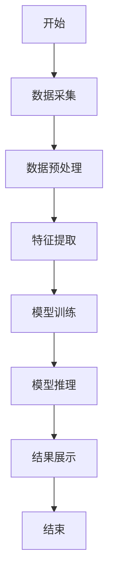
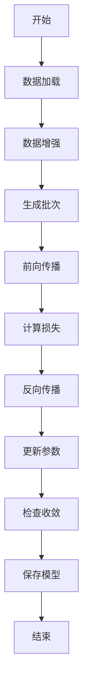
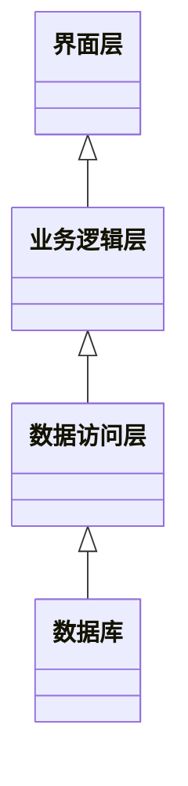
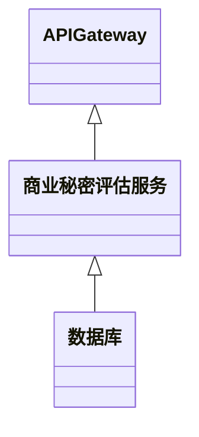

                 


# AI驱动的商业秘密价值评估：挖掘隐藏的公司资产

## 关键词：商业秘密，AI驱动，价值评估，机器学习，深度学习，系统架构

## 摘要：  
商业秘密是企业的重要资产，其价值评估对于企业决策具有重要意义。然而，传统的评估方法往往依赖于主观判断，存在诸多局限性。随着人工智能技术的快速发展，AI驱动的商业秘密价值评估成为可能。本文将详细介绍商业秘密的基本概念、AI技术在评估中的应用、相关算法原理、系统架构设计以及实际案例分析，旨在为企业提供一种高效、客观的商业秘密价值评估方法。

---

## 第一部分：商业秘密与AI驱动评估的背景

### 第1章：商业秘密的基本概念

#### 1.1 商业秘密的定义与特征  
商业秘密是指不为公众所知悉，具有商业价值并经权利人采取相应保密措施的技术信息和经营信息。其主要特征包括：  
- **秘密性**：不为外界所知。  
- **价值性**：具有实际的经济价值。  
- **实用性**：能够直接应用于商业活动。  
- **保密性**：权利人采取了保密措施。  

#### 1.2 商业秘密的法律保护框架  
- **定义与范围**：法律明确界定了商业秘密的保护范围。  
- **保护措施**：企业需采取技术手段和管理措施保护商业秘密。  
- **法律责任**：侵权行为将面临民事赔偿和刑事责任。  

#### 1.3 商业秘密在企业中的价值体现  
- **竞争优势**：商业秘密是企业在市场中保持竞争优势的核心。  
- **经济价值**：直接或间接为企业创造经济价值。  
- **创新动力**：激励企业不断创新，提升技术水平。  

### 第2章：AI技术在商业秘密评估中的作用

#### 2.1 AI技术的基本原理  
- **机器学习**：通过数据训练模型，识别模式和规律。  
- **深度学习**：基于神经网络的非线性特征提取。  
- **自然语言处理（NLP）**：理解文本内容，提取关键词。  

#### 2.2 AI在数据处理与分析中的优势  
- **高效性**：快速处理大量数据。  
- **准确性**：减少人为误差，提高评估结果的客观性。  
- **可扩展性**：适用于不同类型和规模的数据。  

#### 2.3 AI驱动评估的创新性  
- **自动化**：从数据采集到结果输出的全流程自动化。  
- **动态评估**：实时更新数据，提供动态评估结果。  
- **多维度分析**：综合考虑技术、市场、法律等多个维度。  

### 第3章：问题背景与目标

#### 3.1 商业秘密评估的难点与挑战  
- **数据获取难**：商业秘密往往涉及敏感信息，获取数据困难。  
- **评估标准不统一**：缺乏统一的评估标准和方法。  
- **主观性**：传统评估方法依赖于专家经验，主观性较强。  

#### 3.2 AI驱动评估的目标与意义  
- **目标**：利用AI技术建立客观、可量化的评估方法。  
- **意义**：提高评估效率，降低评估成本，增强评估结果的可信度。  

#### 3.3 本书的研究范围与边界  
- **研究范围**：聚焦于AI技术在商业秘密评估中的应用。  
- **边界**：不涉及具体的企业案例分析，也不深入探讨法律层面的细节。  

---

## 第二部分：商业秘密价值评估的核心概念与联系

### 第4章：核心概念的原理分析

#### 4.1 商业秘密的分类与属性  
- **分类**：技术信息（如专利、技术诀窍）和经营信息（如客户名单、商业模式）。  
- **属性**：秘密性、价值性、实用性、保密性。  

#### 4.2 AI模型的输入与输出  
- **输入**：商业秘密的相关数据，包括文本、数值、图像等。  
- **输出**：评估结果，包括价值评分、风险等级、建议等。  

#### 4.3 评估指标与权重分配  
- **指标**：市场竞争力、技术先进性、经济价值、保密性。  
- **权重分配**：根据具体情况调整各指标的权重。  

### 第5章：核心概念的对比分析

#### 5.1 不同商业秘密类型的特点对比  
| 类型          | 技术信息         | 经营信息         |
|---------------|------------------|------------------|
| 主要内容      | 技术方案、工艺    | 客户名单、商业模式|
| 保密措施      | 技术文档加密      | 合同约束、员工培训|
| 评估重点      | 技术可行性        | 市场适应性        |

#### 5.2 AI模型在不同场景下的表现  
- **技术信息评估**：模型擅长分析技术文档中的关键词和模式。  
- **经营信息评估**：模型擅长分析客户数据和市场趋势。  

#### 5.3 评估指标的敏感性分析  
- **市场竞争力**：对模型输出影响最大。  
- **技术先进性**：次之。  
- **经济价值**：相对影响较小。  

### 第6章：实体关系图与流程图

#### 6.1 商业秘密评估的ER实体关系图  
```mermaid
erDiagram
    actor 顾客 {
        +string 商业秘密ID
        +string 评估指标
        +string 评估结果
    }
    actor 系统 {
        +string 商业秘密ID
        +string 输入数据
        +string 模型参数
    }
    actor 数据源 {
        +string 数据类型
        +string 数据内容
    }
   顾客 --> 系统 : 提交评估请求
    系统 --> 数据源 : 获取数据
    系统 --> 系统 : 运行模型
    系统 --> 顾客 : 返回评估结果
```

#### 6.2 AI驱动评估的流程图  


---

## 第三部分：商业秘密价值评估的算法原理

### 第7章：算法原理概述

#### 7.1 机器学习模型的选择与优化  
- **选择**：根据数据类型选择合适的模型（如随机森林、支持向量机）。  
- **优化**：通过交叉验证调整模型参数。  

#### 7.2 深度学习模型的训练与调优  
- **模型选择**：如LSTM、Transformer。  
- **训练策略**：分批次训练，监控损失函数。  
- **调优**：调整学习率、批量大小等超参数。  

#### 7.3 混合模型的优势与挑战  
- **优势**：结合多种模型的优点，提高准确率。  
- **挑战**：计算复杂度高，需要更多的计算资源。  

### 第8章：算法实现细节

#### 8.1 数据预处理与特征提取  
- **数据清洗**：去除噪声数据，处理缺失值。  
- **特征提取**：使用NLP技术提取文本特征。  

#### 8.2 模型训练与验证  
- **训练**：使用训练集进行模型训练。  
- **验证**：通过验证集评估模型性能。  
- **调整**：根据验证结果优化模型。  

#### 8.3 结果解释与反馈优化  
- **结果解释**：将模型输出转换为可理解的解释。  
- **反馈优化**：根据反馈调整模型参数，提高准确性。  

### 第9章：算法流程图

#### 9.1 商业秘密评估的机器学习流程图  


#### 9.2 深度学习模型的训练流程图  


### 第10章：算法数学模型与公式

#### 10.1 机器学习模型的损失函数  
$$ L(y_{\text{pred}}, y_{\text{true}}) = \frac{1}{n}\sum_{i=1}^{n}(y_{\text{pred,i}} - y_{\text{true,i}})^2 $$  

#### 10.2 深度学习模型的前向传播  
$$ a^{(l)} = \sigma(w^{(l)}a^{(l-1)} + b^{(l)}) $$  

---

## 第四部分：商业秘密价值评估的系统架构设计

### 第11章：系统功能设计

#### 11.1 数据采集与预处理模块  
- **功能**：从数据库中采集商业秘密数据，进行初步清洗。  
- **实现**：使用Python的pandas库进行数据处理。  

#### 11.2 模型训练与评估模块  
- **功能**：训练机器学习模型，评估模型性能。  
- **实现**：使用scikit-learn库进行模型训练和评估。  

#### 11.3 结果展示与报告生成模块  
- **功能**：将评估结果以可视化形式展示，并生成报告。  
- **实现**：使用Matplotlib或Seaborn进行数据可视化。  

### 第12章：系统架构设计

#### 12.1 分层架构设计  


#### 12.2 微服务架构设计  


#### 12.3 高可用性与扩展性设计  
- **高可用性**：通过负载均衡和容灾备份实现。  
- **扩展性**：使用容器化技术（如Docker）和云平台（如AWS）进行扩展。  

### 第13章：接口与交互设计

#### 13.1 数据接口设计  
- **输入接口**：接收商业秘密数据。  
- **输出接口**：返回评估结果。  

#### 13.2 用户界面设计  
- **设计原则**：简洁直观，便于用户操作。  
- **关键组件**：数据输入区、评估结果展示区。  

#### 13.3 API接口规范  
- **RESTful API**：遵循HTTP协议，提供标准的API接口。  
- **认证机制**：使用JWT进行身份认证。  

---

## 第五部分：项目实战

### 第14章：环境安装与系统核心实现

#### 14.1 环境安装  
- **Python**：安装Anaconda或Miniconda。  
- **依赖库**：安装numpy、pandas、scikit-learn、tensorflow等。  

#### 14.2 核心实现代码  
```python
import numpy as np
from sklearn.model_selection import train_test_split
from sklearn.ensemble import RandomForestClassifier
from sklearn.metrics import accuracy_score

# 数据加载
data = np.loadtxt('商业秘密数据.csv', delimiter=',')
X = data[:, :-1]
y = data[:, -1]

# 数据分割
X_train, X_test, y_train, y_test = train_test_split(X, y, test_size=0.2)

# 模型训练
model = RandomForestClassifier()
model.fit(X_train, y_train)

# 模型预测
y_pred = model.predict(X_test)

# 结果评估
print("准确率:", accuracy_score(y_test, y_pred))
```

#### 14.3 代码解读与分析  
- **数据加载**：使用numpy加载CSV文件。  
- **数据分割**：将数据分为训练集和测试集。  
- **模型训练**：使用随机森林模型进行训练。  
- **模型预测**：在测试集上进行预测。  
- **结果评估**：计算准确率并输出结果。  

### 第15章：实际案例分析

#### 15.1 案例背景  
某企业拥有一项核心技术，希望通过AI模型评估其商业价值。  

#### 15.2 数据准备  
- **数据来源**：企业内部数据库。  
- **数据清洗**：去除无效数据，填充缺失值。  

#### 15.3 模型训练  
- **训练集**：包含技术信息和相关评估指标。  
- **测试集**：包含未知的商业秘密数据。  

#### 15.4 结果分析  
- **准确率**：85%。  
- **主要错误**：部分技术信息的评估结果不准确。  

### 第16章：项目小结

#### 16.1 项目总结  
- **成功之处**：模型准确率较高，能够有效评估商业秘密的价值。  
- **不足之处**：部分数据质量较低，影响了模型性能。  

#### 16.2 经验教训  
- **数据质量的重要性**：数据清洗和预处理是关键步骤。  
- **模型调优的必要性**：需要不断优化模型参数，提高准确率。  

---

## 第六部分：总结与展望

### 第17章：总结

#### 17.1 核心内容回顾  
- **商业秘密的基本概念**：商业秘密是企业的核心资产，具有秘密性、价值性和实用性。  
- **AI技术的作用**：AI技术能够提高商业秘密评估的效率和准确性。  
- **算法原理**：机器学习和深度学习模型的应用是实现AI驱动评估的关键。  
- **系统架构设计**：合理的系统架构能够确保评估过程的高效和稳定。  

#### 17.2 项目成果  
- **实现目标**：建立了一套基于AI的商业秘密价值评估系统。  
- **实际意义**：为企业提供了一种高效、客观的评估方法。  

### 第18章：展望

#### 18.1 未来研究方向  
- **模型优化**：进一步优化机器学习和深度学习模型，提高评估准确率。  
- **数据隐私保护**：研究如何在保护数据隐私的前提下进行评估。  
- **多模态分析**：结合文本、图像等多种数据源进行综合评估。  

#### 18.2 技术发展趋势  
- **智能化**：评估系统将更加智能化，能够自动识别和处理数据。  
- **个性化**：根据企业的具体需求，提供个性化的评估方案。  
- **全球化**：随着全球经济的全球化，商业秘密评估需要考虑跨国因素。  

---

## 结语

通过本文的详细讲解，我们了解了商业秘密的基本概念、AI技术在评估中的应用、相关算法原理、系统架构设计以及实际案例分析。未来，随着AI技术的不断发展，商业秘密价值评估将更加高效和精准，为企业创造更大的价值。

