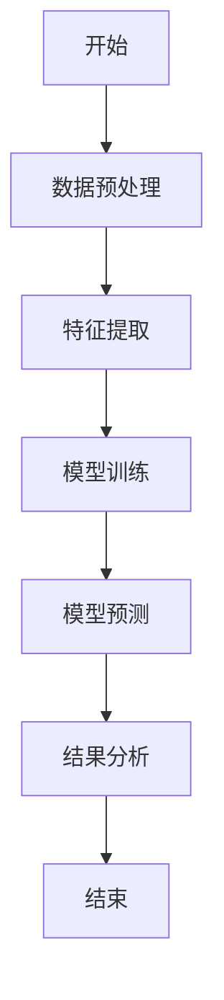
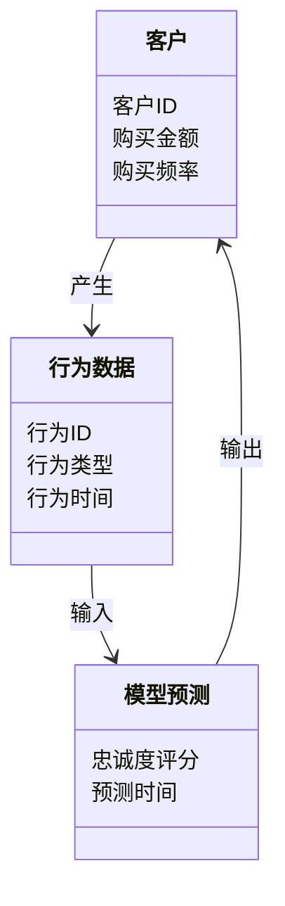
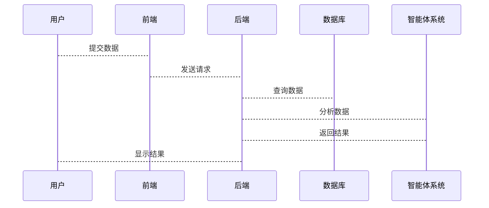

                 


# AI驱动的客户忠诚度分析：价值投资中的多智能体应用

## 关键词：客户忠诚度分析，AI驱动，多智能体系统，价值投资，算法原理

## 摘要：  
本文深入探讨了AI驱动的客户忠诚度分析在价值投资中的多智能体应用。通过系统化的分析和实践，本文详细阐述了客户忠诚度分析的核心概念、算法原理、系统架构以及项目实战。从背景介绍到算法实现，从系统设计到案例分析，本文为读者提供了一个全面的技术视角，帮助读者理解如何利用AI技术提升客户忠诚度分析的效率和精度。

---

# 第一部分: AI驱动的客户忠诚度分析背景与基础

## 第1章: 客户忠诚度分析的背景与问题

### 1.1 客户忠诚度分析的现状
#### 1.1.1 传统客户忠诚度分析方法的局限性
传统客户忠诚度分析方法主要依赖于问卷调查、客户满意度评分等主观指标，这些方法存在以下问题：
- 数据收集成本高，且难以覆盖客户行为的全貌。
- 分析结果缺乏动态性，难以实时反映客户行为变化。
- 难以发现隐含的客户行为模式和潜在价值。

#### 1.1.2 数据驱动时代的客户忠诚度分析新趋势
随着大数据技术的普及和AI技术的发展，客户忠诚度分析进入数据驱动的新阶段：
- 数据来源多样化，包括交易数据、行为数据、社交媒体数据等。
- 分析方法从统计分析向机器学习和深度学习转变。
- 结果应用更加智能化，能够实时指导业务决策。

#### 1.1.3 价值投资中的客户忠诚度分析需求
在价值投资中，客户忠诚度分析的重要性体现在：
- 忠诚客户是企业长期价值的核心来源。
- 通过分析客户忠诚度，可以发现潜在的高价值客户，优化投资策略。
- 多智能体协同分析能够提升客户画像的精准度和预测的准确性。

### 1.2 问题背景与问题描述
#### 1.2.1 什么是客户忠诚度
客户忠诚度是指客户对企业产品或服务的持续购买和使用意愿，通常可以通过客户生命周期、购买频率、购买金额等指标来衡量。

#### 1.2.2 客户忠诚度分析的核心问题
- 如何高效、准确地分析客户行为数据，提取有价值的信息。
- 如何构建多智能体协同系统，实现对客户忠诚度的精准预测。
- 如何将分析结果应用于实际投资决策中，提升企业价值。

#### 1.2.3 价值投资中的客户忠诚度分析目标
在价值投资中，客户忠诚度分析的目标包括：
- 发现高忠诚度客户，优化客户关系管理。
- 预测客户行为变化，提前制定应对策略。
- 提升客户生命周期价值，实现企业长期收益最大化。

### 1.3 问题解决与边界
#### 1.3.1 AI驱动客户忠诚度分析的核心价值
- 提供实时、动态的客户行为分析。
- 通过多智能体协同，提升分析的准确性和效率。
- 支持数据驱动的决策，优化投资策略。

#### 1.3.2 问题解决的边界与外延
- 客户忠诚度分析的边界：基于现有数据，分析客户行为和偏好。
- 外延：通过AI技术，预测客户未来行为，支持投资决策。

#### 1.3.3 核心要素与组成结构
客户忠诚度分析的核心要素包括：
- 数据采集：获取客户行为数据。
- 数据处理：清洗和预处理数据。
- 模型构建：训练客户忠诚度预测模型。
- 结果分析：解读模型输出，指导投资决策。

---

## 第2章: 核心概念与联系

### 2.1 核心概念原理
#### 2.1.1 客户忠诚度分析的定义与属性
客户忠诚度分析通过分析客户行为数据，评估客户对企业产品或服务的忠诚程度。其核心属性包括：
- 客户行为数据：包括购买频率、购买金额、访问时间等。
- 客户画像：基于行为数据构建的客户特征描述。
- 忠诚度预测：通过模型预测客户未来的忠诚度。

#### 2.1.2 多智能体系统的基本原理
多智能体系统由多个协同工作的智能体组成，每个智能体负责特定任务。其基本原理包括：
- 分布式计算：任务分解到多个智能体完成。
- 协同学习：智能体之间共享信息，提升整体性能。
- 自适应优化：根据反馈调整智能体行为。

#### 2.1.3 价值投资中的多智能体应用特点
在价值投资中，多智能体系统的特点包括：
- 高效性：多个智能体协同工作，提升分析效率。
- 精准性：通过智能体协同，提高预测准确度。
- 实时性：支持实时数据处理和分析。

### 2.2 核心概念对比
#### 2.2.1 不同AI模型的特征对比
| AI模型 | 数据类型 | 处理方式 | 预测精度 | 计算复杂度 |
|--------|----------|----------|----------|------------|
| 单智能体 | 结构化数据 | 中央处理 | 中等 | 较高 |
| 多智能体 | 结构化+非结构化数据 | 分布式处理 | 高 | 较低 |

#### 2.2.2 客户行为与模型预测的关联性分析
客户行为数据与忠诚度预测高度相关。通过分析客户的购买频率、金额、时间等行为数据，可以有效预测客户忠诚度。

#### 2.2.3 多智能体与单智能体的性能对比
多智能体系统在处理复杂任务时，性能优于单智能体系统。通过分布式计算和协同学习，多智能体系统能够更高效地完成任务。

### 2.3 实体关系架构
#### 2.3.1 客户-行为-模型的ER实体关系图
```mermaid
erDiagram
    actor 客户 {
        <string> 客户ID
        <string> 购买时间
        <float> 购买金额
        <int> 购买频率
    }
    actor 行为数据 {
        <string> 行为ID
        <string> 行为类型
        <datetime> 行为时间
    }
    actor 模型预测 {
        <int> 忠诚度评分
        <datetime> 预测时间
    }
    客户 --> 行为数据 : 产生
    行为数据 --> 模型预测 : 输入
    模型预测 --> 客户 : 输出
```

---

## 第3章: 算法原理讲解

### 3.1 多智能体协同学习算法
#### 3.1.1 数据预处理与特征提取
数据预处理是关键步骤，包括数据清洗、特征选择和数据增强。特征提取需要从客户行为数据中提取高价值特征，如购买频率、购买金额等。

#### 3.1.2 智能体协同机制的实现
多智能体协同机制包括任务分配、信息共享和协同优化。通过分布式计算和协同学习，多个智能体可以高效完成任务。

#### 3.1.3 算法流程图展示


#### 3.1.4 Python代码示例
```python
import numpy as np
import pandas as pd

# 数据预处理
data = pd.read_csv('customer_behavior.csv')
data = data.dropna()
data = pd.get_dummies(data)

# 特征选择
features = data[['购买频率', '购买金额', '访问时间']]
target = data['忠诚度评分']

# 模型训练
from sklearn.ensemble import RandomForestClassifier
model = RandomForestClassifier()
model.fit(features, target)

# 模型预测
new_customer = pd.DataFrame({'购买频率': [0.8, 0.9], '购买金额': [100, 150], '访问时间': [10, 15]})
predictions = model.predict(new_customer)
```

### 3.2 算法原理的数学模型
#### 3.2.1 协同学习的数学模型
$$
L_i = \sum_{j=1}^{n} w_{ij} \cdot x_j
$$

#### 3.2.2 智能体间通信的数学表达
$$
C_{ij} = \alpha \cdot L_i + (1-\alpha) \cdot L_j
$$

#### 3.2.3 模型训练的优化算法
$$
\theta_{new} = \theta_{old} + \eta \cdot \nabla J(\theta_{old})
$$

### 3.3 算法实现与案例分析
#### 3.3.1 代码实现
```python
import numpy as np
import pandas as pd

# 数据预处理
data = pd.read_csv('customer_behavior.csv')
data = data.dropna()
data = pd.get_dummies(data)

# 特征选择
features = data[['购买频率', '购买金额', '访问时间']]
target = data['忠诚度评分']

# 模型训练
from sklearn.ensemble import RandomForestClassifier
model = RandomForestClassifier()
model.fit(features, target)

# 模型预测
new_customer = pd.DataFrame({'购买频率': [0.8, 0.9], '购买金额': [100, 150], '访问时间': [10, 15]})
predictions = model.predict(new_customer)
```

#### 3.3.2 案例分析与结果解读
通过上述代码实现，我们可以看到模型预测的忠诚度评分。对于新客户，预测结果可以帮助企业制定更精准的客户关系管理策略。

---

## 第4章: 系统分析与架构设计

### 4.1 问题场景分析
#### 4.1.1 客户忠诚度分析的典型场景
- 在线零售：分析客户的购买行为，预测忠诚度。
- 金融服务：评估客户对金融产品的忠诚度，优化投资策略。

#### 4.1.2 价值投资中的系统需求
- 实时数据处理能力。
- 高效的多智能体协同能力。
- 准确的预测能力。

### 4.2 项目介绍
#### 4.2.1 项目背景
通过AI技术提升客户忠诚度分析的效率和精度，支持价值投资决策。

#### 4.2.2 系统功能设计
- 数据采集与处理。
- 模型训练与预测。
- 结果分析与可视化。

#### 4.2.3 领域模型mermaid类图


#### 4.2.4 系统架构设计


#### 4.2.5 系统接口设计
- 前端接口：提供数据输入和结果展示界面。
- 后端接口：处理数据并调用智能体系统。
- 智能体系统接口：负责模型训练和预测。

#### 4.2.6 系统交互mermaid序列图


---

## 第5章: 项目实战

### 5.1 环境安装与配置
#### 5.1.1 环境搭建
- 安装Python和必要的库（如scikit-learn、pandas、numpy）。
- 安装Mermaid工具。

#### 5.1.2 数据集准备
准备客户行为数据集，包括购买频率、购买金额、访问时间等特征。

### 5.2 系统核心实现
#### 5.2.1 数据预处理
```python
import pandas as pd

data = pd.read_csv('customer_behavior.csv')
data = data.dropna()
data = pd.get_dummies(data)
```

#### 5.2.2 特征工程
```python
features = data[['购买频率', '购买金额', '访问时间']]
target = data['忠诚度评分']
```

#### 5.2.3 模型训练与优化
```python
from sklearn.ensemble import RandomForestClassifier
model = RandomForestClassifier()
model.fit(features, target)
```

#### 5.2.4 模型预测与结果分析
```python
new_customer = pd.DataFrame({'购买频率': [0.8, 0.9], '购买金额': [100, 150], '访问时间': [10, 15]})
predictions = model.predict(new_customer)
print(predictions)
```

### 5.3 案例分析与详细解读
通过实际案例分析，展示模型在客户忠诚度分析中的应用效果，解读预测结果的实际意义。

### 5.4 项目总结
总结项目实施过程中的经验和教训，提出改进建议。

---

## 第6章: 最佳实践、小结与注意事项

### 6.1 最佳实践
- 数据预处理是关键，确保数据质量和完整性。
- 特征选择要基于业务需求，避免过拟合。
- 模型优化要结合实际业务场景，选择合适的算法。

### 6.2 小结
通过本文的系统分析和实战，读者可以掌握AI驱动的客户忠诚度分析的基本方法和实际应用。

### 6.3 注意事项
- 数据隐私和安全问题需要高度重视。
- 模型的可解释性是实际应用中的重要考量。
- 需要不断优化模型，适应业务需求的变化。

### 6.4 拓展阅读
- 《机器学习实战》
- 《深度学习》
- 《多智能体系统与应用》

---

## 附录

### 附录1: 数据集与代码下载
提供数据集和代码的下载链接。

### 附录2: 参考文献
列出本文引用的主要文献和资料。

### 附录3: 索引
提供全文的关键词索引。

---

通过本文的详细讲解和实际案例分析，读者可以全面掌握AI驱动的客户忠诚度分析的理论和实践方法，为价值投资中的多智能体应用提供有力的技术支持。

