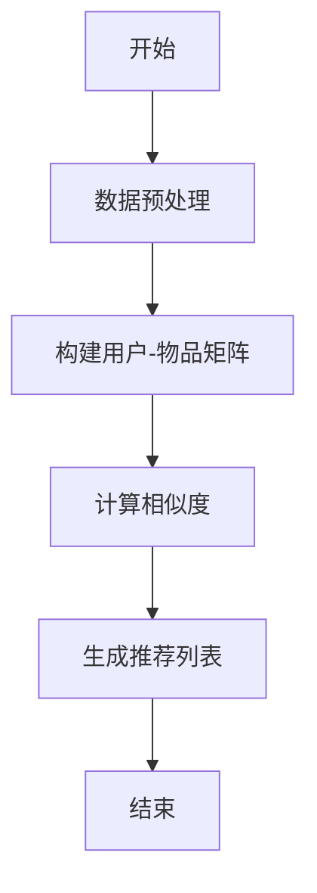

                 


# AI驱动的客户粘性分析：评估公司的长期收入质量

## 关键词：
AI, 客户粘性分析, 长期收入质量, 协同过滤算法, 数据挖掘, 机器学习

## 摘要：
在当今竞争激烈的商业环境中，客户粘性是衡量企业长期收入质量的重要指标。本文将探讨如何利用人工智能技术进行客户粘性分析，评估公司的长期收入质量。通过详细分析客户行为数据和特征数据，结合协同过滤算法，帮助企业预测客户流失，优化营销策略，提高客户保留率。本文将从客户粘性分析的背景与问题描述、核心概念、算法原理、系统架构设计、项目实战等多个方面展开讨论，深入剖析AI驱动的客户粘性分析的实现过程和实际应用。

---

## 第一部分：AI驱动的客户粘性分析基础

### 第1章：客户粘性分析的背景与问题描述

#### 1.1 客户粘性分析的核心概念
- **客户粘性的定义与内涵**  
  客户粘性是指客户对企业产品或服务的依赖程度，反映了客户对企业长期价值的贡献能力。高粘性的客户更可能重复购买、推荐新客户，为企业创造持续收入。

- **客户粘性分析的背景与意义**  
  在数字经济时代，客户粘性分析已成为企业提升客户生命周期价值的核心能力。通过分析客户行为数据，企业可以识别高价值客户，优化资源配置，降低客户获取成本。

- **问题背景与问题描述**  
  传统的企业营销策略往往依赖于直觉和经验，难以精准预测客户行为。随着数据量的爆炸式增长，企业需要借助AI技术，从海量数据中提取有价值的信息，实现客户粘性分析的自动化和智能化。

- **问题解决的思路与方法**  
  利用机器学习算法（如协同过滤、聚类分析、回归分析等），结合客户行为数据和特征数据，构建客户粘性预测模型，帮助企业评估客户粘性，优化客户管理策略。

- **客户粘性分析的边界与外延**  
  客户粘性分析的边界包括客户行为数据、产品特征、服务特征等。其外延则涵盖客户满意度、客户忠诚度、客户生命周期等多个相关领域。

- **客户粘性分析的核心要素**  
  - **客户行为数据**：包括购买频率、购买金额、投诉记录等。
  - **客户特征数据**：包括年龄、性别、职业、收入水平等。
  - **产品与服务特征**：包括产品价格、服务质量、产品创新性等。
  - **企业绩效指标**：包括客户保留率、客户满意度、客户生命周期价值（CLV）等。

#### 1.2 本章小结
本章从客户粘性分析的背景出发，详细阐述了客户粘性的核心概念、问题背景、解决思路以及核心要素，为后续的算法实现和系统设计奠定了基础。

---

### 第2章：客户粘性分析的核心概念与联系

#### 2.1 客户粘性的核心原理
- **客户粘性的形成机制**  
  客户粘性受多种因素影响，包括产品特性、客户满意度、客户信任度、市场竞争环境等。

- **客户粘性的影响因素**  
  - **产品特性**：产品的独特性、质量、性价比。
  - **客户满意度**：客户对产品或服务的满意度。
  - **客户信任度**：客户对企业的信任程度。
  - **市场竞争环境**：市场竞争的激烈程度。

- **客户粘性与企业绩效的关系**  
  高客户粘性意味着客户更可能持续购买，为企业创造长期收入，降低营销成本。

#### 2.2 客户粘性分析的核心概念对比
- **客户满意度与客户忠诚度的对比**  
  | 对比维度 | 客户满意度 | 客户忠诚度 |
  |----------|------------|------------|
  | 定义     | 客户对产品或服务的满意程度 | 客户对品牌或产品的依赖程度 |
  | 关系     | 客户满意度高，可能转化为忠诚度 | 忠诚度高的客户满意度通常较高 |

- **客户保留率与客户获取率的对比**  
  - **客户保留率**：现有客户中继续购买的比例。
  - **客户获取率**：新客户获取的比例。

- **客户生命周期与客户粘性的关系**  
  客户生命周期是客户从首次购买到最终流失的时间段，客户粘性是客户在生命周期中的行为表现。

#### 2.3 客户粘性分析的ER实体关系图
```mermaid
er
actor: Customer
actor: Product
actor: Transaction
actor: Customer Feedback
```

#### 2.4 本章小结
本章通过对比分析客户粘性相关的概念，揭示了客户粘性与其他相关指标的关系，为后续的算法设计和系统实现提供了理论基础。

---

## 第二部分：AI驱动的客户粘性分析算法与系统设计

### 第3章：客户粘性分析的算法原理

#### 3.1 协同过滤算法
- **基于用户的协同过滤**  
  基于用户的协同过滤算法通过寻找与目标用户行为相似的其他用户，推荐这些用户喜欢的产品或服务。

- **基于物品的协同过滤**  
  基于物品的协同过滤算法通过分析产品的相似性，向用户推荐与他们已购买或感兴趣的产品相似的其他产品。

- **混合协同过滤算法**  
  混合协同过滤算法结合基于用户和基于物品的协同过滤算法，通过加权融合两种方法的结果，提升推荐的准确性和多样性。

#### 3.2 协同过滤算法的实现流程


#### 3.3 协同过滤算法的数学模型
- **相似度计算公式**  
  $$\text{相似度} = \cos(\theta) = \frac{\sum_{i=1}^{n} (x_i - \bar{x})(y_i - \bar{y})}{\sqrt{\sum_{i=1}^{n} (x_i - \bar{x})^2} \sqrt{\sum_{i=1}^{n} (y_i - \bar{y})^2}}$$

- **推荐评分计算公式**  
  $$\hat{r}_{u,i} = \frac{\sum_{j \in N(u)} w_{u,j} \cdot r_{j,i}}{\sum_{j \in N(u)} w_{u,j}}$$

#### 3.4 本章小结
本章详细介绍了协同过滤算法的原理和实现流程，为后续的系统设计和项目实战奠定了算法基础。

---

### 第4章：客户粘性分析的系统架构设计

#### 4.1 问题场景介绍
- **问题场景**  
  某电商平台希望通过分析客户行为数据，预测客户粘性，优化营销策略。

#### 4.2 系统功能设计
- **领域模型**  
  ```mermaid
  classDiagram
  class Customer {
    id: int
    name: string
    purchase_history: list
    feedback: string
  }
  class Product {
    id: int
    name: string
    price: float
    category: string
  }
  class Transaction {
    id: int
    customer_id: int
    product_id: int
    timestamp: datetime
  }
  ```

- **系统架构图**  
  ```mermaid
  architecture
  CustomerBehaviorAnalyzer
  includes CustomerDatabase
  includes ProductDatabase
  includes TransactionDatabase
  includes ModelTraining
  includes ResultVisualization
  ```

- **系统接口设计**  
  - 数据输入接口：接收客户行为数据、产品数据。
  - 模型训练接口：训练协同过滤模型，生成客户粘性评分。
  - 结果输出接口：输出客户粘性分析报告。

- **系统交互流程**  
  ```mermaid
  sequenceDiagram
  CustomerBehaviorAnalyzer ->> CustomerDatabase: 获取客户数据
  CustomerBehaviorAnalyzer ->> ProductDatabase: 获取产品数据
  CustomerBehaviorAnalyzer ->> TransactionDatabase: 获取交易数据
  CustomerBehaviorAnalyzer ->> ModelTraining: 训练协同过滤模型
  ModelTraining ->> CustomerBehaviorAnalyzer: 返回客户粘性评分
  CustomerBehaviorAnalyzer ->> ResultVisualization: 生成分析报告
  ```

#### 4.3 本章小结
本章通过系统架构设计，详细描述了客户粘性分析系统的功能模块和交互流程，为后续的项目实战提供了设计依据。

---

## 第三部分：项目实战与总结

### 第5章：客户粘性分析的项目实战

#### 5.1 环境安装与数据预处理
- **环境安装**  
  安装Python、Pandas、NumPy、Scikit-learn等工具。

- **数据预处理**  
  使用Pandas读取数据，清洗数据，处理缺失值。

#### 5.2 特征提取与模型训练
- **特征提取**  
  提取客户ID、购买频率、购买金额、投诉记录等特征。

- **模型训练**  
  使用协同过滤算法训练客户粘性预测模型。

#### 5.3 代码实现与案例分析
- **代码实现**  
  ```python
  from sklearn.metrics.pairwise import cosine_similarity

  # 示例数据
  user_behavior = {
    'user1': [4, 3, 2],
    'user2': [5, 4, 3],
    'user3': [2, 1, 1]
  }

  # 计算相似度
  user_ids = list(user_behavior.keys())
  user_vectors = list(user_behavior.values())
  similarity_matrix = cosine_similarity(user_vectors)

  # 输出相似度矩阵
  print(similarity_matrix)
  ```

- **案例分析**  
  以某电商客户的购买行为为例，分析其粘性评分，预测其未来购买行为。

#### 5.4 项目小结
本章通过实际项目案例，详细讲解了客户粘性分析的实现过程，帮助读者掌握从数据预处理到模型训练的完整流程。

---

### 第6章：最佳实践与总结

#### 6.1 最佳实践
- **数据质量**  
  数据的准确性和完整性直接影响模型的性能，需重视数据预处理工作。
- **模型选择**  
  根据具体场景选择合适的算法，如协同过滤、聚类分析等。
- **结果验证**  
  使用验证集或交叉验证评估模型的性能，避免过拟合。

#### 6.2 未来趋势
- **深度学习的结合**  
  随着深度学习技术的发展，未来的客户粘性分析将更多地结合神经网络模型。
- **实时分析**  
  实时客户行为分析将成为提升客户粘性的关键。

#### 6.3 本章小结
本章总结了客户粘性分析的最佳实践，展望了未来的发展趋势，并提醒读者在实际应用中需要注意的问题。

---

## 附录：扩展阅读与参考资料
- **数据格式**  
  CSV、JSON、XML等常见数据格式。
- **工具安装**  
  Python包管理工具pip的使用方法。
- **扩展阅读**  
  推荐阅读《集体智慧编程》、《机器学习实战》等书籍。

---

以上是《AI驱动的客户粘性分析：评估公司的长期收入质量》的完整目录大纲和文章内容。通过系统化的分析和实践，本文深入探讨了AI在客户粘性分析中的应用，为企业评估长期收入质量提供了有力的技术支持。

