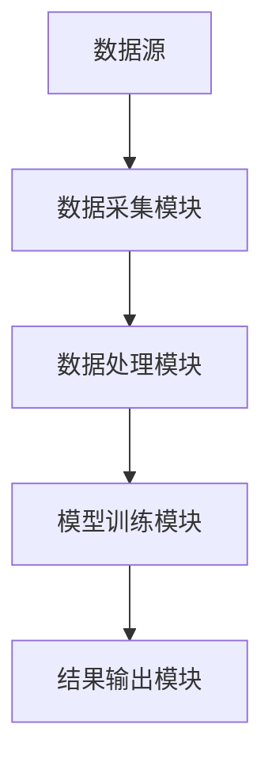

                 


# AI驱动的客户终身价值预测：评估公司的长期盈利能力

## 关键词：客户终身价值、人工智能、预测模型、长期盈利能力、数据科学

## 摘要：  
在当今数据驱动的商业环境中，企业越来越依赖客户终身价值（CLV）的预测来优化客户管理策略和提高长期盈利能力。本文通过AI技术，详细探讨了CLV预测的核心概念、算法原理、系统设计和实际应用。通过案例分析和项目实战，展示了如何利用AI模型预测客户行为，优化客户分层和营销策略，从而实现企业利润的最大化。

---

## 第一章：客户终身价值预测的背景与核心概念

### 1.1 问题背景  
客户终身价值（Customer Lifetime Value, CLV）是企业在客户生命周期中从该客户获得的总收入减去相关成本后的净现值。准确预测CLV可以帮助企业制定更有效的客户管理策略，优化资源分配，提高客户满意度和忠诚度，从而增强企业的长期盈利能力。

#### 1.1.1 企业长期盈利能力的重要性  
企业的长期盈利能力不仅取决于当前的销售业绩，还取决于客户留存率和客户价值的提升。通过预测CLV，企业可以识别高价值客户，优化营销策略，降低客户获取成本，从而实现可持续增长。

#### 1.1.2 客户价值与企业利润的关系  
客户价值是企业利润的重要来源。高价值客户的贡献通常远高于低价值客户，因此，通过CLV预测，企业可以优先关注高价值客户，提高整体利润水平。

#### 1.1.3 AI在客户价值预测中的作用  
人工智能（AI）技术，特别是机器学习算法，能够从海量数据中提取有价值的信息，帮助企业在复杂的市场环境中准确预测客户行为，优化客户管理策略。

### 1.2 客户终身价值（CLV）的定义与特点  
CLV是指企业在整个客户生命周期中从该客户获得的净收益。它不仅考虑了客户的当前价值，还包括客户未来可能带来的收入和成本。

#### 1.2.1 CLV的定义  
CLV = (客户在未来一段时间内的预期收入 - 客户在未来一段时间内的预期成本) / (1 + 折现率)^时间

#### 1.2.2 CLV的核心属性  
- **时间价值**：考虑了资金的时间价值，通常采用折现方法计算未来收益和成本。
- **动态变化**：随着客户行为的变化，CLV会不断调整，因此需要定期更新预测模型。
- **客户分层**：不同客户群体的CLV可能差异很大，因此需要对客户进行分层，分别预测和管理。

#### 1.2.3 CLV与客户生命周期的关系  
客户生命周期包括获取、激活、留存、转化和流失五个阶段。在每个阶段，CLV的预测可以帮助企业制定相应的策略，例如在获取阶段识别高价值客户，在留存阶段优化客户体验，防止客户流失。

### 1.3 AI驱动的CLV预测目标  
AI驱动的CLV预测旨在通过机器学习算法，利用历史数据和客户行为数据，预测客户未来的购买行为和价值，从而帮助企业制定更有效的客户管理策略。

#### 1.3.1 预测客户未来购买行为  
通过分析客户的购买频率、购买金额和购买时间等特征，预测客户未来的行为模式。

#### 1.3.2 优化客户分层与精准营销  
将客户分为不同的群体，针对不同群体制定个性化的营销策略，提高客户满意度和忠诚度。

#### 1.3.3 提高企业长期盈利能力  
通过优化客户管理策略，降低客户获取成本，提高客户留存率和购买频率，从而提高企业的整体盈利能力。

### 1.4 问题解决框架  
CLV预测的核心在于数据和算法。通过收集和整理客户数据，选择合适的机器学习算法，构建预测模型，帮助企业实现CLV的准确预测。

#### 1.4.1 数据驱动的CLV预测方法  
数据驱动的CLV预测方法通常包括以下几个步骤：
1. 数据收集与预处理：收集客户的基本信息、交易记录和行为数据，进行数据清洗和特征提取。
2. 模型选择：根据数据特点选择合适的机器学习算法，如线性回归、随机森林等。
3. 模型训练与评估：利用训练数据训练模型，并通过测试数据评估模型的性能。
4. 模型部署与应用：将模型部署到实际业务场景中，实时预测客户价值，优化客户管理策略。

#### 1.4.2 AI算法在CLV预测中的应用  
AI算法在CLV预测中的应用主要体现在以下几个方面：
- **客户分层**：通过聚类算法将客户分为不同的群体，识别高价值客户。
- **行为预测**：通过回归算法预测客户未来的购买行为和购买金额。
- **风险评估**：通过分类算法预测客户流失的风险，制定相应的保留策略。

#### 1.4.3 CLV预测的边界与外延  
CLV预测的边界在于数据质量和模型的准确性。如果数据不完整或模型不够准确，CLV预测的结果可能会偏离实际值。此外，CLV预测的外延还包括客户体验管理、客户关系管理等方面。

### 1.5 核心概念结构与要素  
CLV预测的核心要素包括客户数据、机器学习算法和预测模型。通过这些要素的有机结合，企业可以实现客户价值的准确预测和管理。

#### 1.5.1 CLV预测的核心要素  
- **客户数据**：包括客户的交易记录、行为数据、人口统计信息等。
- **机器学习算法**：包括回归、分类、聚类等算法。
- **预测模型**：通过算法训练得到的模型，用于预测客户价值。

#### 1.5.2 数据、模型与结果的关系  
数据是模型的基础，模型是数据的表达，结果是模型的输出。通过高质量的数据和高性能的模型，可以得到准确的结果，从而帮助企业制定有效的客户管理策略。

#### 1.5.3 系统架构的核心组件  
- **数据采集模块**：负责收集客户数据。
- **数据处理模块**：负责数据清洗和特征提取。
- **模型训练模块**：负责训练和优化预测模型。
- **结果输出模块**：负责将预测结果输出给业务部门。

---

## 第二章：数据准备与特征工程

### 2.1 数据收集与预处理  
数据收集是CLV预测的第一步，需要从各种渠道收集客户的交易记录、行为数据和人口统计信息。

#### 2.1.1 数据来源与类型  
- **交易数据**：包括客户的购买记录、购买金额、购买时间等。
- **行为数据**：包括客户的浏览记录、点击行为、收藏行为等。
- **人口统计信息**：包括客户的性别、年龄、职业等。

#### 2.1.2 数据清洗与去噪  
数据清洗是数据预处理的重要步骤，包括处理缺失值、异常值和重复值。

#### 2.1.3 数据标准化与归一化  
数据标准化和归一化是数据预处理的关键步骤，可以提高模型的性能和准确性。

### 2.2 客户行为特征提取  
特征工程是数据预处理的重要环节，通过提取有意义的特征，可以提高模型的预测能力。

#### 2.2.1 客户购买频率分析  
购买频率是客户行为的重要特征，可以通过统计客户的购买次数来衡量。

#### 2.2.2 客户购买金额特征提取  
购买金额是客户价值的重要指标，可以通过统计客户的平均购买金额来衡量。

#### 2.2.3 客户生命周期阶段识别  
通过分析客户的购买记录和行为数据，可以识别客户所处的生命周期阶段，从而制定相应的管理策略。

---

## 第三章：AI算法原理

### 3.1 算法选择与原理  
选择合适的算法是CLV预测的关键，需要根据数据特点和业务需求进行选择。

#### 3.1.1 线性回归算法  
线性回归是一种常用的回归算法，可以用于预测客户购买金额。

##### 3.1.1.1 线性回归的数学模型  
$$y = \beta_0 + \beta_1x + \epsilon$$  
其中，$y$ 是预测目标，$x$ 是自变量，$\beta_0$ 和 $\beta_1$ 是回归系数，$\epsilon$ 是误差项。

##### 3.1.1.2 线性回归的损失函数  
线性回归的损失函数通常采用均方误差（MSE）：
$$L = \frac{1}{n}\sum_{i=1}^{n}(y_i - y_i^{\text{pred}})^2$$

##### 3.1.1.3 线性回归的优化方法  
线性回归的优化通常采用最小二乘法，可以通过梯度下降等优化算法求解。

#### 3.1.2 随机森林算法  
随机森林是一种集成算法，可以通过组合多个决策树的结果来提高预测准确率。

##### 3.1.2.1 随机森林的数学模型  
随机森林通过构建多个决策树，并对结果进行投票或平均，得到最终的预测结果。

##### 3.1.2.2 随机森林的优缺点  
随机森林的优点包括高准确率、抗过拟合能力强等，缺点是计算复杂度较高。

### 3.2 算法实现与优化  
通过Python代码实现线性回归和随机森林算法，并进行模型优化。

#### 3.2.1 线性回归的实现  
```python
import numpy as np
from sklearn.linear_model import LinearRegression

# 数据准备
X = np.array([1, 2, 3, 4, 5]).reshape(-1, 1)
y = [2, 4, 5, 4, 6]

# 模型训练
model = LinearRegression()
model.fit(X, y)

# 预测结果
print(model.predict([[6]]))
```

#### 3.2.2 随机森林的实现  
```python
from sklearn.ensemble import RandomForestRegressor

# 数据准备
X = np.array([[1, 2], [3, 4], [5, 6], [7, 8], [9, 10]])
y = [2, 4, 5, 4, 6]

# 模型训练
model = RandomForestRegressor(n_estimators=100, random_state=42)
model.fit(X, y)

# 预测结果
print(model.predict([[11, 12]]))
```

### 3.3 算法性能评估  
通过均方误差（MSE）、均绝对误差（MAE）和决定系数（R²）等指标评估模型的性能。

#### 3.3.1 评估指标  
- MSE：衡量预测值与真实值之间的平均平方差。
- MAE：衡量预测值与真实值之间的平均绝对差。
- R²：衡量模型的解释能力，越接近1表示模型拟合效果越好。

#### 3.3.2 模型调优  
通过网格搜索等方法进行模型参数优化，提高模型的预测准确率。

---

## 第四章：系统设计与架构方案

### 4.1 系统架构设计  
系统架构设计是CLV预测系统的核心，需要考虑数据流、功能模块和系统交互。

#### 4.1.1 系统功能模块  
- **数据采集模块**：负责收集客户数据。
- **数据处理模块**：负责数据清洗和特征提取。
- **模型训练模块**：负责训练和优化预测模型。
- **结果输出模块**：负责将预测结果输出给业务部门。

#### 4.1.2 系统架构图  


### 4.2 系统功能设计  
系统功能设计包括数据输入、模型训练、结果输出和系统管理。

#### 4.2.1 数据输入与处理  
通过数据输入模块，将客户数据输入系统，并进行数据清洗和特征提取。

#### 4.2.2 模型训练与优化  
通过模型训练模块，选择合适的算法，训练预测模型，并进行模型优化。

#### 4.2.3 结果输出与分析  
通过结果输出模块，将预测结果输出，并进行结果分析和可视化。

### 4.3 系统接口设计  
系统接口设计包括数据接口和模型接口，确保系统各模块之间的数据流通和交互。

#### 4.3.1 数据接口设计  
- **输入接口**：负责接收客户数据。
- **输出接口**：负责输出预测结果。

#### 4.3.2 模型接口设计  
- **训练接口**：负责训练预测模型。
- **预测接口**：负责进行客户价值预测。

### 4.4 系统交互流程  
系统交互流程包括数据输入、模型训练、结果输出和系统管理。

#### 4.4.1 数据输入流程  
1. 通过数据采集模块收集客户数据。
2. 将数据输入数据处理模块，进行数据清洗和特征提取。
3. 将处理后的数据输入模型训练模块。

#### 4.4.2 模型训练流程  
1. 选择合适的算法，训练预测模型。
2. 对模型进行优化，提高预测准确率。
3. 保存训练好的模型。

#### 4.4.3 结果输出流程  
1. 将预测结果输出给业务部门。
2. 对结果进行分析和可视化。
3. 根据结果制定客户管理策略。

---

## 第五章：项目实战

### 5.1 项目背景与目标  
通过一个实际的CLV预测项目，展示AI技术在客户价值预测中的应用。

#### 5.1.1 项目背景  
某电商平台希望通过CLV预测，优化客户管理策略，提高客户留存率和购买频率。

#### 5.1.2 项目目标  
- 预测客户未来的购买行为和购买金额。
- 优化客户分层和精准营销策略。

### 5.2 项目实施步骤  
项目实施步骤包括数据准备、模型训练、结果分析和策略优化。

#### 5.2.1 数据准备  
1. 收集客户交易记录和行为数据。
2. 进行数据清洗和特征提取。
3. 将数据分成训练集和测试集。

#### 5.2.2 模型训练  
1. 选择合适的算法，训练预测模型。
2. 对模型进行优化，提高预测准确率。
3. 通过测试集评估模型性能。

#### 5.2.3 结果分析  
1. 分析预测结果，识别高价值客户。
2. 根据结果制定精准营销策略。
3. 监控模型性能，定期更新模型。

### 5.3 项目成果与总结  
通过项目实施，企业成功优化了客户管理策略，提高了客户留存率和购买频率，从而提高了企业的长期盈利能力。

---

## 第六章：案例分析

### 6.1 案例背景与数据介绍  
通过某电商平台的案例，展示CLV预测的实际应用。

#### 6.1.1 案例背景  
某电商平台希望通过CLV预测，优化客户管理策略，提高客户留存率和购买频率。

#### 6.1.2 数据介绍  
数据包括客户的交易记录、行为数据和人口统计信息。

### 6.2 模型实现与结果分析  
通过实现线性回归和随机森林算法，进行模型训练和结果分析。

#### 6.2.1 线性回归模型  
通过线性回归模型，预测客户购买金额，并分析模型性能。

#### 6.2.2 随机森林模型  
通过随机森林模型，预测客户购买金额，并分析模型性能。

### 6.3 案例总结与经验分享  
通过案例分析，总结CLV预测的成功经验，并分享最佳实践。

---

## 第七章：总结与展望

### 7.1 研究总结  
通过本文的探讨，展示了AI技术在CLV预测中的重要性，以及如何通过数据准备、算法选择和系统设计，实现客户价值的准确预测。

### 7.2 未来展望  
未来，随着AI技术的不断发展，CLV预测将更加精准和实时。同时，随着数据科学和机器学习技术的进步，CLV预测将更加广泛地应用于各个行业，帮助企业实现更高效的客户管理。

---

## 致谢  
感谢读者的耐心阅读，希望本文能为您提供有价值的内容和启发。

---

## 参考文献  
[此处列出相关的参考文献和资料来源。]

---

通过以上思考过程，我们可以看到，AI驱动的客户终身价值预测是一项复杂但极具价值的工程。通过数据准备、算法选择和系统设计，企业可以准确预测客户价值，优化客户管理策略，提高长期盈利能力。希望本文能为您提供有价值的内容和启发。

