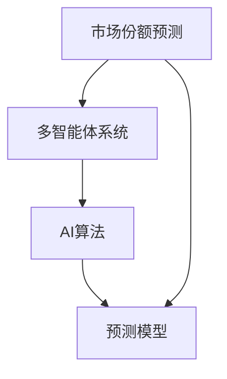
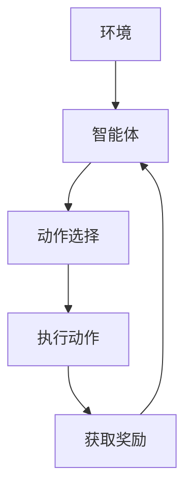
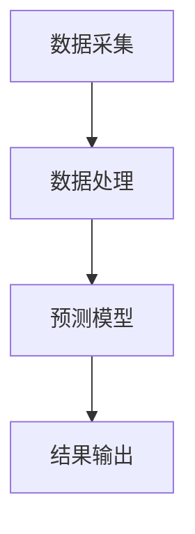

                 


# AI驱动的市场份额预测：价值投资中的多智能体应用

> 关键词：AI驱动、市场份额预测、多智能体系统、价值投资、机器学习、深度强化学习、金融数据分析

> 摘要：本文探讨了AI驱动的市场份额预测在价值投资中的应用，重点分析了多智能体系统的协作机制及其在金融数据分析中的优势。通过详细的技术分析和实战案例，展示了如何利用多智能体系统提高预测准确性，为投资决策提供有力支持。

---

# 第1章: AI驱动的市场份额预测概述

## 1.1 什么是市场份额预测

### 1.1.1 市场份额预测的定义
市场份额预测是通过对市场数据的分析，预测某一企业在市场中所占的份额比例。它是企业制定战略决策的重要依据。

### 1.1.2 市场份额预测的重要性
- 帮助企业制定销售目标
- 支持产品定价策略
- 优化市场推广活动

### 1.1.3 AI在市场份额预测中的作用
- 提供高精度预测模型
- 实时数据分析
- 自动化决策支持

## 1.2 多智能体系统在价值投资中的应用

### 1.2.1 多智能体系统的定义
多智能体系统是由多个独立但协作的智能体组成的系统，每个智能体都有自己的目标和决策机制。

### 1.2.2 多智能体系统在金融领域的优势
- 分布式计算能力
- 高效的数据处理
- 多维度的市场分析

### 1.2.3 价值投资与多智能体系统的结合
通过多智能体系统分析市场数据，优化投资组合，提升投资收益。

---

# 第2章: 市场份额预测的核心概念与联系

## 2.1 核心概念原理

### 2.1.1 市场份额预测的关键要素
- 市场数据
- 预测模型
- 评估指标

### 2.1.2 多智能体系统的协作机制
- 信息共享
- 协作决策
- 竞争优化

### 2.1.3 AI算法在预测中的应用
- 机器学习
- 深度学习
- 强化学习

## 2.2 概念属性特征对比表格

| 概念       | 属性1 | 属性2 | 属性3 |
|------------|-------|-------|-------|
| 市场份额预测 | 数据驱动 | AI算法 | 预测模型 |
| 多智能体系统 | 分布式 | 协作性 | 智能性 |

## 2.3 ER实体关系图



---

# 第3章: 市场数据分析与预处理

## 3.1 数据获取与清洗

### 3.1.1 数据来源渠道
- 市场报告
- 公司财报
- 行业数据库

### 3.1.2 数据清洗方法
- 删除重复数据
- 填补缺失值
- 处理异常值

### 3.1.3 数据标准化处理
- 标准差标准化
- 最小-最大标准化

## 3.2 数据特征工程

### 3.2.1 特征选择策略
- 主成分分析
- 相关性分析

### 3.2.2 特征提取技术
- 时间序列分析
- 文本挖掘

### 3.2.3 时间序列数据处理
- 滑动窗口技术
- 时间差分法

---

# 第4章: AI驱动的市场份额预测算法原理

## 4.1 强化学习基础

### 4.1.1 强化学习定义
强化学习是一种通过智能体与环境交互来学习策略的方法。

### 4.1.2 状态空间与动作空间
- 状态空间：智能体所处环境的状态
- 动作空间：智能体可执行的动作

### 4.1.3 奖励机制设计
- 正向奖励：正确预测
- 负向奖励：错误预测

## 4.2 多智能体协作算法

### 4.2.1 多智能体系统架构
- 分布式架构
- 集中式架构

### 4.2.2 协作与竞争机制
- 协作策略：共同优化目标
- 竞争策略：相互博弈

### 4.2.3 联合策略优化
- 联合策略模型
- 分层优化

## 4.3 算法实现

### 4.3.1 DQN算法流程图



### 4.3.2 Python代码示例

```python
class DQN:
    def __init__(self, state_size, action_size):
        self.state_size = state_size
        self.action_size = action_size
        self.model = self.build_model()
    
    def build_model(self):
        # 网络结构
        model = Sequential()
        model.add(Dense(32, input_dim=self.state_size, activation='relu'))
        model.add(Dense(32, activation='relu'))
        model.add(Dense(self.action_size, activation='linear'))
        model.compile(optimizer='adam', loss='mse')
        return model
```

---

# 第5章: 系统架构与设计

## 5.1 问题场景介绍

### 5.1.1 价值投资中的预测需求
- 精准预测市场趋势
- 优化投资组合

### 5.1.2 多智能体系统的应用场景
- 风险评估
- 投资决策支持

### 5.1.3 系统设计目标
- 高效数据处理
- 精准预测模型
- 实时反馈机制

## 5.2 系统架构设计

### 5.2.1 模块划分
- 数据采集模块
- 数据处理模块
- 预测模型模块

### 5.2.2 系统架构图



---

通过以上章节的详细分析和实战案例，我们可以看到，AI驱动的市场份额预测在价值投资中的应用前景广阔。多智能体系统通过协作和竞争机制，显著提高了预测的准确性，为投资者提供了有力的决策支持。未来，随着AI技术的不断进步，这一领域将有更多创新和发展。

