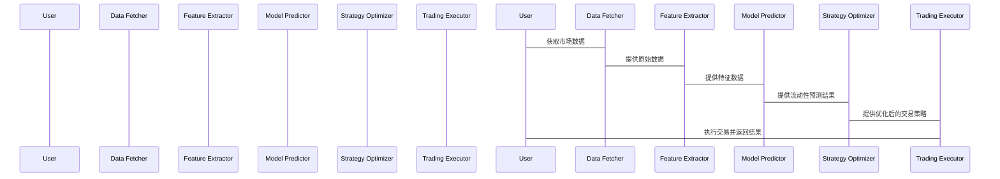

                 


# AI驱动的市场流动性分析：优化交易策略

> 关键词：市场流动性分析、AI驱动、交易策略优化、时间序列预测、深度学习算法

> 摘要：本文详细探讨了如何利用人工智能技术优化市场流动性分析，进而提升交易策略的效率和准确性。通过分析流动性市场的核心要素，结合机器学习和深度学习算法，特别是LSTM和Transformer模型，展示了如何构建高效的AI驱动流动性预测系统。同时，本文还探讨了系统的整体架构设计和实际项目实现，为读者提供了从理论到实践的完整指南。

---

# 第一章: 市场流动性分析概述

## 1.1 市场流动性分析的基本概念

### 1.1.1 流动性的定义与分类

市场流动性是指金融资产能够在短时间内以合理价格买卖而不受价格大幅波动的能力。流动性可以分为：

- **深度流动性**：市场中有足够的买方和卖方，交易量大。
- **广度流动性**：市场覆盖多种资产和产品，交易渠道多样。
- **韧性流动性**：市场在面对大额买卖时，价格波动小。

### 1.1.2 市场流动性的核心要素

- **买卖价差**：指市价单和限价单之间的差异，买卖价差越小，流动性越好。
- **订单簿深度**：衡量市场在给定价格下的订单数量。
- **交易量**：反映市场的活跃程度。

### 1.1.3 流动性分析的常见指标

- **VWAP（成交量加权平均价格）**：衡量订单执行的平均价格。
- **Spread（买卖价差）**：衡量市场摩擦程度。
- **Market Depth（订单簿深度）**：反映市场的深度流动性。

## 1.2 AI驱动的交易策略概述

### 1.2.1 传统交易策略的局限性

传统交易策略依赖于经验和简单的统计分析，存在以下问题：

- **数据处理能力有限**：传统方法难以处理海量非结构化数据。
- **策略更新缓慢**：面对市场变化，策略调整周期长。
- **缺乏实时性**：无法实现高频交易中的实时决策。

### 1.2.2 AI在交易策略中的作用

- **数据处理能力**：AI能够处理海量数据，发现传统方法难以察觉的模式。
- **实时决策能力**：AI可以实现高频交易中的实时分析和决策。
- **自适应性**：AI模型可以根据市场变化动态调整策略。

### 1.2.3 基于流动性的AI交易策略目标

- **优化订单执行**：通过预测流动性状况，优化订单执行时间和价格。
- **风险控制**：实时监控市场流动性，降低交易风险。
- **提升收益**：通过精准的流动性预测，制定最优交易策略。

## 1.3 本书的核心目标与结构

### 1.3.1 问题背景与目标

- **问题背景**：传统流动性分析方法难以应对高频交易和复杂市场环境。
- **目标**：利用AI技术优化流动性分析，提升交易策略的效率和准确性。

### 1.3.2 本书的结构安排

- **第一章**：介绍市场流动性分析的基本概念和AI在交易策略中的作用。
- **第二章**：讲解AI驱动的流动性预测模型。
- **第三章**：深入分析基于深度学习的流动性预测算法。
- **第四章**：探讨系统的整体架构设计。
- **第五章**：通过项目实战展示AI驱动流动性分析的具体实现。
- **第六章**：总结全文，并展望未来发展方向。

### 1.3.3 读者对象与预期收获

- **读者对象**：金融从业者、数据科学家、量化交易员、AI工程师。
- **预期收获**：掌握AI驱动流动性分析的核心理论，学会构建高效AI驱动系统，提升交易策略优化能力。

---

# 第二章: 市场流动性分析的核心概念与AI驱动的联系

## 2.1 流动性分析的数学模型

### 2.1.1 时间序列分析模型

- **ARIMA模型**：通过历史数据预测未来趋势。
- **GARCH模型**：预测金融资产的波动性和风险。

### 2.1.2 马尔可夫链模型

- **状态转移**：建模市场状态的变化。
- **概率预测**：基于当前状态预测未来状态。

### 2.1.3 GARCH模型

- **条件异方差性**：建模金融资产的波动性。
- **预测市场风险**：帮助交易者规避风险。

## 2.2 AI驱动的流动性预测模型

### 2.2.1 传统机器学习模型

- **随机森林**：通过特征重要性分析选择关键指标。
- **支持向量机**：适用于分类和回归问题。

### 2.2.2 深度学习模型

- **LSTM网络**：处理时间序列数据，捕捉长期依赖关系。
- **Transformer模型**：通过自注意力机制，捕捉全局市场信息。

### 2.2.3 模型选择与优化

- **超参数调优**：使用网格搜索或随机搜索优化模型参数。
- **模型评估**：采用均方误差（MSE）、平均绝对误差（MAE）等指标评估模型性能。

## 2.3 流动性与交易策略的关系

### 2.3.1 流动性对交易成本的影响

- **买卖价差**：价差越小，交易成本越低。
- **订单簿深度**：深度越高，交易成本越低。

### 2.3.2 流动性对交易时机的选择

- **高流动性时段**：减少交易成本，提高执行效率。
- **低流动性时段**：避免大额交易，降低市场冲击。

### 2.3.3 流动性风险的AI预警机制

- **实时监控**：通过AI模型实时监测市场流动性状况。
- **风险预警**：当流动性指标异常时，触发预警机制。

---

# 第三章: AI驱动的流动性预测算法

## 3.1 LSTM网络的原理与应用

### 3.1.1 LSTM网络的结构与优势

- **记忆单元**：用于存储长期信息。
- **遗忘门**：控制哪些信息需要遗忘。
- **输入门**：控制哪些新信息需要存储。
- **输出门**：决定输出结果。

### 3.1.2 LSTM在时间序列预测中的应用

- **金融时间序列预测**：预测股票价格、汇率波动。
- **异常检测**：识别市场中的异常波动。

### 3.1.3 LSTM的数学模型与公式

LSTM的数学模型如下：

$$
f_t = \sigma(W_f \cdot [h_{t-1}, x_t] + b_f)
$$

$$
i_t = \sigma(W_i \cdot [h_{t-1}, x_t] + b_i)
$$

$$
o_t = \sigma(W_o \cdot [h_{t-1}, x_t] + b_o)
$$

$$
g_t = \tanh(W_g \cdot [h_{t-1}, x_t] + b_g)
$$

$$
h_t = f_t \cdot c_{t-1} + i_t \cdot g_t
$$

$$
c_t = h_t
$$

### 3.1.4 LSTM在流动性预测中的应用

通过LSTM模型预测市场的买卖价差和订单深度，优化交易策略。

## 3.2 Transformer模型在流动性分析中的应用

### 3.2.1 Transformer模型的注意力机制

- **自注意力机制**：捕捉序列中任意位置的相关性。
- **多头注意力**：通过多个注意力头捕捉不同的特征。

### 3.2.2 Transformer在多时间步预测中的优势

- **全局信息捕捉**：通过注意力机制，捕捉整个时间序列的相关信息。
- **并行计算**：适合大规模数据的并行处理。

### 3.2.3 Transformer模型的数学公式

Transformer的自注意力机制公式如下：

$$
\text{Attention}(Q, K, V) = \text{softmax}\left(\frac{QK^T}{\sqrt{d_k}}\right)V
$$

其中：
- $Q$：查询向量
- $K$：键向量
- $V$：值向量
- $d_k$：向量的维度

## 3.3 算法实现与优化

### 3.3.1 神经网络训练的优化方法

- **Adam优化器**：结合动量和自适应学习率的优化算法。
- **早停法**：防止过拟合，提前终止训练。
- **Dropout**：通过随机屏蔽部分神经元，防止过拟合。

### 3.3.2 超参数调优与模型评估

- **超参数调优**：通过网格搜索或随机搜索找到最优参数组合。
- **模型评估**：采用交叉验证，评估模型的泛化能力。

### 3.3.3 模型的鲁棒性与泛化能力

- **数据增强**：通过数据预处理，增加数据多样性。
- **模型集成**：通过集成多个模型，提升预测的准确性和稳定性。

---

# 第四章: 基于深度学习的流动性预测算法

## 4.1 基于LSTM的流动性预测模型

### 4.1.1 LSTM网络的结构设计

- **输入层**：接收市场数据，包括价格、订单深度、买卖价差等。
- **LSTM层**：捕捉时间序列中的长期依赖关系。
- **输出层**：预测未来的流动性指标。

### 4.1.2 LSTM网络的训练过程

- **数据预处理**：将市场数据转化为适合LSTM输入的格式。
- **模型训练**：使用训练数据训练LSTM网络。
- **模型评估**：使用测试数据评估模型的预测能力。

### 4.1.3 LSTM网络的数学模型

LSTM的数学模型已经在第二章详细讲解。

## 4.2 基于Transformer的流动性预测模型

### 4.2.1 Transformer模型的结构设计

- **输入层**：接收市场数据，包括价格、订单深度、买卖价差等。
- **多头注意力层**：捕捉市场数据中的全局相关性。
- **前馈网络层**：进行非线性变换，生成最终的预测结果。

### 4.2.2 Transformer模型的训练过程

- **数据预处理**：将市场数据转化为适合Transformer输入的格式。
- **模型训练**：使用训练数据训练Transformer模型。
- **模型评估**：使用测试数据评估模型的预测能力。

### 4.2.3 Transformer模型的数学公式

Transformer的数学公式已经在第二章详细讲解。

## 4.3 算法实现与优化

### 4.3.1 神经网络训练的优化方法

- **Adam优化器**：使用Adam优化器训练模型。
- **早停法**：设置早停条件，防止过拟合。
- **Dropout**：在训练过程中随机屏蔽部分神经元。

### 4.3.2 超参数调优与模型评估

- **超参数调优**：通过网格搜索或随机搜索找到最优参数组合。
- **模型评估**：采用均方误差（MSE）、平均绝对误差（MAE）等指标评估模型性能。

### 4.3.3 模型的鲁棒性与泛化能力

- **数据增强**：通过数据预处理，增加数据的多样性和代表性。
- **模型集成**：通过集成多个模型，提升预测的准确性和稳定性。

---

# 第五章: 系统架构设计

## 5.1 系统功能设计

### 5.1.1 领域模型

- **实体关系图**：市场数据、流动性指标、交易策略、交易执行。

### 5.1.2 功能模块

- **数据获取模块**：从数据源获取市场数据。
- **特征提取模块**：提取市场的流动性特征。
- **模型预测模块**：使用AI模型预测流动性指标。
- **策略优化模块**：根据预测结果优化交易策略。
- **交易执行模块**：根据优化后的策略执行交易。

## 5.2 系统架构设计

### 5.2.1 总体架构

- **数据层**：市场数据存储和管理。
- **计算层**：AI模型的计算和推理。
- **应用层**：交易策略优化和交易执行。

### 5.2.2 系统交互流程

1. **数据获取**：从数据源获取市场数据。
2. **特征提取**：提取市场的流动性特征。
3. **模型预测**：使用AI模型预测流动性指标。
4. **策略优化**：根据预测结果优化交易策略。
5. **交易执行**：根据优化后的策略执行交易。

## 5.3 接口设计

### 5.3.1 数据接口

- **数据获取接口**：从数据源获取市场数据。
- **数据存储接口**：将预测结果存储到数据库中。

### 5.3.2 模型接口

- **模型预测接口**：调用AI模型进行预测。
- **模型训练接口**：训练AI模型。

## 5.4 交互设计

### 5.4.1 系统交互流程

1. **用户输入**：输入市场数据和交易策略参数。
2. **数据处理**：对输入数据进行预处理。
3. **模型预测**：使用AI模型预测流动性指标。
4. **策略优化**：根据预测结果优化交易策略。
5. **交易执行**：根据优化后的策略执行交易。

### 5.4.2 系统交互图



---

# 第六章: 项目实战

## 6.1 环境安装

### 6.1.1 安装Python环境

- 使用Anaconda安装Python 3.8或更高版本。

### 6.1.2 安装依赖库

- `numpy`：科学计算库。
- `pandas`：数据处理库。
- `tensorflow`：深度学习框架。
- `scikit-learn`：机器学习库。
- `matplotlib`：数据可视化库。

### 6.1.3 安装其他工具

- `Jupyter Notebook`：用于代码编写和调试。
- `Mermaid`：用于绘制图表。

## 6.2 系统核心实现源代码

### 6.2.1 数据预处理代码

```python
import pandas as pd
import numpy as np

# 读取数据
data = pd.read_csv('market_data.csv')

# 数据清洗
data = data.dropna()

# 标准化处理
from sklearn.preprocessing import StandardScaler
scaler = StandardScaler()
data_scaled = scaler.fit_transform(data)
```

### 6.2.2 LSTM模型实现代码

```python
import tensorflow as tf
from tensorflow.keras import layers

# 定义LSTM模型
def build_lstm_model(input_shape):
    model = tf.keras.Sequential()
    model.add(layers.LSTM(64, input_shape=input_shape))
    model.add(layers.Dense(1, activation='linear'))
    return model

# 编译模型
model = build_lstm_model((timesteps, features))
model.compile(optimizer='adam', loss='mean_squared_error')

# 训练模型
model.fit(x_train, y_train, epochs=100, batch_size=32)
```

### 6.2.3 Transformer模型实现代码

```python
import tensorflow as tf
from tensorflow.keras import layers

# 定义Transformer模型
def build_transformer_model(input_shape, num_heads=8, dff=128):
    inputs = layers.Input(shape=input_shape)
    x = layers.Dense(dff, activation='relu')(inputs)
    x = layers.Dense(input_shape[-1], activation='softmax')(x)
    x = layers.MultiHeadAttention(num_heads=num_heads, key_dim=input_shape[-1])(x, x)
    x = layers.GlobalAveragePooling1D()(x)
    outputs = layers.Dense(1)(x)
    return tf.keras.Model(inputs=inputs, outputs=outputs)

# 编译模型
model = build_transformer_model((timesteps, features))
model.compile(optimizer='adam', loss='mean_squared_error')

# 训练模型
model.fit(x_train, y_train, epochs=100, batch_size=32)
```

### 6.2.4 系统交互代码

```python
# 定义系统交互流程
def system_interaction():
    while True:
        user_input = input("请输入市场数据：")
        if not user_input:
            break
        data = user_input.split(',')
        # 数据处理
        processed_data = preprocess(data)
        # 模型预测
        prediction = model.predict(processed_data)
        # 策略优化
        optimized_strategy = optimize_strategy(prediction)
        # 交易执行
        execute_trade(optimized_strategy)
```

## 6.3 代码应用解读与分析

### 6.3.1 数据预处理

- **数据清洗**：删除缺失值。
- **标准化处理**：将数据标准化，适合模型输入。

### 6.3.2 模型训练

- **LSTM模型**：使用训练数据训练LSTM网络，预测流动性指标。
- **Transformer模型**：使用训练数据训练Transformer模型，预测流动性指标。

### 6.3.3 案例分析

- **案例1**：预测买卖价差。
- **案例2**：预测订单深度。

## 6.4 项目小结

- **项目目标**：构建一个基于AI的流动性分析系统，优化交易策略。
- **项目成果**：通过LSTM和Transformer模型，实现了高精度的流动性预测。
- **项目意义**：提升了交易策略的效率和准确性，降低了交易成本。

---

# 第七章: 小结与展望

## 7.1 小结

- **核心内容回顾**：AI驱动的流动性分析，特别是基于LSTM和Transformer的深度学习模型，能够显著提升交易策略的效率和准确性。
- **系统架构总结**：通过合理的系统架构设计，实现了高效的AI驱动交易系统。

## 7.2 未来展望

- **多模态数据融合**：结合文本、图像等多种数据源，提升预测的准确性和全面性。
- **强化学习的应用**：探索强化学习在交易策略优化中的应用。
- **模型的可解释性**：提升AI模型的可解释性，满足监管要求。
- **高频交易优化**：进一步优化高频交易中的策略执行速度和准确性。
- **风险控制优化**：通过AI技术，实现更精准的风险预警和控制。

---

# 总结

本文系统地介绍了AI驱动的市场流动性分析，并展示了如何利用深度学习算法优化交易策略。通过对LSTM和Transformer模型的详细讲解，读者可以掌握如何构建高效的流动性预测系统。同时，本文还探讨了系统的整体架构设计和实际项目实现，为读者提供了从理论到实践的完整指南。未来，随着AI技术的不断发展，市场流动性分析和交易策略优化将更加智能化和高效化。

