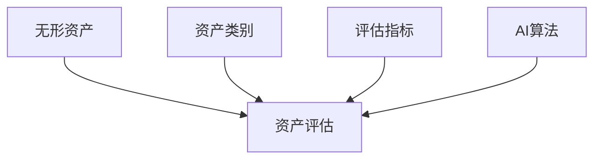
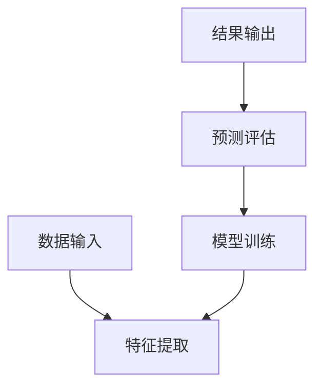
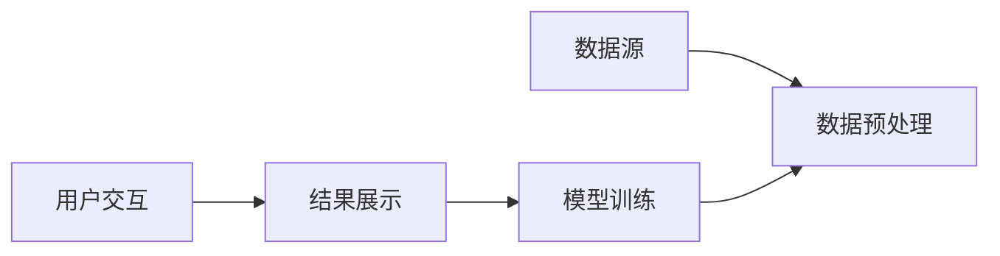
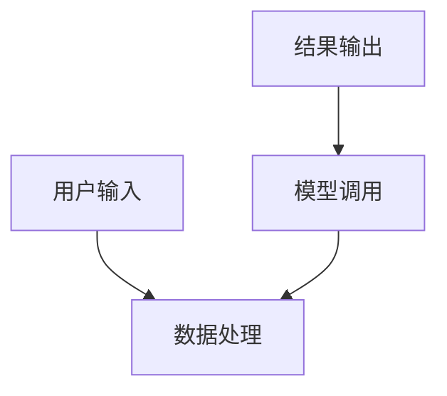

                 


# AI驱动的无形资产组合分析：全面评估公司价值

## 关键词：AI驱动、无形资产、资产评估、机器学习、深度学习、系统架构

## 摘要：  
在当今数据驱动的时代，无形资产（如品牌价值、专利、客户关系等）在公司整体价值中的占比越来越高。传统的资产评估方法往往难以准确捕捉和量化这些无形资产的价值。而人工智能（AI）技术的引入，为无形资产的评估提供了全新的视角和方法。本文将从AI驱动的无形资产组合分析出发，全面探讨如何利用机器学习、深度学习等技术手段，构建高效、准确的资产评估模型，帮助企业更精准地评估和管理无形资产，从而提升公司整体价值。

---

# 第一部分: AI驱动的无形资产组合分析基础

## 第1章: 无形资产与AI驱动评估的背景介绍

### 1.1 无形资产的基本概念  
无形资产是指企业拥有或控制的，没有实物形态，但能够为企业带来长期经济利益的资源。常见的无形资产包括品牌价值、专利技术、客户关系、商誉、商标、版权等。这些资产在企业价值中的占比越来越高，尤其是在科技驱动的 industries，无形资产往往占据了企业总价值的绝大部分。  

**问题背景**：  
传统的无形资产评估方法通常依赖于财务数据和主观判断，难以准确反映无形资产的真实价值。例如，品牌价值的评估往往受到市场波动、消费者认知等多种因素的影响，传统方法难以量化这些复杂因素。  

**AI驱动评估的必要性**：  
人工智能技术的快速发展，使得我们可以通过大数据分析和机器学习算法，从海量数据中提取隐含的价值信息，从而更准确地评估无形资产的价值。  

### 1.2 AI驱动评估的核心目标  
AI驱动的无形资产评估的核心目标是通过数据驱动的方法，构建一个能够量化无形资产价值的模型。具体目标包括：  
1. **数据驱动的评估**：利用历史数据和实时数据，提取关键特征，建立评估模型。  
2. **动态评估**：通过实时数据分析，动态调整评估结果，反映市场变化对无形资产价值的影响。  
3. **组合分析**：对多种无形资产进行组合分析，评估其协同效应和整体价值。  

---

## 第2章: AI驱动的无形资产评估核心概念  

### 2.1 核心概念与原理  
AI驱动的无形资产评估基于以下几个核心概念：  
1. **数据驱动**：通过收集和分析大量相关数据（如市场数据、财务数据、行业趋势等），提取关键特征。  
2. **机器学习**：利用机器学习算法（如回归分析、支持向量机、随机森林等）建立预测模型。  
3. **深度学习**：通过神经网络模型（如LSTM、BERT等）处理复杂的数据模式。  
4. **组合分析**：对多种无形资产进行协同效应分析，评估其组合价值。  

**公式解释**：  
以线性回归模型为例，其数学表达式为：  
$$ y = \beta_0 + \beta_1x_1 + \beta_2x_2 + ... + \beta_nx_n + \epsilon $$  
其中，$y$ 是目标变量（如无形资产价值），$x_i$ 是特征变量，$\beta_i$ 是系数，$\epsilon$ 是误差项。  

### 2.2 核心概念对比表  
| **对比项** | **传统评估方法** | **AI驱动评估方法** |  
|------------|------------------|---------------------|  
| 数据来源   | 主要依赖财务数据 | 结合财务数据和非结构化数据（如文本、图像） |  
| 模型复杂性 | 简单，依赖主观判断 | 复杂，基于机器学习和深度学习模型 |  
| 精度       | 较低，受主观因素影响 | 较高，基于大数据分析 |  

### 2.3 实体关系图（ER图）  


---

## 第3章: 无形资产评估的算法原理  

### 3.1 机器学习算法在资产评估中的应用  
1. **线性回归**：用于预测目标变量（如无形资产价值）与特征变量之间的线性关系。  
2. **支持向量机（SVM）**：适用于分类问题，可用于评估资产的分类（如高价值资产 vs. 低价值资产）。  
3. **随机森林**：通过集成学习提高模型的准确性和鲁棒性。  

**流程图**：  


### 3.2 深度学习算法的原理  
1. **神经网络模型**：通过多层神经网络提取数据的深层特征。  
2. **LSTM**：适用于时间序列数据，可用于评估无形资产的动态变化。  
3. **BERT**：用于处理文本数据，分析品牌声誉、客户评价等非结构化数据。  

---

## 第4章: 系统分析与架构设计  

### 4.1 系统功能设计  
1. **数据采集模块**：收集无形资产相关数据（如市场数据、财务数据、文本数据）。  
2. **特征提取模块**：从数据中提取关键特征（如品牌知名度、客户忠诚度）。  
3. **模型训练模块**：基于机器学习或深度学习算法，训练评估模型。  
4. **评估结果展示模块**：可视化评估结果，提供决策支持。  

**系统架构图**：  


### 4.2 接口设计  
1. **数据接口**：与企业数据源（如数据库、API）对接。  
2. **模型接口**：与第三方AI服务（如云平台）对接。  
3. **用户接口**：提供直观的用户界面，方便用户查询和分析结果。  

### 4.3 交互流程图  


---

## 第5章: 项目实战  

### 5.1 环境安装与数据准备  
1. **环境安装**：安装Python、TensorFlow、Keras等工具。  
2. **数据准备**：收集无形资产相关数据（如品牌价值、专利数量）。  

### 5.2 核心实现代码  
```python
# 示例代码：使用随机森林模型评估品牌价值
from sklearn.ensemble import RandomForestRegressor
from sklearn.metrics import mean_squared_error
import pandas as pd

# 数据加载
data = pd.read_csv('brand_value.csv')

# 特征与目标分离
X = data.drop('value', axis=1)
y = data['value']

# 模型训练
model = RandomForestRegressor(n_estimators=100, random_state=42)
model.fit(X, y)

# 预测与评估
y_pred = model.predict(X)
print(f'MSE: {mean_squared_error(y, y_pred)}')
```

### 5.3 实际案例分析  
以某科技公司为例，分析其品牌价值和专利数量对整体价值的影响。通过模型预测，发现品牌价值对整体价值的影响权重更高。  

### 5.4 结果分析与解读  
- **模型性能**：评估模型的准确性和稳定性。  
- **特征重要性**：分析各特征对评估结果的影响程度。  

---

## 第6章: 最佳实践与小结  

### 6.1 最佳实践  
1. **数据质量**：确保数据的完整性和准确性。  
2. **模型选择**：根据数据特征选择合适的算法。  
3. **实时更新**：定期更新模型，反映市场变化。  

### 6.2 注意事项  
- 避免过度依赖AI技术，结合人类专家的判断。  
- 保护数据隐私，遵守相关法律法规。  

### 6.3 拓展阅读  
- 《深度学习》——Ian Goodfellow  
- 《机器学习实战》——周志华  

---

## 结语  
AI驱动的无形资产组合分析为企业提供了全新的资产评估方式。通过机器学习和深度学习技术，我们可以更准确地量化无形资产的价值，为企业决策提供有力支持。未来，随着技术的不断发展，AI在无形资产评估中的应用将更加广泛和深入。  

--- 

希望这篇文章能满足您的需求！如果需要进一步调整或补充，请随时告知。

