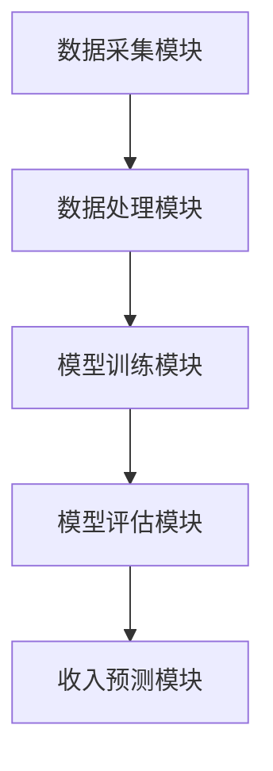
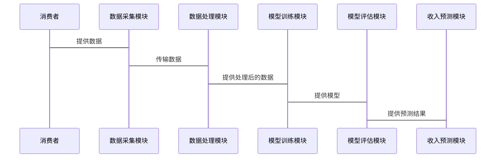

                 


# AI驱动的消费者行为分析：预测公司未来收入

> 关键词：AI, 消费者行为分析, 收入预测, 数据分析, 机器学习, 人工智能

> 摘要：本文探讨了如何利用人工智能技术驱动消费者行为分析，以预测公司未来收入。文章从消费者行为分析的核心概念出发，结合AI算法和系统架构，详细阐述了AI在消费者行为预测中的应用，并通过实际案例展示了如何通过AI技术实现收入预测，帮助企业做出更明智的商业决策。

---

# 第一部分: AI驱动的消费者行为分析基础

## # 第1章: AI驱动的消费者行为分析概述

### 1.1 消费者行为分析的背景与意义

#### 1.1.1 消费者行为分析的定义与重要性
消费者行为分析是指通过对消费者在市场中的行为数据进行收集、处理和分析，以理解消费者的偏好、需求和购买习惯。在现代商业环境中，消费者行为分析是企业制定市场策略、优化产品和服务、提高客户满意度的重要工具。

AI技术的引入，使得消费者行为分析更加精准和高效。通过机器学习算法，企业可以预测消费者的购买行为，从而提前做出应对策略。这种预测能力不仅能够帮助企业优化库存管理，还能提高销售预测的准确性，最终实现收入的最大化。

#### 1.1.2 AI在消费者行为分析中的作用
AI技术在消费者行为分析中的作用主要体现在以下几个方面：
1. **数据处理与特征提取**：AI能够从海量的消费者数据中提取有用的特征，帮助理解消费者行为的模式。
2. **行为预测**：通过机器学习算法，AI可以预测消费者的购买行为，帮助企业提前做好市场准备。
3. **个性化推荐**：AI可以根据消费者的偏好，提供个性化的推荐，从而提高客户满意度和销售转化率。

#### 1.1.3 预测公司未来收入的意义
预测公司未来收入是企业制定长期战略规划的重要依据。通过AI驱动的消费者行为分析，企业可以更准确地预测未来的收入情况，从而做出更明智的投资决策。

### 1.2 AI驱动消费者行为分析的核心概念

#### 1.2.1 数据驱动的消费者行为分析
数据驱动的消费者行为分析是指通过收集和分析大量消费者数据，提取有用的信息，从而理解消费者的偏好和行为模式。AI技术可以通过数据挖掘、机器学习等方法，从海量数据中提取有用的信息。

#### 1.2.2 AI技术在消费者行为分析中的应用
AI技术在消费者行为分析中的应用主要体现在以下几个方面：
1. **数据预处理**：AI可以帮助企业清洗和预处理数据，确保数据的质量和一致性。
2. **特征工程**：AI可以通过特征工程提取有用的特征，帮助模型更好地理解消费者行为。
3. **模型训练**：AI可以通过机器学习算法训练模型，预测消费者的购买行为。

#### 1.2.3 预测公司未来收入的实现路径
预测公司未来收入的实现路径主要包括以下几个步骤：
1. **数据收集**：收集消费者的交易数据、行为数据等。
2. **数据预处理**：清洗数据，处理缺失值、异常值等。
3. **特征工程**：提取有用的特征，构建特征集合。
4. **模型训练**：选择合适的算法，训练模型。
5. **模型评估**：评估模型的性能，优化模型参数。
6. **收入预测**：利用训练好的模型，预测未来的收入情况。

### 1.3 本章小结
本章介绍了AI驱动的消费者行为分析的基本概念和意义，阐述了AI在消费者行为分析中的作用，并提出了预测公司未来收入的实现路径。

---

## # 第2章: 消费者行为分析的核心概念与联系

### 2.1 消费者行为分析的基本原理

#### 2.1.1 数据收集与特征提取
数据收集是消费者行为分析的第一步。企业可以通过多种渠道收集消费者数据，包括：
- **交易数据**：消费者的购买记录、订单金额等。
- **行为数据**：消费者的浏览记录、点击行为等。
- **用户数据**：消费者的个人信息、联系方式等。

特征提取是数据预处理的重要步骤。通过特征工程，可以将原始数据转化为更有意义的特征，例如：
- **购买频率**：消费者在一定时间内的购买次数。
- **购买金额**：消费者每次购买的平均金额。
- **偏好特征**：消费者对某些产品或品牌的偏好程度。

#### 2.1.2 数据预处理与特征工程
数据预处理是确保数据质量的重要步骤。常见的数据预处理方法包括：
- **数据清洗**：处理缺失值、异常值等。
- **数据转换**：将数据转换为适合模型训练的形式，例如标准化、归一化等。
- **特征选择**：选择对模型影响较大的特征，去除无关特征。

特征工程是数据预处理的重要组成部分。通过特征工程，可以将原始数据转化为更有意义的特征，例如：
- **用户画像**：根据消费者的购买记录和行为数据，构建用户画像。
- **行为模式**：分析消费者的购买行为模式，例如购买周期、购买偏好等。

#### 2.1.3 模型训练与评估
模型训练是消费者行为分析的核心步骤。通过机器学习算法，可以训练出一个能够预测消费者行为的模型。常见的机器学习算法包括：
- **线性回归**：用于预测连续型变量，例如购买金额。
- **决策树**：用于分类问题，例如预测消费者是否购买某类产品。
- **随机森林**：一种基于决策树的集成算法，具有较高的预测精度。

模型评估是模型训练的重要步骤。通过评估模型的性能，可以优化模型参数，提高模型的预测精度。常见的模型评估指标包括：
- **准确率**：模型预测正确的比例。
- **召回率**：模型预测出的正例中实际为正例的比例。
- **F1分数**：准确率和召回率的调和平均数。

### 2.2 AI驱动消费者行为分析的数学模型

#### 2.2.1 线性回归模型
线性回归是一种常用的回归算法，适用于预测连续型变量。线性回归模型的数学公式如下：
$$ y = \beta_0 + \beta_1 x_1 + \beta_2 x_2 + \dots + \beta_n x_n + \epsilon $$
其中，$y$ 是目标变量，$x_i$ 是特征变量，$\beta_i$ 是回归系数，$\epsilon$ 是误差项。

#### 2.2.2 支持向量机（SVM）
支持向量机是一种常用的分类算法，适用于分类问题。SVM的核心思想是通过构建一个超平面，将数据点分为两类。SVM的数学公式如下：
$$ y = \text{sign}(w \cdot x + b) $$
其中，$w$ 是权重向量，$x$ 是特征向量，$b$ 是偏置项。

#### 2.2.3 随机森林与梯度提升树
随机森林是一种基于决策树的集成算法，适用于分类和回归问题。随机森林通过构建多棵决策树，并取其预测结果的平均值，从而提高模型的预测精度。

梯度提升树是一种基于树模型的集成算法，适用于分类和回归问题。梯度提升树通过不断优化模型的损失函数，逐步提高模型的预测精度。

### 2.3 消费者行为分析的ER实体关系图

```mermaid
er
  actor: 消费者
  product: 产品
  transaction: 交易记录
  behavior: 行为数据
  actor -[many-to-many]-> behavior
  product -[many-to-many]-> behavior
  actor -[many-to-many]-> transaction
  product -[many-to-one]-> transaction
```

### 2.4 本章小结
本章详细讲解了消费者行为分析的核心概念，包括数据收集与特征提取、数据预处理与特征工程、模型训练与评估等。同时，介绍了几种常用的机器学习算法，并通过ER实体关系图展示了消费者行为分析的数据结构。

---

## # 第3章: 常见算法原理与实现

### 3.1 常见算法原理

#### 3.1.1 线性回归算法
线性回归是一种常用的回归算法，适用于预测连续型变量。线性回归算法的实现步骤如下：
1. **数据准备**：收集和整理数据，确保数据质量。
2. **特征工程**：选择合适的特征，构建特征集合。
3. **模型训练**：使用最小二乘法训练线性回归模型。
4. **模型评估**：评估模型的性能，计算回归系数。

#### 3.1.2 决策树算法
决策树是一种常用的分类算法，适用于分类问题。决策树算法的实现步骤如下：
1. **数据准备**：收集和整理数据，确保数据质量。
2. **特征工程**：选择合适的特征，构建特征集合。
3. **模型训练**：使用ID3、C4.5或CART算法训练决策树模型。
4. **模型评估**：评估模型的性能，计算准确率、召回率等指标。

#### 3.1.3 随机森林算法
随机森林是一种基于决策树的集成算法，适用于分类和回归问题。随机森林算法的实现步骤如下：
1. **数据准备**：收集和整理数据，确保数据质量。
2. **特征工程**：选择合适的特征，构建特征集合。
3. **模型训练**：使用随机森林算法训练模型。
4. **模型评估**：评估模型的性能，计算准确率、召回率等指标。

### 3.2 算法实现

#### 3.2.1 线性回归算法实现

```python
import numpy as np
from sklearn.linear_model import LinearRegression

# 数据准备
X = np.array([[1, 2], [3, 4], [5, 6]])
y = np.array([7, 8, 9])

# 模型训练
model = LinearRegression()
model.fit(X, y)

# 模型预测
print(model.predict(X))
```

#### 3.2.2 决策树算法实现

```python
from sklearn.tree import DecisionTreeClassifier
from sklearn.datasets import make_classification

# 数据准备
X, y = make_classification(n_samples=100, n_features=2, n_classes=2)

# 模型训练
model = DecisionTreeClassifier()
model.fit(X, y)

# 模型预测
print(model.predict(X))
```

#### 3.2.3 随机森林算法实现

```python
from sklearn.ensemble import RandomForestClassifier
from sklearn.datasets import make_classification

# 数据准备
X, y = make_classification(n_samples=100, n_features=2, n_classes=2)

# 模型训练
model = RandomForestClassifier(n_estimators=10)
model.fit(X, y)

# 模型预测
print(model.predict(X))
```

### 3.3 本章小结
本章详细讲解了几种常用的机器学习算法，包括线性回归、决策树和随机森林算法，并通过Python代码展示了这些算法的实现步骤。

---

## # 第4章: 系统分析与架构设计

### 4.1 系统功能设计

#### 4.1.1 数据采集模块
数据采集模块负责从多种数据源中采集消费者数据，包括：
- **交易数据**：消费者的购买记录、订单金额等。
- **行为数据**：消费者的浏览记录、点击行为等。
- **用户数据**：消费者的个人信息、联系方式等。

#### 4.1.2 数据处理模块
数据处理模块负责对采集到的数据进行清洗和预处理，包括：
- **数据清洗**：处理缺失值、异常值等。
- **数据转换**：将数据转换为适合模型训练的形式，例如标准化、归一化等。
- **特征工程**：提取有用的特征，构建特征集合。

#### 4.1.3 模型训练模块
模型训练模块负责选择合适的算法，训练模型并评估模型的性能，包括：
- **模型训练**：使用机器学习算法训练模型。
- **模型评估**：评估模型的性能，计算准确率、召回率等指标。
- **模型优化**：优化模型参数，提高模型的预测精度。

### 4.2 系统架构设计



### 4.3 系统接口设计

#### 4.3.1 数据接口
数据接口负责与数据源进行交互，包括：
- **数据输入接口**：接收消费者数据。
- **数据输出接口**：输出处理后的数据。

#### 4.3.2 模型接口
模型接口负责与模型进行交互，包括：
- **模型输入接口**：接收特征向量。
- **模型输出接口**：输出预测结果。

### 4.4 系统交互流程



### 4.5 本章小结
本章详细讲解了消费者行为分析系统的功能设计和架构设计，并通过图表展示了系统的交互流程。

---

## # 第5章: 项目实战

### 5.1 环境安装与配置

#### 5.1.1 安装Python
在开始之前，需要安装Python环境。推荐使用Anaconda分布，它包含了许多常用的Python包和数据科学工具。

#### 5.1.2 安装机器学习库
需要安装以下机器学习库：
- scikit-learn：用于机器学习算法的实现。
- numpy：用于数据处理和计算。
- pandas：用于数据分析和数据预处理。
- matplotlib：用于数据可视化。

安装命令如下：
```bash
pip install scikit-learn numpy pandas matplotlib
```

### 5.2 核心代码实现

#### 5.2.1 数据预处理

```python
import pandas as pd
import numpy as np

# 数据加载
data = pd.read_csv('consumer_behavior.csv')

# 数据清洗
data.dropna(inplace=True)

# 特征工程
data['购买频率'] = data['购买次数'].apply(lambda x: '高' if x > 5 else '低')
```

#### 5.2.2 模型训练

```python
from sklearn.tree import DecisionTreeClassifier
from sklearn.model_selection import train_test_split

# 数据分割
X = data[['购买次数', '购买金额']]
y = data['购买行为']

X_train, X_test, y_train, y_test = train_test_split(X, y, test_size=0.2)

# 模型训练
model = DecisionTreeClassifier()
model.fit(X_train, y_train)

# 模型预测
y_pred = model.predict(X_test)
```

#### 5.2.3 结果分析

```python
from sklearn.metrics import accuracy_score, recall_score, f1_score

# 准确率
print('准确率:', accuracy_score(y_test, y_pred))

# 召回率
print('召回率:', recall_score(y_test, y_pred))

# F1分数
print('F1分数:', f1_score(y_test, y_pred))
```

### 5.3 项目小结
本章通过一个具体的项目案例，详细讲解了AI驱动的消费者行为分析的实现过程，包括环境安装、数据预处理、模型训练和结果分析。

---

## # 第6章: 总结与展望

### 6.1 总结
AI技术在消费者行为分析中的应用，不仅提高了预测的准确性，还帮助企业更好地理解消费者需求和行为模式。通过机器学习算法，企业可以预测消费者的购买行为，从而制定更有效的市场策略。

### 6.2 展望
未来，随着AI技术的不断发展，消费者行为分析将更加智能化和个性化。通过深度学习算法，企业可以更好地理解消费者的偏好和需求，从而提供更加个性化的服务和产品。

### 6.3 注意事项
在实际应用中，需要注意以下几点：
1. **数据隐私**：保护消费者的隐私数据，确保数据的安全性。
2. **模型优化**：不断优化模型参数，提高模型的预测精度。
3. **实际应用**：将模型应用于实际业务场景中，验证模型的可行性。

### 6.4 拓展阅读
推荐以下书籍和资源，供读者进一步学习：
- 《机器学习实战》：深入讲解机器学习算法的实现和应用。
- 《Python数据处理与分析》：详细讲解Python在数据处理和分析中的应用。
- 《深度学习》：系统介绍深度学习的基本概念和实现方法。

---

# 结语
AI驱动的消费者行为分析是现代商业中的重要工具，通过AI技术，企业可以更好地理解消费者需求和行为模式，从而制定更有效的市场策略。希望本文能够为读者提供有价值的参考，帮助他们在实际工作中更好地应用AI技术。

