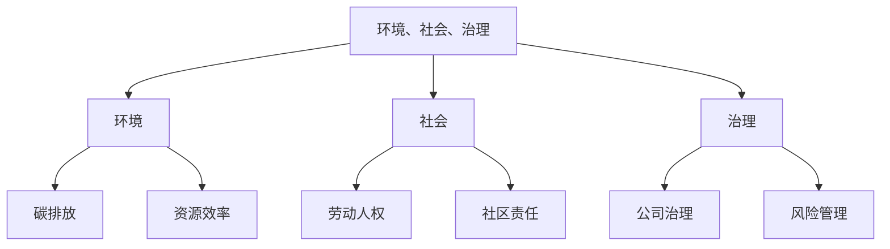
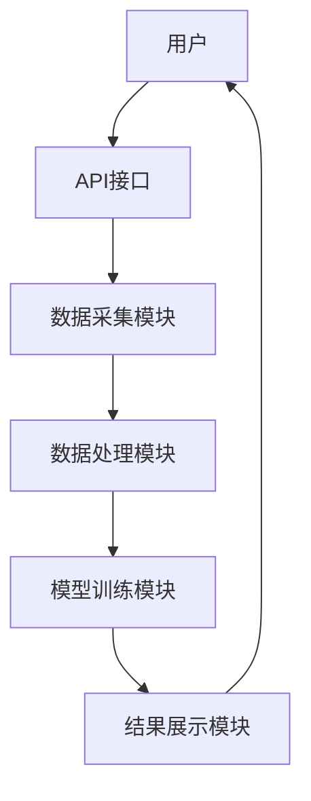
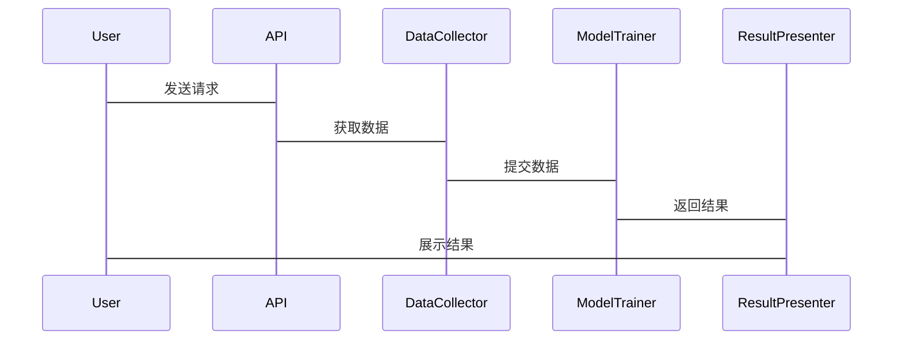

                 


# AI驱动的环境、社会和治理(ESG)分析：可持续价值投资

## 关键词：AI、ESG、可持续投资、环境社会治理、价值投资

## 摘要：本文探讨了如何利用人工智能技术提升环境、社会和治理（ESG）分析的效率和准确性，从而实现可持续价值投资。通过分析ESG的核心概念、AI驱动的算法原理、系统架构设计以及实际项目案例，本文为读者提供了一套完整的AI驱动ESG分析解决方案，帮助投资者做出更明智的决策。

---

# 第一部分: AI驱动的环境、社会和治理(ESG)分析基础

## 第1章: 环境、社会和治理(ESG)概述

### 1.1 ESG的基本概念
#### 1.1.1 环境(E)的定义与重要性
环境因素包括企业的碳排放、资源消耗、污染排放等。在可持续投资中，环境因素是评估企业社会责任和长期风险的重要指标。

#### 1.1.2 社会(S)的定义与核心要素
社会因素关注企业在员工权益、社区参与、劳动条件等方面的实践。社会因素反映了企业在社会中的影响力和道德责任。

#### 1.1.3 治理(G)的定义与关键原则
治理因素涉及企业的管理结构、董事会构成、内部控制、透明度等方面。良好的治理是企业长期稳定发展的基础。

### 1.2 ESG分析的背景与意义
#### 1.2.1 全球可持续发展背景下的ESG投资
随着全球对可持续发展的关注，投资者越来越重视企业对环境、社会和治理的贡献。

#### 1.2.2 ESG分析对企业的价值
通过ESG分析，企业可以识别和管理风险，提升透明度，增强投资者信任，从而获得长期竞争优势。

#### 1.2.3 ESG分析的边界与外延
ESG分析不仅限于企业层面，还涉及行业、国家和全球层面的可持续发展。

### 1.3 ESG分析的核心要素与组成
#### 1.3.1 ESG指标体系的构成
ESG指标包括环境指标（如碳排放）、社会指标（如员工满意度）和治理指标（如董事会多样性）。

#### 1.3.2 ESG分析的流程与方法
ESG分析通常包括数据收集、指标评估、权重分配和综合评分等步骤。

#### 1.3.3 ESG数据的来源与处理
ESG数据来源包括企业报告、第三方评级机构和政府数据库。数据处理需要清洗、转换和整合。

## 1.4 本章小结

---

# 第2章: AI驱动的ESG分析背景与应用前景

## 2.1 AI技术在金融领域的应用现状
### 2.1.1 AI在金融数据分析中的应用
AI技术可以用于金融数据的清洗、特征提取和预测。

### 2.1.2 AI在投资决策中的作用
AI可以通过分析历史数据和市场趋势，辅助投资者做出更明智的投资决策。

### 2.1.3 AI在风险管理中的应用
AI可以帮助识别和预测市场风险，优化投资组合。

## 2.2 ESG分析中的AI驱动优势
### 2.2.1 AI在ESG数据处理中的优势
AI可以快速处理大量非结构化数据，提升ESG分析的效率和准确性。

### 2.2.2 AI在ESG评分中的应用
AI可以通过机器学习模型，自动计算企业ESG评分，减少人为误差。

### 2.2.3 AI在ESG投资策略中的作用
AI可以帮助投资者制定基于ESG因素的投资策略，优化投资回报。

## 2.3 AI驱动ESG分析的挑战与机遇
### 2.3.1 数据质量与获取的挑战
ESG数据的质量和完整性直接影响AI模型的性能。

### 2.3.2 模型可解释性的挑战
复杂的AI模型可能难以解释其决策过程，影响投资者的决策信任。

### 2.3.3 技术进步带来的机遇
随着AI技术的不断进步，ESG分析的精准性和效率将不断提升。

## 2.4 本章小结

---

# 第3章: ESG分析的核心概念与联系

## 3.1 ESG核心概念的原理
### 3.1.1 环境维度的核心原理
环境因素关注企业的资源消耗、污染排放和可持续发展实践。

### 3.1.2 社会维度的核心原理
社会因素关注企业在员工权益、社区参与和社会责任方面的表现。

### 3.1.3 治理维度的核心原理
治理因素关注企业的管理结构、内部控制和透明度。

## 3.2 ESG核心概念的属性特征对比
### 3.2.1 环境、社会、治理的属性对比
| 维度 | 环境(E) | 社会(S) | 治理(G) |
|------|----------|----------|----------|
| 关注点 | 碳排放、资源消耗 | 员工权益、社区责任 | 董事会结构、内部控制 |
| 数据来源 | 环境报告、政府数据 | 社会责任报告、员工反馈 | 公司治理报告、董事会决议 |

### 3.2.2 不同维度的特征分析
环境因素通常涉及定量数据，而社会因素更多依赖定性数据。治理因素结合了定量和定性数据。

### 3.2.3 ESG综合评分的计算方法
ESG综合评分通常基于各维度的权重，通过加权平均计算得出。

## 3.3 ESG实体关系图


## 3.4 本章小结

---

# 第4章: AI在ESG分析中的算法原理

## 4.1 文本挖掘在ESG分析中的应用
### 4.1.1 文本挖掘的基本原理
文本挖掘通过提取、处理和分析文本数据，提取有用的信息。

### 4.1.2 基于文本挖掘的ESG分析流程
1. 数据清洗与预处理
2. 文本分词与特征提取
3. 模型训练与分类
4. 结果分析与可视化

### 4.1.3 文本挖掘在ESG分析中的优势
文本挖掘可以处理大量非结构化数据，发现隐藏的模式和关系。

## 4.2 机器学习在ESG分析中的应用
### 4.2.1 机器学习的基本原理
机器学习通过数据训练模型，实现对新数据的预测和分类。

### 4.2.2 基于机器学习的ESG评分算法
#### 4.2.2.1 数据预处理
- 数据清洗：处理缺失值、异常值
- 特征提取：选择关键特征

#### 4.2.2.2 模型训练
- 使用回归模型预测ESG评分
- 使用分类模型对ESG表现进行分类

#### 4.2.2.3 模型评估
- 使用均方误差（MSE）评估回归模型的准确性
- 使用准确率、召回率评估分类模型的性能

### 4.2.3 机器学习在ESG分析中的优势
机器学习可以自动学习数据中的模式，提升ESG评分的准确性。

## 4.3 ESG分析中的数学模型
### 4.3.1 线性回归模型
$$ y = \beta_0 + \beta_1x_1 + \beta_2x_2 + ... + \beta_nx_n + \epsilon $$

### 4.3.2 支持向量机（SVM）模型
$$ \text{目标函数}： \min_{w,b} \frac{1}{2}||w||^2 + C \sum_{i=1}^n \xi_i $$
$$ \text{约束条件}： y_i (w \cdot x_i + b) \geq 1 - \xi_i $$
$$ \xi_i \geq 0 $$

### 4.3.3 随机森林模型
随机森林通过集成多个决策树，提升模型的准确性和鲁棒性。

## 4.4 本章小结

---

# 第5章: AI驱动的ESG分析系统架构设计

## 5.1 系统功能设计
### 5.1.1 数据采集模块
- 从企业报告、评级机构获取ESG数据
- 数据清洗与预处理

### 5.1.2 模型训练模块
- 使用机器学习算法训练ESG评分模型
- 模型优化与调参

### 5.1.3 结果展示模块
- 可视化ESG评分结果
- 提供投资建议和风险提示

## 5.2 系统架构设计


## 5.3 系统接口设计
- 数据接口：提供ESG数据的导入和导出功能
- 模型接口：支持不同算法的模型训练和预测
- 展示接口：提供友好的用户界面，展示ESG分析结果

## 5.4 系统交互设计


## 5.5 本章小结

---

# 第6章: AI驱动的ESG分析项目实战

## 6.1 环境搭建
### 6.1.1 安装必要的库
- Python 3.8+
- Pandas、NumPy、Scikit-learn、XGBoost、Matplotlib

### 6.1.2 数据集获取
- 使用公开的ESG数据集（如MPT、Sustainalytics）
- 数据清洗与预处理

## 6.2 系统核心实现
### 6.2.1 数据预处理代码
```python
import pandas as pd
import numpy as np

# 加载数据
data = pd.read_csv('esg_data.csv')

# 数据清洗
data.dropna(inplace=True)
data = data.drop_duplicates()
```

### 6.2.2 模型训练代码
```python
from sklearn.model_selection import train_test_split
from sklearn.ensemble import RandomForestRegressor
from sklearn.metrics import mean_squared_error

# 划分训练集和测试集
X_train, X_test, y_train, y_test = train_test_split(data.drop('esg_score', axis=1), data['esg_score'], test_size=0.2)

# 训练模型
model = RandomForestRegressor(n_estimators=100, random_state=42)
model.fit(X_train, y_train)

# 预测与评估
y_pred = model.predict(X_test)
print('均方误差:', mean_squared_error(y_test, y_pred))
```

### 6.2.3 结果展示代码
```python
import matplotlib.pyplot as plt

plt.figure(figsize=(10,6))
plt.scatter(y_test, y_pred, c='blue', alpha=0.5)
plt.xlabel('实际ESG评分')
plt.ylabel('预测ESG评分')
plt.title('ESG评分预测结果')
plt.show()
```

## 6.3 案例分析
### 6.3.1 数据来源与处理
- 使用某行业数据集，展示数据清洗和特征提取的过程。

### 6.3.2 模型训练与评估
- 训练随机森林模型，评估其在ESG评分预测中的表现。

### 6.3.3 投资建议
- 基于模型预测结果，提出具体的ESG投资建议。

## 6.4 本章小结

---

# 第7章: 总结与展望

## 7.1 本章总结
本文详细探讨了AI在ESG分析中的应用，包括核心概念、算法原理、系统架构和项目实战。通过AI技术，ESG分析的效率和准确性得到了显著提升。

## 7.2 未来展望
随着AI技术的不断进步，ESG分析将更加智能化和精准化。未来的研究方向包括提高模型的可解释性、优化数据处理流程以及拓展应用场景。

## 7.3 最佳实践 Tips
- 在使用AI进行ESG分析时，需注意数据质量和模型的可解释性。
- 结合行业特点，选择合适的算法和模型。
- 定期更新数据和模型，保持分析的准确性和时效性。

## 7.4 本章小结

---

# 参考文献

（此处列出相关文献和资料）

---

# 附录

（此处可放置代码示例、数据表格等补充材料）

---

通过以上目录大纲，您可以逐步撰写一篇结构清晰、内容详实的关于AI驱动的环境、社会和治理(ESG)分析的博客文章。

