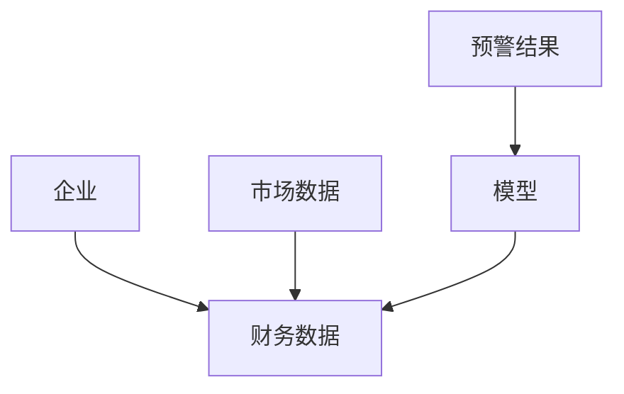

                 


# AI驱动的破产风险预警系统：提前识别投资风险

> 关键词：AI技术，破产风险，预警系统，机器学习，金融数据分析

> 摘要：本文详细探讨了如何利用人工智能技术构建破产风险预警系统，通过分析企业的财务和非财务数据，结合先进的机器学习算法，实现对潜在破产风险的早期识别和预警。文章从系统背景、核心概念、算法原理、系统架构、项目实战到最佳实践，全面阐述了构建该系统的各个方面。

---

# 第1章: 研究背景与问题描述

## 1.1 研究背景

### 1.1.1 研究背景概述
随着全球经济的快速发展，企业面临的经营风险日益复杂。破产不仅是企业个体的问题，也对整个经济系统造成重大冲击。因此，建立有效的破产风险预警机制显得尤为重要。

### 1.1.2 破产风险的定义与特征
破产风险是指企业在一定时期内无法偿还债务或停止经营的可能性。其特征包括财务状况恶化、经营效率下降、市场环境变化等。

### 1.1.3 研究意义
通过AI技术构建破产风险预警系统，可以帮助投资者、债权人和企业提前识别风险，采取有效措施规避损失。

## 1.2 研究问题的提出

### 1.2.1 传统方法的局限性
传统方法主要依赖财务指标分析，存在数据单一、模型简单、预测精度低等问题。

### 1.2.2 AI驱动的解决方案
利用机器学习模型处理多维数据，提高预测准确性。

### 1.2.3 研究目标
构建一个高效、准确的破产风险预警系统。

## 1.3 问题解决思路

### 1.3.1 数据驱动的分析方法
通过收集和分析企业的多维度数据，提取关键特征。

### 1.3.2 AI模型的应用
选择适合的机器学习算法，训练模型并进行预测。

### 1.3.3 系统化预警方案
设计一个完整的预警系统架构，包括数据采集、模型训练、预警生成等模块。

## 1.4 系统的边界与外延

### 1.4.1 输入与输出
输入：企业财务数据、市场数据等；
输出：破产风险预警结果。

### 1.4.2 系统功能边界
系统仅负责风险预警，不涉及企业决策。

### 1.4.3 可扩展性
系统支持新数据和新算法的接入。

---

# 第2章: 破产风险预警系统的核心概念

## 2.1 数据特征分析

### 2.1.1 财务指标分析
流动比率、速动比率、负债率等。

### 2.1.2 非财务指标分析
市场声誉、管理团队稳定性等。

### 2.1.3 数据特征对比
| 特征类型 | 特征描述 | 重要性 |
|----------|----------|--------|
| 财务指标 | 流动比率 | 高     |
| 非财务指标 | 市场声誉 | 中     |

## 2.2 AI模型选择与优化

### 2.2.1 常见模型对比
| 模型名称 | 优点 | 缺点 |
|----------|------|------|
| 逻辑回归 | 简单高效 | 易受维度灾难影响 |
| SVM      | 高精度 | 参数敏感 |
| 随机森林 | 抗噪声强 | 需大量数据 |

### 2.2.2 模型选择
根据数据特征选择适合的模型。

### 2.2.3 模型调优
通过网格搜索优化参数。

## 2.3 系统核心要素

### 2.3.1 数据采集模块
负责收集企业数据。

### 2.3.2 模型训练模块
训练AI模型。

### 2.3.3 预警生成模块
输出预警结果。

## 2.4 核心概念关系图



---

# 第3章: 破产风险预警系统的算法原理

## 3.1 算法选择与流程

### 3.1.1 逻辑回归

#### 3.1.1.1 原理
逻辑回归通过sigmoid函数将线性回归结果映射到概率空间。

#### 3.1.1.2 数学模型
$$ P(y=1|x) = \frac{1}{1 + e^{-w x - b}} $$

#### 3.1.1.3 代码实现
```python
from sklearn.linear_model import LogisticRegression

model = LogisticRegression()
model.fit(X_train, y_train)
```

### 3.1.2 支持向量机（SVM）

#### 3.1.2.1 原理
通过找到最优超平面进行分类。

#### 3.1.2.2 数学模型
$$ \text{最大化} \frac{1}{\lambda} \sum_{i=1}^{n} \xi_i $$
$$ \text{约束} y_i (w x_i + b) \geq 1 - \xi_i $$

#### 3.1.2.3 代码实现
```python
from sklearn import svm

model = svm.SVC()
model.fit(X_train, y_train)
```

### 3.1.3 随机森林

#### 3.1.3.1 原理
通过集成多个决策树提高准确率。

#### 3.1.3.2 数学模型
无明确公式，基于树结构投票。

#### 3.1.3.3 代码实现
```python
from sklearn.ensemble import RandomForestClassifier

model = RandomForestClassifier()
model.fit(X_train, y_train)
```

### 3.1.4 神经网络

#### 3.1.4.1 原理
通过多层神经元模拟人脑学习过程。

#### 3.1.4.2 数学模型
$$ a^{(l+1)} = \sigma(w a^{(l)} + b) $$
$$ L = -\sum y \log(a) + (1-y) \log(1-a) $$

#### 3.1.4.3 代码实现
```python
import tensorflow as tf

model = tf.keras.Sequential([
    tf.keras.layers.Dense(64, activation='relu'),
    tf.keras.layers.Dense(1, activation='sigmoid')
])
model.compile(optimizer='adam', loss='binary_crossentropy')
model.fit(X_train, y_train, epochs=10)
```

---

# 第4章: 破产风险预警系统的系统分析与架构设计

## 4.1 问题场景介绍

### 4.1.1 项目背景
构建一个实时监测企业破产风险的系统。

### 4.1.2 项目目标
实现对企业破产风险的早期预警。

## 4.2 系统功能设计

### 4.2.1 数据采集模块
负责采集企业财务和非财务数据。

### 4.2.2 模型训练模块
训练AI模型并进行预测。

### 4.2.3 预警生成模块
输出预警结果并提供决策建议。

## 4.3 系统架构设计

### 4.3.1 分层架构
将系统分为数据层、模型层和应用层。

### 4.3.2 模块交互
通过API进行数据传输和模型调用。

## 4.4 接口设计

### 4.4.1 数据接口
定义数据格式和传输协议。

### 4.4.2 模型接口
定义模型调用和结果返回的接口。

## 4.5 交互流程图

```mermaid
sequenceDiagram
参与者 用户
系统 破产风险预警系统
用户 -> 系统: 提交企业数据
系统 -> 用户: 返回预警结果
```

---

# 第5章: 破产风险预警系统的项目实战

## 5.1 环境搭建

### 5.1.1 安装Python
安装Python 3.8及以上版本。

### 5.1.2 安装机器学习库
安装scikit-learn、TensorFlow等库。

## 5.2 核心代码实现

### 5.2.1 数据预处理
```python
import pandas as pd

data = pd.read_csv('enterprise_data.csv')
X = data.drop('bankruptcy', axis=1)
y = data['bankruptcy']
```

### 5.2.2 模型训练
```python
from sklearn.model_selection import train_test_split
from sklearn.metrics import accuracy_score

X_train, X_test, y_train, y_test = train_test_split(X, y, test_size=0.2)
model = LogisticRegression().fit(X_train, y_train)
```

### 5.2.3 模型评估
```python
accuracy = accuracy_score(y_test, model.predict(X_test))
print(f'准确率: {accuracy}')
```

## 5.3 案例分析

### 5.3.1 数据来源
使用真实企业的财务数据进行训练。

### 5.3.2 模型预测
训练好的模型对企业进行风险评估。

### 5.3.3 结果分析
分析模型的准确率、召回率等指标。

## 5.4 项目小结

### 5.4.1 成功经验
模型准确率高，预警效果显著。

### 5.4.2 改进方向
优化模型参数，引入更多数据源。

---

# 第6章: 破产风险预警系统的最佳实践与小结

## 6.1 最佳实践

### 6.1.1 数据预处理的重要性
确保数据质量和完整性。

### 6.1.2 模型调优的技巧
使用交叉验证和网格搜索优化参数。

## 6.2 小结

### 6.2.1 核心内容回顾
详细介绍了AI驱动的破产风险预警系统的构建过程。

### 6.2.2 未来展望
随着技术进步，预警系统将更加智能化和精准化。

## 6.3 注意事项

### 6.3.1 数据隐私
保护企业数据隐私。

### 6.3.2 模型解释性
确保模型结果可解释。

## 6.4 拓展阅读

### 6.4.1 推荐书籍
《机器学习实战》、《深度学习》。

### 6.4.2 相关论文
推荐几篇经典的破产预测研究论文。

---

# 附录

## 附录A: 破产风险预警系统代码示例

## 附录B: 数据特征详细说明

## 附录C: 模型评估指标

---

# 结语

通过本文的详细讲解，读者可以系统地了解AI驱动的破产风险预警系统的构建过程，并能够实际操作相关技术。希望本文对相关领域的研究和应用有所帮助。

