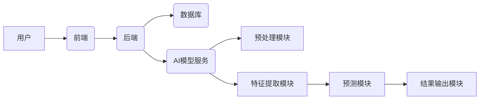

                 


# AI驱动的管理层继任计划分析：评估长期领导力风险

> **关键词**：AI，领导力评估，管理层继任，风险管理，机器学习，自然语言处理，系统架构

> **摘要**：  
> 在数字化转型日益加速的今天，领导力评估与管理层继任计划已成为企业可持续发展的重要基石。传统的继任计划方法往往依赖于主观判断和经验，难以全面、客观地评估潜在领导者的长期风险。本文通过引入人工智能技术，提出了一套基于数据驱动的管理层继任计划分析方法，旨在帮助企业更精准地识别和评估领导力风险，优化继任计划的制定与执行。文章从理论基础、算法原理、系统架构到实际案例，详细探讨了AI在管理层继任计划中的应用，并结合具体实现方案和最佳实践，为企业提供可操作的指导。

---

## 目录

### 第一部分：背景与理论基础

#### 第1章：问题背景与研究意义
1.1 管理层继任计划的挑战
1.2 问题描述与目标设定
1.3 本书的核心问题解决路径

#### 第2章：核心概念与理论基础
2.1 领导力评估的多维度模型
2.2 AI在领导力评估中的应用原理
2.3 继任计划的系统性分析框架

### 第二部分：AI驱动的领导力评估模型

#### 第3章：领导力评估的核心算法
3.1 基于机器学习的领导力预测模型
3.2 自然语言处理在领导力分析中的应用
3.3 群智计算在团队协作评估中的实现

#### 第4章：领导力评估的数学模型与公式
4.1 机器学习模型
4.2 自然语言处理模型
4.3 群智计算模型

### 第三部分：系统分析与架构设计

#### 第5章：系统功能设计
5.1 问题场景介绍
5.2 系统功能需求
5.3 领域模型设计（Mermaid类图）

#### 第6章：系统架构设计
6.1 系统架构设计（Mermaid架构图）
6.2 系统接口设计
6.3 系统交互流程（Mermaid序列图）

### 第四部分：项目实战与案例分析

#### 第7章：项目实战
7.1 环境安装与配置
7.2 核心功能实现（Python代码）
7.3 代码解读与分析

#### 第8章：案例分析
8.1 实际案例分析
8.2 案例实施效果评估
8.3 案例总结与经验分享

### 第五部分：总结与展望

#### 第9章：总结与最佳实践
9.1 小结
9.2 注意事项与常见问题解答
9.3 最佳实践与建议

#### 第10章：展望与未来方向
10.1 未来研究方向
10.2 技术发展趋势
10.3 结语

---

### 详细内容示例

#### 第3章：领导力评估的核心算法

##### 3.1 基于机器学习的领导力预测模型
- **3.1.1 数据预处理与特征选择**
  - 数据清洗与标准化
  - 特征工程与维度降维
- **3.1.2 基于XGBoost的领导力评分模型**
  - XGBoost算法原理
  - 模型训练与调优
  - 模型评估与验证

##### 3.2 自然语言处理在领导力分析中的应用
- **3.2.1 基于BERT的领导力文本分析**
  - BERT模型简介
  - 文本表示与特征提取
  - 领导力文本分析案例

##### 3.3 群智计算在团队协作评估中的实现
- **3.3.1 基于图论的团队协作网络构建**
  - 协作网络的构建方法
  - 协作网络的分析与评估
- **3.3.2 基于协同过滤的团队能力评估**
  - 协同过滤算法原理
  - 团队能力评估的实现步骤

#### 第4章：领导力评估的数学模型与公式

##### 4.1 机器学习模型
- **线性回归模型**：  
  $$ y = \beta_0 + \beta_1 x + \epsilon $$
- **逻辑回归模型**：  
  $$ P(y=1|x) = \frac{1}{1 + e^{-(\beta_0 + \beta_1 x)}} $$
- **XGBoost损失函数**：  
  $$ L = \sum_{i=1}^{n} [ -y_i \ln(p_i) - (1 - y_i) \ln(1 - p_i) ] $$

##### 4.2 自然语言处理模型
- **词嵌入模型（如Word2Vec）**：  
  $$ v_i = \text{word2vec}(w_i) $$

#### 第6章：系统架构设计

##### 6.1 系统架构设计（Mermaid架构图）


---

### 项目实战示例（第7章）

##### 7.1 环境安装与配置
- Python 3.8+
- Jupyter Notebook
- 安装依赖：`pip install xgboost transformers`

##### 7.2 核心功能实现（Python代码）
```python
import xgboost as xgb
from transformers import BertTokenizer, BertModel

# 示例：基于BERT的领导力文本分析
tokenizer = BertTokenizer.from_pretrained('bert-base-uncased')
model = BertModel.from_pretrained('bert-base-uncased')

def extract_features(text):
    inputs = tokenizer(text, return_tensors='np')
    outputs = model(**inputs)
    return outputs.last_hidden_state[:, 0, :]

# 示例：XGBoost模型训练
X_train, y_train = load_data()
dtrain = xgb.DMatrix(X_train, label=y_train)
params = {'n_estimators': 100, 'learning_rate': 0.1}
model = xgb.train(params, dtrain)
```

##### 7.3 代码解读与分析
- **BERT模型**：用于从文本数据中提取特征。
- **XGBoost模型**：用于基于提取的特征进行领导力评分预测。
- **模型评估**：通过交叉验证评估模型性能。

---

### 第9章：总结与最佳实践

##### 9.1 小结
- AI技术为管理层继任计划提供了新的可能性。
- 通过数据驱动的方法，可以更精准地评估领导力风险。
- 实践中需要结合企业实际情况，灵活调整模型和方法。

##### 9.2 注意事项与常见问题解答
- 数据质量是模型性能的关键，需确保数据的完整性和准确性。
- 模型调优需要结合业务场景，避免过拟合或欠拟合。
- 在实际应用中，需注意隐私保护和数据安全。

##### 9.3 最佳实践与建议
- 定期更新模型，以适应组织结构和业务需求的变化。
- 结合人机协作，充分发挥AI的优势，同时保留人类专家的主观判断。
- 建立反馈机制，持续优化继任计划的实施效果。

---

### 第10章：展望与未来方向

##### 10.1 未来研究方向
- 更加智能化的领导力评估模型。
- 多模态数据驱动的领导力分析。
- AI在领导力发展的个性化指导中的应用。

##### 10.2 技术发展趋势
- 自然语言处理技术的进一步发展。
- 联邦学习等隐私保护技术在领导力评估中的应用。
- 自动化机器学习（AutoML）在继任计划中的潜力。

##### 10.3 结语
AI驱动的管理层继任计划分析正在逐步改变传统的人才管理方式。通过技术与业务的深度融合，企业可以更高效地识别和培养潜在领导者，降低领导力风险，确保组织的可持续发展。未来，随着AI技术的不断进步，这一领域将展现出更大的潜力和价值。

