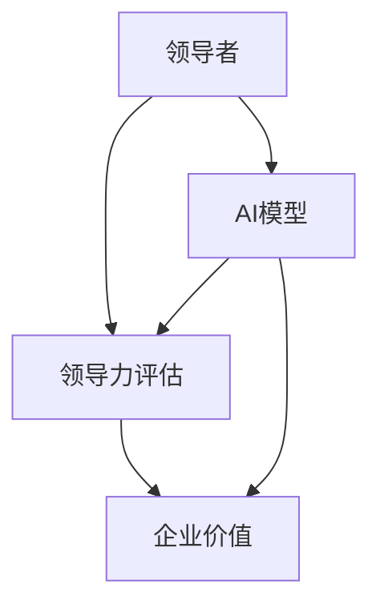
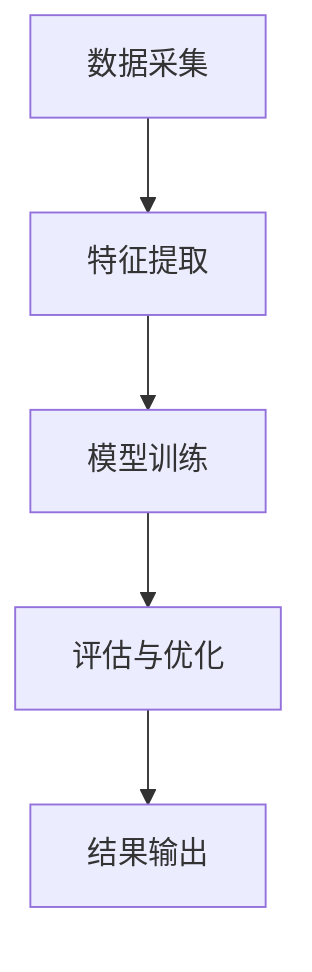

                 


# AI驱动的管理层能力评估：量化领导力对公司价值的影响

## 关键词
AI驱动，管理层能力评估，领导力，企业价值，量化分析

## 摘要
随着人工智能技术的飞速发展，领导力评估的传统方法正面临巨大挑战。传统评估方式依赖于主观判断，难以量化领导力对公司价值的具体影响。本文通过介绍AI驱动的管理层能力评估方法，详细阐述了如何利用AI技术量化领导力，并分析其对企业价值的影响。文章从背景介绍、核心概念、算法原理、系统架构、项目实战到最佳实践，全面探讨了AI在领导力评估中的应用，为管理层和企业提供了新的视角和解决方案。

---

# 第1章: 背景介绍

## 1.1 问题背景

### 1.1.1 管理层能力评估的传统方法
传统领导力评估主要依赖于主观评价，如面试、问卷调查和绩效考核。这种方法虽然在一定程度上能够反映领导者的素质，但存在以下问题：
- **主观性**：评估结果受到评估者主观因素的影响，难以保证客观性。
- **低效性**：传统评估方法耗时较长，难以实时反馈。
- **片面性**：难以全面捕捉领导者的多维度能力。

### 1.1.2 传统方法的局限性
传统领导力评估方法存在以下局限性：
- **数据不足**：传统方法通常依赖少量的主观数据，难以全面反映领导者的实际能力。
- **缺乏量化**：领导力的评估结果难以量化，难以直接与企业价值挂钩。
- **动态性差**：传统方法难以捕捉领导者能力的动态变化。

### 1.1.3 AI技术如何解决传统评估的痛点
人工智能技术的快速发展为领导力评估提供了新的解决方案：
- **数据驱动**：AI可以通过分析大量数据，提取领导者的多维度特征，实现客观评估。
- **实时反馈**：AI可以实时分析领导者的行为数据，提供即时反馈。
- **动态评估**：AI可以捕捉领导者的动态变化，实现持续评估。

## 1.2 问题描述

### 1.2.1 领导力的定义与维度
领导力是一个复杂的概念，可以从多个维度进行定义：
- **影响力**：领导者影响团队或组织的能力。
- **决策力**：领导者做出决策的能力。
- **情商**：领导者理解并管理情绪的能力。
- **创新能力**：领导者提出新想法并推动实施的能力。

### 1.2.2 量化领导力的必要性
量化领导力的必要性体现在以下几个方面：
- **提高评估的准确性**：通过量化分析，可以减少主观判断的影响。
- **提升企业的决策效率**：量化领导力可以帮助企业更快地识别和培养优秀领导者。
- **优化企业绩效**：量化领导力可以为企业的绩效提升提供数据支持。

### 1.2.3 企业价值与领导力的关系
领导力与企业价值密切相关。优秀领导者能够：
- 提高团队效率。
- 激发员工潜能。
- 推动创新。
- 提升企业竞争力。

## 1.3 问题解决

### 1.3.1 AI技术在领导力评估中的应用
AI技术在领导力评估中的应用主要体现在以下几个方面：
- **数据挖掘**：通过挖掘员工的行为数据，提取领导者的特征。
- **模式识别**：通过模式识别技术，识别领导者的潜在能力。
- **预测分析**：通过预测分析，评估领导者的未来表现。

### 1.3.2 数据驱动的领导力评估方法
数据驱动的领导力评估方法包括以下几个步骤：
1. **数据采集**：收集领导者的多维度数据，包括行为数据、绩效数据和情感数据。
2. **特征提取**：从数据中提取有助于评估领导力的特征。
3. **模型训练**：利用机器学习算法，训练领导力评估模型。
4. **结果输出**：根据模型输出评估结果。

### 1.3.3 量化领导力对企业价值的影响
量化领导力对企业价值的影响主要体现在以下几个方面：
- **提升企业绩效**：通过量化分析，企业可以识别出高潜力的领导者，从而提升整体绩效。
- **优化领导力发展**：通过量化分析，企业可以制定更有针对性的领导力发展计划。
- **降低用人风险**：通过量化分析，企业可以减少招聘和晋升中的错误决策。

## 1.4 边界与外延

### 1.4.1 领导力评估的边界
领导力评估的边界包括以下几个方面：
- **数据范围**：仅限于与领导力相关的数据。
- **评估范围**：仅限于领导者的管理能力。
- **时间范围**：仅限于一定时间范围内的数据。

### 1.4.2 量化领导力的外延
量化领导力的外延包括以下几个方面：
- **微观层面**：领导者个人能力的量化。
- **中观层面**：团队领导力的量化。
- **宏观层面**：组织领导力的量化。

### 1.4.3 与其他管理方法的关联
量化领导力与传统管理方法有以下关联：
- **绩效管理**：量化领导力可以为绩效管理提供数据支持。
- **组织发展**：量化领导力可以为组织发展提供决策依据。
- **人才管理**：量化领导力可以为人才管理提供科学依据。

## 1.5 概念结构与核心要素

### 1.5.1 领导力评估模型
领导力评估模型包括以下几个核心要素：
- **数据来源**：包括行为数据、绩效数据和情感数据。
- **特征提取**：包括关键特征的识别和提取。
- **模型训练**：包括机器学习算法的训练和优化。
- **结果输出**：包括评估结果的输出和解释。

### 1.5.2 核心要素组成
领导力评估模型的核心要素组成如下：
- **数据采集模块**：负责采集领导者的多维度数据。
- **特征提取模块**：负责从数据中提取有助于评估领导力的特征。
- **模型训练模块**：负责训练领导力评估模型。
- **结果输出模块**：负责输出评估结果并进行解释。

### 1.5.3 模型的数学表达
领导力评估模型的数学表达如下：
$$
\text{领导力} = f(\text{行为数据}, \text{绩效数据}, \text{情感数据})
$$
其中，$f$ 是一个机器学习模型，通过训练得到。

---

# 第2章: 核心概念与联系

## 2.1 核心概念原理

### 2.1.1 AI驱动的领导力评估模型
AI驱动的领导力评估模型包括以下几个核心模块：
- **数据采集模块**：负责采集领导者的多维度数据。
- **特征提取模块**：负责从数据中提取有助于评估领导力的特征。
- **模型训练模块**：负责训练领导力评估模型。
- **结果输出模块**：负责输出评估结果并进行解释。

### 2.1.2 数据特征提取方法
数据特征提取方法包括以下几个步骤：
1. **数据清洗**：去除噪声数据，确保数据质量。
2. **特征选择**：选择有助于评估领导力的关键特征。
3. **特征工程**：对特征进行预处理，提高模型的性能。

### 2.1.3 模型训练与优化
模型训练与优化包括以下几个步骤：
1. **选择算法**：选择适合的机器学习算法，如随机森林、支持向量机等。
2. **训练模型**：利用训练数据训练模型。
3. **优化模型**：通过交叉验证等方法优化模型的参数。

## 2.2 概念属性特征对比

### 2.2.1 传统评估与AI评估的对比
| 特征维度 | 传统评估 | AI评估 |
|----------|----------|--------|
| 数据来源 | 主观评价 | 多维度数据 |
| 评估方式 | 定性分析 | 定量分析 |
| 评估频率 | 低频 | 实时 |
| 评估结果 | 描述性 | 数量化 |

### 2.2.2 领导力模型的对比
| 模型类型 | 优点 | 缺点 |
|----------|------|------|
| 线性模型 | 简单易懂 | 表现力有限 |
| 树模型 | 表现力强 | 解释性差 |
| 神经网络模型 | 表现力极强 | 计算复杂 |

## 2.3 ER实体关系图



---

# 第3章: 算法原理讲解

## 3.1 算法流程



## 3.2 代码实现

### 3.2.1 数据预处理
```python
import pandas as pd
import numpy as np

# 加载数据
data = pd.read_csv('leadership.csv')

# 数据清洗
data.dropna(inplace=True)
data = pd.get_dummies(data)
```

### 3.2.2 模型训练
```python
from sklearn.model

