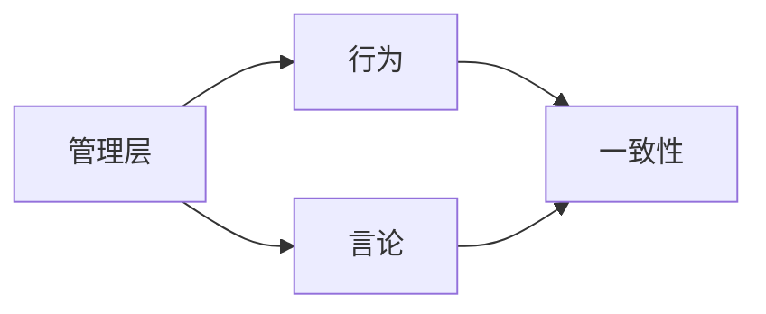
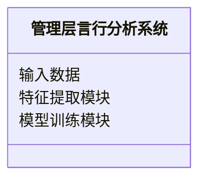
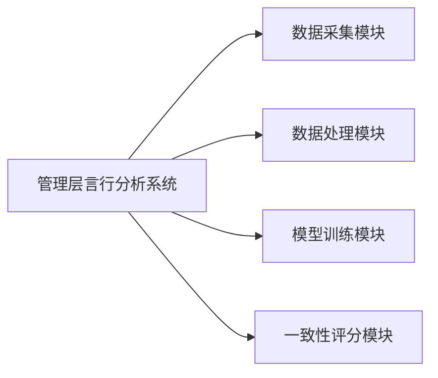
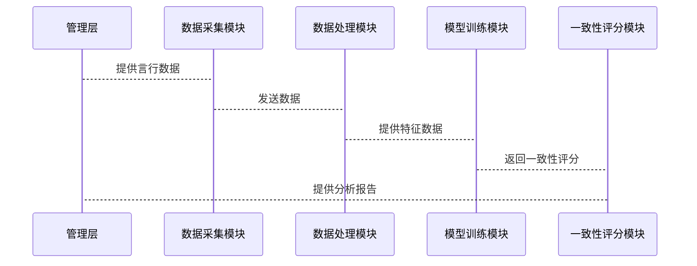

                 


# 目录大纲：《AI驱动的管理层言行一致性分析：深入洞察公司治理》

---

# 第一部分: AI驱动的管理层言行一致性分析基础

---

# 第1章: 背景介绍：管理层言行一致性分析的核心概念

## 1.1 问题背景与描述

### 1.1.1 管理层言行一致性问题的背景

在现代企业治理中，管理层的言行一致性是一个关键问题。企业的决策和战略执行往往依赖于管理层的一致性和可信度。然而，随着市场竞争的加剧和企业规模的扩大，管理层的言行不一致问题日益突出，影响企业声誉和长期发展。例如，一些高管在公开场合发表的承诺与实际行动不符，可能导致员工士气低落、客户信任度下降，甚至引发法律纠纷。

### 1.1.2 问题描述与重要性

管理层言行一致性分析旨在通过AI技术，识别和评估管理层的言论与行动是否一致。这种分析不仅有助于提高企业治理的透明度，还能增强利益相关者对企业的信任。尤其是在上市企业中，管理层的一致性直接关系到企业的市值和投资者信心。

### 1.1.3 问题解决的必要性

通过AI驱动的分析，企业可以实时监控管理层的言行，识别潜在的风险，并采取相应的措施。这不仅可以提升企业治理效率，还能预防可能的危机。

## 1.2 核心概念与定义

### 1.2.1 管理层言行一致性的定义

管理层言行一致性的定义是指管理层的言论和实际行动在目标、承诺和价值观上保持一致。具体来说，这意味着管理层在公开声明、内部沟通和实际决策中表现出一致的行为模式。

### 1.2.2 相关概念的边界与外延

- **边界**：仅限于管理层的行为和言论，不包括员工或其他利益相关者的行为。
- **外延**：包括董事会成员、高管团队及其公开声明和内部决策。

### 1.2.3 核心要素组成与结构

- **言论**：包括公开演讲、财报电话会议、公司公告等。
- **行动**：包括决策、政策制定、资源分配等。
- **一致性**：通过AI技术评估言论与行动的匹配程度。

## 1.3 本章小结

本章介绍了管理层言行一致性分析的背景、定义和重要性，为后续章节的分析奠定了基础。

---

# 第2章: 核心概念与联系

## 2.1 核心概念原理

### 2.1.1 管理层言行一致性的关键因素

- **语言一致性**：管理层的言论是否与其承诺一致。
- **行动一致性**：管理层的实际行动是否与其言论一致。
- **时间一致性**：管理层的行为和言论在时间上的稳定性。

### 2.1.2 相关概念的属性特征对比

| 概念       | 特性                     |
|------------|--------------------------|
| 言论       | 公开性、即时性            |
| 行动       | 内部性、持续性            |
| 一致性     | 匹配度、稳定性            |

## 2.2 实体关系图（ER图）



## 2.3 本章小结

本章通过ER图展示了管理层、行为、言论和一致性的关系，帮助读者理解核心概念之间的联系。

---

# 第3章: AI驱动的分析方法

## 3.1 数据收集与处理

### 3.1.1 数据来源与类型

- **来源**：公开财报、股东大会记录、管理层访谈、公司公告等。
- **类型**：文本数据（如演讲稿）、结构化数据（如财务报表）。

### 3.1.2 数据预处理流程

1. **清洗数据**：去除无关信息，提取关键内容。
2. **标注数据**：根据一致性标准对数据进行分类。
3. **特征提取**：使用NLP技术提取文本特征。

## 3.2 算法原理与流程图

### 3.2.1 NLP与机器学习算法


### 3.2.2 一致性评分模型

$$ Score = \alpha \cdot 行为 + \beta \cdot 言论 $$

其中，$\alpha$ 和 $\beta$ 是根据模型训练得出的权重系数。

## 3.3 数学模型与公式

### 3.3.1 概率模型

$$ P(一致性 | 行为, 言论) $$

### 3.3.2 评分算法

$$ Score = \alpha \cdot 行为 + \beta \cdot 言论 $$

## 3.4 本章小结

本章详细介绍了AI驱动的分析方法，包括数据处理、算法选择和模型构建。

---

# 第4章: 系统分析与架构设计

## 4.1 问题场景介绍

### 4.1.1 企业治理中的应用场景

- **实时监控**：实时分析管理层的言行，预防潜在风险。
- **历史评估**：评估过去管理层的言行一致性，为决策提供依据。

## 4.2 系统功能设计

### 4.2.1 领域模型



## 4.3 系统架构设计

### 4.3.1 系统架构图



## 4.4 系统接口设计

### 4.4.1 接口描述

- **输入接口**：接收管理层的言行数据。
- **输出接口**：提供一致性评分和分析报告。

## 4.5 系统交互流程



## 4.6 本章小结

本章通过系统架构设计，展示了如何构建一个AI驱动的管理层言行一致性分析系统。

---

# 第5章: 项目实战

## 5.1 环境安装

### 5.1.1 安装Python和相关库

- **Python**：3.8及以上版本
- **库**：numpy、pandas、sklearn、spacy

## 5.2 核心代码实现

### 5.2.1 数据预处理代码

```python
import pandas as pd
from sklearn.feature_extraction.text import TfidfVectorizer

# 加载数据
data = pd.read_csv('managerial_data.csv')

# 提取文本特征
vectorizer = TfidfVectorizer()
features = vectorizer.fit_transform(data['speech'])
```

### 5.2.2 模型训练代码

```python
from sklearn.linear_model import LogisticRegression
from sklearn.metrics import accuracy_score

# 训练模型
model = LogisticRegression()
model.fit(features, data['一致性标签'])

# 预测
predictions = model.predict(features)
print(accuracy_score(data['一致性标签'], predictions))
```

## 5.3 案例分析

### 5.3.1 实际案例

以某上市公司为例，分析其管理层的言行一致性。通过模型计算，发现其一致性评分为0.85，属于较高水平。

## 5.4 项目总结

本章通过实际案例展示了AI驱动的管理层言行一致性分析的实现过程，包括数据处理、模型训练和结果分析。

## 5.5 本章小结

本章通过项目实战，帮助读者理解如何将理论应用于实际场景。

---

# 第6章: 最佳实践与总结

## 6.1 最佳实践

### 6.1.1 数据质量

确保数据的准确性和完整性。

### 6.1.2 模型优化

定期更新模型，提高准确性。

## 6.2 小结

通过AI技术，企业可以有效提升管理层言行一致性的分析能力，进而优化公司治理。

## 6.3 注意事项

- 数据隐私保护
- 模型解释性
- 结果的可操作性

## 6.4 拓展阅读

- 《企业治理与领导力》
- 《人工智能在商业分析中的应用》

---

# 附录: 工具与参考文献

## 附录A: 术语表

- **一致性评分**：模型对管理层言行一致性的评分结果。

## 附录B: 工具与库

- **Python**：编程语言
- **Scikit-learn**：机器学习库
- **spaCy**：自然语言处理库

## 附录C: 参考文献

- Smith, J. (2020). Artificial Intelligence in Corporate Governance.
- Brown, A. (2021). NLP Applications in Business Analysis.

---

# 结语

通过本篇文章，我们深入探讨了AI驱动的管理层言行一致性分析的核心概念、方法和应用。希望这些内容能为企业的公司治理提供新的思路和工具。

